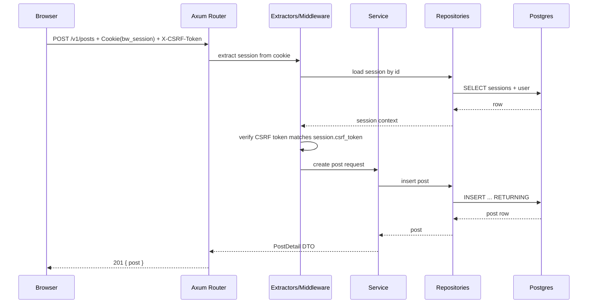

# Backend Low-Level Design (LLD): Blog Website API (Rust)

Last updated: 2026-02-12

## Scope
This LLD defines an implementation-ready backend plan for the Rust API, aligned to the contract artifacts:

- Feature brief: `blog-website/docs/feature-brief.md`
- HLD: `blog-website/docs/hld.md`
- Human contract: `blog-website/docs/api-contracts.md`
- Data model: `blog-website/docs/data-model.md`
- OpenAPI: `blog-website/contracts/openapi.yaml`

Constraints:

- Preserve the API contract as-is for initial delivery.
- Do not implement code in this task.

## Target Stack (per HLD)
- HTTP: Axum (Tower layers for middleware)
- DB: PostgreSQL
- DB access: SQLx
- Migrations: `sqlx migrate`
- Password hashing: Argon2id
- Auth: cookie-based sessions (opaque id stored server-side)
- CSRF: required for state-changing routes via `X-CSRF-Token`

## Runtime Configuration: Dev vs E2E DB Isolation
Goal (from brief/HLD): local development and E2E runs must use isolated Postgres deployments so E2E cannot corrupt dev data, while the API runtime stays simple.

### API config model (keep runtime simple)
Runtime invariant:

- The API process reads exactly one database connection string: `DATABASE_URL`.
- Selecting dev vs E2E DB is purely an environment/deployment concern (different Compose project/env file), not a runtime “mode switch” in code.

Recommended optional “mode” key:

- `APP_ENV` (optional): `dev | test | e2e | prod`.
- Purpose: toggles safe defaults (cookie `Secure`, log verbosity, etc.).
- Non-goal: `APP_ENV` must not implicitly select a database; `DATABASE_URL` remains the sole DB selector.

### Expected env vars / config keys
These keys are stable and should be documented in the runbook(s); code should fail fast on missing required values.

- `DATABASE_URL` (required): Postgres connection string for the target environment.
  - Must be different for dev vs E2E (different host/port and/or different DB name; see deployment invariants below).
- `API_BIND` (optional): bind address/port for the API server (e.g., `0.0.0.0:3001`).
- `APP_ENV` (optional): environment name as described above.

Testing-only override (recommended to reduce foot-guns):

- `TEST_DATABASE_URL` (optional, tests only): if set, Tier 2 integration tests prefer this over `DATABASE_URL`.

### Docker/Compose deployment invariants (dev vs E2E)
To guarantee separation and allow concurrent runs:

- Distinct Compose projects (or equivalent) for dev vs E2E so resource names do not collide.
- Distinct Postgres containers.
- Distinct Docker volumes for Postgres data (no shared data directory).
- Distinct database names (no shared `POSTGRES_DB`).
- Distinct host port bindings (example: dev `5432`, e2e `5434`).

Concrete example (illustrative names; exact Compose files live outside this doc):

- Dev DB:
  - container: `blog-db-dev`
  - volume: `blog_db_dev_data`
  - db name: `blog_dev`
  - `DATABASE_URL=postgres://...@localhost:5432/blog_dev`
- E2E DB:
  - container: `blog-db-e2e`
  - volume: `blog_db_e2e_data`
  - db name: `blog_e2e`
  - `DATABASE_URL=postgres://...@localhost:5434/blog_e2e`

### How E2E runs select the E2E DB
E2E runs select the E2E database by:

- Starting the E2E Postgres deployment (separate Compose project/stack).
- Launching the API with `DATABASE_URL` pointing to the E2E Postgres (typically via an `.env.e2e` file or CI job env).

No other config switches are required.

## Backend Launch Scripts (One-Stop DX Interface)

This section defines the required behavior of the backend-facing one-stop scripts referenced by:

- `blog-website/docs/hld.md`
- `blog-website/docs/runbook-one-command.md`

Scripts covered here (required stable entrypoints):

- `blog-website/scripts/dev/db-up`
- `blog-website/scripts/dev/api`
- `blog-website/scripts/e2e/db-up`
- `blog-website/scripts/e2e/api`

Non-goal: dictate the implementation language (shell/Node/Make/Just). This is the interface/behavior contract.

### Env loading (API)

Env files:

- Dev: `blog-website/api/.env`
- E2E: `blog-website/api/.env.e2e`

Loading rules (both dev and e2e):

- The script must fail fast with an actionable error if the expected env file is missing.
- The script must load the env file and export its keys into the API process environment.
- The script may allow pre-set process env to override the file (recommended), but the env file remains the primary source.

Required keys (fail fast if missing/empty):

- `DATABASE_URL` (required): the *only* database selector for the API runtime.
- `API_BIND` (required): bind address/port for the HTTP server, e.g. `127.0.0.1:3000`.
- `CURSOR_HMAC_SECRET` (required secret): used to sign pagination cursors (32+ bytes recommended).

Recommended keys (optional; use safe defaults if absent):

- `APP_ENV`: `dev` for `scripts/dev/api`, `e2e` (or `test`) for `scripts/e2e/api`.
- `RUST_LOG`
- `SESSION_COOKIE_SECURE` (dev/e2e typically `false` for local HTTP)
- `SESSION_ABSOLUTE_TTL_SECONDS`, `SESSION_IDLE_TTL_SECONDS`
- `AUTH_RATE_LIMIT_PER_MINUTE`

Notes on secrets:

- There is no global CSRF secret: CSRF tokens are per-session random values persisted in the DB.
- Do not log `CURSOR_HMAC_SECRET` (or any secret-derived values).

### `blog-website/scripts/dev/db-up`

Behavior:

- Starts the dev Postgres deployment using `blog-website/api/docker-compose.yml` under Compose project `blog-website-dev`.
- Waits for Postgres readiness (e.g., `pg_isready`) before returning success.
- Idempotent: multiple invocations converge on “DB is running”.

Output/exit:

- Exit `0` when Postgres is ready to accept connections.
- Exit non-zero on failure (Docker not running, compose file missing, readiness timeout).

### `blog-website/scripts/e2e/db-up`

Behavior:

- Starts the isolated E2E Postgres deployment using `blog-website/api/docker-compose.e2e.yml` under Compose project `blog-website-e2e`.
- Waits for Postgres readiness (e.g., `pg_isready`) before returning success.
- Idempotent: multiple invocations converge on “DB is running”.

Output/exit:

- Exit `0` when Postgres is ready to accept connections.
- Exit non-zero on failure.

### `blog-website/scripts/dev/api`

Behavior:

1. Load env from `blog-website/api/.env` (per rules above).
2. Fail fast if required keys are missing.
3. Ensure the DB is reachable at `DATABASE_URL` (either by waiting briefly or by failing fast with a clear message to run `blog-website/scripts/dev/db-up`).
4. Run migrations (see Migration Behavior) and abort on migration failure.
5. Start the API server in the foreground, bound to `API_BIND`.

Readiness check:

- The script (or callers like `scripts/dev/up`) must treat the API as “ready” when an HTTP GET to the readiness endpoint succeeds:
  - `GET /v1/auth/session` returns `200`.
- When `API_BIND` uses `0.0.0.0`, readiness polling should use `127.0.0.1:<port>`.

### `blog-website/scripts/e2e/api`

Behavior mirrors `scripts/dev/api`, with these differences:

- Load env from `blog-website/api/.env.e2e`.
- `DATABASE_URL` must point to the E2E Postgres deployment (never the dev DB).
- The script should default `APP_ENV` to `e2e` (or `test`) to enable test-safe behavior (e.g., log verbosity).

Readiness check:

- Same as dev: `GET /v1/auth/session` returns `200`.

### Migration Behavior (required)

On every API start (dev and e2e):

- Run DB migrations against `DATABASE_URL` before serving requests.
- Migrations are sourced from `blog-website/api/migrations/`.
- The migration operation must be idempotent (safe to run repeatedly) and must not require manual DB resets.

Failure semantics:

- If migrations fail, the API process must exit non-zero and must not start listening.
- Log a clear error (no secrets) including the failing migration name/version and a short remediation hint.

Concurrency:

- If multiple API processes start concurrently against the same DB, migrations must not corrupt the schema; use SQLx migration locking semantics.

## Architecture and Module Boundaries
Design is layered and slice-oriented to enable parallel delivery and testability.

Layers:

- HTTP API layer: routing, extraction, request validation at the boundary, error mapping
- Domain/services layer: business rules, authZ checks, session policy, cursor policy
- Persistence layer (repositories): SQL queries, transactions, migration ownership
- Infra: config, logging, request ids, rate limiting, time, crypto

Proposed workspace layout (names are guidance; exact crate naming can vary):

```
blog-website/
  api/
    Cargo.toml
    migrations/
      <timestamp>_init.sql
    src/
      main.rs
      app.rs                  # build Router, layers, app state
      config.rs
      error.rs                # ApiError + mapping helpers
      http/
        mod.rs
        routes.rs
        handlers/
          auth.rs
          users.rs
          posts.rs
        middleware/
          request_id.rs
          logging.rs
          body_limit.rs
          auth_session.rs
          csrf.rs
          rate_limit.rs
      domain/
        mod.rs
        auth/
          mod.rs
          service.rs
          policy.rs
          password.rs
          errors.rs
        posts/
          mod.rs
          service.rs
          cursor.rs
          policy.rs
          errors.rs
      repo/
        mod.rs
        users_repo.rs
        sessions_repo.rs
        posts_repo.rs
      db/
        mod.rs                # pool init + migrate
```

Vertical slice ownership:

- `domain/auth/*` + `repo/users_repo.rs` + `repo/sessions_repo.rs` + `http/handlers/auth.rs`
- `domain/posts/*` + `repo/posts_repo.rs` + `http/handlers/posts.rs`
- `http/middleware/*` + `error.rs` owned by platform/infra

## App State and Dependency Injection
`AppState` is passed via Axum `State` extractor and holds only shared, cloneable handles:

- `db: sqlx::PgPool`
- `clock: Clock` (trait or wrapper to enable deterministic tests)
- `secrets: Secrets` (CSRF/cursor HMAC keys if used)
- `settings: Settings` (cookie flags, session TTLs)
- `rate_limiter: ...` (only for login/register if implemented)

Avoid putting request-scoped data into `AppState`.

## Request Handling Flow

### Common request pipeline (Tower layers)
Order matters. Recommended order (outer -> inner):

1. `request_id`: generate `requestId` (or accept incoming `X-Request-Id` if trusted) and attach to extensions
2. `logging`: structured request/response logs with `requestId` (redact auth/cookies)
3. `body_limit`: cap JSON payload size (e.g., 256KB)
4. `rate_limit`: apply to selected routes (login/register)
5. Router -> handler

Auth/session and CSRF are most convenient as extractors/middleware at the route level:

- Session extractor: required on protected routes (`security: cookieSession`)
- CSRF guard: required on state-changing routes (POST/PATCH/DELETE) when auth is cookie-based

### Mermaid: protected mutation request



## Authentication, Session, and CSRF

### Session model (contract-aligned)
- Cookie name: `bw_session` (value is opaque)
- Cookie flags:
  - `HttpOnly`: always
  - `SameSite=Lax`: always
  - `Secure`: on in production; off for local http
  - `Path=/`: always
  - `Max-Age` / `Expires`: set to the session expiry

Server-side session is persisted in `sessions` table (per `blog-website/docs/data-model.md`).

Recommended session policy (configurable):

- Absolute expiry: 7 days
- Idle timeout: 24 hours (implemented by extending `expires_at` on activity, capped by absolute)

Implementation note:

- The contract does not require idle extension, but it improves usability; if implemented, keep it invisible to the client.

### Session id and CSRF token generation
- Session id: UUIDv4 (sufficient entropy) stored as `sessions.id`
- CSRF token: 32 bytes random, base64url encoded (no padding) stored as `sessions.csrf_token`

Never log session ids or CSRF tokens.

### Session loading
Session extractor reads `bw_session` cookie and loads session + user:

- Reject when missing: `401 unauthenticated`
- Reject when not found / expired: `401 unauthenticated`
- On success: attach `SessionContext { session_id, user, csrf_token }` to request extensions
- Update `sessions.last_seen_at = now()` and optionally extend expiry (within policy)

DB lookup should be a single query (join sessions -> users) to avoid extra round trips.

### CSRF enforcement
Applies to:

- `POST /v1/auth/logout`
- `POST /v1/posts`
- `PATCH /v1/posts/{postId}`
- `DELETE /v1/posts/{postId}`

Rule:

- Require header `X-CSRF-Token` and compare to `sessions.csrf_token` for the authenticated session.

Error mapping:

- Missing/invalid CSRF: `403 forbidden` with message like `CSRF token missing or invalid`.

Comparison must be constant-time to reduce token oracle leakage (even though practical impact is small here).

### `GET /v1/auth/session`
Contract behavior:

- If not authenticated: `{ "authenticated": false }`
- If authenticated: `{ "authenticated": true, "user": <User>, "csrfToken": "..." }`

This endpoint is the FE bootstrap for CSRF.

### Auth endpoints

#### Register: `POST /v1/auth/register`
Flow:

1. Validate `username`, `password`
2. Hash password with Argon2id
3. Insert user (unique username)
4. Create session row + set cookie
5. Respond `201 { user }`

Conflicts:

- If username taken: `409 conflict`

#### Login: `POST /v1/auth/login`
Flow:

1. Validate `username`, `password`
2. Rate limit (recommended) keyed by IP (and optionally username)
3. Load user by username; verify password hash
4. Create new session row (recommended: invalidate previous sessions for same user is optional; not required by contract)
5. Set cookie and respond `200 { user }`

Credential failure:

- `401 invalid_credentials` (avoid revealing whether username exists)

#### Logout: `POST /v1/auth/logout`
Flow:

1. Require session
2. Require CSRF
3. Delete session row
4. Clear cookie and respond `204`

If session missing/invalid: `401 unauthenticated`.

## Authorization (AuthZ)

### Ownership rules
For post mutations (update/delete), authenticated user must be the post author.

Rule:

- `post.author_id == session.user.id` else `403 forbidden`

Important edge case (404 vs 403):

- If post does not exist: `404 not_found`
- If post exists but not owned: `403 forbidden`

This matches the contract and supports correct FE behavior.

## Validation

Validation happens at the HTTP boundary and returns `400 validation_error` with `details.fieldErrors` per contract.

Recommended constraints (from `blog-website/docs/data-model.md`):

- `username`: 3..32 chars; recommended pattern: `^[a-z0-9_]+$`
- `password`: 8..72 chars (cap length to prevent hashing DoS)
- `title`: 1..200 chars
- `body`: 1..20000 chars

Additional rules:

- Trim leading/trailing whitespace for `username` and `title` (but do not change internal whitespace).
- Treat empty-after-trim as empty.

Validation tags for `details.fieldErrors` (stable identifiers):

- `required`, `too_short`, `too_long`, `invalid_format`, `min_properties`

Examples:

- Register missing password:
  - `fieldErrors.password = ["required"]`
- Update post with empty JSON body `{}`:
  - `fieldErrors._ = ["min_properties"]` (or `fieldErrors.body = [...]` is acceptable; keep stable and documented)

## Cursor Pagination (GET /v1/posts)

Contract:

- Query: `limit` (1..50, default 20), optional `cursor` (opaque string)
- Response: `{ items: PostSummary[], nextCursor: string | null }`

Ordering:

- Newest first, stable: `(created_at desc, id desc)`.

Cursor encoding recommendation:

- Cursor payload contains `(created_at, id)` of the last item in the page.
- Encode payload as base64url(JSON) to keep it simple.
- Optionally HMAC-sign to prevent tampering (recommended):
  - `cursor = "v1." + b64(payload) + "." + b64(hmac_sha256(secret, payload_b64))`
  - On decode: verify signature; invalid -> `400 validation_error` with `fieldErrors.cursor = ["invalid_format"]`

SQL predicate (for desc ordering):

- When cursor is `(c_created_at, c_id)`, fetch rows where:
  - `(created_at, id) < (c_created_at, c_id)` in descending order semantics
  - Implement as:
    - `created_at < c_created_at OR (created_at = c_created_at AND id < c_id)`

Page generation:

- Query `limit + 1` rows
- Return first `limit` as `items`
- If extra row exists: `nextCursor` = cursor(last returned item) else `null`

## Persistence and Migrations

### Schema ownership
Schema is defined by `blog-website/docs/data-model.md` and must be created via migrations.

### Migration plan
Create one initial migration that:

- Enables required extensions (optional): `pgcrypto` (if using `gen_random_uuid()`)
- Creates tables `users`, `posts`, `sessions`
- Adds constraints and indexes:
  - `users(username)` unique
  - `posts(author_id)` index
  - `posts(created_at desc, id desc)` index
  - `sessions(user_id)` index
  - `sessions(expires_at)` index

`updated_at` maintenance options:

- Preferred: set `updated_at = now()` in update queries (keeps logic explicit in SQLx)
- Alternative: Postgres trigger; not required and increases operational complexity

### Repository patterns (SQLx)
Repositories are the only place that runs SQL.

Repo contract style:

- Define trait interfaces for services to depend on:
  - `UsersRepo`, `SessionsRepo`, `PostsRepo`
- Provide SQLx implementations:
  - `PgUsersRepo`, `PgSessionsRepo`, `PgPostsRepo`

Guidelines:

- Use typed ids (`uuid::Uuid`) at boundaries internally; only serialize to strings at HTTP boundary.
- Use explicit transactions for multi-step operations:
  - register: insert user + insert session
  - login: read user + insert session (+ optional cleanup)
  - delete post: ownership check + delete
- Do not rely on DB errors for validation; only for final invariant enforcement (unique username).

## Error Model and Mapping

Contract requires all non-2xx to return:

```
{ "error": { "code": "...", "message": "...", "details": <nullable>, "requestId": "..." } }
```

Implementation plan:

- `ApiError` (HTTP layer) holds:
  - `status: StatusCode`
  - `code: &'static str` (one of the contract codes)
  - `message: String`
  - `details: Option<serde_json::Value>` (holds `fieldErrors` map for validation)
  - `request_id: String`

Domain/service errors map into `ApiError`:

- Validation -> `400 validation_error` + `details.fieldErrors`
- Missing session -> `401 unauthenticated`
- Bad password -> `401 invalid_credentials`
- Not owner -> `403 forbidden`
- Not found -> `404 not_found`
- Username conflict -> `409 conflict`
- Rate limit -> `429 rate_limited`
- Unexpected -> `500 internal`

DB error handling:

- Unique violation on `users.username` becomes `409 conflict`.
- All other SQLx errors become `500 internal` (log with requestId; do not leak SQL).

## Endpoint-by-Endpoint LLD Notes

All DTOs must match `blog-website/contracts/openapi.yaml` exactly (field names, optionality, nullability).

### Auth
- `POST /v1/auth/register`
  - Request validation: `username`, `password`
  - Success: `201` sets cookie, returns `{ user }`
- `POST /v1/auth/login`
  - Validation + rate limit
  - Success: `200` sets cookie
- `POST /v1/auth/logout`
  - Require session + CSRF
  - Always clear cookie on 204; also clear cookie on 401 to reduce client confusion
- `GET /v1/auth/session`
  - Optional session
  - If authenticated: include `csrfToken`

### Users
- `GET /v1/users/me`
  - Require session
  - Return `{ user }`

### Posts
- `GET /v1/posts`
  - Parse `limit`, `cursor`
  - Return joined author info
- `GET /v1/posts/{postId}`
  - Validate UUID in path
  - 404 if missing
- `POST /v1/posts`
  - Require session + CSRF
  - Validate title/body
  - Insert with `author_id = session.user.id`
- `PATCH /v1/posts/{postId}`
  - Require session + CSRF
  - Validate UUID + body minProperties + per-field constraints
  - AuthZ owner check
  - Update selected fields; set `updated_at = now()`
- `DELETE /v1/posts/{postId}`
  - Require session + CSRF
  - AuthZ owner check
  - Delete row

## Security and Browser Boundary Rules

### Cookies and same-origin
Preferred deployment is same-origin (web app proxies `/v1/*` to API), avoiding credentialed CORS.

If cross-origin local dev is used anyway:

- CORS must be explicitly configured
- `Access-Control-Allow-Credentials: true`
- `Access-Control-Allow-Origin` must not be `*` when credentials are used

Config rule:

- Any CORS allowlist must be driven by environment/config (e.g., `CORS_ALLOWED_ORIGINS` as a comma-separated list) and must not be hard-coded in source or tests.

This is a follow-up; initial plan assumes same-origin/proxy.

### Request body limits
Enforce a small JSON size limit (e.g., 256KB) to prevent abuse.

### Password hashing parameters
Argon2id parameters should be chosen to be safe for server resources. Store only the encoded hash string.

### Logging redaction
Never log:

- `password`
- `bw_session` cookie
- CSRF tokens

## Observability

Baseline:

- Structured logs per request with `requestId`
- Log level by status code (4xx info, 5xx error)
- Metrics (optional but recommended): request count/latency by route + error count by `error.code`

## Test Strategy (Backend)

### Tier 0: static gates
- `cargo fmt --check`
- `cargo clippy -- -D warnings`
- `cargo check`

### Tier 1: domain/service tests (no HTTP, minimal DB)
Focus: correctness of business rules and validation mapping.

- Auth service:
  - username/password validation -> fieldErrors
  - invalid credentials always returns `invalid_credentials` (no enumeration)
  - session creation sets expiry + csrf token
- Posts service:
  - ownership check behavior (403 vs 404 handling with repo contracts)
  - update semantics (minProperties)
  - cursor encode/decode (including signature verification if used)

Approach:

- Services depend on repo traits; tests use in-memory fake repos.
- Keep time deterministic with injected `Clock`.

### Tier 2: repository + HTTP integration tests (real Postgres)
Focus: contract adherence, SQL correctness, migrations, and full request pipeline.

- Run migrations into a fresh database per test run (or per test module).
- Use Testcontainers (recommended) or a locally running Postgres.

Config requirements (to preserve DB isolation and avoid hard-coded hosts/origins):

- Do not assume a fixed DB host/port/name in tests.
  - Read `TEST_DATABASE_URL` (preferred) or `DATABASE_URL` from the environment.
  - Recommended safety check (fail-fast): refuse to run destructive setup (drop/recreate schema) unless the DB name indicates a test environment (e.g., contains `_e2e` or `_test`).
- Prefer in-process HTTP testing (Axum `Router` as a `tower::Service`) over binding a real TCP port.
  - Tests issue requests with relative URIs like `/v1/posts`.
  - If a host header is required by the framework, use a non-localhost placeholder like `example.test` (do not embed `localhost`/`127.0.0.1` origins in test source).
  - This keeps cookie/session semantics testable without any base URL literals.

Test cases (minimum):

- Auth:
  - register success sets cookie and returns user
  - register conflict returns 409
  - login invalid returns 401 invalid_credentials
  - login rate limit returns 429
  - logout without CSRF returns 403
- Session:
  - `GET /v1/auth/session` unauthenticated returns `{ authenticated: false }`
  - authenticated returns csrfToken
- Posts:
  - unauthenticated create returns 401
  - CSRF missing create returns 403
  - create + get + list happy path
  - update/delete non-owner returns 403
  - update/delete missing post returns 404
  - list pagination returns stable ordering and nextCursor behavior

### Contract conformance
Integration tests should assert:

- status codes exactly match the OpenAPI
- response JSON matches schemas (including `additionalProperties: false` expectations)

### Tier 3: E2E (QA-owned, backend-supported)
Focus: end-to-end journeys using the existing E2E framework only.

- Backend responsibility: ensure API behavior, error codes, and CSRF/session semantics match contract so E2E can assert stable outcomes.
- Do not introduce new E2E tooling; add missing cases within the existing E2E suite.

Minimum E2E journeys (aligned to contract and brief):

- Register -> logged in session -> can create post
- Login -> can edit/delete own post
- Logout -> cannot create/edit/delete
- Public user can view list + detail
- Non-owner edit/delete is rejected with 403

### Test Coverage Review Plan (Requirement: 2026-02-12)
Goal: review existing unit, integration, and E2E tests for the core journeys and add missing cases using existing frameworks only.

Review steps (no new tooling):

1. Inventory existing tests by tier and map each to the core journeys:
   - register, login, logout, view posts, create, edit, delete
2. Identify gaps per tier and add the lowest-meaningful tests:
   - Tier 1 for domain rules and validation
   - Tier 2 for HTTP + DB contract behavior
   - Tier 3 for end-to-end user flows
3. Validate that added tests:
   - rely on the existing test harness/frameworks in this repo
   - do not introduce new coverage tooling or reporters
   - avoid hard-coded localhost literals (only env/config allowed)
   - use isolated DBs for integration/E2E (dev vs e2e separation)

Coverage matrix (minimum expected additions if missing):

- Register
  - Tier 1: validation (username/password required + bounds)
  - Tier 2: `POST /v1/auth/register` creates user + session cookie + 201
  - Tier 3: user registers and is authenticated (session returns csrfToken)
- Login
  - Tier 1: invalid credentials map to `invalid_credentials`
  - Tier 2: `POST /v1/auth/login` sets session cookie + 200
  - Tier 3: user logs in and can access auth-only actions
- Logout
  - Tier 2: `POST /v1/auth/logout` clears session cookie + 204
  - Tier 3: after logout, mutations are blocked
- View posts
  - Tier 2: `GET /v1/posts` and `GET /v1/posts/{id}` return expected shapes
  - Tier 3: unauthenticated user can browse list + detail
- Create post
  - Tier 1: title/body validation
  - Tier 2: `POST /v1/posts` creates post for session user
  - Tier 3: authenticated user creates and sees post in list/detail
- Edit post
  - Tier 1: ownership rule (not owner -> forbidden)
  - Tier 2: `PATCH /v1/posts/{id}` updates fields + `updatedAt`
  - Tier 3: owner edits and sees changes; non-owner forbidden
- Delete post
  - Tier 1: ownership rule (not owner -> forbidden)
  - Tier 2: `DELETE /v1/posts/{id}` removes post; subsequent GET is 404
  - Tier 3: owner deletes and post disappears; non-owner forbidden

## Local Development Plan (DB + migrations)
See `blog-website/docs/runbook-dev.md` for concrete steps.

## Follow-ups (Contract-Preserving Suggestions)
These are optional improvements; do not change contracts for initial delivery.

1. Add `Retry-After` header and/or `retryAfterSeconds` to `rate_limited` errors
2. Add an explicit error code for CSRF failures (currently mapped to `forbidden`)
3. Add `GET /v1/posts?authorId=<uuid|me>` to enable author dashboard without scanning all posts
4. Add session rotation on privileged actions (not needed initially)
