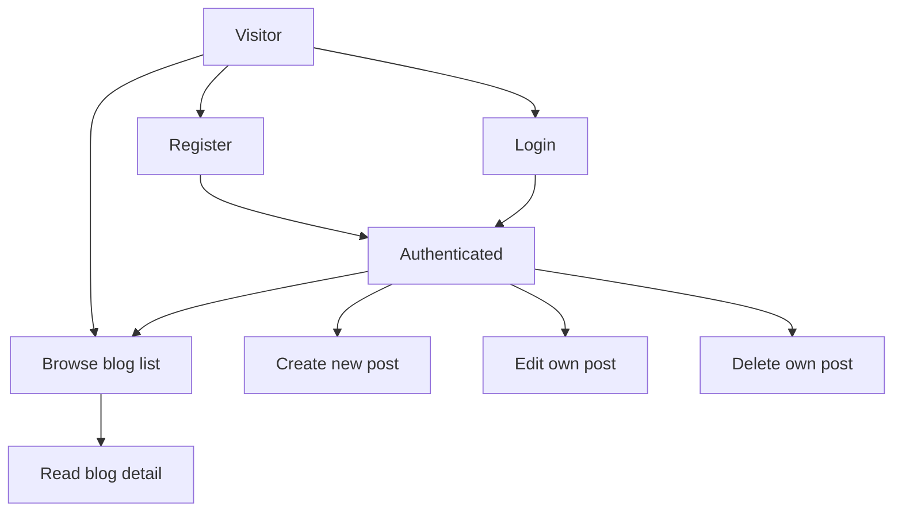

# Feature Brief: Blog Website (Rust Backend + Persistent Storage)

## Context
Build a simple multi-user blog website.

Key requirements:
- Users can register and log in.
- Logged-in users can create, edit, delete their own blogs, and view others' blogs.
- Non-logged-in users can only view blogs.
- Persistent storage.
- Modern website styles.
- Rust backend.

Current delivery ask (2026-02-12): backend implementation exists but must be compiled and tested; once backend gates pass, QA should complete end-to-end verification of the critical user journeys.

Test coverage review ask (2026-02-12): frontend/backend developers and QA should review existing unit, integration, and E2E tests for core user journeys (register, login, logout, view posts, create posts, edit posts, delete posts) and add missing cases. A formal coverage report is not required.

Additional delivery tweaks (2026-02-12):
- Do not hard-code host/base URLs like `127.0.0.1:3000` in implementation or test code; only allow them in env files or framework/configuration files.
- Separate database environments for local development vs E2E testing (distinct Docker deployments) so E2E runs cannot corrupt local dev data.

Launch automation tweaks (2026-02-12):
- Frontend and backend provide one-stop runtime launch scripts/commands (env setup, command params, etc.) so a developer can start each component reliably.
- QA provides one-shot commands to launch all components for local development (DB + API + web) with minimal steps.

## Target Users
- Readers: browse and read blog posts without logging in.
- Authors: register/login to publish and manage their own posts.

## Problem Statement
Provide a lightweight, secure blogging experience where anyone can read posts, and authenticated users can author and manage their own content.

## Goals
- Support public reading of all blogs.
- Support authentication (register/login/logout) with secure session handling.
- Support author-only management of posts (create/edit/delete only for own posts).
- Persist users and blog posts across server restarts.
- Deliver a polished, modern UI on desktop and mobile.

## Current Status (QA)
Last QA run produced blockers for E2E sign-off (see `blog-website/docs/qa-e2e-report.md`).

E2E blockers to resolve before QA re-run:
- Frontend: post detail navigation requests `GET /v1/posts/undefined` (breaks read/detail/edit flows).
- Frontend: session UI often does not update immediately after register/login (cached unauthenticated session).
- Backend: `GET /v1/auth/session` returns `csrf_token` but contract/frontend expect `csrfToken`.

## Non-Goals (Out of Scope)
- Comments, likes, follows, feeds/recommendations.
- Admin/moderation tools.
- Email verification, password reset, SSO.
- Draft/publish states, scheduling.
- WYSIWYG editor or Markdown rendering (unless added later).
- Formal test coverage percentage measurement or tooling changes solely for coverage reporting.

## Assumptions
- Minimal account model: username/email (one identifier) + password.
- Blog posts are public to all visitors.
- Ownership is based on the authenticated user who created the post.

## Key Entities (Conceptual)
- User
  - id
  - handle/username (unique)
  - password (stored as a secure hash)
  - created_at
- BlogPost
  - id
  - author_id
  - title
  - body
  - created_at
  - updated_at

## Primary User Flows

## Functional Requirements

### Authentication
- Registration with validation and duplicate-user handling.
- Login with error messaging for invalid credentials.
- Logout.
- Session persistence for logged-in users (e.g., cookie/session) until logout/expiry.

### Blog Reading (Public)
- Anyone can view:
  - Blog list page (multiple posts).
  - Blog detail page for a selected post.
- Blog list shows at least: title, author, created/updated time (exact fields may vary by UI design).

### Blog Management (Authenticated)
- Logged-in users can:
  - Create a new post.
  - Edit a post they own.
  - Delete a post they own.
- Logged-in users cannot edit/delete posts they do not own.

### Persistence
- Users and posts are stored in a persistent database (not in-memory).
- Data remains after restarting backend and/or frontend.

## Non-Functional Requirements
- Backend implemented in Rust.
- Security baseline:
  - Passwords are never stored in plaintext.
  - Auth-required endpoints reject unauthenticated requests.
  - Ownership checks enforced server-side.
- Usability:
  - Responsive design for mobile and desktop.
  - Clear empty/loading/error states.
- Reliability:
  - Basic input validation with actionable errors.

### Test Coverage Review (No Formal Coverage Report)
- Developers and QA review existing automated tests across unit, integration, and E2E layers.
- Add missing tests to cover core user journeys: register, login, logout, view posts, create posts, edit posts, delete posts.
- Favor existing frameworks and patterns; do not introduce new coverage tooling unless required by existing tooling constraints.

### Environment & Configuration
- Web app, API, and automated tests must take service endpoints (API base URL, web base URL) from environment variables and/or framework configuration.
- Hard-coded localhost URLs in code are disallowed (e.g., `127.0.0.1:3000`, `localhost:3000`), except in:
  - `.env*` files
  - Docker Compose / container configuration (`docker-compose*.yml`, `Dockerfile`, etc.)
  - Framework/tool config files (e.g., Vite/Next config, Playwright/Cypress config)
- Local development database and E2E database must be isolated via separate Docker deployments (distinct containers and volumes, and no shared database name).

### Developer Experience: One-Stop Launch Commands
- Provide documented, runnable commands for starting:
  - Backend API (including required env vars)
  - Frontend web app (including required env vars)
  - Local dev database (Docker)
- Provide a single command (or small command set) to start the full local-dev stack (DB + API + web) end-to-end.
- Launch commands must be configuration-driven (env/config) and must not re-introduce hard-coded loopback URLs into implementation/test source.

## Acceptance Criteria (Testable)

### Registration
- Given I am not logged in, when I submit valid registration details, then my account is created and I can authenticate.
- Given an existing username/identifier, when I attempt to register with the same value, then I see an error and no duplicate account is created.
- Given invalid registration input (e.g., empty username/password), when I submit, then I see validation errors and the account is not created.

### Login/Logout
- Given I have a valid account, when I log in with correct credentials, then I am marked as logged in and can access authenticated actions.
- Given invalid credentials, when I attempt to log in, then I remain logged out and see an error.
- Given I am logged in, when I log out, then I become logged out and authenticated actions are no longer available.

### Public Reading
- Given I am not logged in, when I visit the site, then I can view the blog list.
- Given I am not logged in, when I open a blog post, then I can view the blog details.

### Create Post (Authenticated)
- Given I am logged in, when I create a post with a non-empty title and body, then the post is saved and appears in the blog list.
- Given I am not logged in, when I attempt to access the create-post action, then I am blocked (redirected to login or shown an access denied state).

### Edit/Delete Post (Authorization)
- Given I am logged in and I own a post, when I edit and save changes, then the changes persist and are visible on refresh.
- Given I am logged in and I own a post, when I delete it, then it is removed from the blog list and cannot be opened.
- Given I am logged in but do not own a post, when I attempt to edit or delete it (via UI or direct request), then the action is rejected.

### Persistence
- Given users and posts exist, when the backend restarts, then the same users and posts remain available.

### Backend Readiness (Compile + Test)
- Given I am set up per `blog-website/docs/runbook-dev.md`, when I run `cargo fmt --check` from `blog-website/api`, then it succeeds.
- Given I am set up per `blog-website/docs/runbook-dev.md`, when I run `cargo clippy -- -D warnings` from `blog-website/api`, then it succeeds.
- Given I am set up per `blog-website/docs/runbook-dev.md`, when I run `cargo check` from `blog-website/api`, then it succeeds.
- Given a reachable Postgres and migrations applied (per `blog-website/docs/runbook-dev.md`), when I run `cargo test` from `blog-website/api`, then all backend tests pass.
- Given a reachable Postgres and migrations applied (per `blog-website/docs/runbook-dev.md`), when I run the API and request `GET /v1/auth/session`, then I receive `{ "authenticated": false }` when unauthenticated.

### End-to-End Verification (QA)
- Given the API and web app are running locally, when I register, then I am logged in and can view my session state (`GET /v1/auth/session` returns `authenticated: true` with a `csrfToken`).
- Given I am logged in, when I create a post, then it appears in the list and detail pages and persists after refresh.
- Given I am logged in, when I edit my post, then changes are visible in the detail page and after refresh.
- Given I am logged in, when I delete my post, then it is removed from the list and the detail page is no longer accessible.
- Given I am logged out, when I browse the site, then I can view the list/detail pages but cannot create/edit/delete posts.
- Given two distinct users exist, when user B attempts to edit or delete user A's post (via UI or direct request), then the action is rejected per contract (403 forbidden).

### Automated Test Coverage Review (Unit/Integration/E2E)
- Given the existing test suites, when developers and QA review them, then each core journey (register, login, logout, view posts, create posts, edit posts, delete posts) is covered by at least one appropriate automated test.
- Given a missing test is identified for a core journey, when developers add it, then the test runs in the existing suite without requiring new coverage tooling.

### Configuration: No Hard-Coded Localhost URLs
- Given I set the API base URL via supported configuration (env/framework config), when I run the web app and E2E tests, then they target the configured URL (not an in-code constant).
- Given the repository is searched for literal localhost URLs (e.g., `127.0.0.1:3000`, `localhost:3000`), when reviewing implementation and test source code, then no such literals exist outside approved env/config files.

### E2E Database Isolation
- Given I have local development data in the dev database, when I run the E2E environment and execute the E2E suite, then the dev database data is unchanged.
- Given dev DB and E2E DB Docker deployments are started, when they run concurrently, then there are no port collisions and no shared Docker volumes.
- Given an E2E run completes, when I run E2E again, then the E2E database starts from a known clean state (fresh schema/fixtures as defined by the test plan).

### One-Stop Runtime Launch (Dev)
- Given I have the repo checked out, when I run the documented backend launch command, then the API starts successfully without needing manual env/flag discovery.
- Given I have the repo checked out, when I run the documented frontend launch command, then the web app starts successfully and can reach the API via configured endpoints.
- Given I have Docker available, when I run the one-shot local-dev stack command(s), then DB + API + web all start, are reachable, and a new user can complete register/login/create-post.
- Given I stop the one-shot local-dev stack, when I re-run it, then it is idempotent (or documents required cleanup) and does not require manual port/process hunting.

## Success Metrics
- Product:
  - Time to first published post (median) under 2 minutes after registration.
  - Users can complete registration + first post without guidance.
- Technical:
  - Auth + CRUD flows have automated test coverage (unit/integration/E2E as appropriate).
  - No new coverage tooling added; tests run in existing pipelines or runbooks.
  - No plaintext passwords in storage or logs.

## Definition of Done (This Milestone)
- Backend readiness acceptance criteria pass.
- QA end-to-end verification acceptance criteria pass.
- Configuration acceptance criteria (no hard-coded URLs; E2E DB isolation) pass.
- If automated E2E is available, the suite passes on a clean local run.
- Core journey tests exist across unit/integration/E2E as appropriate, with missing cases added.

## Constraints
- Must use a Rust backend.
- Must use persistent storage.
- UI should look modern (typography, spacing, responsive layout, non-default styling).

## Risks / Unknowns
- Database choice (SQLite vs Postgres) and local-dev setup.
- Deployment target (local only vs hosted) and environment configuration.
- Running dev + E2E stacks simultaneously may require careful default port selection and runbook clarity.
- Content format (plain text vs Markdown) and any sanitization needs.

## Open Questions
1. Do you want usernames, emails, or either as the login identifier?
2. Should the blog body support Markdown (rendered) or plain text only?
3. Expected deployment: local dev only, or a hosted target (and if hosted, where)?
4. For this milestone, should QA treat E2E as a manual checklist run, or is automated Playwright E2E required before sign-off?
