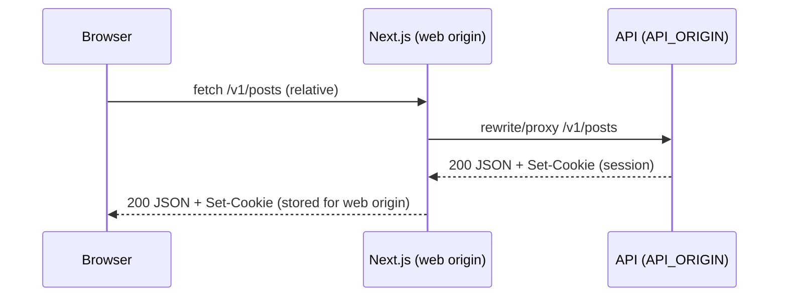
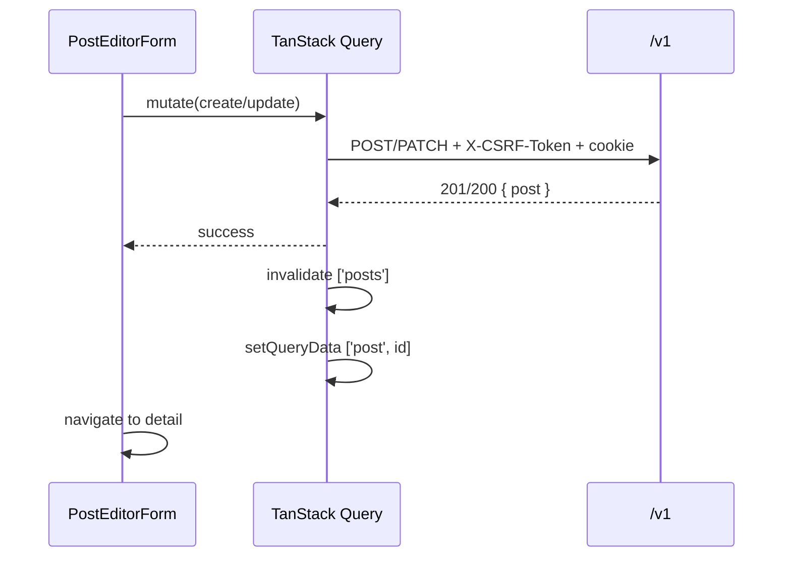

# Frontend Low-Level Design (LLD): Blog Website

Last updated: 2026-02-12

## Scope
This LLD defines an implementation-ready frontend plan for the blog website:

- Routes, layouts, and page composition
- Component boundaries (slice-first)
- Data fetching and caching strategy aligned to `blog-website/contracts/openapi.yaml`
- Auth/session + CSRF handling for cookie-based sessions
- Loading/empty/error states
- Styling direction for a modern responsive UI
- FE test strategy (RTL + MSW + Playwright)

Constraints:

- Contracts are preserved as-is. Any suggested contract improvements are listed in Follow-ups.

## Inputs / Source of Truth
- Feature brief: `blog-website/docs/feature-brief.md`
- HLD: `blog-website/docs/hld.md`
- Human-readable contract: `blog-website/docs/api-contracts.md`
- OpenAPI: `blog-website/contracts/openapi.yaml`

## Product Requirements (condensed)
- Public: list posts, read post detail.
- Auth: register, login, logout; session persists via cookie.
- Authz: create/edit/delete only own posts.
- Persistent data.
- Modern responsive UI; clear loading/empty/error states.

## Proposed Frontend Stack
- Framework: Next.js (App Router) + React + TypeScript (strict).
- Server state: TanStack Query.
- Styling: Tailwind CSS + CSS variables for theming; Next.js fonts.
- Forms: React Hook Form + Zod.
- Testing: Vitest + React Testing Library + MSW; Playwright for E2E.

## App Structure (slice-first)
Proposed top-level layout (implementation guidance; exact filenames may vary):

```
blog-website/
  web/
    src/
      app/
        (public)/
          posts/
            page.tsx
            [postId]/page.tsx
          login/page.tsx
          register/page.tsx
        (authed)/
          posts/new/page.tsx
          posts/[postId]/edit/page.tsx
        layout.tsx
        not-found.tsx
        error.tsx
      features/
        auth/
          api.ts
          hooks.ts
          components/
            auth-forms.tsx
            auth-guard.tsx
          routes/
            login-page.tsx
            register-page.tsx
        posts/
          api.ts
          hooks.ts
          components/
            post-list.tsx
            post-card.tsx
            post-detail.tsx
            post-editor-form.tsx
            post-actions.tsx
          routes/
            posts-page.tsx
            post-detail-page.tsx
            post-new-page.tsx
            post-edit-page.tsx
      shared/
        api/
          client.ts
          errors.ts
          csrf.ts
          query-client.tsx
        ui/
          app-shell.tsx
          button.tsx
          input.tsx
          textarea.tsx
          toast.tsx
          skeleton.tsx
          empty-state.tsx
          error-state.tsx
        lib/
          format.ts
          routes.ts
        styles/
          globals.css
```

Notes:

- `app/*` routes are thin; they compose feature `routes/*` components.
- Feature modules own their UI + hooks + API calls; shared contains generic UI and API plumbing.

## Routing + Access Model

### Routes
- Public
  - `/posts` (home): list posts (paginated)
  - `/posts/:postId`: post detail
  - `/login`
  - `/register`
- Auth required
  - `/posts/new`: create post
  - `/posts/:postId/edit`: edit post (owner only)

Optional redirect:

- `/` -> `/posts`

### Auth gating behavior
- Route-level guard for `/posts/new` and `/posts/:postId/edit`.
  - If `session.authenticated === false`: redirect to `/login?next=<path>`.
  - If authenticated but not owner (edit route): show a 403-style page with CTA back to the post.

Mermaid (routing + guards):

```mermaid
flowchart TD
  R[Router] --> P1[/posts]
  R --> P2[/posts/:postId]
  R --> L[/login]
  R --> G1{Auth?}
  G1 -->|no| L
  G1 -->|yes| N[/posts/new]
  R --> G2{Auth?}
  G2 -->|no| L
  G2 -->|yes| O{Owner?}
  O -->|no| F[403 UI]
  O -->|yes| E[/posts/:postId/edit]
```

## Layouts + Page Composition

### App shell
Global layout (`shared/ui/app-shell.tsx`):

- Top nav:
  - Brand link to `/posts`
  - Public actions: Login/Register
  - Auth actions: "New post" + user menu (username + Logout)
- Main content container with responsive gutters
- Toast region for transient errors/success messages

### Page layouts
- List page: two-column on desktop
  - Left: post feed (cards)
  - Right: "About" panel + CTA (New post if authed)
- Detail page: reading layout
  - Title + author + timestamps + body
  - If owner: "Edit" + "Delete" actions
- Auth pages: centered card layout
- Editor pages: split layout on desktop
  - Left: form
  - Right: live preview (plain text preview; no markdown)

## Contract-Aligned Data Model
Frontend uses generated types from `blog-website/contracts/openapi.yaml` as the only shared DTOs.

Endpoints used:

| Feature | Endpoint | Purpose |
|---|---|---|
| Session bootstrap | `GET /v1/auth/session` | session state + `csrfToken` |
| Register | `POST /v1/auth/register` | create account + start session |
| Login | `POST /v1/auth/login` | start session |
| Logout | `POST /v1/auth/logout` | clear session (CSRF required) |
| Current user | `GET /v1/users/me` | optional sanity check / refresh |
| List posts | `GET /v1/posts` | cursor pagination |
| Post detail | `GET /v1/posts/{postId}` | read post |
| Create post | `POST /v1/posts` | create (CSRF required) |
| Update post | `PATCH /v1/posts/{postId}` | update (CSRF required, owner) |
| Delete post | `DELETE /v1/posts/{postId}` | delete (CSRF required, owner) |

## API Client + CSRF Strategy

### Goals
- Always send cookies (session) and include CSRF header on state-changing requests.
- Normalize errors to a single UI-safe shape (including `fieldErrors`).
- Keep API base URL flexible while preserving contract paths (`/v1/...`).

### Base URL and same-origin cookies
Preferred deployment is same-origin (web + API under same site). For local dev, keep same-origin by proxying:

- Next.js `rewrites` (recommended): forward `/v1/:path*` to the API origin.
- Frontend code always calls relative paths like `/v1/posts`.

This avoids CORS + credential pitfalls and matches cookie-session expectations.

### Origin / endpoint configuration (no hard-coded localhost)
Goal (brief + HLD): neither implementation code nor test source code contains localhost/127.0.0.1 origins. Any concrete origins are supplied via environment variables and consumed only by framework/tool configuration.

Design (aligns to `blog-website/docs/hld.md` and `blog-website/docs/api-contracts.md`):

- Web app source (`web/src/**`) calls relative API paths only (e.g., `/v1/posts`).
- Next.js dev/runtime uses rewrites to map `/v1/:path*` -> `${API_ORIGIN}/v1/:path*`.
- Playwright navigates using `baseURL = E2E_BASE_URL` and performs any out-of-band API checks using `E2E_API_ORIGIN`.

Concrete configuration keys and where they are set/consumed:

| Key | Set in | Consumed by | Purpose |
|---|---|---|---|
| `API_ORIGIN` | Dev: `blog-website/web/.env.local` (required). E2E: injected by `blog-website/scripts/e2e/web` (derived from `E2E_API_ORIGIN`) or set explicitly in `blog-website/web/.env.e2e`. CI/hosting env | `blog-website/web/next.config.*` (rewrites) | API origin that `/v1/*` is proxied/rewritten to |
| `E2E_BASE_URL` | `blog-website/web/.env.e2e`, CI env | `blog-website/web/playwright.config.*` (`use.baseURL`) | Web origin the browser navigates to (tests use `page.goto('/')`) |
| `E2E_API_ORIGIN` | `blog-website/web/.env.e2e`, CI env | Playwright tests/fixtures (any direct API calls) and `blog-website/scripts/e2e/web` | API origin used by the test runner when it must talk to API directly |
| `VITEST_ORIGIN` (optional) | `blog-website/web/.env.app` or CI env | `blog-website/web/vitest.config.*` (`test.environmentOptions.url`) | JSDOM base origin so relative URLs resolve in unit/component tests |

Notes/guardrails about the surfaces:

- `.env*` may contain localhost literals; `web/src/**` and test sources must not.
- `next.config.*`, `playwright.config.*`, `vitest.config.*` may reference env keys but must not embed concrete localhost literals as defaults.
- OpenAPI `servers` entries are illustrative only; runtime origins are never derived from `blog-website/contracts/openapi.yaml`.

Mermaid (request routing in local dev / E2E):



## FE-Side Launch Scripts (One-Stop Commands)

These commands are the stable DX interface defined by `blog-website/docs/hld.md` and `blog-website/docs/runbook-one-command.md`. This LLD specifies the FE-owned behavior only; do not implement ad-hoc alternatives.

### Commands

- `blog-website/scripts/dev/web`
- `blog-website/scripts/e2e/web`

### Env loading and precedence

Policy alignment (repo invariant): loopback origins may appear in `.env*` files, but not in `blog-website/web/src/**` or test source.

Loading rules (both scripts):

- Precedence (highest -> lowest): `process.env` > mode-specific env (`.env.local` or `.env.e2e`) > app defaults (`.env.app`).
- Prefer env file values, but do not override already-set `process.env` keys (CI can override locally).
- Fail fast with an actionable message if required env files are missing:
  - app: `cp blog-website/web/.env.app.example blog-website/web/.env.app`
  - dev: `cp blog-website/web/.env.local.example blog-website/web/.env.local`
  - e2e: `cp blog-website/web/.env.e2e.example blog-website/web/.env.e2e`

### `blog-website/scripts/dev/web` behavior

Required inputs:

- Loads `blog-website/web/.env.local` (overrides) and `blog-website/web/.env.app` (defaults).
- Requires `API_ORIGIN` and `WEB_PORT` (or `PORT`) to be present after env resolution.

Process behavior:

- Starts the Next.js dev server from `blog-website/web/` (equivalent to `npm run dev`).
- Must stream Next.js stdout/stderr without suppressing it (so developers can see compilation errors and the server URL).

### `blog-website/scripts/e2e/web` behavior

Required inputs:

- Loads `blog-website/web/.env.e2e` (overrides) and `blog-website/web/.env.app` (defaults).
- Requires `E2E_BASE_URL` and `E2E_API_ORIGIN` to be present after env resolution.
- Ensures `WEB_PORT`/`PORT` matches the port in `E2E_BASE_URL`.

Config consistency rules (expected by QA):

- Effective `API_ORIGIN` MUST equal `E2E_API_ORIGIN` so that the browser (via `/v1/*` rewrites) and any direct test-runner API calls target the same API instance.
- If `API_ORIGIN` is not set, the script sets `API_ORIGIN=E2E_API_ORIGIN` for the child Next.js process only.
- If `API_ORIGIN` is set but differs from `E2E_API_ORIGIN`, the script must fail with a clear message explaining the mismatch and how to fix it.

Process behavior:

- Starts the Next.js dev server from `blog-website/web/`.
- Must stream Next.js stdout/stderr without suppressing it.

### Stdout/logging contract (readiness + troubleshooting)

Goal: QA/devs can tell when the web server is ready without guessing.

Both scripts must:

- Print a single, machine-searchable line to stdout before starting Next.js:
  - `WEB_ENV envFiles=<modeEnv,appEnv> mode=<dev|e2e> apiOrigin=<value>`
- Print a single, machine-searchable line to stdout exactly once when Next.js is ready to serve requests:
  - `WEB_READY mode=<dev|e2e>`
  - Readiness is detected by observing Next.js dev-server output reaching its "ready" state (do not implement an origin-poll that hard-codes loopback literals).
- On fatal misconfiguration (missing env file / missing required keys / `API_ORIGIN` mismatch in E2E), print:
  - `WEB_ERROR reason=<short>`
  - and exit non-zero.

### Client design
`shared/api/client.ts`:

- `apiFetch(input, init)` wraps `fetch`.
- Sets:
  - `headers['Content-Type'] = 'application/json'` when JSON body
  - `credentials: 'include'` (safe for same-origin; required if proxied cross-origin)
  - `X-CSRF-Token` automatically for `POST|PATCH|DELETE` when available
- Parses JSON error bodies into `ErrorResponse` (OpenAPI type) and maps to `ApiError`.

`shared/api/csrf.ts`:

- CSRF token is stored in memory only (no localStorage).
- Source of truth: `GET /v1/auth/session` response.
- On auth transitions (login/register/logout), refresh session and update CSRF token.

### Error normalization
`shared/api/errors.ts` maps contract `error.code` values to UI behaviors:

- `validation_error`: show inline field errors (when present) + top-level message
- `unauthenticated`: redirect to login if action requires auth
- `invalid_credentials`: show banner on login form
- `forbidden`: show permission UI; for edit/delete: disable actions after 403
- `not_found`: route to `not-found.tsx` for detail/edit routes
- `rate_limited`: show retry-after hint if available (else generic)
- `internal`/unknown: show generic "Something went wrong" + requestId

## State Boundaries + Data Fetching

### State boundaries
- Server state (authoritative): TanStack Query cache.
- Local UI state: component state (editor drafts, modal open states, toasts).
- Cross-route state: only auth session (Query cache + lightweight AuthContext selector).

### Session bootstrap
On initial app load:

- Query: `useSessionQuery()` -> `GET /v1/auth/session`.
- Cache key: `['session']`.
- Stale time: 60s (tuneable); refetch on window focus.

This provides:

- `session.authenticated`
- `session.user`
- `csrfToken` (when authenticated)

### Post queries
- List posts (cursor pagination)
  - Query: `usePostsInfiniteQuery({ limit })`
  - Key: `['posts', { limit }]`
  - Uses `nextCursor` for `getNextPageParam`
- Post detail
  - Query: `usePostQuery(postId)`
  - Key: `['post', postId]`
  - Keep previous data while refetching to reduce layout shift

### Mutations
- Create post: `useCreatePostMutation()`
  - On success: invalidate `['posts']`; navigate to `/posts/:id`
- Update post: `useUpdatePostMutation(postId)`
  - On success: update `['post', postId]` cache; invalidate `['posts']`; navigate back to detail
- Delete post: `useDeletePostMutation(postId)`
  - Confirm modal required
  - On success: remove `['post', postId]` cache; invalidate `['posts']`; navigate to `/posts`

Mermaid (data flow for create/edit):



## Auth Flows

### Register
- Screen: `/register`
- Form fields: `username`, `password`
- Client validation (recommended; must still rely on server):
  - username: 3..32
  - password: 8..72
- Submit -> `POST /v1/auth/register`
  - On 201: refresh session query; redirect to `next` or `/posts`
  - On 409: show "Username already taken"

### Login
- Screen: `/login`
- Submit -> `POST /v1/auth/login`
  - On 200: refresh session query; redirect to `next` or `/posts`
  - On 401 invalid_credentials: show message without indicating which field is wrong
  - On 429: show rate limit UI and keep form disabled briefly

### Logout
- Trigger: user menu -> Logout
- Call `POST /v1/auth/logout` with CSRF token
  - On 204: clear session in cache; redirect to `/posts`
  - If 401: treat as already logged out; clear session in cache
  - If 403 (missing/invalid CSRF): refresh session then retry once (to recover from stale token)

## UI States (Loading / Empty / Error)

### Global
- Network offline: show non-blocking banner "You appear offline" and keep existing cached content.
- Unhandled route error: `app/error.tsx` renders a friendly message + retry.

### `/posts` list
- Loading (no cache): skeleton list (5 cards) + subtle shimmer.
- Loading next page: inline spinner at bottom.
- Empty (`items.length === 0`):
  - Copy: "No posts yet."
  - CTA: if authed -> "Write the first post" -> `/posts/new`; else -> "Login to write".
- Error:
  - Show error state with Retry.
  - If backend returns structured error, show `error.message` + `requestId`.

### `/posts/:postId` detail
- Loading: skeleton header + paragraph blocks.
- Not found (404): render `app/not-found.tsx` ("Post not found").
- Error (non-404): error state + Retry.
- Owner actions:
  - Compare `session.user.id === post.author.id` to decide visibility.
  - If user clicks Edit but receives 403 on update: show "You don't have permission" and navigate back to detail.

### Editor (`/posts/new`, `/posts/:postId/edit`)
- Loading edit page: fetch post, then populate form.
- Empty state: not applicable.
- Validation errors (400 `validation_error`):
  - Map `details.fieldErrors` to field-level messages.
  - Keep any unsubmitted local edits.
- Submit state:
  - Disable inputs + show loading text on primary button.
  - Prevent double-submit.

## Styling Direction (modern, non-default)

### Visual language
"Editorial" look: warm paper background, strong typography, crisp cards.

- Fonts (Next.js `next/font`):
  - Headings: Fraunces (serif)
  - Body/UI: Plus Jakarta Sans (sans)
- Color tokens (CSS variables; Tailwind uses them):
  - `--bg`: paper (near-white with warmth)
  - `--fg`: ink (near-black)
  - `--muted`: slate
  - `--brand`: deep teal
  - `--brand-2`: amber accent
  - `--danger`: brick red
- Background: subtle gradient + light noise texture (CSS only).
- Motion: one intentional motion system
  - Page-load fade/slide (150-200ms)
  - Staggered list reveal for post cards (small, capped to first ~10 items)
  - Respect `prefers-reduced-motion`

### Core UI components (shared)
- `Button`: variants `primary`, `secondary`, `ghost`, `danger`; sizes `sm|md`.
- `Input` / `Textarea`: visible focus ring; error state with helper text.
- `Card`: for post summary; includes hover affordance.
- `EmptyState`, `ErrorState`, `Skeleton`.
- `Toast`: success + error; errors include `requestId` in details panel (collapsed by default).

### Responsive behavior
- Mobile-first; content width capped (readability).
- Post body uses `white-space: pre-wrap` to respect plain text and avoid XSS.

## Accessibility
- Keyboard navigation: all interactive controls reachable and have visible focus.
- Auth forms: proper labels, `aria-invalid`, `aria-describedby` for errors.
- Dialogs (delete confirm): focus trap + ESC close; return focus to trigger.
- Toasts: `role="status"` for success, `role="alert"` for errors.

## Observability (frontend)
- Include `requestId` from error responses in UI and console logs.
- Track key user actions (if/when analytics added): login success/failure, post create/update/delete success/failure.

## Frontend Test Strategy

### Tier 0 (CI gates)
- Typecheck: `tsc --noEmit`.
- Lint: ESLint.
- Format: Prettier.

### Coverage review requirement (core journeys)
This milestone requires reviewing existing FE unit, integration, and E2E tests for the core journeys and adding missing cases using the existing frameworks only (Vitest/RTL/MSW + Playwright). No new coverage tooling or reporters.

Scope to validate:

- Register
- Login
- Logout
- View posts (list + detail)
- Create post
- Edit post
- Delete post

Review approach (FE-owned):

- Inventory existing test files by tier and map each test to a journey step.
- Identify missing coverage per journey and tier; add only the minimal tests needed to close gaps.
- Prefer the lowest meaningful tier:
  - Tier 1: UI behavior and error mapping.
  - Tier 2: route-level flows with MSW.
  - Tier 3: full-stack E2E for end-to-end validation.

Definition of “covered” for FE:

- Each journey has at least one automated FE test that exercises the primary happy path.
- Error handling or auth gating is covered at the lowest tier that expresses the behavior without relying on backend internals.

### Tier 1: Unit + Component tests (Vitest + RTL)
Focus: deterministic behavior, error mapping, and component state.

- Unit tests
  - `shared/api/errors.ts`: maps contract error payloads to UI-safe errors.
  - `shared/lib/format.ts`: timestamp formatting; "updated" label rules.
  - Zod schemas: ensure client-side constraints (min/max) match documented recommendations.
- Component tests (MSW enabled)
  - `AuthForms`: renders field errors from `validation_error` and handles `invalid_credentials`.
  - `PostList`: skeleton -> list -> empty; pagination load-more.
  - `PostEditorForm`: disabled submit; maps `fieldErrors`; success navigation callback invoked.

Coverage additions to verify (add if missing):

- Register form: 409 conflict shows “Username already taken” copy.
- Login form: 429 rate-limited state disables submit and shows retry guidance.
- Logout control: calls mutation and triggers session refresh (mocked success + 401 fallback).

MSW guidelines:

- Use MSW in Node mode for unit/component tests.
- Handlers should return contract-shaped payloads from `blog-website/contracts/openapi.yaml` types.
- Test at least one instance of each contract error code used by the UI.

### Tier 2: Integration tests (RTL + MSW)
Route-level tests that mount the page component with providers:

- `/posts`: happy path, empty, error.
- `/posts/:postId`: 200, 404, 500.
- Auth-required routes redirect when unauthenticated.

Coverage additions to verify (add if missing):

- `/posts/new` unauthenticated -> redirect to `/login?next=/posts/new`.
- `/posts/:postId/edit` unauthenticated -> redirect to `/login?next=...`.
- `/posts/:postId/edit` authenticated non-owner -> 403 UI state (if implemented as page-level guard).
- `/posts/:postId` owner actions appear only when `session.user.id === post.author.id`.

### Tier 3: Playwright E2E
Run against real backend + DB (prefer ephemeral DB per run).

Critical paths (contract-aligned):

1. Public browsing
   - Visit `/posts`, open first post, verify title/body visible.
2. Register + create post
   - Register, create a post, verify it appears in list and detail.
3. Login + edit own post
   - Login, edit, refresh, verify persistence.
4. Delete own post
   - Delete, verify removed from list and 404 on direct URL.
5. Authorization
   - User A creates a post; user B logs in and cannot edit/delete (UI hides actions; direct navigation to edit shows 403 UI).
6. CSRF failure recovery (basic)
   - Simulate stale token (e.g., clear token in storage if implemented) and ensure one refresh+retry path works for logout.

Coverage additions to verify (add if missing):

- Logout: user logs out, UI returns to unauthenticated state, and auth-only actions are not visible.
- View posts: unauthenticated user can open list and detail and navigate back to list.
- Edit + delete: verify ownership enforcement by attempting direct navigation to edit URL as non-owner and seeing 403 UI.

Playwright implementation notes:

- Prefer UI-driven flows; avoid directly calling API except for test setup if needed.
- Use stable selectors (`data-testid`) only on critical controls (submit, new post, delete).

#### Playwright base URL wiring (no hard-coded localhost)
- `blog-website/web/playwright.config.*` must read `process.env.E2E_BASE_URL` and set Playwright `use.baseURL`.
- Tests must navigate via relative paths only:
  - Allowed: `page.goto('/')`, `page.goto('/posts')`
  - Disallowed: `page.goto('http://localhost:3000/posts')` (origin literal in test source)
- Any direct API interactions (health wait, optional setup/teardown) must use `process.env.E2E_API_ORIGIN` (never a literal in test source).

#### Vitest/MSW wiring (no hard-coded localhost)
- Unit/component/integration tests should call the same API client functions as production code (which use relative paths).
- If JSDOM requires an origin for resolving relative URLs, set it via `VITEST_ORIGIN` in `blog-website/web/vitest.config.*` (or equivalent), rather than embedding `http://localhost:*` in test source.
- MSW handlers should match relative paths (e.g., `/v1/auth/session`) and must not require absolute origins.

### Guardrails: prevent localhost literals in source
Explicit review + CI checks to keep the invariant from regressing.

Code review checklist (required):

- No `localhost` / `127.0.0.1` / `0.0.0.0` origin literals in:
  - `blog-website/web/src/**`
  - `blog-website/web/tests/**` (unit/integration)
  - `blog-website/web/e2e/**` (Playwright specs/fixtures)
- All navigations in E2E use Playwright `baseURL` + relative `page.goto()`.
- Any origin usage in configs comes from env keys listed in this section.

Automated guardrail (CI + pre-commit; recommended):

```bash
# Fail if localhost/loopback origins appear in source (allow in env + tool configs only)
rg -n "(https?://)?(localhost|127\\.0\\.0\\.1|0\\.0\\.0\\.0)(:\\d+)?" blog-website/web \
  --glob '!**/.env*' \
  --glob '!**/next.config.*' \
  --glob '!**/playwright.config.*' \
  --glob '!**/vitest.config.*' \
  --glob '!**/*.md'
```

## Follow-ups (contract-preserving suggestions)
These are optional improvements; do not change contracts for initial delivery.

1. Add "my posts" endpoint or filter
   - `GET /v1/posts?authorId=me` or `GET /v1/users/me/posts` to support an author dashboard without fetching all posts.
2. Return `retryAfterSeconds` for `rate_limited`
   - Helps frontend present accurate cooldown messaging.
3. Add `updatedAt` omission semantics on create
   - If `createdAt == updatedAt` always, frontend can simplify labels; otherwise clarify display rules.

## Assumptions / Risks
- Local dev origin/proxy: contract `servers` list is illustrative; frontend should rely on `/v1/...` relative paths + rewrites.
- Plain text body: must render as text (no HTML); if Markdown is later added, re-evaluate XSS and preview.
- Validation tags: UI expects `details.fieldErrors` map when `validation_error`; if backend omits it, UI falls back to `error.message`.
- Script entrypoints: `blog-website/scripts/dev/web` and `blog-website/scripts/e2e/web` are part of the repo-level DX contract, but the `blog-website/scripts/**` tree may not exist yet; this document specifies required behavior so implementation can follow it.
- Concurrent dev + e2e web: `blog-website/web/.env.app.example` defaults `WEB_PORT` to 3001, and `blog-website/web/.env.e2e.example` defaults `E2E_BASE_URL` to port 3001; if dev and E2E stacks must run concurrently, set a distinct E2E web port in `.env.e2e` (the script derives `WEB_PORT`/`PORT` from `E2E_BASE_URL`).
- E2E env completeness: `blog-website/web/.env.e2e.example` currently does not include `API_ORIGIN`; the LLD relies on `blog-website/scripts/e2e/web` deriving it from `E2E_API_ORIGIN`. If script complexity is undesired, add `API_ORIGIN` to the `.env.e2e` template.
