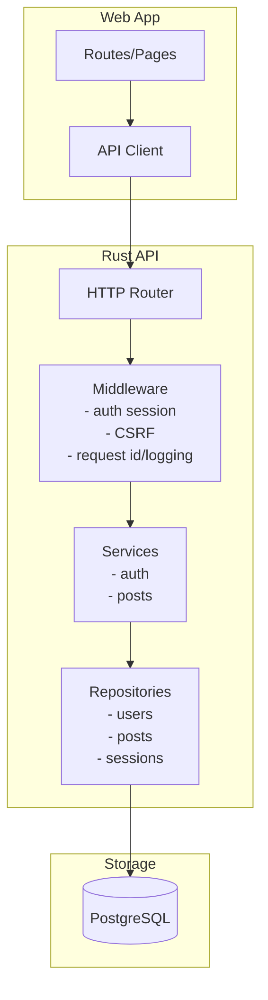

# High-Level Design: Blog Website

## Goals (from brief)
- Public read access to all posts.
- Authenticated users can create/edit/delete their own posts only.
- Persistent storage.
- Modern responsive UI.
- Rust backend.

## Decisions (explicit)
- Backend: Rust HTTP API (Axum) + SQL database access (SQLx) + migrations.
- Persistence default: PostgreSQL.
- Auth: cookie-based session (opaque session id) + CSRF token for state-changing requests.
- API versioning: `/v1` path prefix; additive changes only within `v1`.

## Recommended Tech Stack (to enable parallel delivery)
- Frontend: Next.js (App Router) + React + TypeScript.
- Styling: Tailwind CSS (or CSS Modules if preferred).
- Frontend data fetching: TanStack Query.
- Backend: Axum + tower middleware + SQLx + Argon2.
- DB: Postgres (Docker for local dev).

## Options (documented)
- Database: SQLite is acceptable for single-node/local deployments; Postgres is preferred for production-like multi-user operation.
- Auth alternative: stateless JWT bearer tokens (would remove CSRF need but introduces revocation/rotation complexity); not selected.

## Assumptions (to unblock parallel work)
- Login identifier: `username` (unique handle). If you later prefer email, the contract can be extended with `email` and/or `identifier`.
- Post content: plain text. If Markdown is added later, render with strict sanitization and update the API to include `format`.
- Deployment: single region, single database, single API instance initially; horizontal scaling later.

## System Overview

### Context Diagram
```mermaid
flowchart LR
  U[User Browser] -->|HTTPS| W[Web App
  (Next.js / React)]
  W -->|HTTPS JSON| A[Rust API
  (Axum)]
  A -->|SQL| DB[(PostgreSQL)]
```

### Component Diagram


## Runtime / Deployment Assumptions
- Web app and API are deployed behind HTTPS.
- In production, cookies use `Secure` and `HttpOnly` and `SameSite=Lax`.
- API and DB can be run locally via Docker Compose.

## Environment & Configuration Strategy

### Base URL / Endpoint Configuration (No Hard-Coded Localhost)
Repository invariant (from brief): implementation and test source code must not contain hard-coded localhost origins (e.g., `127.0.0.1:3000`, `localhost:3000`). Any concrete origins are supplied via environment variables and/or framework/tool configuration.

Design choice (to keep cookie sessions simple):

- The web app calls the API using relative paths only (e.g., `/v1/posts`).
- The web framework/tooling is responsible for routing `/v1/*` to the API origin via configuration.

Contracted configuration keys (high level; exact wiring is app-specific):

- `API_ORIGIN`: API origin used by the web app's proxy/rewrites in local dev.
- `E2E_BASE_URL`: web app origin for E2E browser navigation.
- `E2E_API_ORIGIN`: API origin for E2E health checks / setup (if any).

Invariants:

- App/test code must not embed localhost literals; only env/config may contain them.
- If cross-origin is ever required, credentialed CORS must be explicitly configured; same-origin proxy remains the default.

### Database Isolation (Dev vs E2E)
Goal: E2E runs must never corrupt local dev data; dev and E2E stacks must be able to run concurrently.

Deployment invariants:

- Separate Docker deployments for dev and E2E:
  - distinct containers (or distinct Compose projects)
  - distinct Docker volumes (no shared Postgres data directory)
  - distinct database names (no shared `POSTGRES_DB`)
- Separate host port bindings so both stacks can run at once (e.g., dev `5432`, e2e `5434`).

Runtime invariant:

 - The API always reads a single `DATABASE_URL`; the environment/runbook decides whether that points at the dev DB or the E2E DB.

## Developer Experience: Canonical Commands & Invariants

This section defines the stable developer-experience (DX) surface area for launching the system locally.

### Canonical command interface

All "one-stop" launch commands live under:

- `blog-website/scripts/`

Subdirectories:

- `blog-website/scripts/dev/` (local development)
- `blog-website/scripts/e2e/` (local E2E runs with isolated DB)

The intent is that developers and QA do not need to remember per-component env vars/flags; they run a small set of stable entrypoints.

Target commands (stable names; implementation is owned by FE/BE/QA as applicable):

- Backend
  - `blog-website/scripts/dev/api` (start API against dev DB)
  - `blog-website/scripts/e2e/api` (start API against E2E DB)
- Frontend
  - `blog-website/scripts/dev/web` (start web dev server)
  - `blog-website/scripts/e2e/web` (start web dev server configured for E2E)
- Databases
  - `blog-website/scripts/dev/db-up` / `blog-website/scripts/dev/db-down`
  - `blog-website/scripts/e2e/db-up` / `blog-website/scripts/e2e/db-down`
- Full stack (QA one-shot)
  - `blog-website/scripts/dev/up` / `blog-website/scripts/dev/down`
  - `blog-website/scripts/e2e/up` / `blog-website/scripts/e2e/down`

Design note: the scripts are wrappers around the underlying "native" commands (Docker Compose for DB; `cargo run` for API; `npm run dev` for web). They may be implemented as POSIX shell scripts, a small Node CLI, or Make/Just, but the command names and behavior must remain stable.

### Configuration sources (env files)

These are the only places where loopback URLs/origins are allowed to appear by policy:

- API env templates
  - `blog-website/api/.env.example` (template)
  - `blog-website/api/.env` (developer local; not committed)
  - `blog-website/api/.env.e2e` (E2E local; not committed)
- Web env templates
  - `blog-website/web/.env.local.example` -> `blog-website/web/.env.local`
  - `blog-website/web/.env.e2e.example` -> `blog-website/web/.env.e2e`

Scripts must:

- Fail fast with a clear message if required env is missing.
- Prefer loading from these env files (and only fall back to process env).

### DX invariants (must-haves)

- Idempotent starts/stops
  - Re-running `db-up` or `up` does not require manual cleanup.
  - `down` is safe to run even if nothing is running.
- Config-driven networking
  - No hard-coded loopback origins in implementation or test source.
  - The web app calls the API via relative `/v1/*` paths; rewrites/proxy are driven by `API_ORIGIN`.
  - The API bind address/port is driven by `API_BIND`.
- Dev vs E2E DB isolation
  - Dev DB and E2E DB use distinct Compose projects, containers, volumes, and database names.
  - Default ports must not collide (dev `5432`, E2E `5434`).
  - The API must only read one `DATABASE_URL`; scripts/runbooks decide the target.
- Minimal steps for QA
  - A new machine with Docker + Rust + Node can reach a working stack via `blog-website/scripts/dev/up` with no manual env-var discovery.
  - E2E runs use `blog-website/scripts/e2e/up` + a single `blog-website/scripts/e2e/test` (or equivalent) and do not mutate dev data.
- Guardrails
  - CI (or pre-commit) includes a guard that rejects hard-coded localhost URLs in source outside approved env/config locations.
  - Compose project names are treated as stable interface: `blog-website-dev` and `blog-website-e2e`.

## Persistence Approach

### Default: PostgreSQL
- Pros: strong concurrency, straightforward hosting, robust indexing and migrations.
- Approach: SQL migrations (e.g., `sqlx migrate`) with schema defined in `blog-website/docs/data-model.md`.

### Option: SQLite
- Pros: simplest local dev, single binary deployments.
- Cons: concurrency constraints; requires more care with locking and connection pooling.

## Security Baseline

### Authentication
- Register/login/logout with cookie session.
- Password hashing: Argon2id (with per-user salt); never log passwords.
- Session cookie: opaque id; server-side session record stored in DB.
- Session expiry: absolute max age (e.g., 7 days) and idle timeout (e.g., 24 hours) are recommended.

### Authorization
- All write operations on posts enforce ownership server-side.
- No client-side trust for `author_id` or `user_id`.

### CSRF
- Because auth uses cookies, state-changing endpoints require a CSRF token.
- Contract: frontend obtains CSRF token from `GET /v1/auth/session` and echoes it via `X-CSRF-Token` on `POST/PATCH/DELETE`.

### Input Validation and Abuse Controls
- Field validation (length, required, basic character constraints).
- Rate limits (at least on login/register); response should not allow easy user enumeration.
- Request body size limits to prevent oversized payload attacks.

### XSS / Content Safety
- Posts are treated as plain text; frontend must escape when rendering.
- If Markdown is introduced later: sanitize HTML output server-side or via a well-audited renderer with strict allowlist.

### Observability (baseline)
- Structured logs with `requestId`.
- Minimal metrics: request count/latency by route + error count by `error.code`.

## Threat / Abuse Considerations (high level)
- Credential stuffing / brute force: rate limit login; consider IP-based throttles.
- User enumeration: on login, return generic invalid-credentials; on registration, return conflict but avoid leaking if email-based.
- IDOR: enforce `author_id == session.user_id` for mutations.
- CSRF: enforce token + same-site cookies; avoid CORS with credentials unless necessary.
- SQL injection: parameterized queries only.

## API Contract Source of Truth
- Human-readable contract: `blog-website/docs/api-contracts.md`.
- Machine-readable OpenAPI: `blog-website/contracts/openapi.yaml`.

## Testing / Verification Strategy (contract-first)
- Tier 0: lint + format + typecheck (FE/BE).
- Tier 1 (BE): service/repo tests (auth + ownership rules) without HTTP.
- Tier 2 (BE): HTTP integration tests against a real DB (Testcontainers or local Postgres).
- Tier 2 (FE): UI flows with mocked network responses (MSW) generated from OpenAPI types.
- Tier 3: Playwright E2E for critical paths: public browse/read; register/login; create/edit/delete own post; forbidden on others.

### Test Coverage Review Requirement (2026-02-12)
The current milestone requires a review of existing automated tests and the addition of missing cases for core journeys (register, login, logout, view posts, create, edit, delete). This is a contract requirement for delivery readiness.

Coverage review approach (no new tooling):

- Inventory existing unit/integration/E2E tests and map each to a core journey step.
- Identify gaps and add tests within existing suites and frameworks (no new coverage tools or reporters).
- Prefer the lowest meaningful tier for each missing behavior (Tier 1 for rules, Tier 2 for HTTP and DB, Tier 3 for full journey).

Expected coverage mapping (minimum):

- Register
  - BE Tier 1: validation and duplicate-user handling.
  - BE Tier 2: `POST /v1/auth/register` persists user and sets session.
  - E2E: user can register and is logged in.
- Login
  - BE Tier 1: invalid credentials check.
  - BE Tier 2: `POST /v1/auth/login` sets session.
  - E2E: user can log in and access auth-only actions.
- Logout
  - BE Tier 2: `POST /v1/auth/logout` clears session.
  - E2E: user is logged out and cannot create/edit/delete.
- View posts
  - BE Tier 2: `GET /v1/posts` and `GET /v1/posts/{postId}` return expected data.
  - E2E: unauthenticated user can browse list and detail.
- Create/Edit/Delete posts
  - BE Tier 2: auth and ownership enforced on `POST/PATCH/DELETE /v1/posts`.
  - E2E: authenticated user can create/edit/delete own post; non-owner forbidden.

Suggested verification commands (to be wired by implementers):
- Backend: `cargo test` and an integration suite (e.g., `cargo test -p api --test integration`).
- Frontend: `npm test` + `npm run e2e`.
- Contract checks: validate `blog-website/contracts/openapi.yaml` in CI (e.g., `npx @redocly/cli lint ...`).
