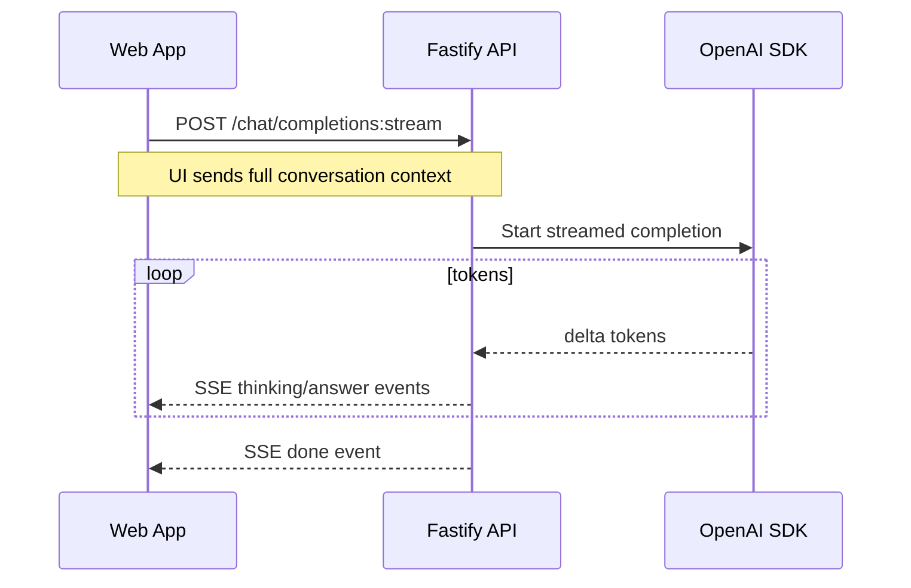

# Backend Low-Level Design: Chatbot App

## Scope and Assumptions
- Backend stack: Node.js, Fastify, TypeScript, SSE (no database).
- Contract-first: `chatbot-app/packages/contracts/openapi.yaml` is source of truth and must be updated to remove identity/session dependencies before implementation.
- Error envelope and codes follow `chatbot-app/docs/api/error-model.md` with identity-related codes removed or deprecated.
- No login, sessions, or identity headers; access is fully anonymous and stateless.
- Chat history is local-only in the browser; backend must not persist chats, messages, or identity.
- Client sends full conversation context with each inference request.
- Model selection defaults per conversation; optional per-message override if contract allows.

## Service Structure and Module Boundaries

Layering: API -> domain/service (stateless).

Modules (vertical slices):
- models
  - api: list models
  - service: config loader, cache, validator
  - repo: none (file-backed)
- completions
  - api: SSE endpoint for streaming completions
  - service: prompt assembly, validation, OpenAI integration

Shared infrastructure:
- validation: request schema validation, payload size caps
- error-mapper: domain errors -> API error envelope
- observability: request_id middleware, structured logs, metrics

## Data Flow (SSE Request)

## API Layer

Controllers are thin: validate, apply access rules, call services, map errors.

Endpoints per contract:
- Models: `GET /models`
- Streaming: `POST /chat/completions:stream`

Stateless policies:
- Requests must include full conversation context required to build the prompt.
- No list or detail endpoints that depend on server-stored chat state.

## Contract Updates Required

- Remove guest session and chat persistence endpoints.
- Remove all security schemes and identity-related parameters.
- Add `POST /chat/completions:stream` with full conversation context payload.

## Domain Services

ModelCatalogService
- `listModels()` reads config file, validates schema, returns list + updated_at.
- Optional in-memory cache with file mtime check and TTL.

CompletionService
- `buildPrompt(payload)` validates payload and constructs OpenAI messages.

StreamingService
- `streamCompletion(payload, res)`
Flow:
- Validate model selection and conversation context size.
- Build OpenAI messages from client-supplied context.
- Stream tokens to client with SSE events.
- Do not persist assistant message after done.

## Persistence and Identity

- No database or server-side persistence.
- Backend must not store chat history, messages, or identity.
- No cookies, sessions, or identity headers.
- Any `chatId` or message identifiers are treated as client-only metadata.

## Model Config Loading

Config source:
- File path from env, e.g. `MODEL_CONFIG_PATH`.
- Format: JSON or YAML (must be declared; default JSON for simplicity).

Load strategy:
- On each `GET /models`, read file and validate schema.
- Optional cache with file mtime + TTL to reduce IO.
- If invalid or missing, return `MODEL_CONFIG_INVALID` with 400.

Validation rules:
- Each model has unique `id`, `label`, `supports_streaming`.
- Optional: `context_length`, `default_temperature` within reasonable bounds.
- Streaming endpoint only allows models with `supports_streaming: true`.

## OpenAI SDK Integration

Client config:
- Use OpenAI SDK with `base_url` and `api_key` from env.
- Set request timeout and retry policy (e.g. 2 retries for 5xx/429).
- Attach `request_id` to OpenAI request metadata when supported.

Prompt construction:
- Use messages array from request payload in order received.
- Include system prompt if later introduced (not in current contract).

Safety and limits:
- Enforce max prompt size before request; return `PAYLOAD_TOO_LARGE` or `VALIDATION_ERROR`.
- Truncate or reject oversized histories with clear error.

## Streaming SSE Implementation

Protocol:
- Content-Type `text/event-stream`.
- Events: `thinking`, `answer`, `done`, `error` as in contract.

Flow details:
- Write headers: `Cache-Control: no-cache`, `Connection: keep-alive`.
- Flush on each event to minimize latency.
- If client disconnects, abort OpenAI stream and mark stream as interrupted.

Persistence:
- Accumulate tokens in memory per request, no server-side writes on `done`.
- On `error`, end stream without writing any state.

## Error Mapping

Error envelope per `chatbot-app/docs/api/error-model.md`.

Domain errors -> API codes:
- Invalid model id -> `MODEL_NOT_FOUND` (422)
- Model config invalid -> `MODEL_CONFIG_INVALID` (400)
- OpenAI timeouts -> `STREAM_TIMEOUT` (503)
- OpenAI errors -> `DEPENDENCY_ERROR` (503)
- Validation errors -> `VALIDATION_ERROR` (400)

SSE errors:
- Emit `event: error` with `ErrorResponse` payload.
- End stream after error to avoid partial state.

## Observability

Logs:
- Include `request_id` and model id.
- Redact secrets, tokens, and full prompt text.

Metrics:
- Stream start latency, total stream duration.
- Error counts by code.
- OpenAI latency and error rate.

## Test Strategy

Tier 0:
- Lint, format, TypeScript strict.

Tier 1 (service/domain):
- ModelCatalogService validation and cache behavior.
- CompletionService validation of conversation context size and model rules.
- StreamingService error mapping for OpenAI failures.

Tier 2 (API):
- Models endpoint reflects config updates and invalid config behavior.
- Stream endpoint accepts full context payloads and returns contract-compliant SSE responses.
- Oversized context is rejected with `VALIDATION_ERROR`.

## Risks and Open Questions

- Per-message vs per-conversation model selection final rule; current design supports both if in contract.
- Definition of thinking content (real model reasoning vs placeholder).
- Config format and reload strategy (file watcher vs request-time read).
- Maximum conversation context limits and client behavior on truncation.
