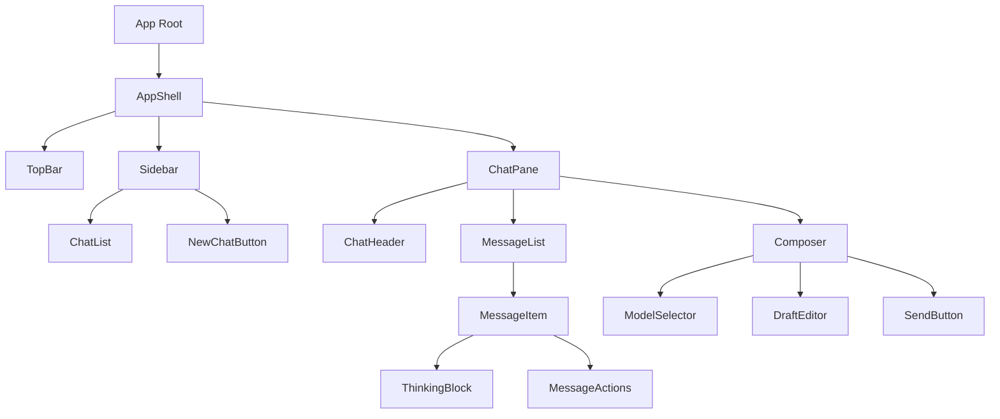

# Frontend Low-Level Design: Chatbot App

## Scope and Assumptions
- Frontend stack: Next.js App Router, React, TypeScript, Tailwind, React Query, Zustand.
- No-login access: the app never shows auth UI and does not gate routes.
- Model selection defaults per conversation; per-message override allowed via optional field.
- Chat history is local-only and stored in browser storage; the server never persists chats/messages.
- No guest session or cookie-based identity is assumed for the UI.
- Streaming uses SSE as defined in `packages/contracts/openapi.yaml`.

## Routing and Page Structure
- `/`: Shell with side panel and chat area; shows empty state when no chat selected.
- `/chat/[chatId]`: Chat view with messages for selected chat and branch.

Route behavior:
- No auth gating. Any request failures are treated as generic service errors; no session recovery flow.

## Component Tree

## State Management Boundaries

Server state (React Query):
- `models`: `GET /models`

Local persistent state (IndexedDB):
- `chats`: `{ id, title, model_id, created_at, updated_at }`
- `branches`: `{ id, chat_id, root_message_id, created_at }`
- `messages`: `{ id, chat_id, branch_id, parent_message_id, role, content, thinking_content, model_id_override, created_at }`
- `drafts`: `{ chat_id, content, updated_at }` (optional; used to restore composer input)

Local UI state (Zustand):
- `selectedChatId`, `selectedBranchId`
- `draftByChatId` (composer text)
- `isStreaming`, `streamRequestId`
- `pendingMessage` (optimistic user message)
- `sidebarOpen` (mobile drawer)

Derived state:
- Current model ID = chat model unless `model_id_override` selected for next send.
- Current branch = selected branch, default to latest branch in chat detail.

## Local Storage Strategy

- Storage engine: IndexedDB database `chatbot-app` with versioned schema.
- Object stores: `chats`, `branches`, `messages`, `drafts`, `metadata`.
- Indexes: `messages.byChat`, `messages.byBranch`, `chats.byUpdatedAt` for fast list rendering.
- Hydration: load chats and selected chat branch on app start; lazy-load messages per chat/branch.
- Write-through persistence: every chat/message mutation writes to IndexedDB; UI state remains in memory.
- User controls: provide a "Clear history" action that wipes IndexedDB and resets selection.

## API Integration Plan

Use contract-generated types only (no manual DTOs).

Endpoints and hooks:
- `useModelsQuery` -> `GET /models`
- `useStreamMessage` -> `POST /chat/completions:stream` (SSE)

Local data hooks (IndexedDB-backed):
- `useLocalChats` -> list/create/update/delete chats
- `useLocalChatDetail(chatId)` -> chat metadata + branches
- `useLocalMessages(chatId, branchId)` -> message list for branch

Client identifiers:
- `chatId` is client-generated (UUID) and only used for local history.
- `messageId` is client-generated for user and assistant messages; optional `completion_id` from stream is stored for telemetry only.

Cache updates:
- On create chat: write to IndexedDB and navigate to new chat.
- On message done: persist assistant message and update chat timestamps in IndexedDB.
- On edit/resubmit: create new branch locally before streaming; persist it and switch selection.

## Streaming Handling

SSE client strategy:
- Use `fetch` + `ReadableStream` parser for SSE.
- Open stream on submit; add optimistic user message to UI.
- Build request payload with `model_id` and full branch `messages` array.
- Accumulate tokens into two buffers keyed by temp message ID:
  - `thinking_content` from `event: thinking`
  - `content` from `event: answer`
- On `event: done`, finalize message, persist locally, and clear streaming state.
- On `event: error`, show inline error banner in chat pane, stop streaming, keep optimistic user message marked as failed with retry action.
- Support cancellation when user switches chats or sends a new message: abort stream, mark message as cancelled.

## Error UX and Empty States

Global:
- Central error mapper from `ErrorResponse` -> human text; never show raw code.
- Request failures render a non-blocking banner: "Service unavailable. Please refresh or try again later."

Chat list:
- Empty: show "No chats yet" and primary action "Start new chat".
- Error: retry button and brief message.

Chat pane:
- Empty (no chat selected): show guidance and model selector disabled until chat exists.
- Empty (chat selected, no messages): prompt to send first message.
- Streaming errors: inline notice with retry; keep partial output visible.

## Conversation Branching UX

- Message item includes "Edit" action on user messages.
- Editing opens inline draft; submitting creates a new local branch and streams using that branch context.
- On `done`, UI stays on the new branch; previous branch remains in branch selector.

## Responsive Layout

- Desktop: persistent sidebar (25-30% width), chat pane fills remaining width.
- Mobile: sidebar as slide-over drawer; top bar includes menu toggle.
- Message list uses sticky composer at bottom; list height uses `calc(100vh - header - composer)`.
- Model selector in composer on desktop, in header dropdown on mobile to preserve space.

## Accessibility and UX Standards

- Visible focus states, keyboard navigation across sidebar, message list, and composer.
- Aria labels on model selector, send button, and sidebar toggle.
- Streaming status announced via aria-live polite region.

## Observability (Frontend)

- Log stream start latency, stream error events, and send failures (client analytics hook).
- Include `request_id` from error responses in user-visible "Details" expandable section.

## Test Strategy

Tier 0:
- Lint, format, TypeScript strict checks.

Tier 1 (component/hook):
- `ModelSelector` renders models and supports selection/disabled states.
- `Composer` submit/disabled logic while streaming.
- `useStreamMessage` parses thinking/answer/done/error events.
- `MessageItem` edit flow shows inline editor and triggers callback.
- Local history repository reads/writes, including drafts and deletion.

Tier 2 (integration):
- Open app -> create chat -> send message -> stream thinking + answer -> message finalized.
- Edit prior message -> new branch created -> branch switch -> messages rendered.
- Refresh page -> local history restored -> continue in same chat.

## Open Questions and Risks

- Max request size for full context payloads and client-side truncation policy.
- Streaming "thinking" content may be placeholder vs real reasoning; UI treats it as a separate panel and keeps it collapsible.
- Model selection override rules should be confirmed for per-message use; default is per chat.
- Local storage limits and migration strategy for IndexedDB schema need explicit policy.
