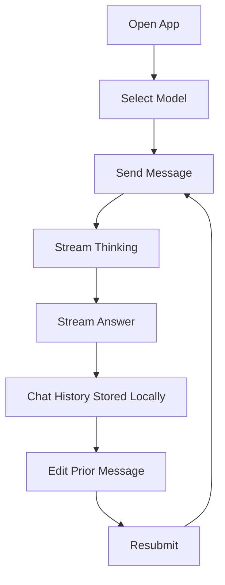

# Feature Brief: Chatbot App Website

## Overview
Build a web-based chatbot application with a ChatGPT-like experience. Users can access the chat without logging in, manage chat histories via a side panel, select models, and interact in a main chat area that supports streaming responses and a separate “thinking” section. Users can edit a previous question and resubmit to branch the conversation. A backend API provides available models driven by a maintainer-editable config file. The LLM calls use the OpenAI SDK with `base_url` and `api_key` sourced from environment variables. All URLs and ports must be configured through env or config files (not hard-coded in code or scripts), and launch scripts must avoid port conflicts by auto-selecting an available port.

## Target Users
- End users who want immediate, no-login access to an LLM chat UI
- Maintainers who need to control available models without code changes

## Problem Statement
Users need a modern, responsive chat UI that supports real-time streaming output, model selection, and easy iteration on previous prompts. Maintainers need a simple, secure way to manage available models.

## Desired Outcomes
- Users can access chat without logging in, edit prior prompts, and view local-only history smoothly.
- Responses appear as streaming output with a visible “thinking” section.
- Users can switch models per conversation or per message (product decision to be finalized).
- Maintainers can update available models through a config file without redeploying code (if supported by runtime) or without changing source.
- Developers and maintainers can run scripts without editing code to change URLs/ports.
- Environment variable management is consistent and minimal across frontend, backend, local-dev, and e2e-test.
- Launch scripts recover automatically from port conflicts by selecting an available port and continuing.
- Frontend and backend each have standalone app-specific env/config files, plus integrated env/config files for local-dev and e2e-test that override app defaults.

## Use Cases
- Open the app and immediately start a new conversation with streaming responses.
- Review prior chats stored on the device in a side panel and resume a conversation.
- Change the selected model and continue chatting.
- Edit a prior user message and resubmit to create a new branch/variant.
- Maintainer updates model config, which is reflected in the model selector.
- Developer runs the app via scripts and gets a working launch even if the configured port is already in use.
- Developer can run local-dev and e2e flows without manual env file edits or duplication.

## Key User Flows
### 1) Open and Chat
- User lands on app and sees the chat UI.
- User selects a model.
- User sends a message.
- Assistant streams “thinking” and answer sections in real time.

### 2) Edit and Resubmit
- User opens a prior message in the conversation.
- User edits and resubmits.
- App creates a new branch/variant of the conversation.

### 3) Model Management (Maintainer)
- Maintainer edits a config file to add/remove models.
- Backend model list API returns updated models.

## In Scope
- No-login access to the chat experience (no auth gating).
- Chat history persistence is local-only (browser storage) with no server-side history storage.
- Web UI with side panel chat history, model selector, main chat area.
- User-facing error handling with friendly messages for frontend and backend errors.
- Streaming assistant output with a distinct “thinking” section.
- Edit previous user question and resubmit to create a new conversation variant.
- Backend API to list available models based on a config file.
- OpenAI SDK usage with `base_url` and `api_key` from environment variables.
- Remove hard-coded URLs/ports from code and scripts, using env or config files instead.
- Update launch scripts to detect port conflicts and select an available port automatically.
- Refactor env var management to a consistent, minimal set of per-app env files with clear precedence for local-dev and e2e-test overrides.

## Out of Scope
- Any authentication or login requirement for chat access.
- Server-side chat history persistence or cross-device chat sync.
- OAuth or external identity providers.
- Full user account management system (password reset, MFA, email verification).
- Billing, quotas, or rate limiting.
- Model fine-tuning or custom tools/plugins.
- Multi-tenant admin panel for model management.
- Dynamic, in-app UI for editing environment variables or config files.
- Introducing a new secrets management service or external config platform.

## Acceptance Criteria (Given/When/Then)
- Given a user accesses the app, when it loads, then the chat UI is available without any login prompt.
- Given a user opens the app, when they view the UI, then they can see a side panel listing chat histories stored locally on that device.
- Given a user clears local storage or uses a different device, when they open the app, then prior chat history is not available.
- Given a user selects a model, when they continue chatting, then the selection is visible and used for subsequent messages.
- Given a user sends a message, when the assistant responds, then the UI streams output in real time and shows a distinct “thinking” section separate from the final answer.
- Given a user edits a prior question and resubmits, when the response returns, then a new conversation branch is created and the original remains accessible.
- Given the model config file is updated by a maintainer, when the model list API is called, then it reflects the updated models.
- Given the backend calls the LLM, when it initializes the OpenAI SDK, then it reads `base_url` and `api_key` from environment variables.
- Given a frontend or backend error occurs, when it is surfaced to the user, then the UI displays a user-friendly, actionable message.
- Given any runtime URL or port is needed, when the app or scripts run, then the value is sourced only from env or config files and not hard-coded in code or scripts.
- Given a configured port is already in use, when a launch script runs, then it selects an available port, starts successfully, and reports the chosen port in its output.
- Given a developer runs `npm run dev` in the frontend app, when the app starts, then it reads configuration from the frontend app-specific env/config file.
- Given a developer runs `npm run dev` in the backend app, when the app starts, then it reads configuration from the backend app-specific env/config file.
- Given a developer runs local-dev scripts, when the services start, then the local-dev integrated env/config file overrides the app-specific configs for both frontend and backend.
- Given a developer runs e2e-test scripts, when the services start, then the e2e-test integrated env/config file overrides the app-specific configs for both frontend and backend.
- Given a developer runs any supported script, when it loads configuration, then it uses a single documented precedence order with no duplicated keys across env files unless explicitly overridden.

## Success Metrics
- 95% of chat responses show streaming updates within 1s of request start.
- 0 critical UI errors during a 30-minute exploratory session.
- Model list updates visible within one refresh cycle (define at implementation).
- 90% task completion rate for “edit and resubmit” flow in user testing.
- 100% of launch scripts succeed without manual port changes when the default port is occupied (within the defined search strategy).
- 0 manual env edits required to run local-dev and e2e flows after initial setup.

## Constraints
- Must use OpenAI SDK with env-based `base_url` and `api_key`.
- Config-driven model list managed by maintainers.
- Responsive UI for desktop and mobile.
- Errors must be presented with user-friendly, non-technical copy.
- Chat history must be stored locally in the browser; the backend must not persist chat history or user identity.
- URLs and ports must be defined in env/config only; scripts should not embed env var declarations inline beyond loading them.
- Launch scripts must check port availability and select a free port by incrementing the configured port by +1 until available.
- Config/env structure must be consolidated, documented, and enforce a single precedence order across frontend and backend.

## Risks and Unknowns
- Definition of “thinking” section: whether it is real model reasoning or a UI placeholder.
- Conversation branching behavior and how it is represented in history.
- Port selection limits (maximum attempts) and how the selected port is communicated to dependent services.
- Specific config file naming conventions and precedence rules for app-level vs integrated overrides.
- Risk of breaking local-dev or e2e flows during env refactor; require documented migration steps.

## E2E Test Stability (2026-02)

### Context
Recent E2E reruns show failures in chat streaming completion state and a model-list fixture mismatch. These regressions block confidence in the core chat flows.

### In Scope
- Fix the chat UI (and/or mocked streaming backend) so message streaming transitions to a terminal `complete` state reliably in E2E.
- Align E2E model list configuration/fixtures so the model selector shows the expected number of models.
- Ensure the existing E2E suite passes locally using the repo-provided runner script.

### Out of Scope
- Redesigning the chat streaming UX, changing product behavior, or adding new models beyond what is required for tests.
- Refactoring the E2E test framework/tooling.

### Acceptance Criteria (Given/When/Then)
- Given a chat response is streamed in the UI, when the stream ends, then the message container transitions to `data-status="complete"` within the test timeout.
- Given the E2E environment model config is loaded, when the model selector renders, then it shows at least 2 models as expected by E2E.
- Given a developer runs `./scripts/e2e-run.sh` from `chatbot-app`, when the run completes, then all E2E tests pass with 0 retries.

## Open Questions
- Should model selection apply per message or per conversation?
- Any constraints on the model config format (JSON, YAML) and location?
- What is the maximum number of +1 attempts before failing, and how should the selected port be surfaced to dependent services?
- What are the preferred file names and locations for the per-app config/env files and the local-dev/e2e-test override files?
- Which env keys are currently redundant and can be removed versus must be preserved for compatibility?
