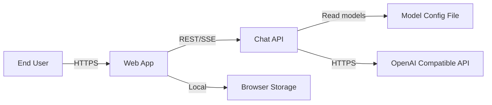
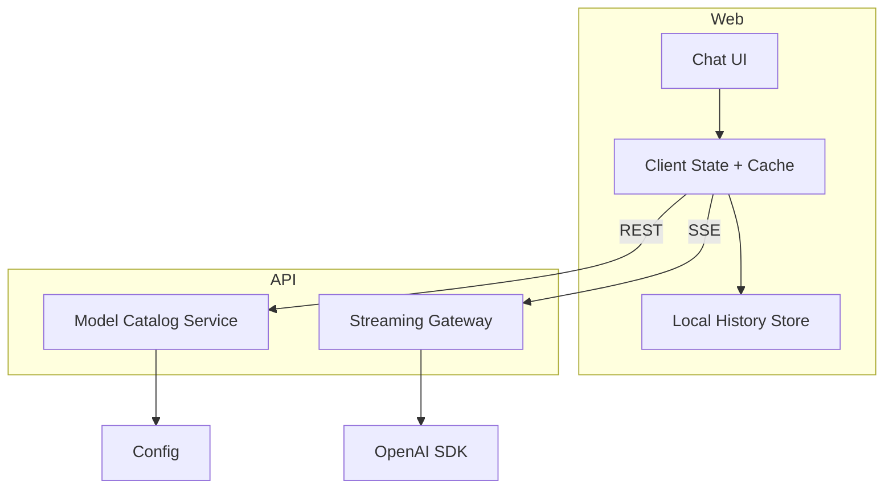

# System Architecture: Chatbot App

## Goals
- Deliver a ChatGPT-like web experience with streaming responses and a visible thinking section.
- Support no-login access, local-only chat history, model selection, and branching conversations.
- Allow maintainers to change available models via a config file.

## Non-Goals
- OAuth, billing, quotas, or multi-tenant admin.
- Full account lifecycle (MFA, email verification, password reset).

## Stack Selection
- Frontend: Next.js (App Router) + React + TypeScript, Tailwind CSS, React Query, Zustand.
- Backend: Node.js + Fastify + TypeScript (stateless API).
- Database: None (chat history lives only in browser storage).
- Streaming: Server-Sent Events (SSE) over HTTP.

Rationale: Next.js and Fastify provide fast iteration, good TypeScript support, and first-class streaming responses. A stateless API simplifies privacy guarantees by never persisting chat history or identity.

## Context Diagram

## Component Diagram

## Key Decisions
- Model selection applies per conversation by default; per-message override is allowed for experimentation.
- Conversation branching is represented by a `branch_id` plus `parent_message_id` on messages. No in-place edits.
- The backend is stateless: it never persists chat history or identity. The client sends full conversation context on each request.

## Configuration and Environment Management
The system uses a minimal, consistent env set with explicit precedence across frontend, backend, local-dev, and e2e-test.

Sources (lowest to highest precedence):
1. App-specific env files:
   - `apps/web/.env`
   - `apps/api/.env`
2. Integrated override env files (only one active per run mode):
   - `env/.env.local-dev`
   - `env/.env.e2e-test`
3. Process environment (CI/CD or runtime overrides)

Rules:
- Keys are defined once in app env files; integrated files may override, not duplicate without intent.
- Runtime scripts load the app env first, then the integrated override, then process env.
- Launch scripts auto-select a free port by incrementing the configured port and must output the final port used.

Minimal env key sets (subject to feature scope):
- Frontend: `WEB_PORT`, `API_BASE_URL`, `APP_ORIGIN`
- Backend: `API_PORT`, `OPENAI_BASE_URL`, `OPENAI_API_KEY`, `MODEL_CONFIG_PATH`, `CORS_ORIGIN`

## Contract Implications
- No endpoint changes are required for the env refactor.
- Error responses may include env/config-related error codes; clients surface the provided message.

### E2E Stability Contracts (2026-02)
- Streaming terminal state: the SSE stream MUST terminate with exactly one terminal event (`done` or `error`) and then close the response; the UI marks the assistant message `data-status="complete"` on `done` (with an EOF fallback for mocks).
- E2E model list: `env/.env.e2e-test` pins `MODEL_CONFIG_PATH` to `apps/e2e/fixtures/models.e2e.json`; `GET /models` must reflect that file and provide at least 2 models for Playwright.

See `chatbot-app/docs/testing/e2e-test-stability-2026-02.md`.

## Data Model (Client Storage)

Collections stored in browser storage (IndexedDB/localStorage), representative fields:

- `chats`
  - `id` (uuid)
  - `title` (string)
  - `model_id` (string)
  - `created_at` (timestamp)
  - `updated_at` (timestamp)
  - `last_message_at` (timestamp)
- `branches`
  - `id` (uuid)
  - `chat_id` (uuid)
  - `root_message_id` (uuid)
  - `created_at` (timestamp)
- `messages`
  - `id` (uuid)
  - `chat_id` (uuid)
  - `branch_id` (uuid)
  - `parent_message_id` (uuid, nullable)
  - `role` (user | assistant | system)
  - `content` (string)
  - `thinking_content` (string, nullable)
  - `model_id_override` (string, nullable)
  - `created_at` (timestamp)

Indexes (client-side):
- `chats` by `updated_at desc`
- `messages` by `chat_id`, `branch_id`, `created_at`

## Key Flows

### Open and Chat (Streaming)
1. UI loads chat history from browser storage.
2. UI calls `GET /models` to populate model selector.
3. UI selects a chat or creates a new local chat.
4. UI sends the full branch context to `POST /chat/completions:stream` and opens SSE stream.
5. API streams thinking and answer events; UI persists the assistant message locally.

### Edit and Resubmit
1. UI chooses a prior user message.
2. UI creates a new branch locally and builds a new message list.
3. UI streams a response using the new branch context and stores the result locally.

### Model Management
1. Maintainer updates config file on server.
2. API reads config on request (or hot reload) and returns latest model list.

## Security Posture
- No authentication or identity storage; requests are anonymous.
- Input validation at API boundary; reject oversized content.
- CORS locked to expected origins for production deployments.
- Rate limiting and abuse protection can be added without storing user identity.

## Observability
- Structured logs with request_id and model_id; avoid logging raw prompt content.
- Metrics: request latency, stream start latency, error rate.
- Tracing: propagate request_id to OpenAI SDK requests.

## Versioning and Compatibility
- API versioning via URL prefix (`/api/v1`).
- Backward compatible additions: optional fields, new endpoints.
- Breaking changes require `/v2` and dual support window.

## Contract-First Discipline
- `packages/contracts/openapi.yaml` is source of truth.
- Update contract before any API or UI changes.
- Generate types from contract; no hand edits to generated artifacts.

## Migration Risks and Mitigations
- Inconsistent precedence across scripts can load stale values; enforce one loader and document order.
- Duplicate keys across env files can mask overrides; add validation to fail fast on conflicts.
- Missing keys can cause opaque runtime failures; validate required keys at startup and return structured errors.
- Port auto-selection can desync dependent services; ensure scripts log and export the selected port.

## Local-Only History
- Chat history is stored in browser storage only; the API does not persist messages or identity.
- Clearing local storage or switching devices removes access to prior chats.
- Optional in-memory cache can accelerate UI but the local store remains source of truth.
