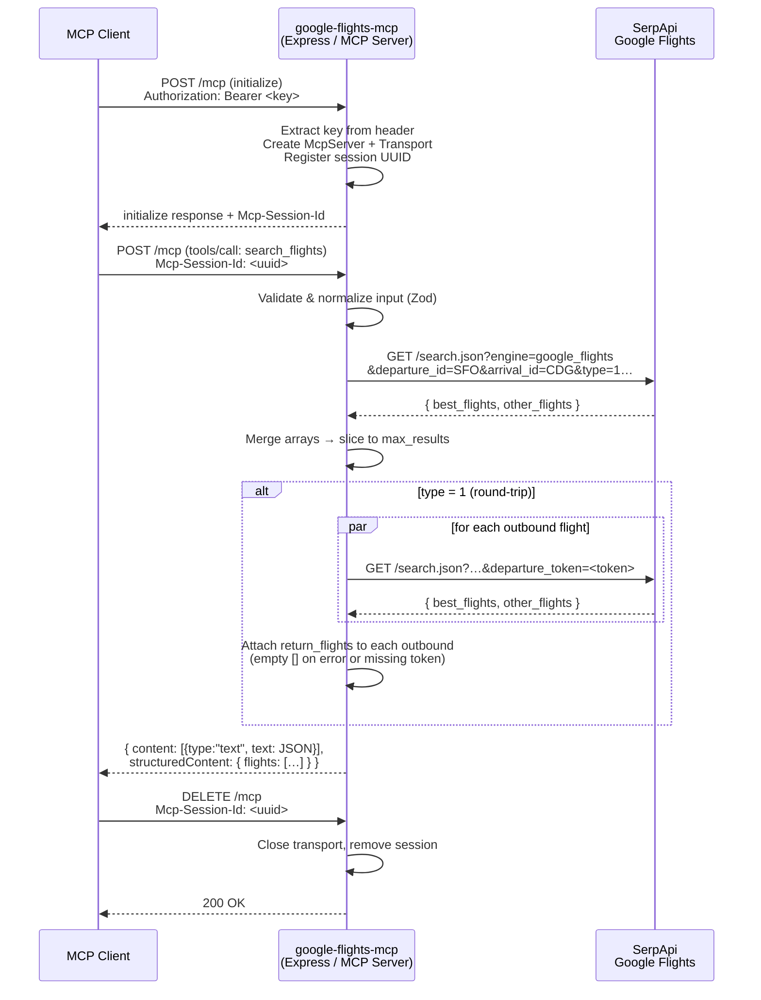

# google-flights-mcp

TypeScript MCP server that exposes one tool, `search_flights`, backed by the [SerpApi Google Flights engine](https://serpapi.com/google-flights-api).

Unlike `flights-mcp` (stdio), this server uses **Streamable HTTP transport** — it runs as a persistent HTTP process and MCP clients connect to it over the network.

---

## Architecture

```
src/
├── index.ts        # Express HTTP server + session management + transport wiring
├── server.ts       # McpServer factory + search_flights tool registration
└── flightSearch.ts # Zod schema, SerpApi fetch logic, round-trip orchestration
```

### Source modules

| File | Responsibility |
|------|---------------|
| `index.ts` | Starts Express on `HOST:PORT`, manages a session map (`sessionId → transport`), extracts the SerpApi key from the `Authorization: Bearer` header on each new session, creates a fresh `McpServer + StreamableHTTPServerTransport` pair per session |
| `server.ts` | `createGoogleFlightsServer(apiKey?)` — builds `McpServer`, registers `search_flights` with the Zod input schema and an async handler that calls domain logic |
| `flightSearch.ts` | Input validation schema, SerpApi HTTP call helpers (`buildSerpApiParams`, `fetchFromSerpApi`), outbound/return flight fetchers, `searchFlightsWithSerpApi` orchestrator, `toToolError` mapper |

### Request flow

```
MCP client (POST /mcp)
  │
  ├─ New session?
  │    Extract Authorization: Bearer <key>
  │    Create StreamableHTTPServerTransport  ──► session map[id] = transport
  │    Create McpServer(key)
  │    server.connect(transport)
  │
  └─ Existing session?
       Reuse transport from session map
         │
         ▼
  McpServer dispatches to search_flights handler
         │
         ▼
  searchFlightsWithSerpApi(input, apiKey)
         │
         ├─ GET https://serpapi.com/search.json  (outbound)
         │    merge best_flights + other_flights
         │    slice to max_results
         │
         └─ type=1 (round-trip)?
              Promise.all → GET serpapi (return, per departure_token)
              silently sets return_flights=[] on failure / missing token
         │
         ▼
  { content: [{type:"text", text: JSON}], structuredContent: {flights:[...]} }
```

### Flight search sequence



### Session model

Each MCP client session gets its own `McpServer + StreamableHTTPServerTransport` pair, keyed by the UUID session ID assigned during the MCP `initialize` handshake. Sessions are cleaned up via `transport.onclose`. This allows multiple concurrent clients, each potentially carrying a different API key.

### API key passing

The SerpApi key is **not** stored on the server. It is sent by the MCP caller in every session's first request as an HTTP header:

```
Authorization: Bearer <serpapi_key>
```

The server extracts it, passes it to `createGoogleFlightsServer(key)`, and uses it for all SerpApi calls within that session. This means the key is managed entirely by the caller's MCP config — the server process itself needs no credentials at startup.

---

## Tech stack

| Concern | Library |
|---------|---------|
| Runtime | Node.js 18+ (ESM) |
| Language | TypeScript 5, strict mode |
| HTTP framework | `express` |
| MCP SDK | `@modelcontextprotocol/sdk` — `McpServer`, `StreamableHTTPServerTransport`, `createMcpExpressApp` |
| Input validation | `zod` v4 |
| Flights data | SerpApi Google Flights engine (`/search.json?engine=google_flights`) |
| Tests | `vitest` + `@vitest/coverage-v8` |
| Dev runner | `tsx` |

---

## Runbook

### Prerequisites

- Node.js 18+
- `pnpm`
- A [SerpApi](https://serpapi.com) account with a valid API key

### Install

```bash
pnpm install
```

### Start the HTTP server

```bash
PORT=3000 pnpm start
# → google-flights-mcp on http://127.0.0.1:3000/mcp
```

Environment knobs:

| Variable | Default | Purpose |
|----------|---------|---------|
| `PORT` | `3000` | TCP port to listen on |
| `HOST` | `127.0.0.1` | Bind address; `createMcpExpressApp` enables DNS-rebinding protection automatically for localhost |
| `SERPAPI_API_KEY` | — | Fallback key if no `Authorization` header is sent (useful for manual testing) |

### Register with an MCP client (Claude Code)

Add to `.mcp.json` in your project root. The server must already be running.

```json
{
  "mcpServers": {
    "google-flights-mcp": {
      "type": "http",
      "url": "http://127.0.0.1:3000/mcp",
      "headers": {
        "Authorization": "Bearer <your_serpapi_key>"
      }
    }
  }
}
```

### Register with opencode

```json
{
  "mcp": {
    "google-flights-mcp": {
      "type": "remote",
      "url": "http://127.0.0.1:3000/mcp",
      "enabled": true,
      "headers": {
        "Authorization": "Bearer <your_serpapi_key>"
      }
    }
  }
}
```

### Typecheck

```bash
pnpm typecheck
```

### Tests

```bash
# Unit tests only (no network, no key needed)
pnpm test:unit

# All tests including e2e (requires SERPAPI_API_KEY, key is sent as Bearer header)
SERPAPI_API_KEY=<key> pnpm test

# Coverage
SERPAPI_API_KEY=<key> pnpm test --coverage
```

E2e tests (`tests/mcpServer.http.e2e.test.ts`) are automatically skipped when `SERPAPI_API_KEY` is not set. They:
1. Spawn `pnpm start` on port 3099 with no env key (server starts keyless)
2. Connect via `StreamableHTTPClientTransport` with `Authorization: Bearer <key>`
3. Verify `listTools`, one-way search, and round-trip search

### Manual smoke test

With the server running:

```bash
# Initialize session
curl -s -X POST http://127.0.0.1:3000/mcp \
  -H "Content-Type: application/json" \
  -H "Authorization: Bearer <key>" \
  -d '{"jsonrpc":"2.0","id":1,"method":"initialize","params":{"protocolVersion":"2024-11-05","capabilities":{},"clientInfo":{"name":"curl","version":"0.0.1"}}}'
```

---

## Troubleshooting

| Symptom | Likely cause | Fix |
|---------|-------------|-----|
| `Missing SERPAPI_API_KEY` error from tool | No `Authorization` header sent and no `SERPAPI_API_KEY` env var | Add the header in MCP client config or set the env var |
| `SerpApi request failed with status 401` | Invalid or expired API key | Verify key at [serpapi.com](https://serpapi.com/manage-api-key) |
| `SerpApi request failed with status 429` | Rate limit exceeded | Wait and retry; upgrade SerpApi plan if needed |
| `return_flights` is empty for round-trip | SerpApi returned no return options, or `departure_token` was absent | Expected behavior — check the route/date combination |
| Session 404 on GET/DELETE | Client sending a stale or unknown session ID | Re-initialize by starting a new session (new POST without `Mcp-Session-Id`) |
| DNS rebinding rejection (403) | MCP client sending a non-localhost `Host` header to a `HOST=127.0.0.1` server | Use `127.0.0.1` or `localhost` in the client URL, or set `HOST=0.0.0.0` with explicit `allowedHosts` |
