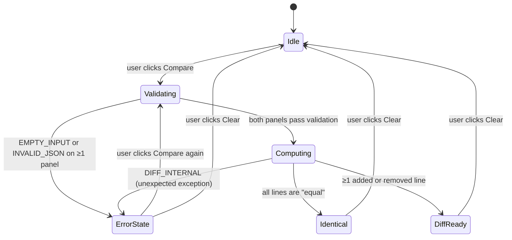

# Error Model — JSON Diff Checker

> **Status:** Draft  
> **Date:** 2026-02-27  
> **Author:** Chief Tech Lead  
> **Scope:** Client-side only — all errors are UI errors, not HTTP errors.

---

## Overview

Because this is a frontend-only application there are no HTTP status codes or server error payloads. All errors are **validation errors produced in the browser** and surfaced in the UI. This document defines every error case, its trigger condition, its human-readable message, where it is displayed, and how the UI recovers.

---

## Error Categories

| Category | Code | Description |
|---|---|---|
| Validation | `EMPTY_INPUT` | A required input panel is empty |
| Validation | `INVALID_JSON` | The input text is not parseable JSON |
| System | `DIFF_INTERNAL` | An unexpected error during diff computation (should never happen) |

---

## Error Definitions

### `EMPTY_INPUT`

| Field | Value |
|---|---|
| **Code** | `EMPTY_INPUT` |
| **Trigger** | User clicks Compare and one or both textarea values are blank / whitespace-only |
| **Message (left panel)** | `"Left input is empty. Please paste JSON to compare."` |
| **Message (right panel)** | `"Right input is empty. Please paste JSON to compare."` |
| **Display location** | Directly below the offending textarea, inside `<JsonInputPanel />` |
| **ARIA** | Error container has `role="alert"` so screen readers announce immediately |
| **Recovery** | User types/pastes content; error clears on next Compare click |
| **Diff output** | Hidden / not rendered |

---

### `INVALID_JSON`

| Field | Value |
|---|---|
| **Code** | `INVALID_JSON` |
| **Trigger** | `JSON.parse()` throws for the given input text |
| **Message template** | `"Invalid JSON: {nativeErrorMessage}"` |
| **Example message** | `"Invalid JSON: Unexpected token f at position 1"` |
| **Display location** | Directly below the offending textarea, inside `<JsonInputPanel />` |
| **ARIA** | Error container has `role="alert"` |
| **Recovery** | User edits the textarea; error clears on next Compare click |
| **Diff output** | Hidden / not rendered |
| **Note** | Both panels are validated independently; it is possible for both to show an error simultaneously |

---

### `DIFF_INTERNAL`

| Field | Value |
|---|---|
| **Code** | `DIFF_INTERNAL` |
| **Trigger** | An exception is thrown inside `computeLineDiff()` after both inputs have been validated as valid JSON (defensive catch) |
| **Message** | `"An unexpected error occurred while computing the diff. Please try again."` |
| **Display location** | A banner above the diff area, styled as a generic app error |
| **ARIA** | `role="alert"` |
| **Recovery** | User clicks Compare again; if the error persists, Clear and re-paste |
| **Diff output** | Not rendered |

---

## Error State Machine



---

## `ParseResult` Type Contract

The `parseJson()` utility returns a discriminated union. All consumers must handle both branches.

```typescript
// src/types/diff.ts (excerpt)
export type ParseResult =
  | { ok: true; value: unknown }
  | { ok: false; error: string };   // error is the human-readable message for the UI
```

The `error` string in the `false` branch is already formatted for display (it begins with `"Invalid JSON: "` or `"Left/Right input is empty."`). Components must not further manipulate it — display it as-is.

---

## UI Presentation Rules

1. **Never crash the application.** All errors are caught and surfaced as UI messages.
2. **Show errors adjacent to the offending input**, not in a modal or toast.
3. **Clear previous errors** before each new Compare run.
4. **Never display raw stack traces** to the user; only the formatted message string.
5. **Support simultaneous errors** on both panels — each panel shows its own independent error.
6. **Diff output must be absent** (not just hidden with CSS) when any error is active — use conditional rendering.

---

## Accessibility Requirements for Errors

- Error text containers use `role="alert"` (live region — implicit `aria-live="assertive"`).
- Each textarea references its error container via `aria-describedby="panel-{side}-error"` when an error is present.
- Error messages are written in plain language, not technical jargon (with the exception of the native JSON parse message, which is appended after a colon for power users).
