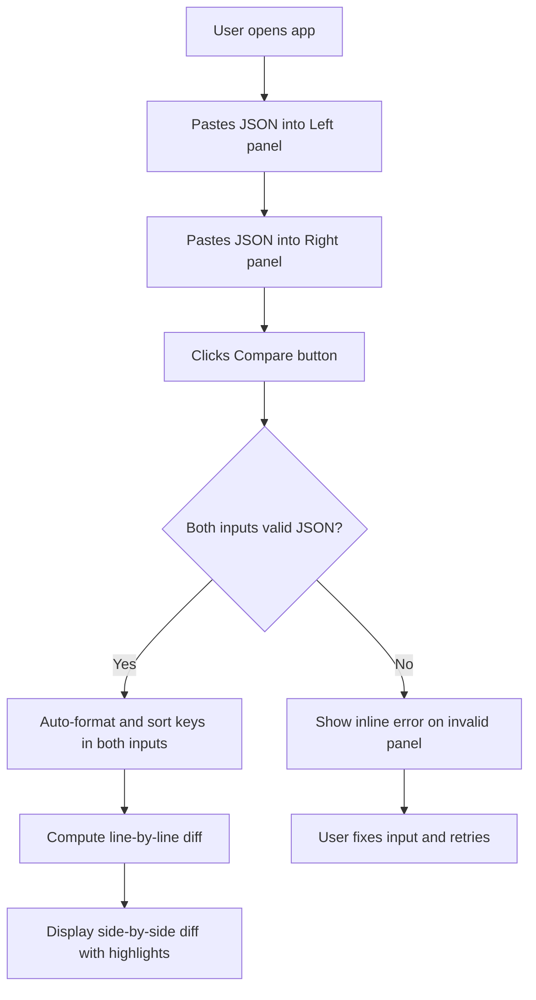

# Feature Brief: JSON Text Diff Checker

## Context

### Problem Statement
Developers and technical users frequently need to compare two JSON payloads to identify differences — but raw JSON is often unformatted, inconsistently ordered, and hard to read. Manually comparing JSON blobs is error-prone and time-consuming.

### Target Users
- Developers debugging API responses
- QA engineers comparing expected vs. actual JSON payloads
- Technical users needing a quick, browser-based JSON diff tool

### Desired Outcomes
- Users can paste two JSON texts and instantly see a clear, structured diff
- JSON inputs are automatically formatted (pretty-printed) and key-sorted before comparison, ensuring that cosmetic differences (whitespace, key order) do not produce false positives
- The tool is self-contained, runs entirely in the browser, and requires no backend

### Constraints
- Frontend-only application (no backend required)
- Must run in modern browsers (Chrome, Firefox, Safari, Edge)
- No user data should be sent to any server

---

## Scope

### In-Scope
- Two side-by-side JSON input text areas (Left and Right)
- Auto-format (pretty-print with 2-space indent) of each JSON input on compare
- Recursive key sorting (alphabetical) of each JSON object before comparison
- Side-by-side diff view highlighting:
  - Added lines (present in Right, not in Left)
  - Removed lines (present in Left, not in Right)
  - Unchanged lines
  - **Inline (character-level) diff for modified lines:** when the same JSON key exists in both Left and Right but its value differs, the two versions are shown on a single paired row with the changed characters/tokens highlighted within the line (not split across two separate removed/added rows)
  - **Inline diff for changed array items:** when an array element changes between Left and Right, the changed item is shown on a single paired row with the differing portion highlighted inline
- Clear error messaging when either input is invalid JSON
- A "Compare" button to trigger the diff
- A "Clear" / "Reset" button to reset both inputs and the diff output

### Out-of-Scope
- Backend services or API calls
- User authentication or session persistence
- File upload (paste only)
- Saving or sharing diff results via URL
- Support for non-JSON formats (YAML, XML, etc.)
- Inline editing of diff output

---

## User Journeys

### Primary Flow

### Edge Cases
- One or both inputs are empty → show validation error prompting user to enter JSON
- Input is valid JSON but not an object or array (e.g., a bare string or number) → still format, sort (no-op for primitives), and diff
- Identical JSON after formatting and sorting → show "No differences found" message
- Extremely large JSON → app remains responsive; no hard limit enforced but performance is best-effort

---

## Requirements

### Functional Requirements
1. The app shall provide two text input areas labeled "Left (Original)" and "Right (Modified)".
2. When the user clicks "Compare", the app shall parse both inputs as JSON.
3. If either input is invalid JSON, the app shall display a clear error message adjacent to the offending input without crashing.
4. Before diffing, the app shall recursively sort all object keys alphabetically (nested objects included) in both inputs.
5. Before diffing, the app shall pretty-print both JSON values with 2-space indentation and update the text areas to show the formatted result.
6. The app shall compute and display a line-by-line diff of the two formatted, sorted JSON strings.
7. The diff view shall visually distinguish added lines, removed lines, and unchanged lines using color coding (e.g., green for added, red for removed, grey/white for unchanged).
10. **Inline value diff for modified object keys:** when the same JSON key appears on the same line in both Left and Right but with a different value, the diff shall display that key on a **single paired row** (Left side shows old value, Right side shows new value) with the differing characters highlighted inline (e.g., highlighted span within the line). It shall NOT split such a change into a separate red removal row and a separate green addition row.
11. **Inline diff for changed array items:** when an array item changes between Left and Right at the same index position, it shall be shown as a single paired row with inline character-level highlighting of the changed portion, not as a separate removal + addition row.
8. The app shall display a "No differences found" message when both formatted+sorted JSONs are identical.
9. The app shall provide a "Clear" button that resets both input areas and the diff output.

### Non-Functional Requirements
- **Performance:** Diff computation and rendering shall complete within 2 seconds for JSON payloads up to 500 KB.
- **Accessibility:** Color indicators shall be supplemented with text labels or icons (not color alone) to support color-blind users.
- **Usability:** The UI shall be clean and minimal, usable without instructions.
- **Compatibility:** Must work on latest stable versions of Chrome, Firefox, Safari, and Edge.
- **Privacy:** No data leaves the browser; all processing is client-side only.

---

## Acceptance Criteria

### AC-1: Valid JSON Compare
**Given** the user has entered valid JSON in both the Left and Right panels  
**When** the user clicks "Compare"  
**Then** both inputs are auto-formatted (pretty-printed, 2-space indent) and keys are recursively sorted alphabetically, and a diff is displayed highlighting additions, removals, and unchanged lines.

### AC-2: Key Sorting Normalizes Order Differences
**Given** the Left input is `{"b":1,"a":2}` and the Right input is `{"a":2,"b":1}`  
**When** the user clicks "Compare"  
**Then** both are sorted to `{"a":2,"b":1}` and the diff shows "No differences found".

### AC-3: Invalid JSON Error Handling
**Given** the user has entered invalid JSON (e.g., `{foo: bar}`) in the Left panel  
**When** the user clicks "Compare"  
**Then** an error message is shown near the Left panel indicating it contains invalid JSON, and no diff is rendered.

### AC-4: Empty Input Validation
**Given** one or both input panels are empty  
**When** the user clicks "Compare"  
**Then** a validation message prompts the user to enter JSON in the empty panel(s), and no diff is rendered.

### AC-5: Identical JSON After Normalization
**Given** both inputs produce identical JSON after formatting and sorting  
**When** the diff is computed  
**Then** a "No differences found" message is displayed instead of a diff view.

### AC-6: Clear / Reset
**Given** the user has entered JSON and/or viewed a diff  
**When** the user clicks "Clear"  
**Then** both input panels are emptied and the diff output is removed.

### AC-7: Diff Highlights
**Given** a diff is displayed  
**Then** added lines are visually distinct (e.g., green background), removed lines are visually distinct (e.g., red background), and unchanged lines are neutral.

### AC-8: Accessibility — Color + Label
**Given** the diff is displayed  
**Then** added/removed lines are indicated by both color and a text marker (e.g., `+` / `-` prefix) so the diff is interpretable without relying on color alone.

### AC-9: Inline Diff for Modified Object Key Values
**Given** the Left JSON is `{"key": "hello"}` and the Right JSON is `{"key": "world"}`  
**When** the user clicks "Compare"  
**Then** the diff view shows a **single paired row** for `"key"`, with the Left side showing `"key": "hello"` and the Right side showing `"key": "world"`, and the differing characters (`hello` vs `world`) are highlighted inline within each side — the change is NOT rendered as two separate rows (one red removal + one green addition).

### AC-10: Inline Diff for Changed Array Items
**Given** the Left JSON is `["apple", "banana"]` and the Right JSON is `["apple", "mango"]`  
**When** the user clicks "Compare"  
**Then** the diff view shows a **single paired row** for the changed item at index 1, with `"banana"` on the Left side and `"mango"` on the Right side, with the differing characters highlighted inline — not as a separate removed row and a separate added row.

---

## Success Metrics

| Metric | Target |
|---|---|
| Diff renders correctly for valid JSON pairs | 100% of test cases pass |
| Key-sort normalization eliminates false positives on reordered keys | 100% of test cases pass |
| Error shown for invalid JSON without app crash | 100% of test cases pass |
| Diff computation for 500 KB JSON completes within 2s | ≥ 95th percentile |
| Modified key/array-item pairs shown as single paired rows with inline highlights | 100% of AC-9 & AC-10 test cases pass |

---

## Execution Notes

This is a **frontend-only** project. The following roles are required:

| Role | Responsibility |
|---|---|
| Chief Tech Lead | HLD, tech stack choice, component contracts |
| Frontend Tech Lead | LLD, component breakdown, state management |
| Frontend Developer | Implementation, unit tests |
| QA | E2E testing against acceptance criteria |

**Project subfolder:** `json-diff/`  
**All docs and contracts:** `json-diff/docs/`
