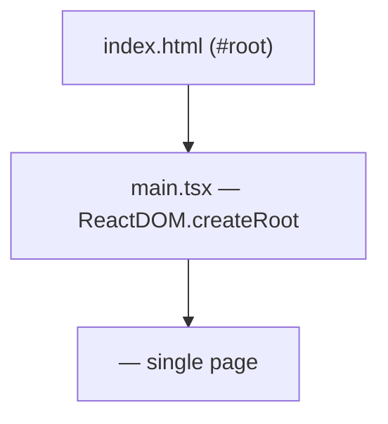
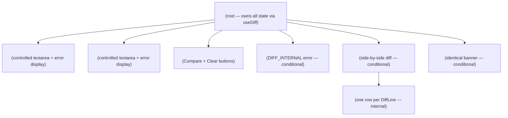
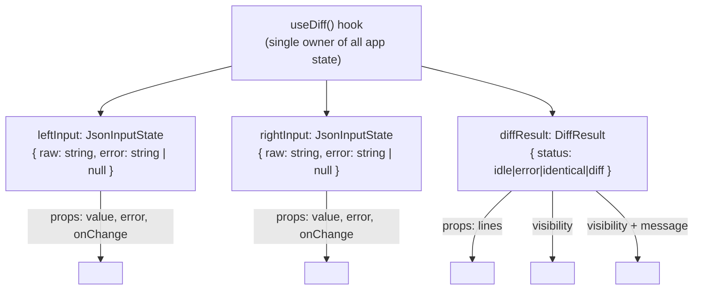
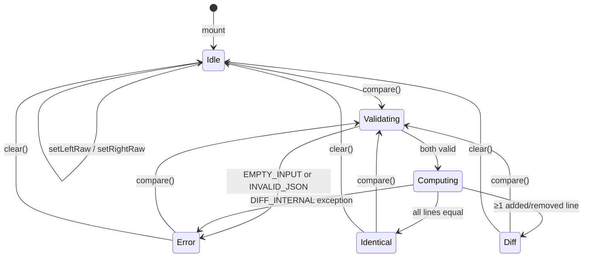
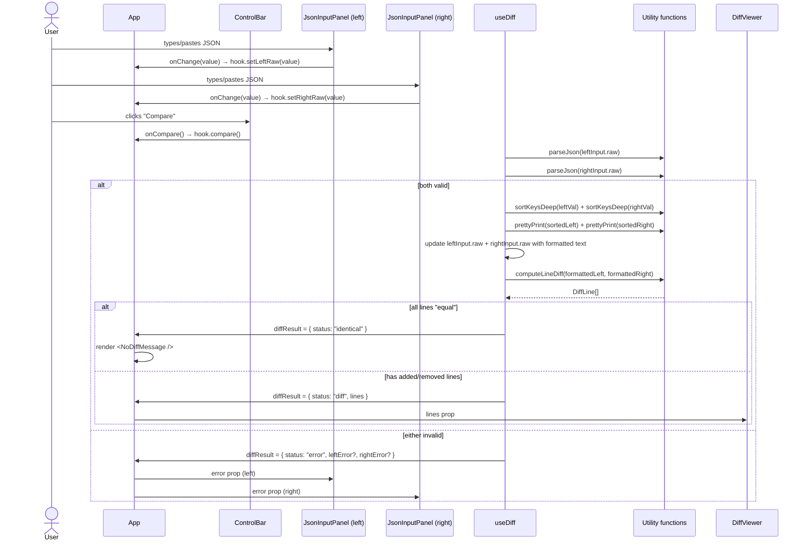
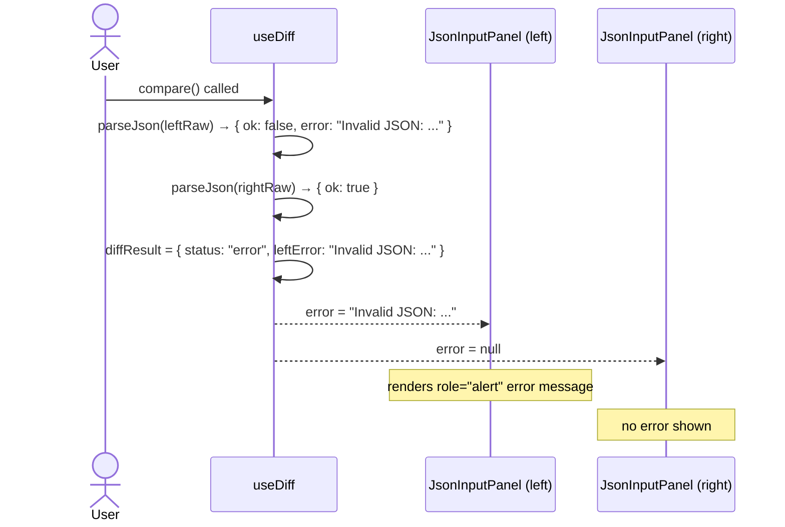
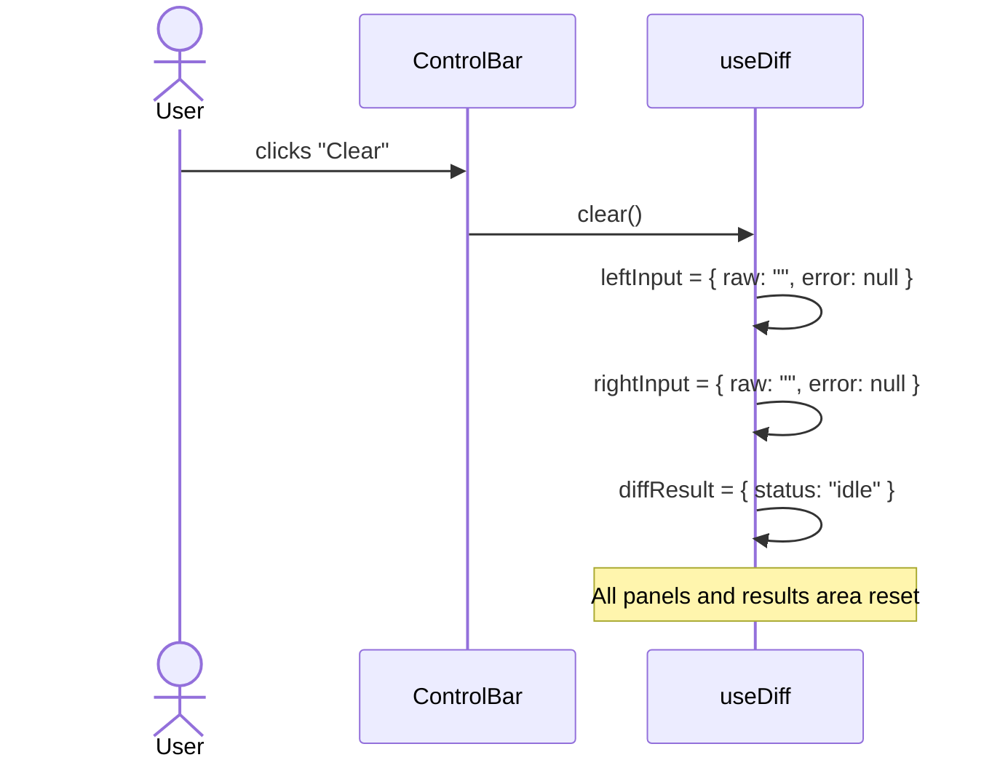

# Frontend Low-Level Design — JSON Diff Checker

> **Status:** Draft  
> **Date:** 2026-02-27  
> **Author:** Frontend Tech Lead  
> **Project subfolder:** `json-diff/`  
> **Inputs:** `feature-brief.md`, `system-architecture.md`, `contracts/component-contracts.md`, `api/error-model.md`, `implementation-plan.md`

---

## Table of Contents

1. [Overview](#1-overview)
2. [File & Folder Structure](#2-file--folder-structure)
3. [Routing & Page Architecture](#3-routing--page-architecture)
4. [Component Breakdown](#4-component-breakdown)
5. [State Management](#5-state-management)
6. [Data Flows](#6-data-flows)
7. [UX States](#7-ux-states)
8. [Hooks Design](#8-hooks-design)
9. [Utility Layer](#9-utility-layer)
10. [Styling & Theming](#10-styling--theming)
11. [Accessibility Specification](#11-accessibility-specification)
12. [Performance Strategy](#12-performance-strategy)
13. [Test Strategy](#13-test-strategy)
14. [Developer Slice Assignments](#14-developer-slice-assignments)
15. [Open Questions & Tradeoffs](#15-open-questions--tradeoffs)

---

## 1. Overview

### 1.1 Scope

This document provides the frontend low-level design for the JSON Diff Checker — a fully client-side SPA that lets users paste two JSON payloads, normalise (sort keys, pretty-print), and view a colour-coded side-by-side diff.

There is **no backend, no network I/O, and no routing beyond a single page**. All design decisions below concern in-browser state management, component structure, and rendering.

### 1.2 Non-Goals

- Web Worker offloading (deferred to a Slice 4 performance decision per implementation-plan.md §Open Items 3).
- URL-based sharing, file upload, or session persistence.
- Any theming system beyond a single CSS variables file; dark-mode toggle is out-of-scope for v1.

### 1.3 Key Assumptions

| # | Assumption |
|---|---|
| A-1 | `useJsonInput` is **not** extracted as a standalone hook; `useDiff` manages both panel states directly (simplifies the state graph and avoids unnecessary indirection for two identical sub-states). |
| A-2 | CSS breakpoints: ≥ 900 px → side-by-side panels; < 900 px → stacked panels (left on top, right below). |
| A-3 | The `diff` npm package is pinned at `^5.x` (latest stable as of 2026-02). |
| A-4 | No animation/transition on diff line render; performance is prioritised over cosmetics. |
| A-5 | `DiffViewer` virtualisation is **not** implemented in v1; re-assessed after Slice 4 perf test (4.9). |

### 1.4 Risks

| Risk | Mitigation |
|---|---|
| `DiffViewer` renders thousands of rows for large JSON, causing jank | `useMemo` on `diffResult`; if perf test fails, introduce `react-window` virtualisation or a Web Worker |
| Safari CSS Grid quirks in side-by-side layout | Playwright WebKit coverage; fallback to `display: flex` on `DiffViewer` rows |
| `diff` package API change | Version-pinned; isolated behind `computeLineDiff` adapter — swap without touching UI code |

---

## 2. File & Folder Structure

The structure below is the **canonical** layout developers must follow. Each component lives in its own folder with co-located styles and test files.

```
json-diff/
├── docs/                              # All design documents
│   ├── feature-brief.md
│   ├── system-architecture.md
│   ├── implementation-plan.md
│   ├── frontend-lld.md                ← this file
│   ├── api/
│   │   └── error-model.md
│   └── contracts/
│       └── component-contracts.md
│
├── src/
│   ├── types/
│   │   └── diff.ts                    # Canonical shared types — edit FIRST on any contract change
│   │
│   ├── utils/                         # Pure functions — no React imports allowed
│   │   ├── parseJson.ts
│   │   ├── parseJson.test.ts
│   │   ├── sortKeysDeep.ts
│   │   ├── sortKeysDeep.test.ts
│   │   ├── prettyPrint.ts
│   │   ├── prettyPrint.test.ts
│   │   ├── computeLineDiff.ts
│   │   └── computeLineDiff.test.ts
│   │
│   ├── hooks/
│   │   ├── useDiff.ts
│   │   └── useDiff.test.ts            # Hook tests via renderHook
│   │
│   ├── components/
│   │   ├── App/
│   │   │   ├── App.tsx
│   │   │   ├── App.module.css
│   │   │   └── App.test.tsx           # Integration test — full wired tree
│   │   ├── JsonInputPanel/
│   │   │   ├── JsonInputPanel.tsx
│   │   │   ├── JsonInputPanel.module.css
│   │   │   └── JsonInputPanel.test.tsx
│   │   ├── ControlBar/
│   │   │   ├── ControlBar.tsx
│   │   │   ├── ControlBar.module.css
│   │   │   └── ControlBar.test.tsx
│   │   ├── DiffViewer/
│   │   │   ├── DiffViewer.tsx
│   │   │   ├── DiffViewer.module.css
│   │   │   └── DiffViewer.test.tsx
│   │   ├── NoDiffMessage/
│   │   │   ├── NoDiffMessage.tsx
│   │   │   ├── NoDiffMessage.module.css
│   │   │   └── NoDiffMessage.test.tsx
│   │   └── ErrorBanner/               # NEW — for DIFF_INTERNAL errors (see §4.6)
│   │       ├── ErrorBanner.tsx
│   │       ├── ErrorBanner.module.css
│   │       └── ErrorBanner.test.tsx
│   │
│   ├── styles/
│   │   └── tokens.css                 # CSS custom properties (colours, spacing, fonts)
│   │
│   ├── main.tsx                       # React root mount
│   └── index.css                      # Global reset + tokens import
│
├── tests/
│   └── e2e/                           # Playwright E2E tests
│       ├── compare.spec.ts            # AC-1, AC-2, AC-7, AC-8
│       ├── errors.spec.ts             # AC-3, AC-4
│       ├── identical.spec.ts          # AC-5
│       ├── clear.spec.ts              # AC-6
│       ├── accessibility.spec.ts      # axe-core scan
│       └── performance.spec.ts        # 500 KB perf test (AC-NFR-1)
│
├── index.html
├── vite.config.ts
├── tsconfig.json
├── package.json
└── .eslintrc.cjs
```

### Rules

- **No `index.ts` barrel files** at `src/components/` level — import directly from the component folder to keep tree-shaking effective and avoid circular dependency risk.
- **No React imports in `src/utils/`** — utilities are pure TypeScript; if a utility ever needs React it must move to `src/hooks/`.
- **Test files are co-located** with implementation files in `src/`; E2E tests live in `tests/e2e/` only.
- **`src/types/diff.ts` is edited first** on any contract change — this is the single source of truth.

---

## 3. Routing & Page Architecture

This application has **exactly one route** (`/`). There is no React Router or equivalent. The entire app is rendered by `<App />` mounted at `#root` in `index.html`.



**No lazy loading, code-splitting, or suspense boundaries are required** for v1 — the entire bundle is small (target ≤ 200 KB gzipped).

---

## 4. Component Breakdown

### 4.1 Component Tree



### 4.2 Conditional Rendering Rules

`<App />` is the **sole conditional rendering authority** for the results area. Exactly one of the following result states is rendered at a time:

| `diffResult.status` | Result area rendered |
|---|---|
| `"idle"` | Nothing (empty results area) |
| `"error"` | Nothing — errors appear inline in `<JsonInputPanel />` (and optionally `<ErrorBanner />` for `DIFF_INTERNAL`) |
| `"identical"` | `<NoDiffMessage />` |
| `"diff"` | `<DiffViewer />` |

```tsx
// App.tsx — conditional rendering sketch (pseudocode)
{diffResult.status === 'diff' && <DiffViewer lines={diffResult.lines} />}
{diffResult.status === 'identical' && <NoDiffMessage />}
{diffResult.status === 'error' && diffResult.internalError && (
  <ErrorBanner message={diffResult.internalError} />
)}
```

### 4.3 `<App />` — Root Orchestrator

**File:** `src/components/App/App.tsx`

**Responsibility:** Mounts the full layout. Calls `useDiff()` and distributes state/callbacks to children. Contains **no business logic**.

**Layout structure (HTML semantic):**

```html
<main class="app-layout">
  <header>
    <h1>JSON Diff Checker</h1>
  </header>
  <section class="input-panels">
    <JsonInputPanel side="left" … />
    <JsonInputPanel side="right" … />
  </section>
  <ControlBar … />
  <!-- results area — one of the following: -->
  <ErrorBanner … />
  <DiffViewer … />
  <NoDiffMessage />
</main>
```

**Props:** None (root component).

**Internal wiring:**

```tsx
const {
  leftInput, rightInput,
  diffResult,
  setLeftRaw, setRightRaw,
  compare, clear,
} = useDiff();
```

### 4.4 `<JsonInputPanel />` — Input + Error

**File:** `src/components/JsonInputPanel/JsonInputPanel.tsx`

**Responsibility:** Renders one labelled `<textarea>` and its inline error message. Purely presentational — no internal state.

**Props (from component-contracts.md §2):**

```typescript
interface JsonInputPanelProps {
  side: 'left' | 'right';
  value: string;
  error: string | null;
  onChange: (value: string) => void;
}
```

**Internal structure:**

```html
<div class="panel panel--{side}">
  <label for="panel-{side}-input">
    {side === 'left' ? 'Left (Original)' : 'Right (Modified)'}
  </label>
  <textarea
    id="panel-{side}-input"
    aria-label="{side === 'left' ? 'Left JSON input' : 'Right JSON input'}"
    aria-describedby={error ? "panel-{side}-error" : undefined}
    aria-invalid={error ? "true" : undefined}
    spellCheck={false}
    autoCorrect="off"
    autoCapitalize="off"
    value={value}
    onChange={e => onChange(e.target.value)}
  />
  {error && (
    <p
      id="panel-{side}-error"
      role="alert"
      class="panel__error"
    >
      {error}
    </p>
  )}
</div>
```

**Key rules:**
- The error `<p>` is **conditionally rendered** (not hidden) — satisfies error-model.md rule 6.
- `aria-invalid` is set to `"true"` when `error` is non-null — assists AT navigation.
- `onChange` fires on every keystroke; no debouncing (compare is manual).
- `value` is fully controlled — textarea never has internal local state.

**Visual states:**

| State | `textarea` border CSS class | Error element |
|---|---|---|
| Default | `panel__textarea` | absent |
| Error | `panel__textarea panel__textarea--error` | present |

### 4.5 `<ControlBar />` — Action Buttons

**File:** `src/components/ControlBar/ControlBar.tsx`

**Responsibility:** Renders Compare and Clear buttons. Zero business logic.

**Props (from component-contracts.md §3):**

```typescript
interface ControlBarProps {
  onCompare: () => void;
  onClear: () => void;
  isComparing?: boolean;
}
```

**Internal structure:**

```html
<div class="control-bar" role="toolbar" aria-label="Actions">
  <button
    type="button"
    aria-label="Compare JSON inputs"
    disabled={isComparing}
    onClick={onCompare}
    class="btn btn--primary"
  >
    Compare
  </button>
  <button
    type="button"
    aria-label="Clear all inputs and results"
    onClick={onClear}
    class="btn btn--secondary"
  >
    Clear
  </button>
</div>
```

**Notes:**
- `role="toolbar"` groups the buttons semantically and enables arrow-key navigation between them (standard toolbar pattern).
- `isComparing` defaults to `false` — reserved for future Web Worker async path.
- "Clear" is **never** disabled, even when inputs are empty (safe no-op).

### 4.6 `<ErrorBanner />` — Internal Error Display (new component)

**File:** `src/components/ErrorBanner/ErrorBanner.tsx`

**Responsibility:** Renders a full-width error banner for `DIFF_INTERNAL` errors. Not used for validation errors (those live in `<JsonInputPanel />`).

> **Design decision:** The HLD/contracts did not define this component explicitly, but the error-model.md §DIFF_INTERNAL requires a "banner above the diff area". This component fulfils that requirement without polluting `JsonInputPanel` or `DiffViewer`.

**Props:**

```typescript
interface ErrorBannerProps {
  message: string;
}
```

**Internal structure:**

```html
<div role="alert" class="error-banner">
  <span class="error-banner__icon" aria-hidden="true">⚠</span>
  <span class="error-banner__text">{message}</span>
</div>
```

**Rendered:** Only when `diffResult.status === 'error'` AND a `DIFF_INTERNAL` message is present (both panels passed JSON validation but diff computation threw).

### 4.7 `<DiffViewer />` — Side-by-Side Diff

**File:** `src/components/DiffViewer/DiffViewer.tsx`

**Responsibility:** Renders the line-by-line diff with left and right column layout. Pure component — no internal state.

**Props (from component-contracts.md §4):**

```typescript
interface DiffViewerProps {
  lines: DiffLine[];
}
```

**Internal structure (DOM hierarchy):**

```html
<div role="region" aria-label="Diff output" class="diff-viewer">
  <!-- Column headers -->
  <div class="diff-viewer__header">
    <div class="diff-viewer__col-header">Left (Original)</div>
    <div class="diff-viewer__col-header">Right (Modified)</div>
  </div>
  <!-- Line rows -->
  <div class="diff-viewer__body">
    {lines.map((line, i) => (
      <DiffLineRow key={i} line={line} />
    ))}
  </div>
</div>
```

> **Note on `key`:** Index keys are acceptable here because the `lines` array is computed fresh on every compare and never reordered in-place. The array reference changes on each compare, causing a full re-render of `DiffViewer` — stable keys within that render are sufficient.

**`<DiffLineRow />` — internal sub-component (not exported):**

```typescript
// Internal only — not a standalone module
interface DiffLineRowProps {
  line: DiffLine;
}
```

```html
<div class="diff-row diff-row--{line.type}">
  <!-- Left column -->
  <div class="diff-row__col diff-row__col--left">
    <span class="diff-row__lineno">{line.leftLineNo ?? ''}</span>
    <span class="diff-row__marker" aria-hidden="true">
      {line.type === 'removed' ? '-' : ' '}
    </span>
    <span class="diff-row__content">
      {line.type !== 'added' ? line.value : ''}
    </span>
  </div>
  <!-- Right column -->
  <div class="diff-row__col diff-row__col--right">
    <span class="diff-row__lineno">{line.rightLineNo ?? ''}</span>
    <span class="diff-row__marker" aria-hidden="true">
      {line.type === 'added' ? '+' : ' '}
    </span>
    <span class="diff-row__content">
      {line.type !== 'removed' ? line.value : ''}
    </span>
  </div>
</div>
```

**Colour mapping (CSS class → token):**

| `DiffLineType` | CSS class | Background token |
|---|---|---|
| `"added"` | `diff-row--added` | `--color-diff-added-bg` (`#e6ffed`) |
| `"removed"` | `diff-row--removed` | `--color-diff-removed-bg` (`#ffeef0`) |
| `"equal"` | `diff-row--equal` | `--color-diff-equal-bg` (`#ffffff`) |
| `"modified"` | `diff-row--modified` | Left col: `--color-diff-modified-left-bg` (`#ffeef0`), Right col: `--color-diff-modified-right-bg` (`#e6ffed`) |

**Memoisation:** `<DiffViewer />` is wrapped in `React.memo()` — it only re-renders when the `lines` array reference changes (which only happens after a new compare).

### 4.8 `<NoDiffMessage />` — Identical Banner

**File:** `src/components/NoDiffMessage/NoDiffMessage.tsx`

**Responsibility:** Displays a success/info banner when both normalised JSONs are identical.

**Props:** None.

**Internal structure:**

```html
<div role="status" class="no-diff-message">
  <span class="no-diff-message__icon" aria-hidden="true">✓</span>
  <span class="no-diff-message__text">
    No differences found — both JSON inputs are identical after formatting and key sorting.
  </span>
</div>
```

---

## 5. State Management

### 5.1 State Ownership Map

This is a frontend-only app with **no server state** — all state is local UI state. There is no external state library (no Redux, Zustand, Jotai, etc.).



**Rule: No prop drilling beyond one level.** `useDiff` is called in `<App />` and its outputs are distributed directly to leaf components. No intermediate component holds or transforms state.

### 5.2 State Shape

```typescript
// Derived from src/types/diff.ts — reproduced here for design clarity

type DiffResult =
  | { status: 'idle' }
  | { status: 'error'; leftError?: string; rightError?: string; internalError?: string }
  | { status: 'identical' }
  | { status: 'diff'; lines: DiffLine[] };

// Extended from component-contracts.md to include DIFF_INTERNAL:
// The 'error' branch adds an optional `internalError` field not in the original contract.
// → See §15 (Open Questions) — this is a proposed extension requiring contract update.

interface JsonInputState {
  raw: string;
  error: string | null;
}
```

> **⚠ Contract Change Required:** `DiffResult` in `src/types/diff.ts` must be updated to add `internalError?: string` to the `error` status branch before implementation begins. See §15.1.

### 5.3 State Transitions



### 5.4 State Invariants

These invariants must hold at all times and are enforced inside `useDiff`:

1. `leftInput.error` and `rightInput.error` are **always cleared** when `setLeftRaw` / `setRightRaw` is called.
2. When `diffResult.status` is `"diff"` or `"identical"`, both `leftInput.error` and `rightInput.error` are `null`.
3. When `diffResult.status` is `"error"`, the diff output area is **not rendered** — enforced by conditional rendering in `<App />`.
4. `diffResult.status` starts as `"idle"` and returns to `"idle"` only via `clear()`.
5. Inputs are reset to `""` only via `clear()` — compare never empties inputs.

---

## 6. Data Flows

### 6.1 Happy Path — Compare



### 6.2 Error Path — Invalid JSON



### 6.3 Clear Flow



### 6.4 User Edits After Compare

When the user edits a textarea after a compare has run:

```
setLeftRaw(v) called
  → leftInput.raw = v
  → leftInput.error = null       (clear stale error)
  → diffResult = { status: "idle" }   (stale diff is discarded)
```

This ensures the diff display never shows a result that is out-of-sync with the current inputs.

---

## 7. UX States

### 7.1 Per-Panel States

| State | textarea | Error message | Notes |
|---|---|---|---|
| **Empty / idle** | Placeholder text visible | Absent | Initial state |
| **Has content** | Content visible | Absent | User is typing |
| **Error** | Red border | `role="alert"` error text present | After failed compare |
| **Formatted** | Content replaced with pretty-printed JSON | Absent | After successful compare |

### 7.2 Results Area States

| State | What is displayed |
|---|---|
| **Idle** | Empty results area (no content) |
| **Diff present** | `<DiffViewer />` with coloured rows |
| **Identical** | `<NoDiffMessage />` success banner |
| **DIFF_INTERNAL error** | `<ErrorBanner />` above results area |

### 7.3 Diff Line States

| `DiffLineType` | Left column | Right column | Background |
|---|---|---|---|
| `"equal"` | `"  "` + content | `"  "` + content | Neutral white |
| `"removed"` | `"- "` + content | *(blank)* | Red tint |
| `"added"` | *(blank)* | `"+ "` + content | Green tint |
| `"modified"` | `"~ "` + old value (inline char highlights via `<mark>`) | `"~ "` + new value (inline char highlights via `<mark>`) | Left: red tint, Right: green tint |

### 7.4 Loading State

There is **no async loading state** in v1. All computation is synchronous. The `isComparing` prop on `<ControlBar />` exists for forward-compatibility with a Web Worker path and defaults to `false`.

If the Web Worker path is introduced in a future slice:
- `useDiff` sets `isComparing = true` before dispatching to the worker.
- `isComparing = false` when the worker responds.
- `<ControlBar />` disables the Compare button during computation.

### 7.5 Empty State

When both panels are empty and the user clicks Compare, the `EMPTY_INPUT` error is shown inline on both panels. The results area remains empty (no placeholder illustration needed — the brief does not call for one).

---

## 8. Hooks Design

### 8.1 `useDiff` — Full Specification

**File:** `src/hooks/useDiff.ts`

**Signature (from component-contracts.md §6):**

```typescript
interface UseDiffReturn {
  leftInput: JsonInputState;
  rightInput: JsonInputState;
  diffResult: DiffResult;
  setLeftRaw: (value: string) => void;
  setRightRaw: (value: string) => void;
  compare: () => void;
  clear: () => void;
}

function useDiff(): UseDiffReturn;
```

**Internal implementation design:**

```typescript
// Internal state shape (implementation detail — not exported)
type UseDiffState = {
  leftRaw: string;
  rightRaw: string;
  leftError: string | null;
  rightError: string | null;
  diffResult: DiffResult;
};
```

**`useState` breakdown:**

```typescript
// Three separate useState calls (not a single reducer) for simplicity:
const [leftRaw, setLeftRawState] = useState('');
const [rightRaw, setRightRawState] = useState('');
const [leftError, setLeftError] = useState<string | null>(null);
const [rightError, setRightError] = useState<string | null>(null);
const [diffResult, setDiffResult] = useState<DiffResult>({ status: 'idle' });
```

> **Design note:** A `useReducer` was considered but adds complexity with no benefit at this scale. Individual `useState` calls keep the state transitions readable and test-friendly.

**`setLeftRaw` / `setRightRaw` implementation:**

```typescript
const setLeftRaw = useCallback((value: string) => {
  setLeftRawState(value);
  setLeftError(null);
  setDiffResult({ status: 'idle' });
}, []);

const setRightRaw = useCallback((value: string) => {
  setRightRawState(value);
  setRightError(null);
  setDiffResult({ status: 'idle' });
}, []);
```

**`compare` implementation:**

```typescript
const compare = useCallback(() => {
  // 1. Clear previous errors
  setLeftError(null);
  setRightError(null);

  // 2. Empty check
  const leftEmpty = leftRaw.trim() === '';
  const rightEmpty = rightRaw.trim() === '';
  if (leftEmpty || rightEmpty) {
    setLeftError(leftEmpty ? 'Left input is empty. Please paste JSON to compare.' : null);
    setRightError(rightEmpty ? 'Right input is empty. Please paste JSON to compare.' : null);
    setDiffResult({ status: 'error',
      leftError: leftEmpty ? 'Left input is empty...' : undefined,
      rightError: rightEmpty ? 'Right input is empty...' : undefined,
    });
    return;
  }

  // 3. Parse
  const leftResult = parseJson(leftRaw);
  const rightResult = parseJson(rightRaw);
  if (!leftResult.ok || !rightResult.ok) {
    setLeftError(!leftResult.ok ? leftResult.error : null);
    setRightError(!rightResult.ok ? rightResult.error : null);
    setDiffResult({ status: 'error',
      leftError: !leftResult.ok ? leftResult.error : undefined,
      rightError: !rightResult.ok ? rightResult.error : undefined,
    });
    return;
  }

  // 4. Normalise
  const sortedLeft = sortKeysDeep(leftResult.value);
  const sortedRight = sortKeysDeep(rightResult.value);
  const formattedLeft = prettyPrint(sortedLeft);
  const formattedRight = prettyPrint(sortedRight);

  // 5. Update textareas with formatted output
  setLeftRawState(formattedLeft);
  setRightRawState(formattedRight);

  // 6. Compute diff
  try {
    const lines = computeLineDiff(formattedLeft, formattedRight);
    const isIdentical = lines.every(l => l.type === 'equal');
    setDiffResult(isIdentical
      ? { status: 'identical' }
      : { status: 'diff', lines }
    );
  } catch (e) {
    setDiffResult({ status: 'error',
      internalError: 'An unexpected error occurred while computing the diff. Please try again.',
    });
  }
}, [leftRaw, rightRaw]);

**`clear` implementation:**

```typescript
const clear = useCallback(() => {
  setLeftRawState('');
  setRightRawState('');
  setLeftError(null);
  setRightError(null);
  setDiffResult({ status: 'idle' });
}, []);
```

**Return value construction:**

```typescript
return {
  leftInput: { raw: leftRaw, error: leftError },
  rightInput: { raw: rightRaw, error: rightError },
  diffResult,
  setLeftRaw,
  setRightRaw,
  compare,
  clear,
};
```

**`useMemo` for derived display (in `<App />`):**

```typescript
// In App.tsx — memoise the lines array reference for DiffViewer
const diffLines = useMemo(
  () => diffResult.status === 'diff' ? diffResult.lines : [],
  [diffResult]
);
```

---

## 9. Utility Layer

All utilities are **pure functions** in `src/utils/`. They have **zero side effects** and **no React imports**. They are independently unit-testable.

### 9.1 `parseJson`

**File:** `src/utils/parseJson.ts`

```typescript
import type { ParseResult } from '../types/diff';

export function parseJson(raw: string): ParseResult {
  if (raw.trim() === '') {
    return { ok: false, error: 'Input is empty. Please paste JSON to compare.' };
  }
  try {
    const value = JSON.parse(raw);
    return { ok: true, value };
  } catch (e) {
    const msg = e instanceof SyntaxError ? e.message : String(e);
    return { ok: false, error: `Invalid JSON: ${msg}` };
  }
}
```

> **Note:** The empty check in `useDiff.compare()` happens **before** calling `parseJson`, producing panel-specific messages (`"Left input is empty…"` vs `"Right input is empty…"`). `parseJson` itself returns a generic empty message as a fallback for direct callers.

### 9.2 `sortKeysDeep`

**File:** `src/utils/sortKeysDeep.ts`

```typescript
export function sortKeysDeep(value: unknown): unknown {
  if (Array.isArray(value)) {
    return value.map(sortKeysDeep);
  }
  if (value !== null && typeof value === 'object') {
    return Object.keys(value as Record<string, unknown>)
      .sort()
      .reduce<Record<string, unknown>>((acc, key) => {
        acc[key] = sortKeysDeep((value as Record<string, unknown>)[key]);
        return acc;
      }, {});
  }
  return value;
}
```

### 9.3 `prettyPrint`

**File:** `src/utils/prettyPrint.ts`

```typescript
export function prettyPrint(value: unknown): string {
  return JSON.stringify(value, null, 2);
}
```

### 9.4 `computeLineDiff`

**File:** `src/utils/computeLineDiff.ts`

```typescript
import { diffLines } from 'diff';
import type { DiffLine } from '../types/diff';

export function computeLineDiff(left: string, right: string): DiffLine[] {
  if (left === '' && right === '') return [];

  const changes = diffLines(left, right);
  const result: DiffLine[] = [];
  let leftLineNo = 1;
  let rightLineNo = 1;

  for (const change of changes) {
    const lines = change.value.split('\n');
    // diffLines always adds a trailing newline to the last chunk — remove the empty string
    if (lines[lines.length - 1] === '') lines.pop();

    const type = change.added ? 'added' : change.removed ? 'removed' : 'equal';

    for (const lineValue of lines) {
      const diffLine: DiffLine = { type, value: lineValue };
      if (type !== 'added') {
        diffLine.leftLineNo = leftLineNo++;
      }
      if (type !== 'removed') {
        diffLine.rightLineNo = rightLineNo++;
      }
      result.push(diffLine);
    }
  }

  return result;
}
```

---

## 10. Styling & Theming

### 10.1 CSS Architecture

- **CSS Modules** for all component styles — zero global CSS leakage, no runtime overhead.
- **One global token file** (`src/styles/tokens.css`) defines CSS custom properties.
- `src/index.css` imports `tokens.css` and applies a global reset.

### 10.2 CSS Custom Properties (Design Tokens)

**File:** `src/styles/tokens.css`

```css
:root {
  /* Colours — Diff */
  --color-diff-added-bg: #e6ffed;
  --color-diff-added-text: #24292e;
  --color-diff-added-marker: #22863a;
  --color-diff-removed-bg: #ffeef0;
  --color-diff-removed-text: #24292e;
  --color-diff-removed-marker: #cb2431;
  --color-diff-equal-bg: #ffffff;
  --color-diff-equal-text: #24292e;

  /* Colours — UI */
  --color-error: #d32f2f;
  --color-error-bg: #fff5f5;
  --color-success-bg: #f0fff4;
  --color-success-text: #276749;
  --color-border-default: #d0d7de;
  --color-border-error: #d32f2f;

  /* Typography */
  --font-mono: 'SFMono-Regular', 'Consolas', 'Liberation Mono', 'Menlo', monospace;
  --font-ui: -apple-system, BlinkMacSystemFont, 'Segoe UI', Roboto, sans-serif;
  --font-size-base: 14px;
  --font-size-sm: 12px;

  /* Spacing */
  --space-1: 4px;
  --space-2: 8px;
  --space-3: 12px;
  --space-4: 16px;
  --space-6: 24px;
  --space-8: 32px;

  /* Layout */
  --panel-min-height: 240px;
  --diff-row-height: 20px;   /* line-height for monospace rows */
}
```

### 10.3 Responsive Breakpoints

| Breakpoint | Layout |
|---|---|
| `≥ 900px` | Two input panels side-by-side (CSS Grid, `1fr 1fr`) |
| `< 900px` | Panels stacked vertically; DiffViewer columns stacked |

**CSS Grid for input panels:**

```css
/* App.module.css */
.inputPanels {
  display: grid;
  grid-template-columns: 1fr 1fr;
  gap: var(--space-4);
}

@media (max-width: 899px) {
  .inputPanels {
    grid-template-columns: 1fr;
  }
}
```

**CSS Grid for DiffViewer rows:**

```css
/* DiffViewer.module.css */
.diffRow {
  display: grid;
  grid-template-columns: 1fr 1fr;
  font-family: var(--font-mono);
  font-size: var(--font-size-base);
  min-height: var(--diff-row-height);
}

@media (max-width: 899px) {
  .diffRow {
    grid-template-columns: 1fr;
  }
}
```

### 10.4 Textarea Styling

```css
/* JsonInputPanel.module.css */
.textarea {
  width: 100%;
  min-height: var(--panel-min-height);
  font-family: var(--font-mono);
  font-size: var(--font-size-base);
  border: 1px solid var(--color-border-default);
  border-radius: 4px;
  padding: var(--space-3);
  resize: vertical;
  box-sizing: border-box;
}

.textarea--error {
  border-color: var(--color-border-error);
}
```

---

## 11. Accessibility Specification

### 11.1 ARIA Attributes Summary

| Element | ARIA attribute | Value |
|---|---|---|
| Left textarea | `aria-label` | `"Left JSON input"` |
| Left textarea (error) | `aria-describedby` | `"panel-left-error"` |
| Left textarea (error) | `aria-invalid` | `"true"` |
| Right textarea | `aria-label` | `"Right JSON input"` |
| Right textarea (error) | `aria-describedby` | `"panel-right-error"` |
| Right textarea (error) | `aria-invalid` | `"true"` |
| Left error container | `id` | `"panel-left-error"` |
| Left error container | `role` | `"alert"` |
| Right error container | `id` | `"panel-right-error"` |
| Right error container | `role` | `"alert"` |
| Compare button | `aria-label` | `"Compare JSON inputs"` |
| Clear button | `aria-label` | `"Clear all inputs and results"` |
| ControlBar container | `role` | `"toolbar"` |
| DiffViewer container | `role` | `"region"` |
| DiffViewer container | `aria-label` | `"Diff output"` |
| NoDiffMessage container | `role` | `"status"` |
| ErrorBanner container | `role` | `"alert"` |
| Diff markers (`+`/`-`) | `aria-hidden` | `"true"` |

> **Note on diff markers:** The `+`/`-` characters are `aria-hidden` because they are decorative when the background colour already conveys the diff type. The **accessible label** for each row comes from the line content itself, read in DOM order.

### 11.2 Colour Contrast

| Use | Foreground | Background | Ratio (target ≥ 4.5:1) |
|---|---|---|---|
| Removed marker text | `#cb2431` | `#ffeef0` | ≥ 4.5:1 — verify with contrast checker |
| Added marker text | `#22863a` | `#e6ffed` | ≥ 4.5:1 — verify with contrast checker |
| Error text | `#d32f2f` | `#fff5f5` | ≥ 4.5:1 — verify with contrast checker |
| Monospace content | `#24292e` | `#ffffff` | ≥ 10:1 ✓ |

> **Action for developer:** Run axe-core and a contrast checker against the chosen token values before Slice 4 sign-off.

### 11.3 Keyboard Navigation

| Flow | Expected behaviour |
|---|---|
| Tab into app | Focus lands on Left textarea |
| Tab from Left textarea | Focus moves to Right textarea |
| Tab from Right textarea | Focus moves to Compare button |
| Tab from Compare | Focus moves to Clear button |
| Enter / Space on button | Activates button (native `<button>` behaviour) |
| After clicking Compare | Focus **stays** on Compare button (no focus jump) |

---

## 12. Performance Strategy

### 12.1 Memoisation

| Location | Technique | Rationale |
|---|---|---|
| `<DiffViewer />` | `React.memo()` | Prevents re-render when parent state changes but `lines` array has not changed |
| `diffLines` in `App.tsx` | `useMemo(() => ..., [diffResult])` | Stable array reference passed to `DiffViewer` |
| `setLeftRaw`, `setRightRaw`, `compare`, `clear` | `useCallback` | Stable callback references for child components; prevents unnecessary re-renders |

### 12.2 Synchronous Computation

All computation (parse, sort, diff) is synchronous on the main thread. For v1 this is acceptable — the 2s budget for 500 KB JSON is achievable synchronously (the `diff.diffLines` algorithm is O(N·D) and `sortKeysDeep` is O(N log N)).

**Web Worker upgrade path** (if Slice 4.9 perf test fails):
1. Move `compare()` logic into `src/workers/diff.worker.ts`.
2. `useDiff` posts a message to the worker and sets `isComparing = true`.
3. Worker posts back a `DiffResult` message.
4. `useDiff` receives the result and sets `isComparing = false`.
5. `<ControlBar isComparing />` shows a disabled button with a loading indicator.

No code changes are required in components — `useDiff` is the only affected file.

### 12.3 Bundle Size

| Package | Estimated gzipped size |
|---|---|
| React 18 | ~45 KB |
| `diff` package | ~15 KB |
| App code | ~20 KB |
| CSS | ~5 KB |
| **Total** | **~85 KB** (well under 200 KB target) |

---

## 13. Test Strategy

### 13.1 Tier 0 — Lint, Format, Typecheck

Run as a pre-commit hook and in CI before all other steps.

```bash
npm run lint        # ESLint — zero warnings
npm run typecheck   # tsc --noEmit — zero errors
```

**Enforced rules:**
- `@typescript-eslint/no-explicit-any: error`
- `@typescript-eslint/strict-boolean-expressions: warn`
- No unused variables/imports.

### 13.2 Tier 1 — Unit Tests (Vitest)

**Target:** Utility functions and `useDiff` hook.

#### `parseJson.test.ts`

| Test case | Input | Expected output |
|---|---|---|
| Valid object | `'{"a":1}'` | `{ ok: true, value: { a: 1 } }` |
| Valid array | `'[1,2,3]'` | `{ ok: true, value: [1,2,3] }` |
| Valid primitive | `'"hello"'` | `{ ok: true, value: "hello" }` |
| Valid null | `'null'` | `{ ok: true, value: null }` |
| Empty string | `''` | `{ ok: false, error: "Input is empty…" }` |
| Whitespace only | `'   '` | `{ ok: false, error: "Input is empty…" }` |
| Invalid JSON | `'{foo: bar}'` | `{ ok: false, error: "Invalid JSON: …" }` |
| Truncated JSON | `'{"a":'` | `{ ok: false, error: "Invalid JSON: …" }` |

#### `sortKeysDeep.test.ts`

| Test case | Input | Expected output |
|---|---|---|
| Flat object — unsorted | `{ b: 2, a: 1 }` | `{ a: 1, b: 2 }` |
| Nested object | `{ z: { b: 2, a: 1 } }` | `{ z: { a: 1, b: 2 } }` |
| Array — preserved order | `[3, 1, 2]` | `[3, 1, 2]` |
| Array of objects | `[{ b: 2, a: 1 }]` | `[{ a: 1, b: 2 }]` |
| Primitive string | `"hello"` | `"hello"` |
| Null | `null` | `null` |
| Mixed nesting | `{ z: [{ b: 1, a: 2 }], a: null }` | `{ a: null, z: [{ a: 2, b: 1 }] }` |
| AC-2 regression | `{ b: 1, a: 2 }` vs `{ a: 2, b: 1 }` | Both produce `{ a: 2, b: 1 }` |

#### `prettyPrint.test.ts`

| Test case | Input | Expected output |
|---|---|---|
| Object | `{ a: 1, b: 2 }` | `'{\n  "a": 1,\n  "b": 2\n}'` |
| Array | `[1, 2]` | `'[\n  1,\n  2\n]'` |
| Null | `null` | `'null'` |

#### `computeLineDiff.test.ts`

| Test case | Description |
|---|---|
| Identical strings | Returns array where all lines have `type: "equal"` |
| Added lines | Lines present only in right have `type: "added"`, `leftLineNo` undefined |
| Removed lines | Lines present only in left have `type: "removed"`, `rightLineNo` undefined |
| Mixed diff | Combination of added/removed/equal — verify counts and types |
| Empty both | Returns `[]` |
| Line number correctness | Left and right line numbers increment correctly per side |
| AC-2 regression | `{ b:1, a:2 }` normalised vs `{ a:2, b:1 }` normalised → all lines equal |

#### `useDiff.test.ts` (via `renderHook`)

| Test case | Description |
|---|---|
| Initial state | `diffResult.status === "idle"`, both inputs empty |
| `setLeftRaw` | Updates `leftInput.raw`; clears `leftInput.error`; resets to idle |
| `setRightRaw` | Same for right |
| `compare()` — both empty | `diffResult.status === "error"`, both panel errors set |
| `compare()` — left empty only | Only left error set |
| `compare()` — left invalid JSON | `leftInput.error` set, right clean, no diff |
| `compare()` — both invalid | Both errors set simultaneously |
| `compare()` — valid diff | `diffResult.status === "diff"`, `lines` non-empty |
| `compare()` — identical after normalise | `diffResult.status === "identical"` |
| `compare()` — formats inputs | `leftInput.raw` and `rightInput.raw` updated to pretty-printed value |
| `clear()` | Resets all state to initial values |

### 13.3 Tier 2 — Component Integration Tests (RTL)

**Target:** Full `<App />` wired component tree. Tests simulate user actions and verify visible DOM output.

**File:** `src/components/App/App.test.tsx`

| Test ID | AC | Description |
|---|---|---|
| T2-01 | — | Renders two textareas with correct `aria-label` attributes |
| T2-02 | — | Renders "Compare" and "Clear" buttons |
| T2-03 | AC-1 | Valid JSON → diff rows rendered, panels updated with formatted JSON |
| T2-04 | AC-2 | `{"b":1,"a":2}` vs `{"a":2,"b":1}` → NoDiffMessage shown |
| T2-05 | AC-3 | Invalid JSON left → error message visible below left panel, diff absent |
| T2-06 | AC-3 | Both invalid → both error messages visible simultaneously |
| T2-07 | AC-4 | Empty left input → "Left input is empty" error visible |
| T2-08 | AC-4 | Both empty → both "empty" errors visible |
| T2-09 | AC-5 | Identical valid JSON → NoDiffMessage visible |
| T2-10 | AC-6 | After diff, clicking Clear → inputs empty, diff absent, NoDiffMessage absent |
| T2-11 | AC-7 | Diff rows have CSS class `diff-row--added` / `diff-row--removed` |
| T2-12 | AC-8 | Added lines have `"+ "` prefix; removed lines have `"- "` prefix |
| T2-13 | — | Editing textarea after compare → diff result cleared (inputs show idle state) |
| T2-14 | — | Error message uses `role="alert"` |
| T2-15 | — | NoDiffMessage has `role="status"` |

**Component-level tests** (isolated, mocked callbacks):

| File | Tests |
|---|---|
| `JsonInputPanel.test.tsx` | Renders label, textarea, no error initially; shows error when `error` prop set; calls `onChange` on input |
| `ControlBar.test.tsx` | Renders both buttons; calls `onCompare` on Compare click; calls `onClear` on Clear click; Compare disabled when `isComparing=true` |
| `DiffViewer.test.tsx` | Renders correct number of rows; added row has `+` marker; removed row has `-` marker; equal row has space marker; `role="region"` present |
| `NoDiffMessage.test.tsx` | Renders expected text; has `role="status"` |
| `ErrorBanner.test.tsx` | Renders message prop; has `role="alert"` |

### 13.4 Tier 3 — E2E Tests (Playwright)

**Target:** All acceptance criteria, all required browsers (Chrome, Firefox, WebKit).

| File | AC | Description |
|---|---|---|
| `compare.spec.ts` | AC-1 | Paste valid JSON → click Compare → diff rows visible with markers |
| `compare.spec.ts` | AC-2 | Reordered keys → Compare → NoDiffMessage |
| `compare.spec.ts` | AC-7 | Diff rows have correct CSS classes for color coding |
| `compare.spec.ts` | AC-8 | `+`/`-` text prefix visible in diff output |
| `errors.spec.ts` | AC-3 | Invalid JSON → error message below textarea |
| `errors.spec.ts` | AC-4 | Empty input → empty validation error |
| `identical.spec.ts` | AC-5 | Identical JSON → NoDiffMessage text visible |
| `clear.spec.ts` | AC-6 | Clear button → inputs empty, results gone |
| `accessibility.spec.ts` | — | axe-core scan — zero critical/serious violations |
| `performance.spec.ts` | NFR-1 | 500 KB JSON paste → Compare → diff renders in ≤ 2 s |

**Playwright configuration:**

```typescript
// playwright.config.ts
projects: [
  { name: 'chromium', use: { ...devices['Desktop Chrome'] } },
  { name: 'firefox',  use: { ...devices['Desktop Firefox'] } },
  { name: 'webkit',   use: { ...devices['Desktop Safari'] } },
]
```

### 13.5 Coverage Targets

| Tier | Target coverage |
|---|---|
| Tier 1 — utils | 100% line coverage (small, pure functions) |
| Tier 1 — hook | 100% branch coverage for `compare()` pipeline |
| Tier 2 — components | All props variants and user interactions covered |
| Tier 3 — E2E | All 8 acceptance criteria verified on all 3 browsers |

---

## 14. Developer Slice Assignments

The following maps implementation tasks to LLD sections, enabling parallel developer work within Slice 3.

### Slice 2 — Utilities (one developer, sequential)

| Task | LLD Section | File |
|---|---|---|
| `parseJson` | §9.1 | `src/utils/parseJson.ts` + test |
| `sortKeysDeep` | §9.2 | `src/utils/sortKeysDeep.ts` + test |
| `prettyPrint` | §9.3 | `src/utils/prettyPrint.ts` + test |
| `computeLineDiff` | §9.4 | `src/utils/computeLineDiff.ts` + test |

### Slice 3 — UI & Hooks (can be parallelised across 2 developers)

**Developer A — Hook + App shell:**

| Task | LLD Section | File |
|---|---|---|
| `useDiff` hook | §8.1 | `src/hooks/useDiff.ts` + test |
| `<App />` layout | §4.3 | `src/components/App/App.tsx` + CSS module |
| `tokens.css` | §10.2 | `src/styles/tokens.css` |
| `index.css` global reset | — | `src/index.css` |

**Developer B — Leaf components (can start from types/contracts alone):**

| Task | LLD Section | File |
|---|---|---|
| `<JsonInputPanel />` | §4.4 | component + CSS module + test |
| `<ControlBar />` | §4.5 | component + CSS module + test |
| `<DiffViewer />` + `<DiffLineRow />` | §4.7 | component + CSS module + test |
| `<NoDiffMessage />` | §4.8 | component + CSS module + test |
| `<ErrorBanner />` | §4.6 | component + CSS module + test |

**Integration test (both developers together, after merge):**

| Task | LLD Section | File |
|---|---|---|
| `App.test.tsx` integration suite | §13.3 | `src/components/App/App.test.tsx` |

---

## 15. Open Questions & Tradeoffs

### 15.1 Contract Change Required — `DiffResult` Extension

**Issue:** The error-model.md specifies that `DIFF_INTERNAL` errors display a "banner above the diff area". The current `DiffResult` type in component-contracts.md only includes `leftError` and `rightError` in the `error` status branch — there is no field for an internal/system error message.

**Proposed change to `src/types/diff.ts`:**

```typescript
// BEFORE
| { status: 'error'; leftError?: string; rightError?: string }

// AFTER
| { status: 'error'; leftError?: string; rightError?: string; internalError?: string }
```

**Action required:** Update `component-contracts.md` and `src/types/diff.ts` **before** implementation begins. This LLD proceeds with the extended type.

### 15.2 `useJsonInput` Decision

**Decision:** `useJsonInput` is **not extracted** as a standalone hook. `useDiff` manages both `leftRaw` / `rightRaw` / `leftError` / `rightError` directly using four `useState` calls. This avoids an indirection layer that provides no reuse benefit (there are exactly two panels and they will never be instantiated elsewhere).

### 15.3 `DiffViewer` Key Strategy

**Decision:** Array index keys are used for `<DiffLineRow key={i} />`. This is acceptable because: (1) the `lines` array is entirely replaced on each compare call — there is no in-place reorder scenario; (2) using a content-based key would require hashing or concatenating `type + value + lineNo`, adding complexity with no correctness benefit.

### 15.4 `DiffViewer` Virtualisation

**Decision:** Not implemented in v1. The 500 KB JSON perf test (Slice 4.9) will validate whether synchronous rendering is acceptable. If the test fails, `react-window` `<FixedSizeList>` can be introduced inside `DiffViewer` without changing its props contract.

### 15.5 Mobile Layout for DiffViewer

**Decision:** On `< 900px` breakpoints, `DiffViewer` columns stack vertically (left above right for each row). This is acceptable for a developer tool — mobile is not the primary use case. A horizontal scroll option was considered but rejected as harder to read.
