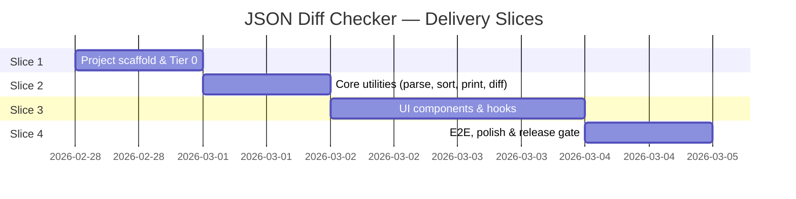
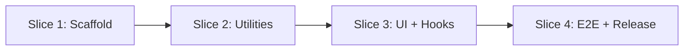

# Implementation Plan — JSON Diff Checker

> **Status:** Draft  
> **Date:** 2026-02-27  
> **Author:** Chief Tech Lead

---

## Overview

The feature is delivered in **4 vertical slices**. Each slice is independently mergeable and testable. Slices are ordered so that foundational utilities (which everything else depends on) land first, enabling unblocked parallel work on later slices.



---

## Slice 1 — Project Scaffold & Tier 0

**Goal:** A working build pipeline with linting, type-checking, and a passing test harness — all gates green before any feature code is written.

### Tasks

| # | Area | Task | Owner |
|---|---|---|---|
| 1.1 | Scaffold | `npm create vite@latest json-diff -- --template react-ts` | FE Dev |
| 1.2 | Deps | Install `diff`, `vitest`, `@testing-library/react`, `@testing-library/user-event`, `@testing-library/jest-dom`, `playwright` | FE Dev |
| 1.3 | Config | Configure `vite.config.ts` with Vitest, CSS Modules | FE Dev |
| 1.4 | Config | Configure `tsconfig.json` (strict mode, `noImplicitAny: true`) | FE Dev |
| 1.5 | Config | Configure ESLint + Prettier, add `.eslintrc.cjs` | FE Dev |
| 1.6 | Config | Add `package.json` scripts: `dev`, `build`, `preview`, `lint`, `typecheck`, `test:unit`, `test:e2e` | FE Dev |
| 1.7 | Types | Author `src/types/diff.ts` (from component-contracts.md §0) | FE Dev |
| 1.8 | CI | Add GitHub Actions workflow: Tier 0 → Tier 1 → build → Tier 3 | FE Dev |

### Test Gate
- `npm run lint` passes with zero warnings.
- `npm run typecheck` passes.
- `npm run test:unit` passes (no tests yet → vacuously passes with 0 suites).
- `npm run build` produces a valid `dist/`.

---

## Slice 2 — Core Utilities

**Goal:** All pure utility functions implemented and fully unit-tested (Tier 1). This is the algorithmic heart of the feature.

### Tasks

| # | Area | Task | Notes |
|---|---|---|---|
| 2.1 | Util | Implement `src/utils/parseJson.ts` | See contract §8.1 |
| 2.2 | Util | Implement `src/utils/sortKeysDeep.ts` | See contract §8.2 |
| 2.3 | Util | Implement `src/utils/prettyPrint.ts` | See contract §8.3 |
| 2.4 | Util | Implement `src/utils/computeLineDiff.ts` | See contract §8.4; wraps `diff.diffLines` |
| 2.5 | Tests | Unit tests for `parseJson` — valid JSON, invalid JSON, empty input | Vitest |
| 2.6 | Tests | Unit tests for `sortKeysDeep` — flat object, nested object, array, primitive | Vitest |
| 2.7 | Tests | Unit tests for `prettyPrint` — spot-check output format | Vitest |
| 2.8 | Tests | Unit tests for `computeLineDiff` — added, removed, equal, identical, empty | Vitest |
| 2.9 | Tests | AC-2 regression test in utils: `{"b":1,"a":2}` vs `{"a":2,"b":1}` → no diff lines changed | Vitest |

### Test Gate
- Tier 0 passes.
- All Slice 2 unit tests pass (100%).
- No `any` types in utility files (`tsc --strict`).

---

## Slice 3 — UI Components & Hooks

**Goal:** Full UI implemented, wired to utilities via `useDiff`, and verified with React Testing Library component tests (Tier 2).

### Tasks

| # | Area | Task | Notes |
|---|---|---|---|
| 3.1 | Hook | Implement `src/hooks/useDiff.ts` | See contract §6 |
| 3.2 | Component | Implement `<App />` — layout, wires hook to children | See contract §1 |
| 3.3 | Component | Implement `<JsonInputPanel />` | See contract §2; accessibility attrs required |
| 3.4 | Component | Implement `<ControlBar />` | See contract §3 |
| 3.5 | Component | Implement `<DiffViewer />` | See contract §4; side-by-side layout, markers |
| 3.6 | Component | Implement `<NoDiffMessage />` | See contract §5 |
| 3.7 | Styles | CSS Modules for each component; diff colour scheme (green/red/neutral) | Accessibility: colour + marker |
| 3.8 | Tests | RTL test: renders two textareas with correct aria-labels | Tier 2 |
| 3.9 | Tests | RTL test: Compare with valid JSON → diff rendered | Tier 2 |
| 3.10 | Tests | RTL test: Compare with invalid JSON → error message visible, diff absent | Tier 2 (AC-3) |
| 3.11 | Tests | RTL test: Compare with empty input → validation error visible | Tier 2 (AC-4) |
| 3.12 | Tests | RTL test: Compare identical JSON → NoDiffMessage visible | Tier 2 (AC-5) |
| 3.13 | Tests | RTL test: Clear button resets inputs and diff | Tier 2 (AC-6) |
| 3.14 | Tests | RTL test: Diff lines have `+`/`-` prefix text (accessibility) | Tier 2 (AC-8) |

### Test Gate
- Tier 0 passes.
- All Slice 2 + Slice 3 unit/component tests pass.
- Visual review: diff colours correct; layout does not break at common viewport widths (1024 px, 1440 px).

---

## Slice 4 — E2E, Polish & Release Gate

**Goal:** All acceptance criteria verified by Playwright E2E tests across all required browsers. App is production-ready.

### Tasks

| # | Area | Task | Notes |
|---|---|---|---|
| 4.1 | E2E | Playwright test: AC-1 — valid JSON compare | Chrome, Firefox, WebKit |
| 4.2 | E2E | Playwright test: AC-2 — key sorting eliminates false positives | All browsers |
| 4.3 | E2E | Playwright test: AC-3 — invalid JSON error handling | All browsers |
| 4.4 | E2E | Playwright test: AC-4 — empty input validation | All browsers |
| 4.5 | E2E | Playwright test: AC-5 — identical JSON after normalisation | All browsers |
| 4.6 | E2E | Playwright test: AC-6 — Clear / Reset | All browsers |
| 4.7 | E2E | Playwright test: AC-7 — diff highlights (colour via class name check) | All browsers |
| 4.8 | E2E | Playwright test: AC-8 — `+`/`-` prefix present in diff output | All browsers |
| 4.9 | Perf | Manual/automated: paste 500 KB JSON, measure diff render time ≤ 2 s | Chrome DevTools / Playwright `performance` |
| 4.10 | A11y | Axe-core accessibility scan via Playwright (`@axe-core/playwright`) | No critical violations |
| 4.11 | Polish | Page title, favicon, responsive layout check (mobile: stacked panels) | FE Dev |
| 4.12 | Docs | Update README with usage instructions and local dev commands | FE Dev |
| 4.13 | Release | Tag `v1.0.0`, deploy to static host | FE Dev |

### Test Gate (Release Readiness)
- Tier 0 passes.
- Tier 1 (all unit tests) pass.
- Tier 2 (all component tests) pass.
- Tier 3 (all E2E tests) pass on Chrome, Firefox, and WebKit.
- No axe-core critical/serious violations.
- Bundle size ≤ 200 KB gzipped.
- Performance: 500 KB JSON diff completes in ≤ 2 s on reference machine.

---

## Dependency Graph



All slices are strictly sequential because each builds on the previous. Within a slice, tasks without inter-dependencies can be parallelised by multiple developers.

---

## Recommended `package.json` Scripts

```json
{
  "scripts": {
    "dev": "vite",
    "build": "tsc --noEmit && vite build",
    "preview": "vite preview",
    "lint": "eslint src --ext .ts,.tsx --max-warnings 0",
    "typecheck": "tsc --noEmit",
    "test:unit": "vitest run",
    "test:unit:watch": "vitest",
    "test:e2e": "playwright test",
    "test:e2e:ui": "playwright test --ui"
  }
}
```

---

## Open Items for FE Tech Lead

1. Decide whether to extract `useJsonInput` as a standalone hook or inline in `useDiff`.
2. Define CSS breakpoints for responsive (mobile) layout — brief does not specify but polish is expected.
3. Determine whether a Web Worker is needed for the diff computation based on perf test results in Slice 4.9.
4. Confirm `diff` package version to pin in `package.json`.
