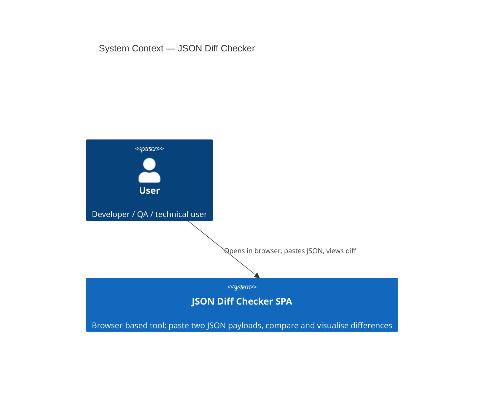
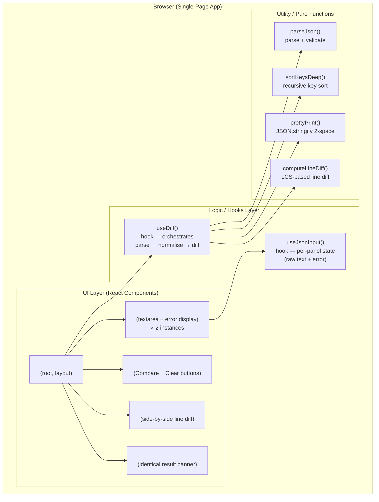
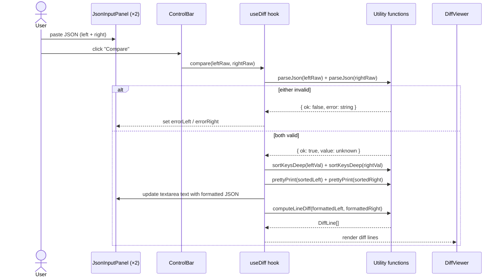
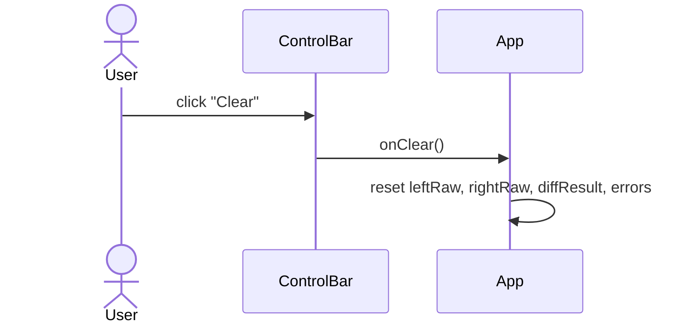

# System Architecture — JSON Diff Checker

> **Status:** Draft  
> **Date:** 2026-02-27  
> **Author:** Chief Tech Lead  
> **Project subfolder:** `json-diff/`

---

## 1. System Context

JSON Diff Checker is a **fully client-side, single-page application (SPA)**. There is no backend, no network I/O, and no persistent storage. All processing happens inside the user's browser.



**Key properties:**
- Zero server round-trips — privacy by design (AC requirement).
- Deployable as a static bundle to any CDN / GitHub Pages / Netlify.
- No authentication, no session, no external dependencies at runtime.

---

## 2. Component Diagram



---

## 3. Tech Stack

| Concern | Choice | Rationale |
|---|---|---|
| Language | **TypeScript 5** | Type safety, better DX, catches contract mismatches at compile time |
| UI Framework | **React 18** | Industry standard, large ecosystem, concurrent rendering for large payloads |
| Build Tool | **Vite 5** | Fast HMR, zero-config SPA, tree-shaking for small bundle |
| Styling | **CSS Modules** (plain CSS) | Zero runtime, scoped styles, no extra dependency |
| Diff Algorithm | **`diff` npm package** (`diff.diffLines`)  | Battle-tested LCS implementation, handles large inputs, MIT license |
| Testing (Unit) | **Vitest + React Testing Library** | Co-located with Vite, fast, Jest-compatible API |
| Testing (E2E) | **Playwright** | Cross-browser (Chrome, Firefox, Safari, Edge), headless CI |
| Linting | **ESLint + Prettier** | Consistent code style, Tier 0 gate |
| Type check | **`tsc --noEmit`** | Tier 0 gate in CI |
| Package manager | **npm** | Default, lock-file committed |

### Non-Functional Requirements

| NFR | Target | Mechanism |
|---|---|---|
| Performance | Diff + render ≤ 2 s for 500 KB JSON | `useMemo` for diff, `diff.diffLines` is O(N·D) |
| Accessibility | WCAG 2.1 AA; colour + text markers | `+`/`-` prefix on diff lines, `aria-label` on textareas |
| Browser support | Latest stable Chrome, Firefox, Safari, Edge | Vite target: `es2020`, no IE |
| Privacy | Zero data egress | Static SPA, no telemetry, no analytics |
| Bundle size | ≤ 200 KB gzipped | Vite tree-shaking + `diff` is ~15 KB |

---

## 4. Project Structure

```text
json-diff/
├── docs/                          # All design docs (this folder)
│   ├── feature-brief.md
│   ├── system-architecture.md     ← this file
│   ├── implementation-plan.md
│   ├── api/
│   │   └── error-model.md
│   └── contracts/
│       └── component-contracts.md
├── src/
│   ├── components/
│   │   ├── App/
│   │   ├── JsonInputPanel/
│   │   ├── ControlBar/
│   │   ├── DiffViewer/
│   │   └── NoDiffMessage/
│   ├── hooks/
│   │   ├── useDiff.ts
│   │   └── useJsonInput.ts
│   ├── utils/
│   │   ├── parseJson.ts
│   │   ├── sortKeysDeep.ts
│   │   ├── prettyPrint.ts
│   │   └── computeLineDiff.ts
│   ├── types/
│   │   └── diff.ts                # Shared TypeScript types
│   ├── main.tsx
│   └── index.css
├── tests/
│   ├── unit/                      # Vitest unit tests
│   └── e2e/                       # Playwright E2E tests
├── index.html
├── vite.config.ts
├── tsconfig.json
├── package.json
└── .eslintrc.cjs
```

---

## 5. Core Flows

### 5.1 Happy Path — Compare



### 5.2 Error Path — Invalid JSON

- `parseJson()` returns `ParseResult` discriminated union (`ok: true | false`).
- `useDiff` sets per-panel error state; `JsonInputPanel` renders the error inline.
- Diff output is cleared / hidden.
- User fixes the input and clicks Compare again (no auto-compare on type).

### 5.3 Reset Flow



### 5.4 Identical JSON

- After normalisation both strings are equal.
- `computeLineDiff` returns all lines with type `"equal"`.
- `useDiff` detects this and sets `isIdentical = true`.
- `App` renders `<NoDiffMessage />` instead of `<DiffViewer />`.

---

## 6. Data / Type Model

All types are authored in `src/types/diff.ts` — this is the **frontend contract source of truth** (equivalent role to an OpenAPI schema in a full-stack project).

```typescript
// src/types/diff.ts

/** Result of parsing a raw JSON string */
export type ParseResult =
  | { ok: true; value: unknown }
  | { ok: false; error: string };

/** A single line in the diff output */
export type DiffLineType = "added" | "removed" | "equal";

export interface DiffLine {
  type: DiffLineType;
  /** The line content (without trailing newline) */
  value: string;
  /** Line number in the LEFT formatted string (undefined for added-only lines) */
  leftLineNo?: number;
  /** Line number in the RIGHT formatted string (undefined for removed-only lines) */
  rightLineNo?: number;
}

/** The complete result returned by useDiff */
export type DiffResult =
  | { status: "idle" }
  | { status: "error"; leftError?: string; rightError?: string }
  | { status: "identical" }
  | { status: "diff"; lines: DiffLine[] };

/** State held per input panel */
export interface JsonInputState {
  raw: string;
  error: string | null;
}
```

---

## 7. Security Posture

| Threat | Mitigation |
|---|---|
| Data exfiltration | Static SPA — no network calls; CSP header blocks outbound XHR/fetch |
| XSS via JSON content | All diff content rendered as text nodes (no `dangerouslySetInnerHTML`); React escapes by default |
| ReDoS / CPU exhaustion | Input size is not hard-capped but rendering is synchronous in a single tab; no regex on user input |
| Supply-chain | Lock file committed; `npm audit` in CI |

**Recommended Content-Security-Policy** (for hosting layer):
```
default-src 'none'; script-src 'self'; style-src 'self'; font-src 'self'; connect-src 'none';
```

---

## 8. Accessibility Baseline

- Every `<textarea>` has an `aria-label` and is associated with its error via `aria-describedby`.
- Diff lines include a visible text marker (`+` / `-` / space) in addition to background colour.
- `<DiffViewer>` uses `role="region"` with `aria-label="Diff output"`.
- Error messages use `role="alert"` so screen readers announce them immediately.
- Focus management: after clicking Compare, focus stays on ControlBar (no unexpected jump).

---

## 9. Logging / Observability

This is a client-only static app — no server-side observability.

- **Browser console:** Errors caught in `parseJson()` are logged at `console.warn` level in development only (stripped in production build via `import.meta.env.DEV`).
- **Performance:** `performance.mark` / `performance.measure` around the diff computation in development for manual profiling.
- No analytics or error-reporting service is included (privacy requirement).

---

## 10. Test Governance

| Tier | What | Tooling | Gate |
|---|---|---|---|
| **Tier 0** | Lint, format, typecheck | ESLint, Prettier, `tsc --noEmit` | Before every commit (pre-commit hook) |
| **Tier 1** | Utility functions, hooks | Vitest | Before moving to next slice |
| **Tier 2** | Component integration, key user flows | Vitest + React Testing Library + MSW (not needed — no network) | Before declaring a slice integrated |
| **Tier 3** | Full E2E against all ACs | Playwright (Chrome, Firefox, WebKit) | Before declaring feature done |

---

## 11. Versioning & Compatibility

- **Semantic versioning** on the npm package / git tags (`v1.0.0`).
- **Backward compatibility:** N/A — no API surface; types are internal-only.
- **Browser targets:** `es2020` (Vite default); no polyfills needed for target browsers.
- **Type contract evolution:** changes to `src/types/diff.ts` are considered breaking if they change the shape consumed by components or hooks. Follow the same spec-change-first discipline — update types first, then hooks/utilities, then components.

---

## 12. Deployment

- `npm run build` → `dist/` (static files).
- Deploy `dist/` to any static host (GitHub Pages, Netlify, Vercel, S3+CloudFront).
- No environment variables required at runtime.
- CI pipeline (GitHub Actions recommended):
  1. Tier 0: `npm run lint && npm run typecheck`
  2. Tier 1: `npm run test:unit`
  3. Build: `npm run build`
  4. Tier 3: `npm run test:e2e` (Playwright)

---

## Open Risks & Unknowns

| # | Risk | Likelihood | Impact | Mitigation |
|---|---|---|---|---|
| R-1 | Very large JSON (>500 KB) causes UI freeze | Medium | Medium | Run diff in a Web Worker if perf testing reveals issues |
| R-2 | `diff` package not maintained | Low | Low | Package is stable; fallback: implement Myers diff internally |
| R-3 | Safari WebKit quirks with CSS Grid layout | Low | Low | Playwright WebKit coverage in CI |
