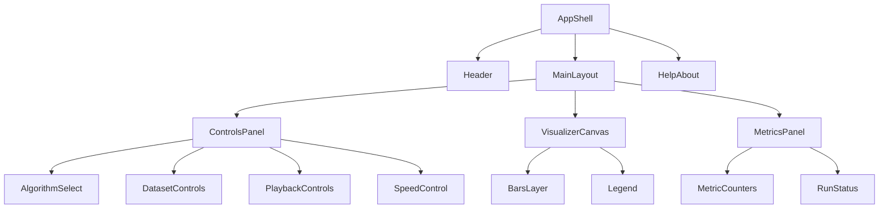

# Frontend Low-Level Design (LLD): Sorting Algorithm Visualizer (v1)

This document refines the frontend implementation plan for the Sorting Algorithm Visualizer using the product brief (`docs/feature-brief.md`), HLD (`docs/hld.md`), and internal contracts (`docs/contracts.md`). It is design-only (no code).

## Goals and Non-Goals

Goals:
- Implement a single-page React + TypeScript visualizer with contract-driven playback (`StepEvent[]`) and deterministic dataset generation.
- Keep rendering smooth for up to 150 bars by updating only affected indices per applied event.
- Preserve clear boundaries between controller/store logic and presentational components.

Non-goals (v1):
- Side-by-side compare mode.
- Step backward (design keeps it feasible but not implemented).
- Network/backend APIs.

## Key Decisions (v1)

- Rendering uses DOM bars (not `<canvas>`) with imperative per-index updates via element refs (avoids React re-render per event).
- Playback uses a `requestAnimationFrame` loop with a time accumulator; coalesces multiple events into one visual frame under high speed and/or reduced motion (per contract).
- App state uses `useReducer` as the “store”; playback scheduling and DOM updates live in controller hooks (effects + refs), leaving presentational components pure.
- Event lists are precomputed on Start (recommended by HLD for v1), but interfaces are shaped to allow Worker/streaming later.

## Page Structure and Component Breakdown

Single route: `/`.

Top-level layout areas (required by brief): App shell, Controls panel, Visualizer canvas, Metrics panel, Help/about.

Proposed component tree (container/presentational split):

### AppShell

Responsibilities:
- Initializes controller hooks (store + playback loop + reduced-motion detection).
- Owns global layout and persistent chrome (header/footer).
- Wires Help/About open/close state and focus management.

Props/events: none (root).

### ControlsPanel

Responsibilities:
- Renders all user controls.
- Shows current algorithm, dataset settings, playback status, and speed.
- Disables/enables controls according to the contract state machine.

Suggested subcomponents:
- `AlgorithmSelect` (presentational): select algorithm id.
- `DatasetControls` (presentational): size slider, pattern select, seed (optional), generate button.
- `PlaybackControls` (presentational): start, pause/resume, step, reset.
- `SpeedControl` (presentational): speed slider.

Container boundary:
- A thin `ControlsPanelContainer` maps store state -> props and dispatches contract actions (`SET_ALGO`, `GENERATE`, `START`, `PAUSE`, `RESUME`, `STEP`, `RESET`, `SET_SPEED`).

### VisualizerCanvas

Responsibilities:
- Hosts the bar elements and legend.
- Applies render patches produced by the renderer controller (imperative updates).
- Displays ephemeral highlight state and persistent sorted state.

Subcomponents:
- `BarsLayer` (mostly static DOM; bars are mounted once per dataset size).
- `Legend` (presentational): explains colors/patterns for compare/swap/write/sorted.

Important: this is a “canvas” in the product sense; it is still DOM.

### MetricsPanel

Responsibilities:
- Displays contract metrics (`comparisons`, `swaps`, `writes`, `arrayAccesses`, `appliedEvents`, `elapsedMs`).
- Provides a readable run status and any error message with recovery action.

### HelpAbout

Responsibilities:
- Explains what the visualizer does, event meanings, and keyboard usage.
- Implemented as a modal dialog or collapsible panel.

Modal requirements:
- Trap focus while open; return focus to the triggering button on close.
- Esc closes; close button is first/last tabbable.

## State Management and Boundaries

### Store shape

The runtime state follows the contract types in `docs/contracts.md`:
- `dataset: DatasetSnapshot`
- `playback: PlaybackState`
- `metrics: Metrics`

### React approach

- Use `useReducer` for the authoritative “store” (serializable state + action log friendliness).
- Use refs for high-frequency, non-serializable, or imperative concerns:
  - Timer/rAF handles
  - Last animation frame timestamp / accumulator
  - A reference to the current `values` array used for apply-time reads (to avoid stale closures)
  - Bar element refs (`HTMLElement[]`)

### Controller vs presentational boundary

Design rule:
- Presentational components receive data via props and emit events via callbacks. They must not:
  - Schedule timers
  - Generate events
  - Mutate DOM directly

Controller layer (store/controller) responsibilities:
- `useAppStore()`
  - Owns reducer + exposes `{state, dispatch}`
  - Enforces action preconditions (invalid-state -> error per contract)
- `useEventEngine()`
  - `generateEvents(initialValues, algorithmId, runId) => StepEvent[]`
  - `validateEvents(initialValues, events) => ok | contract-violation`
- `usePlaybackLoop()`
  - Starts/stops the rAF scheduling based on `playback.status`
  - Applies events (single or coalesced batches)
  - Updates elapsed time semantics (running only)
- `useDomBarsRenderer()`
  - Maintains bar refs and applies render patches (only affected indices)

Presentational layer responsibilities:
- Render controls/metrics/help based on props.
- Render bar container markup once per dataset size and expose bar element refs to the renderer controller.

## Playback Loop Design (Contract-Consistent)

### Precompute mode (v1)

On `START`:
- Ensure `dataset.values` is reset to a copy of `dataset.initialValues` (contract).
- Generate `events: StepEvent[]` from `dataset.initialValues` and `playback.algorithmId`.
- Initialize `runId`, `cursor = 0`, clear `sorted[]` and highlight, reset metrics, set status `running`.

On `STEP` from `ready`:
- If `events` empty, generate `events` (same as start) but keep status `ready`/`paused` per contract semantics.
- Apply exactly one event.

### Scheduling mechanism

Use `requestAnimationFrame` with a time accumulator, computed from `eventsPerSecond`:
- Each animation frame:
  - Convert elapsed frame time into “event budget” (events to apply).
  - Apply up to that budget, limited by a maximum-per-frame cap to avoid long tasks.
  - Emit a single render patch representing all applied events (coalesced visual update).

Rationale:
- rAF syncs updates to paint; accumulator stabilizes rates across different refresh rates.
- A cap/time budget prevents single frames from applying too many events and freezing the UI.

### Event coalescing policy

Automatic playback MAY apply multiple events per visual frame when:
- `eventsPerSecond` implies multiple events within a 16ms frame, or
- `reducedMotion === true`.

Coalescing rules (must match contract intent):
- Apply events strictly in order.
- Metrics are updated as if each event were applied individually.
- Highlight state is set to the last event in the applied batch.
- DOM updates affect only indices touched across the batch (dedupe indices).

Manual stepping rules:
- `STEP` applies exactly one event and produces a visible state change.

### Reduced motion

Reduced motion behavior is derived from `prefers-reduced-motion: reduce` into `playback.reducedMotion`:
- Transition durations are reduced to near-zero (or zero).
- Coalescing becomes more aggressive by lowering the visual emphasis on intermediate highlights.
- Still guarantees perceptibility: after each tick/frame, the bars reflect the updated values and the highlight reflects the last applied event.

### Pause/resume correctness

- `PAUSE` cancels the rAF loop immediately and freezes `elapsedMs` accumulation.
- `RESUME` restarts with the latest speed and reduced-motion settings.
- `RESET` cancels the loop and clears any pending apply/render work.

### Visibility handling (recommended)

On `document.visibilitychange`:
- If hidden while running, dispatch `PAUSE` (prevents “catch-up” bursts on tab return).

## DOM Bars Renderer Design

### Bar identity and keying

Bars represent positions, not values.
- Key bars by `index` (`0..size-1`).
- Swaps/writes update bar height styling for the affected indices; the DOM node stays in place.

This avoids expensive reordering and keeps ref arrays stable.

### How to update only affected indices

Renderer input: a small “render patch” derived from applied events:
- `changedIndices: number[]` (bars whose value changed: swap i/j, write i)
- `highlight: { indices: number[]; kind: HighlightKind }`
- `sortedChangedIndices: number[]` (from `markSorted`)
- `reducedMotion: boolean` (controls transition duration variables)

Renderer responsibilities:
- For each `changedIndices` entry:
  - Update a CSS variable (e.g., `--bar-scale`) or data attribute used to compute transform.
- For highlight updates:
  - Remove highlight classes from previous highlight indices.
  - Add new highlight kind class to current highlight indices.
- For sorted updates:
  - Add a persistent `is-sorted` class when `sorted[i]` becomes true.

Imperative DOM updates are preferred here to prevent React from reconciling 150 nodes per event.

### CSS strategy (variables, classes, transitions)

Use CSS variables on the visualizer root to centralize theme and motion:
- `--bar-anim-ms`, `--highlight-anim-ms`, `--bar-gap`, `--bar-radius`, `--bar-base-color`, `--compare-color`, `--swap-color`, `--write-color`, `--sorted-color`.

Per bar element:
- Use `transform: scaleY(var(--bar-scale))` with `transform-origin: bottom` to avoid layout reflow.
- Set `transition: transform var(--bar-anim-ms) linear, background-color var(--highlight-anim-ms) linear, outline-color var(--highlight-anim-ms) linear`.

State classes (examples):
- `is-compare`, `is-swap`, `is-write` (ephemeral highlight)
- `is-sorted` (persistent)

Reduced motion:
- Apply `@media (prefers-reduced-motion: reduce)` to set `--bar-anim-ms: 0ms` and reduce highlight transitions.

Non-color signal for highlights (a11y):
- Add outline/box-shadow or subtle pattern (e.g., dashed outline) for highlight kinds so meaning is not color-only.

## Algorithm Module Structure (Pure Event Generators) and Validation

### Module boundaries

Algorithm implementations are pure event generators:
- Input: `initialValues: number[]` (must not be mutated), `runId`, and any algorithm options (none in v1).
- Output: `StepEvent[]` satisfying the contract (including a final `done`).
- Internal: algorithms operate on a local copy of values to decide which events to emit.

Suggested module layout (illustrative):
- `algorithms/` (bubble/selection/insertion/merge)
- `engine/` (registry mapping `AlgorithmId -> generator`, and shared utilities)
- `contracts/` (runtime validators for events and dataset constraints)

### Validation strategy

Two layers:
- Generation-time validation (dev + tests):
  - `validateStepEvents(initialValues, events)` checks:
    - Required fields per event type
    - Indices are integers and in range
    - `swap.i !== swap.j`
    - `done` occurs exactly once and is last (precompute mode)
- Apply-time validation (always, but lightweight):
  - Re-check in-bounds indices and `prevValue` semantics for `write` (per contract).
  - On violation: set `playback.status='error'` with `code='contract-violation'`, stop automatic playback, present reset recovery.

Correctness check (tests/dev):
- Applying all events to a fresh copy of `initialValues` results in an ascending-sorted array.

## Accessibility and Responsiveness Notes

### Accessibility

- Controls:
  - Use native form elements with visible `<label>` and logical tab order.
  - Buttons have clear names: Start, Pause, Resume, Step, Reset, Generate.
  - Disable controls when disallowed by the contract (also prevents invalid-state errors).
- Keyboard:
  - Ensure all primary actions are reachable and operable without a mouse.
  - Optional keyboard shortcuts (documented in Help): space = pause/resume, right arrow = step.
- Screen reader:
  - Metrics panel provides an `aria-live="polite"` region for status changes (paused/running/done/error) and a throttled announcement policy (avoid announcing every counter tick).
  - Visualizer canvas has a short text description (`<figure>` + `<figcaption>`) explaining what colors/patterns mean.
- Reduced motion:
  - Honor OS setting via CSS + store state.
  - Do not rely on animation alone to convey meaning.

### Responsiveness

- Layout uses CSS grid:
  - Desktop: 3 columns (Controls / Visualizer / Metrics) with reasonable max widths.
  - Mobile: stack sections vertically; controls remain usable without horizontal scroll.
- Bar sizing:
  - Bars compute width from container width and `size`.
  - Cap bar minimum width; when very small, reduce gaps and border radius.
- Touch targets:
  - Sliders and buttons meet minimum hit area; avoid tiny icon-only actions.

## Frontend Test Strategy

Tier 0 (automation gates):
- Typecheck (TS strict), lint, formatting.

Tier 1 (unit tests):
- Event generation per algorithm:
  - Contract validation passes.
  - Applying events sorts the array.
- Event application:
  - `applyEvent` updates `values`, `highlight`, `sorted[]`, and metrics per event semantics.
  - `write.prevValue` mismatch triggers contract-violation error path.
- Dataset generation:
  - Determinism with fixed seed.
  - Constraint enforcement (size bounds, value range).

Tier 2 (basic component tests, React Testing Library):
- Smoke flow: Generate -> Start -> Pause -> Step -> Resume -> Done -> Reset.
- Control disabling rules by status (e.g., cannot change algorithm while running/paused).
- Reduced motion:
  - Simulate `prefers-reduced-motion` and assert motion variables/classes are adjusted (without asserting animation timing).
- Renderer behavior (lightweight):
  - When applying a swap/write patch, only affected bar elements receive updated style variables/classes.

## Risks, Tradeoffs, and Gotchas

- React re-render storms: storing `values` in state and passing to 150 bar components will likely re-render too often at high speed; use imperative DOM updates for bars.
- Stale closures in the playback loop: keep the latest state needed for applying events in refs, or ensure the loop reads from refs rather than captured values.
- Coalescing correctness: coalescing must not break manual step semantics; it must update metrics per event and set highlight based on the last event applied.
- `elapsedMs` accounting: must exclude paused time; avoid incrementing based solely on wall clock without status checks.
- Contract violations should be loud and recoverable: stop playback immediately and provide a single Reset recovery.
- `done` handling: precomputed lists should include exactly one final `done`; controller must transition to `done` even if the cursor reaches the end unexpectedly.
