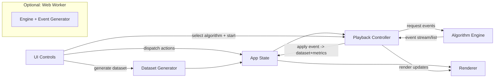
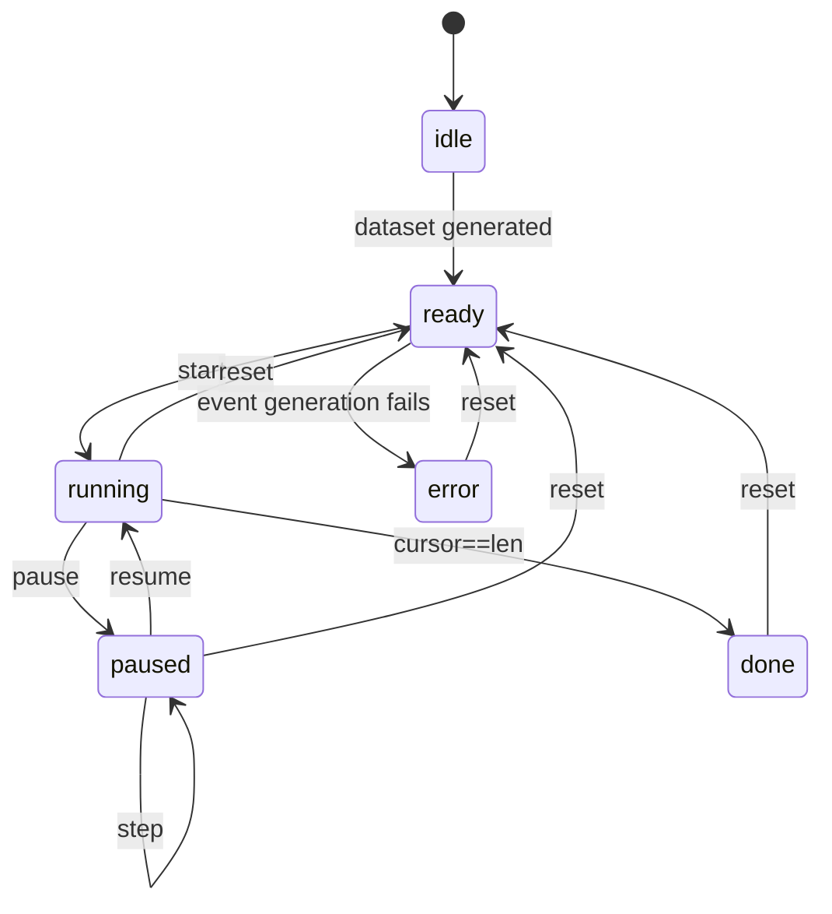

# High-Level Design (HLD): Sorting Algorithm Visualizer (v1)

This document defines the high-level architecture and contracts for a single in-browser sorting visualizer (static site; no backend). It follows v1 assumptions:

- Single visualizer (no side-by-side compare in v1)
- Max array size target: 150
- Step granularity: atomic operation events (`compare` / `swap` / `write`)

## Goals

- Deterministic, step-driven playback of sorting algorithms with pause/resume and single-step forward.
- Smooth, responsive rendering for up to 150 bars without main-thread stalls.
- Clear internal boundaries: algorithm engine generates atomic events; renderer consumes events; metrics are derived from events.

## 1) Architecture Overview

### Deployment model

- Static site only (bundled JS/CSS/HTML). No backend services.
- Optional Web Worker for algorithm/event generation to keep UI responsive (still part of static site).

### Major modules

1. UI Controls
   - Algorithm selector, dataset generator controls (size/type/seed), speed slider
   - Playback controls (start, pause/resume, step, reset)
   - A11y-first control semantics (labels, keyboard, ARIA)

2. Algorithm Engine
   - Implementations: bubble, selection, insertion (merge optional)
   - Produces a stream/list of atomic events; never touches DOM
   - Deterministic RNG for dataset generation (optional seed)

3. Step / Event Generator
   - Wraps algorithm implementations into a common “event stream” interface
   - Optionally runs in a Web Worker
   - Can operate in either mode:
     - Precompute all events before playback (simpler)
     - Stream events incrementally with a bounded buffer (more scalable)

4. Playback Controller
   - Owns the playback state machine and the event cursor
   - Applies events to the in-memory dataset model
   - Schedules event consumption based on speed and reduced-motion settings

5. Renderer
   - Visualizes dataset as bars and highlights active indices
   - Consumes “render instructions” derived from events; updates only affected bars

6. Metrics
   - Counters + elapsed time
   - Updated as events are applied; displayed live

### Component diagram

## 2) State Model

### Core state (single visualizer)

- Dataset state
  - `values: number[]` (current values)
  - `initialValues: number[]` (snapshot used for reset / replay)
  - `generation: { size: number; pattern: 'random'|'nearlySorted'|'reversed'; seed?: string }`
  - `valueRange: { min: number; max: number }` (optional)

- Playback state
  - `status: 'idle'|'ready'|'running'|'paused'|'done'|'error'`
  - `algorithmId: 'bubble'|'selection'|'insertion'|...`
  - `speed: { eventsPerSecond: number }`
  - `cursor: number` (index of next event to apply)
  - `events: StepEvent[]` (precomputed mode) OR `buffer: StepEvent[]` (streaming mode)
  - `active: { indices: number[]; kind?: StepEvent['type'] }` (for highlight)
  - `reducedMotion: boolean`

- Metrics state
  - `comparisons: number`
  - `swaps: number`
  - `writes: number`
  - `arrayAccesses: number` (if tracked; defined by event semantics)
  - `appliedEvents: number`
  - `elapsedMs: number`
  - `startedAt?: number` (performance.now timestamp)

### Event queueing / streaming

Two supported internal modes (choose one for v1; keep interfaces compatible):

1) Precompute (recommended for v1)
- On `Start`: generate full `events: StepEvent[]` from `initialValues` + algorithm.
- Playback consumes `events[cursor]` at the configured pace.
- Benefits: simplest pause/step; easier to show progress; deterministic.
- Cost: stores all events (bounded for n<=150).

2) Streaming generator (future-proof)
- Engine exposes an iterator/async generator (or Worker message stream).
- Playback maintains a bounded `buffer` (e.g., 200-1000 events) and requests more as needed.
- Benefits: scales to larger n/algorithms; lower memory.
- Cost: more complexity; step-back requires additional strategy.

### Pause / resume / step semantics

- `Pause`
  - Cancels any scheduled tick (timeout / rAF loop)
  - Leaves `cursor` unchanged (next event not applied)

- `Resume`
  - Restarts the scheduling loop using the latest `speed` and `reducedMotion` settings

- `Step` (single-step forward; required)
  - Applies exactly one atomic event:
    - Reads `events[cursor]`, applies it to `values`, increments metrics, updates highlights
    - Increments `cursor` by 1
  - If `cursor == events.length`, transitions to `done`

- `Reset`
  - Stops playback immediately
  - Restores `values = initialValues` and clears highlights
  - Resets metrics and `cursor = 0`

### Optional step backward (nice-to-have)

Not required for v1; design keeps it feasible:

- Preferred approach: make events reversible by including enough information to undo.
  - `swap` is self-inverse
  - `write` should include `prevValue` so it can be undone
- Alternative: store periodic snapshots of `values` every N events and replay forward.

### Playback state machine

## 3) Rendering Strategy

### Decision: DOM (not Canvas) for v1

Rationale (n<=150):

- 150 bars is small enough for DOM with targeted updates (update 1-2 bars per event).
- Simpler styling and highlighting (CSS classes) and easier a11y for controls.
- Lower implementation risk vs custom Canvas rendering + hit testing.

### Performance considerations

- Avoid re-rendering all bars every event.
  - Renderer updates only the bars touched by the current event (typically indices `i` and/or `j`).
  - Highlights are applied by toggling classes on a small set of elements.

- Avoid layout thrash.
  - Prefer transforms (`scaleY`) over changing `height` to reduce layout cost.
  - Bars can be absolutely positioned with fixed widths; value mapped to CSS variable used by transform.

- Frame scheduling.
  - Playback uses a timing loop driven by `setTimeout` or `requestAnimationFrame` with an accumulator.
  - When speed is very high or reduced motion is enabled, coalesce multiple events into one visual frame (apply N events per frame) while still respecting step semantics for manual stepping.

- Visibility handling.
  - On `document.visibilitychange`, pause automatic playback (optional) to prevent “catch-up storms”.

### Reduced motion

- If `prefers-reduced-motion: reduce`:
  - Use shorter transitions or no transitions.
  - Optionally lower highlight pulse frequency.
  - Preserve step correctness: every step still results in a visible state change.

## 4) Event / Step Contract (High Level)

Events are the single source of truth for:

- Dataset mutation (`swap` / `write`)
- Highlights (`compare` and mutation events)
- Metrics increments (comparisons/swaps/writes/accesses)

### Common event fields

Each `StepEvent` includes:

- `id: string | number` (unique within a run)
- `type: 'compare'|'swap'|'write'|'markSorted'|'done'`
- `i?: number` and `j?: number` (indices involved, when applicable)
- `timestampHint?: number` (optional; informational only)
- `meta?: { algorithmId: string; runId: string }` (optional)

### Event types (v1)

- `compare`
  - Required: `i`, `j`
  - Meaning: algorithm compares `values[i]` and `values[j]`
  - Metrics: `comparisons += 1`; `arrayAccesses += 2` (if defined)
  - Rendering: highlight `i` and `j` as “compare”

- `swap`
  - Required: `i`, `j`
  - Meaning: algorithm swaps the values at the two indices
  - Metrics: `swaps += 1`; `writes += 2`; `arrayAccesses += 4` (optional semantics)
  - Rendering: highlight `i` and `j` as “swap”; update both bars

- `write`
  - Required: `i`, `value`
  - Optional (for reversibility): `prevValue`
  - Meaning: algorithm writes `value` into `values[i]`
  - Metrics: `writes += 1`; `arrayAccesses += 1` (optional semantics)
  - Rendering: highlight `i` as “write”; update one bar

- `markSorted`
  - Required: `i` (or optionally a range in future)
  - Meaning: index is now known to be in final position (visual affordance)
  - Metrics: none
  - Rendering: apply “sorted” styling to bar `i`

- `done`
  - No required indices
  - Meaning: run completed; final UI state

Notes:

- v1 keeps event taxonomy minimal and algorithm-agnostic.
- If merge sort is added later, it can still express itself through `compare` + `write`.

## 5) Error Model + Edge Cases

### Error model

Since this is a static site, errors are primarily client-side logic/runtime issues.

- Error categories
  - `invalid-state`: action not allowed in current state (e.g., start without dataset)
  - `generation-failed`: event generation threw or returned invalid events
  - `render-failed`: DOM not ready / bar elements missing (should be rare)

- Error handling policy
  - Transition to `status='error'` with a user-facing message and a single recovery action: `Reset`.
  - Log details to console for developer diagnostics (no remote logging in v1).

### Edge cases and required behaviors

- Changing array size mid-run
  - Policy: disallow while `running`/`paused` OR treat as implicit `Reset`.
  - Recommended v1 behavior: disable size and dataset pattern controls while not `ready/idle/done`.

- Changing algorithm mid-run
  - Same policy as size; recommended: disable while running/paused.

- Speed changes during a run
  - Allowed while running/paused.
  - Applied on next tick (no need to regenerate events).

- Reset during run
  - Must be immediate.
  - Cancels scheduling and ignores any in-flight generator/Worker messages.
  - Restores `values` and metrics to pre-run state.

- Generate during run
  - Recommended: disabled; or treated as `Reset + Generate`.

- Reduced motion
  - Must respect OS setting.
  - Ensure highlight contrast remains clear even without animation.

- Determinism (optional seed)
  - Dataset generation uses a seeded PRNG when seed is provided.
  - Event generation must be deterministic given `initialValues` and `algorithmId`.

## 6) Testing Strategy (High Level)

### Unit tests (Tier 1)

- Algorithm correctness
  - Given `initialValues`, applying generated events results in a sorted array.
  - Property-style checks for multiple random seeds (bounded to keep tests fast).

- Event contract validation
  - All events have required fields.
  - Indices within bounds; values are within expected range.

- Event application
  - Applying `swap` and `write` mutates `values` as expected.
  - Metrics increments match event types.

- Optional reversibility tests (if step-back is implemented)
  - Apply N events, then undo N events, returns to original values and metrics (or metrics reset/recomputed by policy).

### Basic UI tests (Tier 2-ish, minimal for v1)

- Smoke flows
  - Generate -> Start -> Pause -> Step -> Resume -> Done -> Reset.
  - Speed change affects playback rate.

- A11y behavior
  - Keyboard navigation reaches all primary controls.
  - Reduced-motion setting results in reduced/disabled transitions.

### Performance checks

- Automated perf budget (lightweight)
  - Run bubble sort with n=150 and ensure the UI remains responsive.
  - Record max “long task” duration (where feasible) and fail if consistently above a threshold.
  - Validate that renderer updates only affected bars (can be asserted via instrumentation in test builds).

## 7) Non-Functional Requirements (NFRs)

- Accessibility
  - All controls are standard form elements with labels.
  - Visible focus states; keyboard operability for start/pause/step/reset.
  - Color is not the only signal: use combined color + subtle outline/pattern for active bars.

- Responsiveness
  - Mobile layout without horizontal scrolling.
  - Bars adapt to available width; controls stack vertically on narrow screens.

- Reduced motion
  - Honor `prefers-reduced-motion`.
  - Provide functional equivalence: state changes remain perceptible.

- Determinism
  - Optional seed for dataset generation.
  - Given the same seed + settings + algorithm, events and final array are the same.

- Reliability
  - No uncaught exceptions in normal flows.
  - Clear recovery path via `Reset` from any error state.
