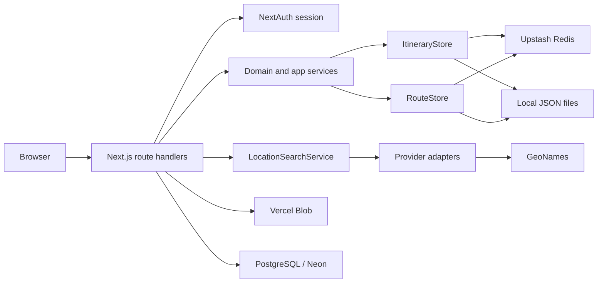

# Backend Architecture - travel-plan-web-next

## Scope

- Backend stays inside the Next.js monolith: route handlers under `app/api/**`, domain and storage modules under `app/lib/**`, auth in `auth.ts`.
- Primary itinerary backend is the itinerary-scoped stack under `/api/itineraries*`; legacy `note-update`, `stay-update`, `attraction-update`, and `train-update` endpoints remain compatibility paths for the legacy route tab.
- Location lookup for itinerary stay entry runs through a backend-owned same-origin API under `/api/locations/search`; third-party providers stay behind server-side adapters.
- Image uploads use Vercel Blob via a backend-issued client upload token at `/api/upload-image`.
- This baseline doc is the canonical backend subsystem reference for feature LLDs.

## Runtime Shape

## Module Boundaries

- `app/api/itineraries/**/route.ts`: authenticated itinerary create/read/update/seed handlers.
- `app/api/locations/search/route.ts`: authenticated provider-neutral place search for itinerary stay entry.
- `app/api/upload-image/route.ts`: authenticated Vercel Blob client upload token issuer.
- `app/lib/itinerary-store/service.ts`: request validation, ownership checks, error mapping, workspace shaping; exports `createItineraryShell`, `getWorkspace`, `listItineraries`, `appendStay`, `patchStay`, `moveStay`, `patchDayPlan`, `patchDayNote`, `patchDayAttractions`, `seedItinerary`.
- `app/lib/itinerary-store/domain.ts`: pure stay and date-regeneration rules (`applyAppendStay`, `applyPatchStay`, `applyMoveStay`, `deriveStays`, `regenerateDerivedDates`).
- `app/lib/itinerary-store/store.ts`: `ItineraryStore` interface + `FileItineraryStore` and `UpstashItineraryStore` implementations for per-user itinerary records.
- `app/lib/location-search/`: `LocationSearchService` orchestration, degraded success handling, DTO normalization, and provider adapters.
- `app/lib/imageStore.ts`: `ImageStore` interface + `VercelBlobImageStore` implementation.
- `app/lib/attractionValidator.ts`: `parseAttractions` — validates and normalizes `DayAttraction[]` from request bodies.
- `app/lib/stayLocation.ts`: `normalizeStayLocation` — coerces raw location input to a typed `StayLocation`.
- `app/api/note-update`, `app/api/stay-update`, `app/api/attraction-update`, `app/api/train-update`: legacy route-tab write paths still used by non-itinerary-scoped flows.
- `app/lib/routeStore.ts`: file/Upstash storage for the legacy flat route tab (single `TabKey = 'route'`).

## Data Model

- `ItineraryRecord`: `id`, `ownerEmail`, `name`, `startDate`, `status`, `createdAt`, `updatedAt`, `days: RouteDay[]`.
- `RouteDay` is the shared canonical day type for both itinerary-scoped and legacy route storage. It includes `location?: StayLocation`, `note?: string`, and `attractions?: DayAttraction[]` in addition to the base fields.
- Stays are derived from contiguous `RouteDay.overnight` blocks; no normalized stay table is used.
- Owner lookup is maintained through a per-user itinerary index ordered by most recent `updatedAt`.
- `/api/itineraries/seed` converts the legacy route store days into a new owned `ItineraryRecord`; there is no separate synthetic read model for the seeded route.

## API Baseline

- `GET /api/itineraries`: list owned itinerary summaries ordered by `updatedAt desc`.
- `POST /api/itineraries`: create itinerary shell.
- `POST /api/itineraries/seed`: create a new itinerary from the legacy route store data.
- `GET /api/itineraries/{id}`: load one owned itinerary workspace.
- `GET /api/locations/search`: search normalized place candidates for itinerary stay entry.
- `POST /api/itineraries/{id}/stays`: append a stay.
- `PATCH /api/itineraries/{id}/stays/{stayIndex}`: update stay city, nights, and/or location.
- `POST /api/itineraries/{id}/stays/{stayIndex}/move`: reorder a stay up or down.
- `PATCH /api/itineraries/{id}/days/{dayIndex}/plan`: update one day's plan sections.
- `PATCH /api/itineraries/{id}/days/{dayIndex}/note`: update one day's note.
- `PATCH /api/itineraries/{id}/days/{dayIndex}/attractions`: replace one day's attractions list.
- `POST /api/upload-image`: issue a Vercel Blob client upload token.
- Contract source of truth remains `packages/contracts/openapi.yaml`.

## Authorization And Browser Boundary

- All itinerary routes require `auth()` and authorize by `ownerEmail === session.user.email`.
- `/api/locations/search` and `/api/upload-image` follow the same session boundary.
- Same-origin cookie/session behavior remains unchanged; no new CORS, CSRF, or token model is introduced.
- Ownership failures map to `403`, missing records to `404`, validation to `400`, stale writes to `409`.

## Persistence Rules

- Local development uses JSON files (`data/route.json` for legacy route store; `data/itineraries/` for itinerary store).
- Production uses Upstash Redis JSON documents keyed by itinerary id plus a per-owner index.
- Writes remain whole-record replacements with `updatedAt` as the optimistic concurrency token.
- `RouteDay.location`, `RouteDay.note`, and `RouteDay.attractions` are additive persisted fields; legacy days without them are handled transparently at the service boundary.

## Test Baseline

- Tier 0: lint, formatting, type safety, generated contract consistency.
- Tier 1: pure itinerary domain rules, ownership-aware service logic, location-provider normalization, and store ordering/concurrency behavior.
- Tier 2: route-handler tests with authenticated and unauthenticated cases, validation mapping, degraded location-search behavior, and real store fixtures.

## Risks

- Whole-record writes keep implementation simple but accept last-write-wins concurrency.
- Redis/file dual backends require mirrored behavior for list ordering and stale-write handling.
- Provider-backed location lookup adds upstream dependency and quota risk, so degraded success responses must keep stay save flows custom-safe.
- Vercel Blob upload tokens are scoped per request; uploads bypass the backend after token issuance.
- The current monolith keeps scope small, but page-level read behavior and API-level read behavior must stay aligned as new read-only entry flows are added.
