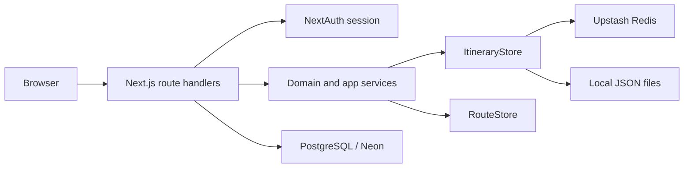

# Backend Architecture - travel-plan-web-next

## Scope

- Backend stays inside the Next.js monolith: route handlers under `app/api/**`, domain and storage modules under `app/lib/**`, auth in `auth.ts`.
- Primary itinerary backend is the itinerary-scoped stack under `/api/itineraries*`; legacy `route` and `route-test` endpoints remain compatibility paths for the older tab flows.
- This baseline doc is the canonical backend subsystem reference for feature LLDs.

## Runtime Shape

## Module Boundaries

- `app/api/itineraries/**/route.ts`: authenticated itinerary create/read/update handlers.
- `app/lib/itinerary-store/service.ts`: request validation, ownership checks, error mapping, workspace shaping.
- `app/lib/itinerary-store/domain.ts`: pure stay and date-regeneration rules.
- `app/lib/itinerary-store/store.ts`: `ItineraryStore` file/Upstash implementations for per-user itinerary records.
- `app/lib/itineraryCards.ts`: server-side cards payload shaping that derives seeded starter-route metadata from legacy `route` days without writing to `ItineraryStore`.
- `app/api/plan-update`, `app/api/stay-update`, `app/api/train-update`: legacy route-backed write paths still used by non-itinerary-scoped flows.
- `app/lib/routeStore.ts`: file/Upstash storage for the legacy flat route tabs.

## Data Model

- `ItineraryRecord`: `id`, `ownerEmail`, `name`, `startDate`, `status`, `createdAt`, `updatedAt`, `days`.
- `days` remains the canonical editor payload as `RouteDay[]`; stays are derived from contiguous `overnight` blocks.
- Owner lookup is maintained through a per-user itinerary index ordered by most recent `updatedAt`.
- No normalized stay table or separate itinerary-detail read model is used in the current MVP.
- Starter seeded route card metadata is a synthetic read model (`name`, `startDate`, `dayCount`, `stayCount`, `legacyTabKey=route`) composed at page-load time from `RouteStore` only.

## API Baseline

- `GET /api/itineraries`: list owned itinerary summaries ordered by `updatedAt desc`.
- `POST /api/itineraries`: create itinerary shell.
- `GET /api/itineraries/{itineraryId}`: load one owned itinerary workspace.
- `POST /api/itineraries/{itineraryId}/stays`: append a stay.
- `PATCH /api/itineraries/{itineraryId}/stays/{stayIndex}`: update stay city and-or nights.
- `PATCH /api/itineraries/{itineraryId}/days/{dayIndex}/plan`: update one day plan.
- Contract source of truth remains `packages/contracts/openapi.yaml`.

## Authorization And Browser Boundary

- All itinerary routes require `auth()` and authorize by `ownerEmail === session.user.email`.
- Same-origin cookie/session behavior remains unchanged; no new CORS, CSRF, or token model is introduced.
- Ownership failures map to `403`, missing records to `404`, validation to `400`, stale writes to `409` where supported.

## Persistence Rules

- Local development uses JSON files under `data/itineraries`.
- Production uses Upstash Redis JSON documents keyed by itinerary id plus a per-owner index.
- Writes remain whole-record replacements with `updatedAt` as the optimistic concurrency token.
- No destructive migration or storage-model change is required for read-only itinerary listing features.

## Test Baseline

- Tier 0: lint, formatting, type safety, generated contract consistency.
- Tier 1: pure itinerary domain rules, ownership-aware service logic, store ordering and concurrency behavior.
- Tier 2: route-handler tests with authenticated and unauthenticated cases, validation mapping, and real store fixtures.

## Risks

- Whole-record writes keep implementation simple but accept last-write-wins concurrency.
- Redis/file dual backends require mirrored behavior for list ordering and stale-write handling.
- The current monolith keeps scope small, but page-level read behavior and API-level read behavior must stay aligned as new read-only entry flows are added.
