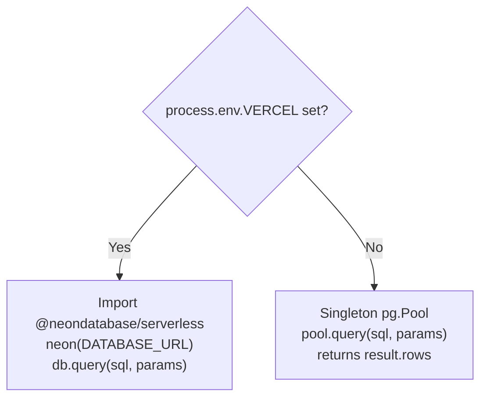
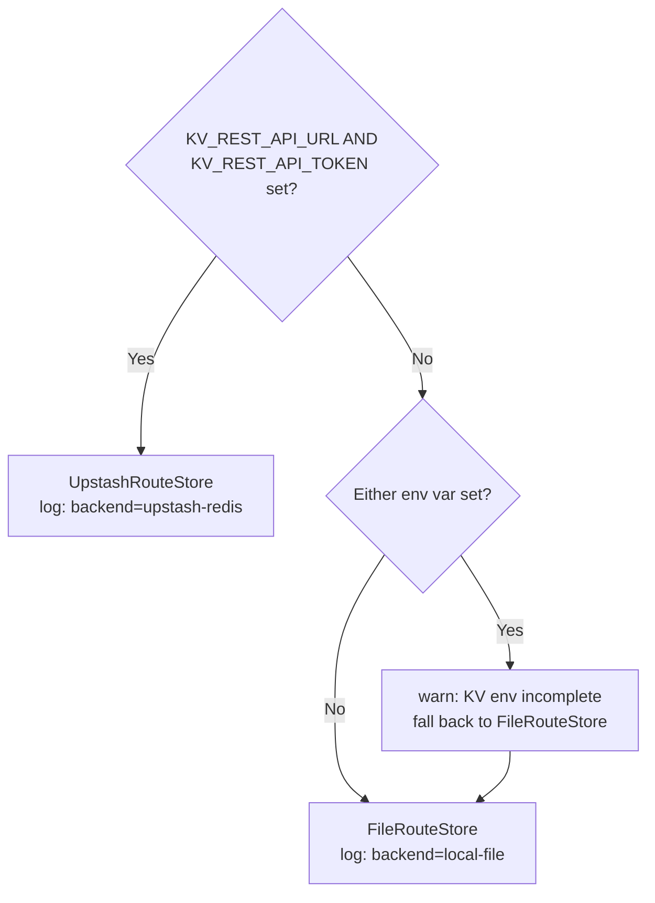
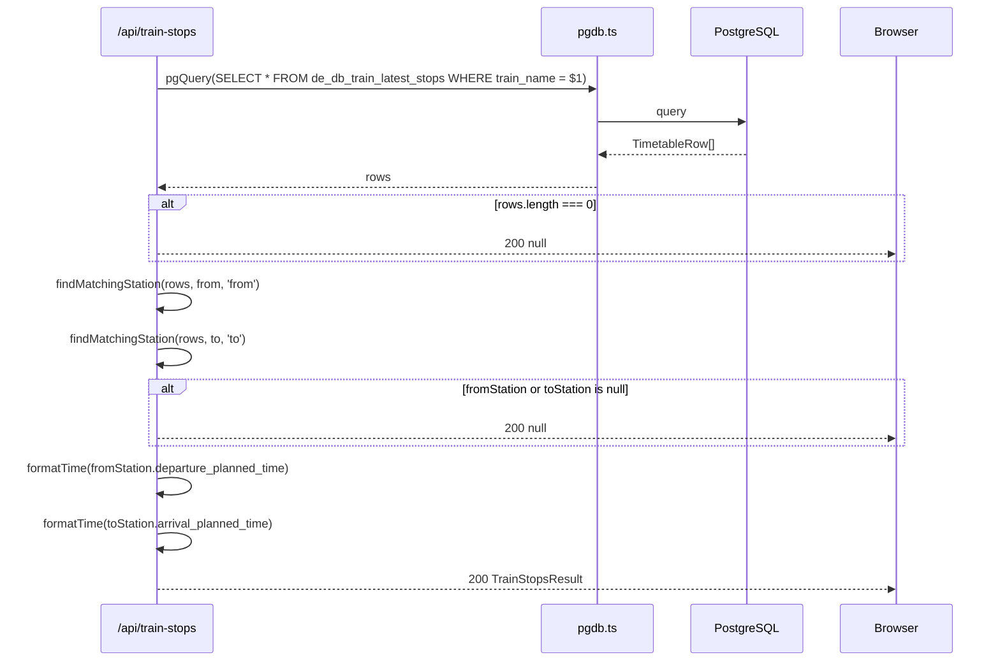
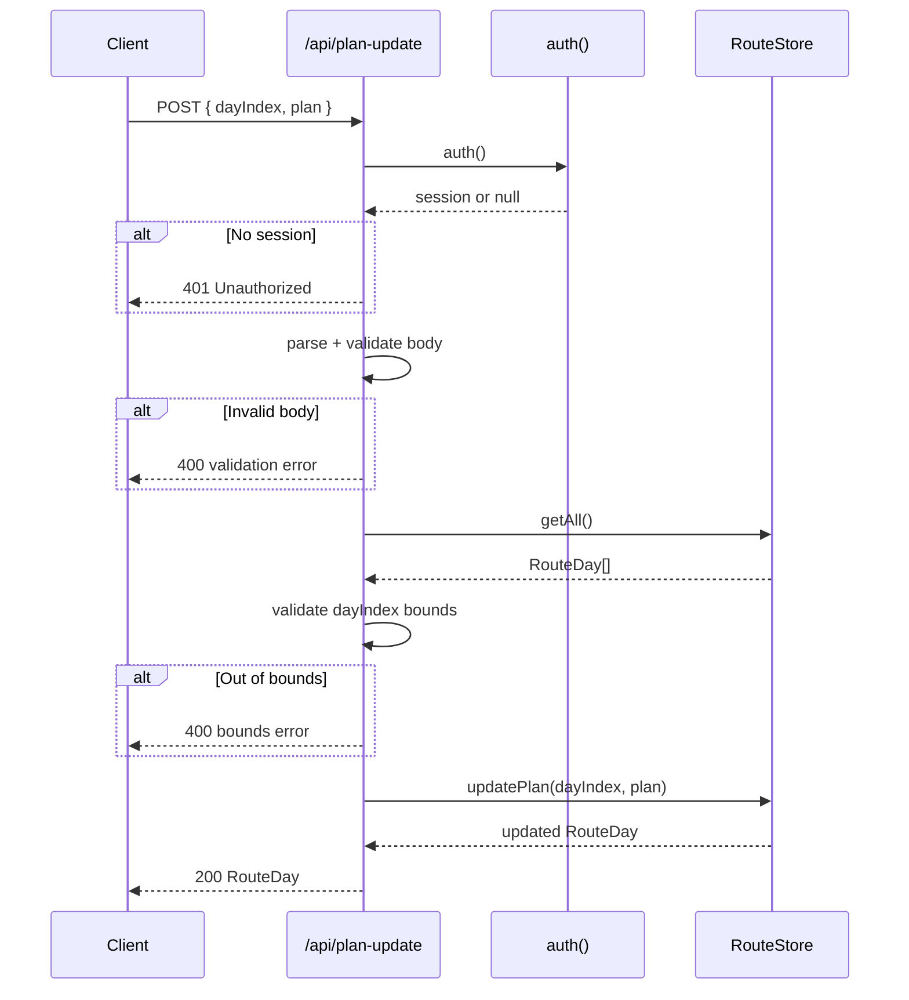

# Backend Low-Level Design — Travel Plan Web (Next.js)

**Version:** 1.0  
**Date:** 2026-03-13  
**Status:** Baseline (existing system)  
**Author:** Backend Tech Lead  
**Aligned with:** [`docs/high-level-design.md`](./high-level-design.md)

---

## Table of Contents

1. [Scope & Assumptions](#1-scope--assumptions)
2. [Module Map](#2-module-map)
3. [Data Access Layer](#3-data-access-layer)
   - 3.1 [pgdb.ts — PostgreSQL Abstraction](#31-pgdbts--postgresql-abstraction)
   - 3.2 [routeStore.ts — Itinerary Persistence](#32-routestorets--itinerary-persistence)
4. [API Route Details](#4-api-route-details)
   - 4.1 [GET /api/trains](#41-get-apitrains)
   - 4.2 [GET /api/timetable](#42-get-apitimetable)
   - 4.3 [GET /api/stations](#43-get-apistations)
   - 4.4 [GET /api/delay-stats](#44-get-apidelay-stats)
   - 4.5 [GET /api/train-stops](#45-get-apitrain-stops)
   - 4.6 [POST /api/plan-update](#46-post-apiplan-update)
   - 4.7 [GET/POST /api/auth/[...nextauth]](#47-getpost-apiauthNextauth)
   - 4.8 [GET /api/warmup](#48-get-apiwarmup)
5. [Domain & Utility Modules](#5-domain--utility-modules)
   - 5.1 [itinerary.ts](#51-itineraryts)
   - 5.2 [trainDelay.ts](#52-traindelayts)
   - 5.3 [trainTimetable.ts](#53-traintimetablets)
   - 5.4 [logger.ts](#54-loggerts)
6. [Authentication Middleware](#6-authentication-middleware)
7. [Data Models](#7-data-models)
   - 7.1 [Itinerary (Redis / JSON file)](#71-itinerary-redis--json-file)
   - 7.2 [GTFS Tables (PostgreSQL)](#72-gtfs-tables-postgresql)
   - 7.3 [German Railway Tables (PostgreSQL)](#73-german-railway-tables-postgresql)
8. [Error Handling Conventions](#8-error-handling-conventions)
9. [Configuration & Environment Model](#9-configuration--environment-model)
10. [Backend Test Strategy](#10-backend-test-strategy)
11. [Risks & Tradeoffs](#11-risks--tradeoffs)

---

## 1. Scope & Assumptions

### Scope

This document describes the **current backend implementation** of Travel Plan Web: every Next.js API route, the data access layer, the authentication middleware, and the domain utility modules. It does not cover the React frontend components.

### Non-Goals

- New feature design — this is a baseline documentation exercise.
- Infrastructure provisioning — Vercel, Neon, and Upstash are treated as given.
- ORM migration — the system intentionally uses raw parameterised SQL.

### Key Assumptions

| # | Assumption |
|---|---|
| A-01 | All API routes run as Vercel serverless functions; there is no persistent server process. |
| A-02 | The DuckDB / MotherDuck path in `db.ts` is available for local-development analytics but **all production API routes use `pgdb.ts`** (PostgreSQL/Neon). |
| A-03 | The application is single-tenant: one `ALLOWED_EMAIL` and one `route` key in Redis. |
| A-04 | GTFS data and German railway parquet data are loaded once via scripts; API routes are read-only for those datasets. |
| A-05 | Session verification uses the NextAuth.js v5 `auth()` helper, which reads the encrypted session JWT from cookies. |

---

## 2. Module Map

```
app/
├── api/
│   ├── auth/[...nextauth]/route.ts   # NextAuth catch-all (GET + POST)
│   ├── trains/route.ts               # GET  — combined train list
│   ├── timetable/route.ts            # GET  — stop sequence for one train
│   ├── stations/route.ts             # GET  — stations for a German train
│   ├── delay-stats/route.ts          # GET  — delay percentiles + trend
│   ├── train-stops/route.ts          # GET  — dep/arr between two cities
│   ├── plan-update/route.ts          # POST — persist plan (auth-gated)
│   └── warmup/route.ts               # GET  — DB readiness probe
└── lib/
    ├── pgdb.ts                        # pgQuery abstraction (pg.Pool / Neon)
    ├── routeStore.ts                  # RouteStore interface + impls
    ├── itinerary.ts                   # RouteDay types + domain helpers
    ├── trainDelay.ts                  # DelayStats types + UI-helper fns
    ├── trainTimetable.ts              # TimetableRow type + formatTime
    └── logger.ts                      # pino instance

auth.ts                                # NextAuth.js v5 config
```

### Dependency flow

```mermaid
graph TD
  subgraph Routes
    trains[/api/trains]
    timetable[/api/timetable]
    stations[/api/stations]
    delayStats[/api/delay-stats]
    trainStops[/api/train-stops]
    planUpdate[/api/plan-update]
    warmup[/api/warmup]
  end

  subgraph Lib
    pgdb[pgdb.ts]
    routeStore[routeStore.ts]
    itinerary[itinerary.ts]
    timetableLib[trainTimetable.ts]
    logger[logger.ts]
  end

  subgraph Auth
    authTs[auth.ts]
  end

  trains --> pgdb
  timetable --> pgdb
  stations --> pgdb
  delayStats --> pgdb
  trainStops --> pgdb
  trainStops --> itinerary
  trainStops --> timetableLib
  warmup --> pgdb
  planUpdate --> authTs
  planUpdate --> routeStore
  routeStore --> itinerary

  pgdb --> logger
  routeStore --> logger
  trains --> logger
  timetable --> logger
  stations --> logger
  delayStats --> logger
  trainStops --> logger
  planUpdate --> logger
  warmup --> logger
```

---

## 3. Data Access Layer

### 3.1 `pgdb.ts` — PostgreSQL Abstraction

**File:** `app/lib/pgdb.ts`

The single exported function `pgQuery<T>` provides a uniform SQL execution interface that transparently selects the correct PostgreSQL driver at runtime.

#### Backend selection logic



| Condition | Driver | Notes |
|---|---|---|
| `VERCEL=1` | `@neondatabase/serverless` (`neon()`) | HTTP-based; safe for serverless; no persistent TCP connection |
| `VERCEL` absent | `pg.Pool` | Module-level singleton; reused across invocations in same Node.js process |

#### Signature

```typescript
export async function pgQuery<T = Record<string, unknown>>(
  sql: string,
  params?: unknown[]
): Promise<T[]>
```

- **`sql`** — parameterised SQL string using `$1`, `$2`, … placeholders.
- **`params`** — optional positional parameter array; passed directly to the driver without modification.
- **Returns** — `T[]` cast from the driver result.
- **Throws** — re-throws any driver error to the caller (API routes catch this and return `500`).

#### One-time backend logging

Both driver paths log `'Postgres backend selected'` at `info` level **exactly once** per process lifetime (guarded by `hasLoggedPoolBackend` / `hasLoggedNeonBackend` module-level booleans). Log fields: `{ backend, databaseHost, vercelEnv? }`.

#### `next.config.ts` — Server external packages

```typescript
serverExternalPackages: ['pg', 'pino', 'pino-pretty']
```

`pg` is excluded from webpack bundling so that its native bindings and module-level pool singleton are handled correctly by Node.js.

---

### 3.2 `routeStore.ts` — Itinerary Persistence

**File:** `app/lib/routeStore.ts`

#### `RouteStore` interface

```typescript
export interface RouteStore {
  getAll(): Promise<RouteDay[]>
  updatePlan(dayIndex: number, plan: PlanSections): Promise<RouteDay>
}
```

All reads and writes go through this interface. Production code must never import `data/route.json` directly.

#### Implementations

| Class | Trigger condition | Storage | Notes |
|---|---|---|---|
| `FileRouteStore` | `KV_REST_API_URL` **or** `KV_REST_API_TOKEN` absent | Local `data/route.json` (or `ROUTE_DATA_PATH`) | Synchronous `fs.readFileSync` / `fs.writeFileSync`; adequate for local dev |
| `UpstashRouteStore` | Both `KV_REST_API_URL` **and** `KV_REST_API_TOKEN` present | Upstash Redis key `"route"` | Lazy-imports `@upstash/redis`; auto-seeds from `route.json` on first `getAll()` if Redis is empty |

#### `getRouteStore()` factory



**Warning behaviour:** If exactly one of the two KV env vars is set, the factory logs a `warn`-level message (`'KV env is incomplete, falling back to FileRouteStore'`) and falls back gracefully rather than throwing.

#### `UpstashRouteStore` seed-on-first-read

When `redis.get('route')` returns `null`, `getAll()` seeds the store from the bundled `data/route.json` (static import at module load time) via `redis.set('route', seed)` before returning. This is a read-then-write pattern — there is no distributed lock; in a concurrent serverless environment a race could result in double-seeding (idempotent in practice since the payload is identical).

#### File path resolution

```typescript
function resolveRouteFilePath(): string {
  return path.join(process.cwd(), process.env.ROUTE_DATA_PATH ?? 'data/route.json')
}
```

`ROUTE_DATA_PATH` allows E2E tests to point to a separate fixture file without touching the development data.

---

## 4. API Route Details

All routes follow the same structural pattern:

1. Parse and validate query params / request body.
2. Perform DB or store operation(s).
3. Return `NextResponse.json(payload)` on success.
4. `try/catch` wraps all DB calls; caught errors return `{ error: message }` with appropriate HTTP status.
5. Per-request `pino` log emitted on both success and error paths, including elapsed time `ms`.

Error response shape (all routes):
```json
{ "error": "<human-readable message>" }
```

---

### 4.1 `GET /api/trains`

**File:** `app/api/trains/route.ts`

#### Parameters

| Param | Type | Required | Validation |
|---|---|---|---|
| `railway` | `german \| french \| eurostar` | No | No explicit validation — unknown values fall through to the all-sources branch |

#### Behaviour

**When `railway=german`:** Single `pgQuery` against `de_db_train_latest_stops`. Returns immediately without querying GTFS tables.

**When `railway` is absent or any other value:** Three concurrent `pgQuery` calls via `Promise.allSettled`:
1. **German** — `SELECT DISTINCT train_name, split_part(train_name, ' ', 1) AS train_type FROM de_db_train_latest_stops ORDER BY train_name`
2. **French** — `SELECT DISTINCT trip_headsign AS train_name, 'SNCF' AS train_type FROM gtfs_trips WHERE split_part(trip_id, ':', 1) = 'fr' AND trip_headsign IS NOT NULL AND trip_headsign != '' ORDER BY train_name`
3. **Eurostar** — same pattern with `'eu'` prefix and `'Eurostar'` as `train_type`

Rejected promises are logged at `error` level; the fulfilled results are still combined and returned (`200`).

#### Deduplication & ordering

After all three results are collected:
1. French → Eurostar → German rows are concatenated (priority order matters for deduplication: French wins over a same-named German train).
2. Sorted alphabetically by `train_name` via `localeCompare`.
3. Deduplicated by `train_name` using a `Set<string>` (first occurrence wins after sort — French prefix rows come before German rows when names collide).

#### Response shape

```typescript
Array<{
  train_name: string
  train_type: string  // "ICE", "TGV", "SNCF", "Eurostar", etc.
  railway: 'german' | 'french' | 'eurostar'
}>
```

#### Error handling

| Condition | Status | Body |
|---|---|---|
| All three DB queries fail | `200` | `[]` (empty array — `Promise.allSettled` absorbs all rejections) |
| Partial DB failure | `200` | Successful sources returned; failed sources logged |
| Unexpected error outside `Promise.allSettled` | `500` | `{ error: message }` |

---

### 4.2 `GET /api/timetable`

**File:** `app/api/timetable/route.ts`

#### Parameters

| Param | Type | Required | Validation |
|---|---|---|---|
| `train` | string | **Yes** | Absent → `400` |
| `railway` | `german \| french \| eurostar` | No | Defaults to `german`; any other non-empty value → `400` |

#### Behaviour by railway

**`german` (default / empty):**
```sql
SELECT station_name, station_num,
  arrival_planned_time::TEXT AS arrival_planned_time,
  departure_planned_time::TEXT AS departure_planned_time,
  ride_date::TEXT AS ride_date
FROM de_db_train_latest_stops
WHERE train_name = $1
ORDER BY station_num
```
Returns times in `"YYYY-MM-DD HH:MM:SS"` format (PostgreSQL TIMESTAMPTZ cast to TEXT).

**`french`:**
```sql
WITH canonical_trip AS (
  SELECT t.trip_id
  FROM gtfs_trips t
  JOIN gtfs_stop_times st ON st.trip_id = t.trip_id
  WHERE split_part(t.trip_id, ':', 1) = 'fr'
    AND t.trip_headsign = $1
  GROUP BY t.trip_id
  ORDER BY COUNT(*) DESC    -- trip with most stops = canonical
  LIMIT 1
)
SELECT DISTINCT ON (CAST(st.stop_sequence AS INTEGER))
       CAST(st.stop_sequence AS INTEGER) AS station_num,
       s.stop_name AS station_name,
       st.arrival_time AS arrival_planned_time,
       st.departure_time AS departure_planned_time,
       NULL AS ride_date
FROM gtfs_stop_times st
JOIN canonical_trip ct ON st.trip_id = ct.trip_id
JOIN gtfs_stops s ON st.stop_id = s.stop_id
ORDER BY CAST(st.stop_sequence AS INTEGER)
```
Returns GTFS times in `"HH:MM:SS"` format; `ride_date` is always `null`.

**`eurostar`:**
```sql
WITH latest_trip AS (
  SELECT t.trip_id, cd.date AS ride_date
  FROM gtfs_trips t
  JOIN gtfs_calendar_dates cd ON t.service_id = cd.service_id
  WHERE split_part(t.trip_id, ':', 1) = 'eu'
    AND t.trip_headsign = $1
    AND cd.exception_type = '1'
  ORDER BY cd.date DESC    -- most recent calendar entry
  LIMIT 1
)
SELECT DISTINCT ON (CAST(st.stop_sequence AS INTEGER))
       CAST(st.stop_sequence AS INTEGER) AS station_num,
       s.stop_name AS station_name,
       st.arrival_time AS arrival_planned_time,
       st.departure_time AS departure_planned_time,
       lt.ride_date::TEXT AS ride_date
FROM gtfs_stop_times st
JOIN latest_trip lt ON st.trip_id = lt.trip_id
JOIN gtfs_stops s ON st.stop_id = s.stop_id
ORDER BY CAST(st.stop_sequence AS INTEGER)
```

#### Response shape

```typescript
Array<{
  station_name: string
  station_num: number
  arrival_planned_time: string | null   // "HH:MM:SS" or "YYYY-MM-DD HH:MM:SS"
  departure_planned_time: string | null
  ride_date: string | null              // "YYYY-MM-DD" or null
}>
```

> `formatTime()` in `trainTimetable.ts` normalises both time formats to `HH:MM` for display.

#### Error handling

| Condition | Status | Body |
|---|---|---|
| `train` param absent | `400` | `{ error: 'train param required' }` |
| Unknown `railway` value | `400` | `{ error: 'Unknown railway: <value>' }` |
| DB error | `500` | `{ error: message }` |

---

### 4.3 `GET /api/stations`

**File:** `app/api/stations/route.ts`

#### Parameters

| Param | Type | Required | Validation |
|---|---|---|---|
| `train` | string | **Yes** | Absent → `400` |

#### SQL query

```sql
SELECT station_name, MIN(train_line_station_num) AS station_num
FROM de_db_delay_events
WHERE train_name = $1
GROUP BY station_name
ORDER BY station_num
```

Uses `de_db_delay_events` (not `de_db_train_latest_stops`) to derive station order via `MIN(train_line_station_num)`. This means station order reflects historical event data, not the canonical timetable sequence.

#### Response shape

```typescript
Array<{
  station_name: string
  station_num: number
}>
```

#### Error handling

| Condition | Status | Body |
|---|---|---|
| `train` absent | `400` | `{ error: 'train param required' }` |
| DB error | `500` | `{ error: message }` |
| No matching stations | `200` | `[]` |

---

### 4.4 `GET /api/delay-stats`

**File:** `app/api/delay-stats/route.ts`

#### Parameters

| Param | Type | Required | Validation |
|---|---|---|---|
| `train` | string | **Yes** | Absent → `400` |
| `station` | string | **Yes** | Absent → `400` |

#### SQL queries (parallel via `Promise.all`)

**Stats query:**
```sql
SELECT
  COUNT(*)::INTEGER AS total_stops,
  ROUND(AVG(delay_in_min)::numeric, 2)::FLOAT8 AS avg_delay,
  ROUND(PERCENTILE_CONT(0.5) WITHIN GROUP (ORDER BY delay_in_min)::numeric, 1)::FLOAT8 AS p50,
  ROUND(PERCENTILE_CONT(0.75) WITHIN GROUP (ORDER BY delay_in_min)::numeric, 1)::FLOAT8 AS p75,
  ROUND(PERCENTILE_CONT(0.90) WITHIN GROUP (ORDER BY delay_in_min)::numeric, 1)::FLOAT8 AS p90,
  ROUND(PERCENTILE_CONT(0.95) WITHIN GROUP (ORDER BY delay_in_min)::numeric, 1)::FLOAT8 AS p95,
  MAX(delay_in_min) AS max_delay
FROM de_db_delay_events
WHERE is_canceled = false
  AND train_name = $1
  AND station_name = $2
  AND event_time >= (SELECT MAX(event_time) - INTERVAL '3 months' FROM de_db_delay_events)
```

**Trends query:**
```sql
SELECT
  CAST(DATE_TRUNC('day', event_time) AS VARCHAR) AS day,
  ROUND(AVG(delay_in_min)::numeric, 2)::FLOAT8 AS avg_delay,
  COUNT(*)::INTEGER AS stops
FROM de_db_delay_events
WHERE is_canceled = false
  AND train_name = $1
  AND station_name = $2
  AND event_time >= (SELECT MAX(event_time) - INTERVAL '3 months' FROM de_db_delay_events)
GROUP BY DATE_TRUNC('day', event_time)
ORDER BY day
```

**Time window:** Rolling 3-month window anchored at `MAX(event_time)` — not current wall-clock time. Both sub-queries use the same anchor, computed independently via correlated sub-selects.

**Cancelled stops:** Filtered out with `is_canceled = false`.

#### Response shape

```typescript
{
  stats: {
    total_stops: number    // INTEGER
    avg_delay: number      // FLOAT8, rounded to 2dp
    p50: number            // FLOAT8, rounded to 1dp
    p75: number
    p90: number
    p95: number
    max_delay: number      // INTEGER
  } | null                 // null when no rows match
  trends: Array<{
    day: string            // ISO datetime string "YYYY-MM-DD HH:MM:SS"
    avg_delay: number
    stops: number
  }>
}
```

> `stats` is `null` when `pgQuery` returns an empty array (`stats[0] ?? null`).

#### Error handling

| Condition | Status | Body |
|---|---|---|
| `train` or `station` absent | `400` | `{ error: 'train and station params required' }` |
| DB error (either query) | `500` | `{ error: message }` |

---

### 4.5 `GET /api/train-stops`

**File:** `app/api/train-stops/route.ts`

#### Parameters

| Param | Type | Required | Validation |
|---|---|---|---|
| `train` | string | **Yes** | Absent → `400` |
| `from` | string | **Yes** | Absent → `400` |
| `to` | string | **Yes** | Absent → `400` |

#### Execution flow



#### SQL query

```sql
SELECT station_name, station_num,
  arrival_planned_time::TEXT AS arrival_planned_time,
  departure_planned_time::TEXT AS departure_planned_time,
  ride_date::TEXT AS ride_date
FROM de_db_train_latest_stops
WHERE train_name = $1
ORDER BY station_num
```

#### City alias resolution

`findMatchingStation()` from `itinerary.ts` resolves free-text city names to station rows using `CITY_ALIASES`:

```typescript
const CITY_ALIASES: Record<string, string[]> = {
  cologne: ['köln', 'koeln', 'cologne'],
  munich: ['münchen', 'munich'],
  augsburg: ['augsburg'],
  bolzano: ['bozen', 'bolzano'],
  lyon: ['lyon'],
  paris: ['paris'],
  rome: ['rome', 'roma'],
  florence: ['florence', 'firenze'],
  pisa: ['pisa'],
}
```

- Matching is case-insensitive substring match of `station_name` against all aliases.
- For `from`: returns the **first** matching station (lowest station_num → departure city).
- For `to`: returns the **last** matching station (highest station_num → arrival city).

#### Response shape

```typescript
// On success
{
  fromStation: string   // matched station_name
  depTime: string       // "HH:MM" formatted departure time
  toStation: string     // matched station_name
  arrTime: string       // "HH:MM" formatted arrival time
}
// When no rows or no station match
null
```

#### Error handling

| Condition | Status | Body |
|---|---|---|
| Any required param absent | `400` | `{ error: '<param> param required' }` |
| No train rows found | `200` | `null` |
| No station match (from/to city not in alias map or no match in rows) | `200` | `null` |
| DB error | `500` | `{ error: message }` |

---

### 4.6 `POST /api/plan-update`

**File:** `app/api/plan-update/route.ts`

#### Authentication gate

```typescript
const session = await auth()
if (!session?.user) {
  logger.warn('/api/plan-update unauthorized request')
  return NextResponse.json({ error: 'Unauthorized' }, { status: 401 })
}
```

`auth()` is called **before** any body parsing. A missing or invalid session cookie causes an immediate `401` return.

#### Request body

```typescript
{
  dayIndex: number   // 0-based index into RouteDay[]
  plan: {
    morning: string
    afternoon: string
    evening: string
  }
}
```

#### Validation sequence

1. **JSON parse** — `request.json()` throws → `400 { error: 'Invalid JSON in request' }`.
2. **Type check** — `typeof body.dayIndex !== 'number'`, or any `plan` field is not a `string` → `400` with descriptive message.
3. **Bounds check** — `dayIndex < 0 || dayIndex >= allData.length` → `400` with range message. Requires a `store.getAll()` read first.

#### Execution sequence



#### Response

- `200` — the full updated `RouteDay` object.
- Logged at `info`: `{ user: session.user.email, dayIndex }`.

#### Error handling

| Condition | Status | Body |
|---|---|---|
| No session | `401` | `{ error: 'Unauthorized' }` |
| Invalid JSON | `400` | `{ error: 'Invalid JSON in request' }` |
| Invalid body types | `400` | `{ error: 'Invalid request: dayIndex must be a number…' }` |
| dayIndex out of bounds | `400` | `{ error: 'Invalid dayIndex: must be between 0 and N' }` |
| Store error | `500` | `{ error: 'Internal server error while updating plan' }` |

---

### 4.7 `GET|POST /api/auth/[...nextauth]`

**File:** `app/api/auth/[...nextauth]/route.ts`

```typescript
import { handlers } from '../../../../auth'
export const { GET, POST } = handlers
```

This is a pure delegation to NextAuth.js v5. The route handles all OAuth sub-paths automatically:

| Sub-path | Method | Purpose |
|---|---|---|
| `/api/auth/csrf` | GET | CSRF token for forms |
| `/api/auth/signin` | GET | Sign-in page redirect |
| `/api/auth/signin/google` | POST | Initiate Google OAuth |
| `/api/auth/callback/google` | GET | OAuth callback, token exchange |
| `/api/auth/session` | GET | Session JSON (used by client) |
| `/api/auth/signout` | GET/POST | Sign-out, clears session cookie |

CSRF protection and session cookie management are handled transparently by NextAuth. No application-level code is needed.

---

### 4.8 `GET /api/warmup`

**File:** `app/api/warmup/route.ts`

Runs two lightweight `SELECT LIMIT 1` queries in parallel against both German tables to confirm the database connection is ready:

```typescript
await Promise.all([
  pgQuery(`SELECT train_name FROM de_db_train_latest_stops LIMIT 1`),
  pgQuery(`SELECT train_name FROM de_db_delay_events LIMIT 1`),
])
```

**Purpose:** Used as `webServer.url` in `playwright.config.ts` — Playwright blocks test execution until this endpoint returns `200`, absorbing MotherDuck's ~80-second cold-start delay.

**Response:** `{ ok: true }` with HTTP `200`. No error handling — any DB failure will cause a non-`200` response, blocking the test suite (correct fail-safe behaviour).

---

## 5. Domain & Utility Modules

### 5.1 `itinerary.ts`

**File:** `app/lib/itinerary.ts`

#### Types

```typescript
interface TrainRoute {
  train_id: string
  start?: string
  end?: string
}

interface PlanSections {
  morning: string
  afternoon: string
  evening: string
}

interface RouteDay {
  date: string       // "2026/9/25"
  weekDay: string    // "星期五"
  dayNum: number     // 1-based
  overnight: string  // City name (Chinese)
  plan: PlanSections
  train: TrainRoute[]
}

interface ProcessedDay extends RouteDay {
  overnightRowSpan: number  // >0 on first day of a run; 0 on subsequent days
}
```

#### Pure functions

| Function | Signature | Purpose |
|---|---|---|
| `getOvernightColor` | `(location: string) => string` | Deterministic HSL pastel from string hash; returns `'#f5f5f5'` for `'—'` |
| `processItinerary` | `(data: RouteDay[]) => ProcessedDay[]` | Computes `overnightRowSpan` for table `rowspan` rendering |
| `normalizeTrainId` | `(trainId: string) => string` | Adds space between prefix and number (e.g. `"ICE123"` → `"ICE 123"`) |
| `findMatchingStation` | `(stations[], cityName, side) => station \| null` | City-alias lookup; `side='from'` returns first match, `side='to'` returns last |

**`processItinerary` algorithm:** Single-pass scan tracking the current overnight location and span count. On location change, back-patches `overnightRowSpan` on the first day of the previous run.

---

### 5.2 `trainDelay.ts`

**File:** `app/lib/trainDelay.ts`

Pure presentation-helper module. Contains no I/O.

#### Types

```typescript
interface DelayStats {
  total_stops: number
  avg_delay: number
  p50: number; p75: number; p90: number; p95: number
  max_delay: number
}

interface TrendPoint { day: string; avg_delay: number; stops: number }
interface TrainRow   { train_name: string; train_type: string; railway: 'german' | 'french' | 'eurostar' }
interface StationRow { station_name: string; station_num: number }
interface StatItem   { label: string; value: number | string; unit: string }
```

#### Functions

| Function | Signature | Purpose |
|---|---|---|
| `formatDay` | `(day: string) => string` | Formats ISO datetime to `"M/D"` for chart x-axis labels |
| `buildStatItems` | `(stats: DelayStats) => StatItem[]` | Converts `DelayStats` to display-ordered `StatItem[]` for the stats grid |

---

### 5.3 `trainTimetable.ts`

**File:** `app/lib/trainTimetable.ts`

```typescript
interface TimetableRow {
  station_name: string
  station_num: number
  arrival_planned_time: string | null    // "HH:MM:SS" (GTFS) or "YYYY-MM-DD HH:MM:SS" (German)
  departure_planned_time: string | null
  ride_date: string | null
}

function formatTime(ts: string | null): string
```

`formatTime` normalises both time formats by:
1. If `ts` is `null` → returns `'—'`.
2. If `ts` contains a space → splits on space, takes the time part.
3. Takes first 5 characters (`HH:MM`).

---

### 5.4 `logger.ts`

**File:** `app/lib/logger.ts`

```typescript
const logger = pino({
  level: process.env.LOG_LEVEL ?? 'info',
  ...(process.env.NODE_ENV === 'development' && {
    transport: { target: 'pino-pretty', options: { colorize: true, ignore: 'pid,hostname' } }
  })
})
```

| Environment | Transport | Format |
|---|---|---|
| `development` | `pino-pretty` | Colorised, human-readable |
| `production` / `test` | default (stdout) | JSON (Vercel log drain compatible) |

**Log levels used in routes:**

| Level | When |
|---|---|
| `info` | Successful request/response; backend selection |
| `warn` | Unauthenticated write attempt; incomplete KV env |
| `error` | DB errors; failed operator queries in `/api/trains` |

**Per-request log fields always include:** `ms` (elapsed milliseconds), route-specific params (`train`, `station`, `railway`, `dayIndex`), `rows` (row counts on success).

---

## 6. Authentication Middleware

### `auth.ts` — NextAuth.js v5 Configuration

**File:** `auth.ts` (project root)

```typescript
export const { handlers, auth, signIn, signOut } = NextAuth({
  providers: [Google],
  pages: { error: '/auth-error' },
  callbacks: {
    signIn({ user }) {
      const allowed = process.env.ALLOWED_EMAIL
      if (!allowed) return true         // allow-list disabled → all Google accounts
      return user.email === allowed     // strict email match
    }
  }
})
```

#### Exported symbols and their use-sites

| Export | Used by | Purpose |
|---|---|---|
| `handlers` | `app/api/auth/[...nextauth]/route.ts` | NextAuth catch-all HTTP handlers |
| `auth` | `app/api/plan-update/route.ts`, `app/page.tsx` | Server-side session check |
| `signIn` | `app/login/page.tsx` (client import via `next-auth/react`) | Initiates OAuth |
| `signOut` | `components/AuthHeader.tsx` (client import via `next-auth/react`) | Clears session |

#### Session cookie

NextAuth v5 issues an encrypted JWT session cookie (`__Secure-authjs.session-token` in production, `authjs.session-token` in development). The `AUTH_SECRET` env var is the signing/encryption key (minimum 32 characters).

#### `ALLOWED_EMAIL` allow-list

- If absent: any authenticated Google account is permitted.
- If set: only `user.email === ALLOWED_EMAIL` is permitted; any other account triggers the `signIn` callback to return `false`, causing NextAuth to redirect to `/auth-error`.

#### Authorization guard in `plan-update`

```typescript
const session = await auth()
if (!session?.user) {
  // 401 — covers: no cookie, expired session, invalid signature
  return NextResponse.json({ error: 'Unauthorized' }, { status: 401 })
}
```

`auth()` is the **only** write-protection mechanism at the API level. The `ItineraryTab` client-side `isLoggedIn` flag is a UI-only convenience.

#### CSRF

CSRF protection for OAuth flows is handled transparently by NextAuth.js v5 via the `/api/auth/csrf` token endpoint. No custom CSRF middleware is required.

---

## 7. Data Models

### 7.1 Itinerary (Redis / JSON file)

**Storage key:** `"route"` (Upstash Redis) or `data/route.json` (local file)

**Shape:** `RouteDay[]` — a JSON array, serialised as a single value.

```
RouteDay {
  date       string    "2026/9/25"              required
  weekDay    string    "星期五"                   required
  dayNum     number    1 (1-based)              required
  overnight  string    "巴黎"                    required
  plan       PlanSections {
    morning    string  required
    afternoon  string  required
    evening    string  required
  }
  train      TrainRoute[] {
    train_id   string  "ICE 123"    required
    start?     string  "paris"      optional
    end?       string  "cologne"    optional
  }[]
}
```

**Constraints (enforced in `plan-update` API, not at DB level):**
- `dayIndex` must be a valid index (`0 ≤ dayIndex < data.length`).
- All three `plan` fields must be strings.

**No server-side validation on `RouteDay` structure** for fields other than `plan` — the store reads and writes the full array as a blob.

---

### 7.2 GTFS Tables (PostgreSQL)

**Schema source:** `scripts/init-db.sql`  
**Data loaded by:** `scripts/load-data.sh` (from GTFS CSV files in `euro-railway-timetable/`)

All columns are `TEXT` — no typed constraints at the PostgreSQL level. The application casts values in SQL queries (`CAST(st.stop_sequence AS INTEGER)`).

| Table | Purpose | Key Columns |
|---|---|---|
| `gtfs_agency` | Operator info | `agency_id`, `agency_name` |
| `gtfs_calendar` | Regular service schedule | `service_id`, `monday`–`sunday`, `start_date`, `end_date` |
| `gtfs_calendar_dates` | Calendar exceptions (active dates) | `service_id`, `date`, `exception_type` |
| `gtfs_routes` | Route metadata | `route_id`, `agency_id`, `route_short_name` |
| `gtfs_stops` | Stop/station master | `stop_id`, `stop_name`, `stop_lat`, `stop_lon` |
| `gtfs_stop_times` | Planned arrival/departure per stop per trip | `trip_id`, `stop_id`, `stop_sequence`, `arrival_time`, `departure_time` |
| `gtfs_trips` | Trip definitions | `trip_id`, `trip_headsign` (branded train name), `service_id`, `train_brand` |
| `gtfs_shapes` | Route geometry | `shape_id`, `shape_pt_lat`, `shape_pt_lon`, `shape_pt_sequence` |

**Trip ID prefix convention:** All `trip_id` values are prefixed with the operator code followed by `:` — e.g. `fr:8088`, `eu:9002`, `de:ICE905`. Queries use `split_part(trip_id, ':', 1)` to filter by operator.

**Indexes:**

```sql
CREATE INDEX IF NOT EXISTS idx_trips_prefix ON gtfs_trips(split_part(trip_id, ':', 1));
CREATE INDEX IF NOT EXISTS idx_trips_headsign ON gtfs_trips(trip_headsign);
```

These indexes support the `/api/trains` and `/api/timetable` queries that filter on prefix and `trip_headsign`.

---

### 7.3 German Railway Tables (PostgreSQL)

**Schema source:** `scripts/init-db-german-railway.sql`  
**Data loaded by:** `scripts/load-german-railway.sh` (from `db_railway_stats/` parquet files)

#### `de_db_delay_events`

| Column | Type | Notes |
|---|---|---|
| `id` | `BIGSERIAL PRIMARY KEY` | Auto-generated surrogate key |
| `source_file` | `TEXT NOT NULL` | Source parquet filename for incremental loading |
| `service_date` | `DATE NOT NULL` | Calendar date of the service |
| `event_time` | `TIMESTAMPTZ NOT NULL` | Actual event timestamp; used for 3-month window filter |
| `train_name` | `TEXT NOT NULL` | e.g. `"ICE 905"` |
| `station_name` | `TEXT NOT NULL` | e.g. `"Berlin Hbf"` |
| `train_line_ride_id` | `TEXT` | Trip/ride identifier |
| `train_line_station_num` | `INTEGER` | Station sequence number for ordering |
| `delay_in_min` | `INTEGER` | Delay in minutes |
| `is_canceled` | `BOOLEAN` | True when stop was cancelled |
| `arrival_planned_time` | `TIMESTAMPTZ` | Planned arrival |
| `departure_planned_time` | `TIMESTAMPTZ` | Planned departure |

**Constraint:** `train_name` must match `^(ICE|IC|EC|EN|RJX|RJ|NJ|ECE)([ ]|$)` — long-distance trains only.

**No additional indexes** beyond the primary key (as noted in schema comments).

#### `de_db_train_latest_stops`

| Column | Type | Notes |
|---|---|---|
| `train_name` | `TEXT NOT NULL` | Part of composite PK |
| `station_num` | `INTEGER NOT NULL` | Part of composite PK |
| `station_name` | `TEXT NOT NULL` | Station name |
| `arrival_planned_time` | `TIMESTAMPTZ` | Planned arrival |
| `departure_planned_time` | `TIMESTAMPTZ` | Planned departure |
| `ride_date` | `DATE` | Date of the latest observed run |
| `train_line_ride_id` | `TEXT` | Trip identifier |
| `last_event_time` | `TIMESTAMPTZ NOT NULL` | When this stop was last observed |

**Primary key:** `(train_name, station_num)` — enforces one stop-sequence row per train per station position.

**Constraint:** Same long-distance prefix CHECK as `de_db_delay_events`.

#### `de_db_load_state`

| Column | Type | Notes |
|---|---|---|
| `file_name` | `TEXT PRIMARY KEY` | Source parquet file name |
| `loaded_at` | `TIMESTAMPTZ NOT NULL DEFAULT NOW()` | Load timestamp |
| `rows_loaded` | `BIGINT NOT NULL` | Row count for reconciliation |

Used by `scripts/load-german-railway.sh` to track incremental loads and avoid re-loading already processed files.

---

## 8. Error Handling Conventions

### Consistent error response envelope

All routes return a JSON body with a top-level `"error"` string on all non-`2xx` responses:

```json
{ "error": "<human-readable message>" }
```

### HTTP status code mapping

| Code | Condition |
|---|---|
| `200 OK` | Success |
| `200 OK` (with `null` body) | Valid request but no data found (`/api/train-stops`) |
| `400 Bad Request` | Missing required params; invalid JSON; invalid types; `dayIndex` out of range; unknown `railway` value |
| `401 Unauthorized` | `POST /api/plan-update` without valid session |
| `500 Internal Server Error` | Unhandled DB error or unexpected exception |

### Patterns

- **Validate before DB calls:** All parameter checks return early before any I/O.
- **`try/catch` wraps all DB calls:** Database errors are caught, logged at `error` level, and returned as `500`. The raw error message is included in the response body — acceptable for a private single-tenant app.
- **`Promise.allSettled` for fan-out:** `/api/trains` all-sources path uses `allSettled` so partial failures do not degrade the entire response.
- **`200 null` for not-found:** `/api/train-stops` returns `200` with `null` body when no station match is found, rather than `404`. Callers treat `null` as "no data".
- **No global error handler:** Each route handles its own errors. There is no centralised API error middleware.

---

## 9. Configuration & Environment Model

### Environment variables

| Variable | Required in | Used by | Description |
|---|---|---|---|
| `GOOGLE_CLIENT_ID` | All non-test | `auth.ts` | Google OAuth client ID |
| `GOOGLE_CLIENT_SECRET` | All non-test | `auth.ts` | Google OAuth client secret |
| `AUTH_SECRET` | All non-test | `auth.ts` | NextAuth session signing/encryption key (≥32 chars) |
| `ALLOWED_EMAIL` | Optional | `auth.ts` | Restricts sign-in to one Google account; absent = allow all |
| `DATABASE_URL` | Production | `pgdb.ts` | PostgreSQL connection string (pooler endpoint on Neon) |
| `KV_REST_API_URL` | Production | `routeStore.ts` | Upstash Redis REST URL |
| `KV_REST_API_TOKEN` | Production | `routeStore.ts` | Upstash Redis REST token |
| `MOTHERDUCK_TOKEN` | Optional | `db.ts` | MotherDuck auth token (omit = local parquets) |
| `MOTHERDUCK_DB` | Optional | `db.ts` | MotherDuck database name |
| `MOTHERDUCK_DELAY_TABLE` | Optional | `db.ts` | Delay table name override (default: `delay_events_slim`) |
| `MOTHERDUCK_STOPS_TABLE` | Optional | `db.ts` | Stops table name override (default: `train_latest_stops`) |
| `VERCEL` | Auto-set by Vercel | `pgdb.ts` | Triggers Neon serverless path |
| `ROUTE_DATA_PATH` | Optional | `routeStore.ts` | Override path to `route.json` (default: `data/route.json`) |
| `LOG_LEVEL` | Optional | `logger.ts` | Pino log level (default: `info`) |
| `NODE_ENV` | Auto-set | `logger.ts`, Next.js | `development` / `production` / `test` |

### Environment files

| File | Tracked? | Purpose |
|---|---|---|
| `.env.local` | No | Local dev credentials (Google OAuth, optional MotherDuck) |
| `.env.test` | Yes | Fixed credentials for Jest and Playwright integration/E2E tests |
| `.env.test.local` | No | Local override of `.env.test` values |

### Backend selection matrix

| Scenario | Route store | PostgreSQL driver | German data |
|---|---|---|---|
| Local dev (default) | `FileRouteStore` | `pg.Pool` → Docker localhost | Local parquets via `db.ts` (not used by API routes) |
| Local dev cloud (`dev:cloud`) | `FileRouteStore` | `pg.Pool` → Neon | MotherDuck via `db.ts` (not used by API routes) |
| Vercel production | `UpstashRouteStore` | `@neondatabase/serverless` → Neon | PostgreSQL via `pgdb.ts` |
| Jest (unit/integration) | Mocked | Mocked `pgQuery` | Mocked |
| Playwright E2E local | `FileRouteStore` | `pg.Pool` → Docker | PostgreSQL |
| Playwright E2E cloud | `FileRouteStore` | `pg.Pool` → Neon | PostgreSQL |

---

## 10. Backend Test Strategy

### Tier overview

| Tier | Tool | Scope | Location | Run command |
|---|---|---|---|---|
| **Tier 0** | `next lint` + TypeScript (`tsc --noEmit`) | Lint, format, type safety | All source files | `npm run lint` |
| **Tier 1 — Unit** | Jest 30 (`@jest-environment node`) | Pure functions, data-access abstractions | `__tests__/unit/` | `npm test` |
| **Tier 2 — Integration** | Jest 30 (`@jest-environment node`) | API route handlers with mocked `pgQuery` / `auth` / `RouteStore` | `__tests__/integration/` | `npm test` |
| **Tier 3 — E2E** | Playwright | Full browser flows against running Next.js server | `__tests__/e2e/` | `npm run test:e2e:local` |

### Tier 1 — Unit tests

#### `__tests__/unit/pgdb.test.ts`

Tests the `pgQuery` function in isolation. Both paths (local and Vercel) are exercised by manipulating `process.env.VERCEL` and using `jest.resetModules()` to force fresh module imports.

| Test group | Key cases |
|---|---|
| Local path (`VERCEL` unset) | Pool constructed with `DATABASE_URL`; `pool.query` called with SQL + params; pool singleton reused; backend logged once |
| Vercel path (`VERCEL=1`) | `neon(DATABASE_URL)` called; `db.query` called; `pg.Pool` never constructed; backend logged once |

#### `__tests__/unit/routeStore.test.ts`

Tests both `FileRouteStore` and `UpstashRouteStore` via `getRouteStore()`. Uses `fs.readFileSync` / `fs.writeFileSync` spies and a mock `@upstash/redis`.

| Test group | Key cases |
|---|---|
| `FileRouteStore` | `getAll()` reads FS; `updatePlan()` writes FS; returns updated day; `ROUTE_DATA_PATH` respected |
| `UpstashRouteStore` | `getAll()` reads Redis; seeds Redis when empty; `updatePlan()` writes Redis; returns updated day |
| Factory `getRouteStore()` | FileStore when no KV env; UpstashStore when both KV env vars set; warn + fallback when only one KV env var; backend selection logged |

#### `__tests__/unit/itinerary.test.ts`

Tests `getOvernightColor`, `processItinerary`, and domain helpers.

#### `__tests__/unit/trainDelay.test.ts`

Tests `formatDay` and `buildStatItems`.

### Tier 2 — Integration tests

All integration tests mock `pgdb.ts` at the module level:

```typescript
jest.mock('../../app/lib/pgdb', () => ({ pgQuery: jest.fn() }))
```

This allows the route handler to be imported and executed without a real database connection.

#### `__tests__/integration/api-trains.test.ts`

| Key cases |
|---|
| All three sources returned with correct `railway` field |
| `?railway=german` triggers single query only |
| Deduplication: French entry wins over same-named German entry |
| Partial failure (one source down): remaining sources returned with `200` |
| All sources fail: `200 []` returned |
| SQL assertions: `de_db_train_latest_stops` for German; `gtfs_trips` + `split_part` for French/Eurostar |

#### `__tests__/integration/api-timetable.test.ts`

| Key cases |
|---|
| Missing `train` → `400` |
| Unknown `railway` → `400` |
| German default path: returns rows from mock |
| French path: SQL contains `canonical_trip`, `trip_headsign`, `gtfs_stop_times` |
| Eurostar path: SQL contains `split_part`, `trip_headsign` |
| DB error → `500` |
| SQL injection safety: parameterised query with raw `O'Hare Express` |

#### `__tests__/integration/api-stations.test.ts`

| Key cases |
|---|
| Missing `train` → `400` |
| Returns ordered station list |
| DB error → `500` |

#### `__tests__/integration/api-delay-stats.test.ts`

| Key cases |
|---|
| Missing `train` or `station` → `400` |
| Returns `{ stats, trends }` with correct shapes |
| Empty DB result → `{ stats: null, trends: [] }` |
| SQL injection safety: params array contains raw station/train names |
| DB error → `500` |

#### `__tests__/integration/api-train-stops.test.ts`

| Key cases |
|---|
| Missing any required param → `400` |
| No matching rows → `200 null` |
| No station match → `200 null` |
| Valid result with `fromStation`, `depTime`, `toStation`, `arrTime` |
| DB error → `500` |

#### `__tests__/integration/api-plan-update.test.ts`

| Key cases |
|---|
| No session → `401` |
| Valid body → `200` with updated day |
| Invalid JSON body → `400` |
| `dayIndex` not a number → `400` |
| Missing plan field → `400` |
| Negative `dayIndex` → `400` |
| Out-of-bounds `dayIndex` → `400` |
| Store called with correct `dayIndex` and `plan` |

#### `__tests__/integration/api-auth-plan-update.test.ts`

Additional auth-focused integration tests for `plan-update`.

### Coverage expectations

| Module | Expected coverage |
|---|---|
| `pgdb.ts` | 100% — both local and Vercel paths |
| `routeStore.ts` | 100% — FileStore, UpstashStore, factory |
| `itinerary.ts` | 100% — all pure functions |
| `trainDelay.ts` | 100% — all pure functions |
| `trainTimetable.ts` | Covered via `train-stops` integration tests |
| All API routes | All success paths + all error/validation paths |

### Test environment isolation

- Integration tests use `@jest-environment node` to avoid jsdom overhead.
- All DB and external service calls are mocked — no Docker or network required for Tier 1/2.
- `jest.resetModules()` in `pgdb.test.ts` ensures fresh module state between test groups.

---

## 11. Risks & Tradeoffs

| # | Type | Description | Mitigation |
|---|---|---|---|
| T-01 | Design tradeoff | All API routes use raw parameterised SQL — no ORM or query builder. Correct but verbose; SQL is embedded as string literals. | Parameterised queries prevent SQL injection. Queries are short enough that string literals are acceptable. Tests assert on SQL content. |
| T-02 | Data risk | `de_db_delay_events` has no index on `(train_name, station_name, event_time)`. The 3-month window query with percentile aggregation may be slow on large datasets. | Acceptable for current data volume. Mitigation: add composite index if query time exceeds SLA. |
| T-03 | Design tradeoff | `/api/stations` derives station order from `MIN(train_line_station_num)` in `de_db_delay_events`, not the canonical `de_db_train_latest_stops` table. Station order may differ from the timetable. | Acceptable: station list is for autocomplete selection; exact order is not critical. |
| T-04 | Reliability risk | `UpstashRouteStore.updatePlan()` performs `getAll()` → mutate → `set()` with no distributed lock. Concurrent edits on the same day could silently lose one update. | Acceptable: single-tenant app; only one authenticated user; concurrent editing is extremely unlikely. |
| T-05 | Security note | DB error messages are included verbatim in `500` response bodies (`{ error: (e as Error).message }`). May expose internal schema or connection details. | Acceptable: single-tenant private app; no public-facing risk. In a multi-tenant context, error messages should be sanitised. |
| T-06 | Reliability risk | `FileRouteStore` uses synchronous `fs.readFileSync`/`writeFileSync`. In a serverless environment with multiple concurrent requests, writes are not atomic. | Not a concern on Vercel (Upstash used) or in single-user local dev. |
| T-07 | Observability gap | Response time (`ms`) is logged per-request but there are no aggregate metrics, dashboards, or alerts. | Acceptable for current scale. Vercel log drain provides access to raw structured logs. |
| R-01 | Operational risk | MotherDuck connections take ~80s to warm up. Production users may see slow first requests if MotherDuck is the German data source. | Mitigated in E2E tests via `/api/warmup`. Production risk accepted; PostgreSQL path is preferred for production. |
| R-02 | Open question | The `/api/stations` endpoint only supports German trains (queries `de_db_delay_events`). French and Eurostar delay data is unavailable. | Open: expand delay analytics to other operators in a future iteration. |

---

*This document describes the backend implementation as of 2026-03-13. Update it when API routes, data schemas, or the data access layer change materially.*
