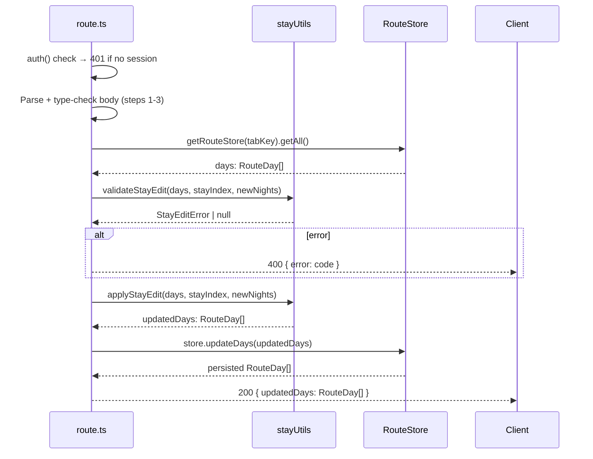

# Backend Low-Level Design — Editable Itinerary Stays

**Feature ID:** editable-itinerary-stays  
**Status:** LLD — ready for implementation  
**Date:** 2026-03-19  
**Refs:** [feature-analysis.md](./feature-analysis.md) · [system-design.md](./system-design.md) · [implementation-plan.md](./implementation-plan.md) · [../backend-lld.md](../backend-lld.md)

---

## 1. Scope & Non-Goals

### In Scope

- Extend `getRouteStore(tabKey)` to support a second, isolated persistence key (`route-test`).
- Extend `POST /api/plan-update` to accept an optional `tabKey` field (backward-compatible default `"route"`).
- Implement `POST /api/stay-update` — new endpoint for stay-boundary mutations.
- Implement `stayUtils.ts` — pure domain functions for stay computation and mutation.
- Backend validation strategy for the new write flow, domain rules, and storage isolation.

### Non-Goals

- Frontend component implementation (`StayEditOverlay`, `ItineraryTab` prop changes).
- Database schema changes (PostgreSQL / Neon is not touched).
- New infrastructure, environment, or deployment changes.
- Multi-user concurrency control (last-write-wins, consistent with existing pattern).
- Resetting test-tab data (out of scope for MVP).
- Re-computation of date/weekday columns after stay edits.

### Assumptions

- `RouteDay[]` data shape is unchanged; nights per stay are derived at read-time, not stored.
- Trip length is fixed at 16 days; total day count must never change.
- Only the immediately following stay absorbs or donates days; no non-consecutive borrowing.

---

## 2. Module Map — Changes Only

```
app/
├── api/
│   ├── plan-update/route.ts   ← MODIFY: accept optional tabKey
│   └── stay-update/route.ts   ← NEW
└── lib/
    ├── routeStore.ts          ← MODIFY: getRouteStore(tabKey) overload
    └── stayUtils.ts           ← NEW: pure stay domain functions
```

No other backend modules are modified.

---

## 3. Persistence — `routeStore.ts` Changes

### 3.1 `TabKey` Type

```
TabKey = 'route' | 'route-test'
VALID_TAB_KEYS: readonly TabKey[] = ['route', 'route-test']
```

This type is the allowlist. Any value not in this set is rejected at the API boundary before `getRouteStore` is called.

### 3.2 `getRouteStore(tabKey)` Signature Change

**Current:** `getRouteStore(): RouteStore`  
**New:** `getRouteStore(tabKey: TabKey = 'route'): RouteStore`

- Backward compatible: callers that omit `tabKey` continue to receive the `'route'` store.
- The `tabKey` is passed into the constructor of whichever backend is selected.
- No singleton/caching of store instances; a new instance is created per call (consistent with existing behaviour).

### 3.3 Key Resolution Table

| tabKey | Backend | Redis key | File path | Env override |
|--------|---------|-----------|-----------|--------------|
| `'route'` | `UpstashRouteStore` | `process.env.ROUTE_REDIS_KEY ?? 'route'` | — | `ROUTE_REDIS_KEY` |
| `'route-test'` | `UpstashRouteStore` | `process.env.ROUTE_TEST_REDIS_KEY ?? 'route-test'` | — | `ROUTE_TEST_REDIS_KEY` |
| `'route'` | `FileRouteStore` | — | `process.env.ROUTE_DATA_PATH ?? 'data/route.json'` | `ROUTE_DATA_PATH` |
| `'route-test'` | `FileRouteStore` | — | `process.env.ROUTE_TEST_DATA_PATH ?? 'data/route-test.json'` | `ROUTE_TEST_DATA_PATH` |

### 3.4 `FileRouteStore` — Auto-Seed for Test Key

When `tabKey = 'route-test'` and `data/route-test.json` does not exist on disk:

```
getAll():
  if !fs.existsSync(filePath):
    seed = fs.readFileSync(ROUTE_DATA_PATH ?? 'data/route.json')
    fs.writeFileSync(filePath, seed)
  return JSON.parse(fs.readFileSync(filePath))
```

- Seed copy is a one-time operation per environment; subsequent reads use the test file directly.
- The original `FileRouteStore.getAll()` (for `'route'`) is **not changed**; it continues to fail-fast if the file is absent (unchanged existing behaviour).

### 3.5 `UpstashRouteStore` — Key Injection

The Redis key is passed to the constructor rather than read from `process.env.ROUTE_REDIS_KEY` inside each method call. The getter `private get redisKey()` is replaced by `private readonly redisKey: string` set in the constructor.

```
constructor(redisKey: string, seedFilePath: string)
  this.redisKey = redisKey
  this.seedFilePath = seedFilePath
```

Seeding logic remains identical; only the key variable changes.

### 3.6 `RouteStore` Interface — New Method

```typescript
interface RouteStore {
  getAll(): Promise<RouteDay[]>
  updatePlan(dayIndex: number, plan: PlanSections): Promise<RouteDay>
  updateTrain(dayIndex: number, train: TrainRoute[]): Promise<RouteDay>
  updateDays(days: RouteDay[]): Promise<RouteDay[]>   // NEW
}
```

`updateDays` writes the entire `RouteDay[]` array atomically. It is the only write path used by `stay-update`.

**`FileRouteStore.updateDays`:** write full array to file, return the written array.  
**`UpstashRouteStore.updateDays`:** `redis.set(this.redisKey, days)`, return `days`.

---

## 4. Domain Logic — `stayUtils.ts`

This module is pure (no I/O, no imports from `routeStore`). All domain invariants live here.

### 4.1 Types

```
Stay {
  overnight: string    // city name
  startIndex: number   // index in RouteDay[] of first day of this stay
  nights: number       // count of consecutive days sharing overnight
}
```

### 4.2 Functions

#### `getStays(days: RouteDay[]): Stay[]`

Groups consecutive `RouteDay` entries by `overnight` value.

```
Invariant: sum of stay.nights for all stays === days.length
Edge: days.length === 0 → return []
Edge: all days same overnight → one Stay with nights === days.length
```

#### `applyStayEdit(days: RouteDay[], stayIndex: number, newNights: number): RouteDay[]`

Returns a **new** `RouteDay[]` with the stay at `stayIndex` set to `newNights` and the immediately following stay adjusted by `±delta`.

```
Preconditions (domain errors thrown if violated — see §4.3):
  stays = getStays(days)
  stayIndex ∈ [0, stays.length - 2]          // not last
  newNights ≥ 1
  nextNewNights = stays[stayIndex+1].nights - (newNights - stays[stayIndex].nights)
  nextNewNights ≥ 1

Postcondition (defence-in-depth assertion):
  sum(result days) === days.length            // day conservation

Mutation:
  delta = newNights - stays[stayIndex].nights
  for days in stay[stayIndex]: no field change (overnight unchanged)
  for days in stay[stayIndex+1]: no field change (overnight unchanged)
  Resize by slicing or extending the day array for each stay:
    stay A covers days[A.startIndex .. A.startIndex + newNights - 1]
    stay B starts at A.startIndex + newNights
    stay B covers newNights[B] = B.nights - delta days
  All RouteDay fields other than array membership are unchanged.
```

> **Key design note:** `RouteDay` has no explicit `nights` field. Stay duration is encoded purely by how many consecutive rows share the same `overnight` value. `applyStayEdit` remaps rows — specifically, it moves the boundary day(s) from one group to the other by updating the `overnight` field of boundary rows.

```
Boundary day reassignment (shrink: delta < 0 — days move from A to B):
  For i in [A.startIndex + newNights .. A.startIndex + oldNights - 1]:
    result[i].overnight = stays[stayIndex+1].overnight

Boundary day reassignment (extend: delta > 0 — days move from B to A):
  For i in [B.startIndex .. B.startIndex + delta - 1]:
    result[i].overnight = stays[stayIndex].overnight
```

#### `validateStayEdit(days: RouteDay[], stayIndex: number, newNights: number): StayEditError | null`

Pure validation only; returns the first `StayEditError` or `null` if valid. Used by the route handler to produce the correct HTTP error code without throwing.

```
Returns StayEditError with code:
  'invalid_stay_index'    if stayIndex < 0 or stayIndex >= stays.length - 1
  'invalid_new_nights'    if newNights < 1 or !Number.isInteger(newNights)
  'next_stay_exhausted'   if next stay would drop below 1 night
```

### 4.3 Domain Error Model

```typescript
type StayEditErrorCode =
  | 'invalid_stay_index'
  | 'invalid_new_nights'
  | 'next_stay_exhausted'
  | 'day_conservation_violated'

class StayEditError extends Error {
  constructor(public readonly code: StayEditErrorCode, message: string)
}
```

`day_conservation_violated` is thrown inside `applyStayEdit` only as a defence-in-depth postcondition check; it should never be reachable by a valid `validateStayEdit → applyStayEdit` call sequence.

---

## 5. API Layer

### 5.1 `POST /api/plan-update` — Modified (Backward Compatible)

**Change:** Accept optional `tabKey` field in request body; default to `'route'`.

#### Updated Request Body

```typescript
{
  tabKey?:   'route' | 'route-test'   // optional; defaults to 'route'
  dayIndex:  number
  plan: {
    morning:   string
    afternoon: string
    evening:   string
  }
}
```

#### Validation (in order)

| Check | Error |
|-------|-------|
| `tabKey` present but not in `['route', 'route-test']` | 400 `"invalid_tab_key"` |
| `dayIndex` not a number | 400 existing message |
| `plan` fields missing or non-string | 400 existing message |
| `dayIndex` out of bounds | 400 existing message |

#### Store Call

```
store = getRouteStore(body.tabKey ?? 'route')
store.updatePlan(body.dayIndex, body.plan)
```

**Backward compatibility:** Existing callers that send `{ dayIndex, plan }` without `tabKey` continue to work; they write to the `'route'` key.

---

### 5.2 `POST /api/stay-update` — New Endpoint

**File:** `app/api/stay-update/route.ts`

#### Auth

```
session = await auth()
if (!session?.user) → 401 { error: 'Unauthorized' }
```

#### Request Body

```typescript
{
  tabKey:    'route' | 'route-test'
  stayIndex: number   // integer ≥ 0; must not be the last stay index
  newNights: number   // integer ≥ 1
}
```

#### Validation (in order — return first error found)

| # | Condition | Status | `error` value |
|---|-----------|--------|---------------|
| 1 | `tabKey` not in `['route', 'route-test']` | 400 | `"invalid_tab_key"` |
| 2 | `stayIndex` not an integer or `< 0` | 400 | `"invalid_stay_index"` |
| 3 | `newNights` not a positive integer | 400 | `"invalid_new_nights"` |
| 4 | `validateStayEdit` returns `StayEditError` | 400 | error code from `StayEditError.code` |

Validation at step 4 runs after loading current `RouteDay[]` from the store (required to compute stay boundaries). Steps 1–3 are pure and run before any I/O.

#### Handler Flow



#### Success Response `200`

```json
{
  "updatedDays": RouteDay[]
}
```

Full array returned so the client can atomically replace its local state.

#### Error Responses

| Status | `error` | Condition |
|--------|---------|-----------|
| 400 | `"invalid_tab_key"` | `tabKey` not in allowlist |
| 400 | `"invalid_stay_index"` | `stayIndex` not integer, `< 0`, or is last stay |
| 400 | `"invalid_new_nights"` | `newNights < 1` or not integer |
| 400 | `"next_stay_exhausted"` | next stay nights after borrow `< 1` |
| 400 | `"day_conservation_violated"` | postcondition failed (defence-in-depth) |
| 401 | `"Unauthorized"` | no session |
| 500 | `"internal_error"` | store read/write failure |

#### Logging

```
info: { user, tabKey, stayIndex, newNights, delta }  '/api/stay-update ok'
warn: { user, tabKey, stayIndex, newNights, code }   '/api/stay-update validation failed'
error: { err, user, tabKey, stayIndex }              '/api/stay-update error'
```

---

## 6. Validation Rules Summary

| Rule | Owner | Enforcement level |
|------|-------|-------------------|
| `tabKey` in `['route', 'route-test']` | route handler | API boundary (before store) |
| `stayIndex` is integer `≥ 0` | route handler | API boundary (before store) |
| `newNights` is integer `≥ 1` | stayUtils `validateStayEdit` | Domain |
| `stayIndex` is not last stay | stayUtils `validateStayEdit` | Domain |
| next stay nights after borrow `≥ 1` | stayUtils `validateStayEdit` | Domain |
| day-conservation sum | stayUtils `applyStayEdit` | Domain (defence-in-depth postcondition) |

FE **must** mirror all domain rules as pre-flight validation to provide instant UI feedback, but the server is authoritative.

---

## 7. Config — New Environment Variables

| Variable | Default | Purpose |
|----------|---------|---------|
| `ROUTE_TEST_REDIS_KEY` | `route-test` | Redis key for the test-tab store (Upstash) |
| `ROUTE_TEST_DATA_PATH` | `data/route-test.json` | File path for the test-tab store (local/dev) |

**CI / E2E note:** Use unique key suffixes per test run (e.g. `route:e2e` / `route-test:e2e`) to prevent test interference. Set via `ROUTE_REDIS_KEY` and `ROUTE_TEST_REDIS_KEY` in the CI environment.

No other env vars are added or changed.

---

## 8. Error Conventions (inherited + additions)

Inherits all conventions from `docs/backend-lld.md`:

| Status | Meaning |
|--------|---------|
| `200` | Success |
| `400` | Missing, invalid, or business-rule-violating request |
| `401` | No session on a write endpoint |
| `500` | Store or unexpected server error |

New `stay-update` uses `{ error: "<code_string>" }` for 400s rather than prose messages, so the client can display localised text based on the code. Existing `plan-update` continues with its current prose error strings.

---

## 9. Backend Validation Strategy

### Tier 0 — Lint & Typecheck

- Linting and type-checking remain the first gate for route contracts, shared types, and config-driven backend selection.
- Exhaustiveness should be preserved for tab-key allowlists and typed stay-edit error codes so unsupported states fail at compile time.

---

### Tier 1 — Domain & Persistence Validation

- Pure domain validation should cover stay grouping, stay-boundary mutations, allowed edit ranges, and the day-conservation invariant.
- Persistence validation should confirm store selection remains isolated by `tabKey`, full-array writes stay atomic at the storage abstraction, and seeded fallback behavior remains correct for both local-file and Redis-backed execution.

---

### Tier 2 — API Contract Validation

- Route-level validation should cover request parsing, auth enforcement, allowlist checks, domain-rule failures, store read/write failures, and success responses for both primary and test-tab write paths.
- Contract coverage should confirm `plan-update` keeps its backward-compatible default behavior while `stay-update` requires an explicit `tabKey` and returns a full-array replacement payload.
- Error coverage should stay aligned with the documented envelope and status mapping in this doc and `docs/backend-lld.md`.

---

### Tier 3 — Cross-End Dependency Notes

Backend constraints that cross-end validation depends on:

| Constraint | Detail |
|------------|--------|
| Isolated route stores | Primary and test-tab data must stay independently seeded and addressed in shared environments |
| Full-array stay response | `/api/stay-update` must continue returning `updatedDays` so the client can replace state atomically |
| Day-count invariant | Valid stay edits must preserve total trip length across reloads and subsequent writes |
| Auth enforcement | Unauthenticated write attempts must continue returning `401` from the server boundary |

---

## 10. Risks & Tradeoffs

| ID | Risk | Mitigation |
|----|------|-----------|
| R-A | `UpstashRouteStore` per-request key resolution was env-global; changing to constructor injection alters the internal design | Validate both storage keys and preserve the public store-selection contract |
| R-B | `FileRouteStore` auto-seed for `'route-test'` adds a filesystem side-effect not present for `'route'` | Guard with existence checks and keep fallback-seeding behavior covered by persistence validation |
| R-C | `applyStayEdit` mutates `overnight` field of boundary days — a non-obvious data mutation | Keep domain validation focused on boundary reassignment and total-day conservation |
| R-D | E2E key collision across parallel CI runs (existing risk, now doubled) | Each run sets unique `ROUTE_REDIS_KEY` + `ROUTE_TEST_REDIS_KEY`; document in CI runbook |
| R-E | `stay-update` returns full `RouteDay[]` (up to 16 rows) per request — heavier payload than `plan-update` (1 row) | Acceptable; 16 rows of RouteDay JSON is < 5 KB |
| R-F | `updateDays` adds a new method to `RouteStore` interface — validation scaffolding must stay in sync with the storage contract | Treat interface drift as a test-fixture maintenance risk during backend changes |

---

## 11. Constraints Frontend & QA Must Honor

1. **`tabKey` is required** on every `POST /api/stay-update` call; the field has no default.  
   (`plan-update` defaults to `'route'` if omitted; `stay-update` does not — presence is mandatory for explicit isolation.)

2. **`stayIndex` semantics:** index into the stays array (derived from `getStays(days)`), **not** a `RouteDay` array index or `dayNum`. FE must compute `stayIndex` from the processed overnight groupings.

3. **Full array replacement:** the server returns `updatedDays: RouteDay[]` — the full 16-element array. The FE must replace its entire local state with this response, not merge individual fields.

4. **Last stay is never editable:** FE must suppress the edit control on the last overnight group. The BE will also reject `stayIndex === stays.length - 1` with 400 `invalid_stay_index`.

5. **Optimistic update snapshot:** FE must capture a snapshot before posting; on any 4xx/5xx it must restore the snapshot. The server does not provide a "before" state in error responses.

6. **E2E key isolation:** CI must set `ROUTE_TEST_REDIS_KEY` (Upstash) or `ROUTE_TEST_DATA_PATH` (file) to a run-unique value to prevent cross-run data contamination in the test-tab store.

7. **Auth state:** `/api/stay-update` returns 401 with `{ error: 'Unauthorized' }` (no session). FE must handle this as a non-retryable error (redirect to login).
