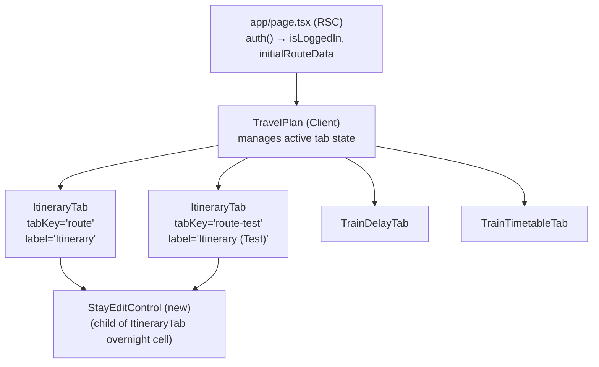
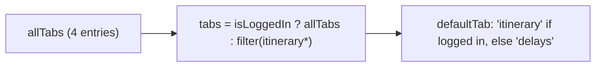
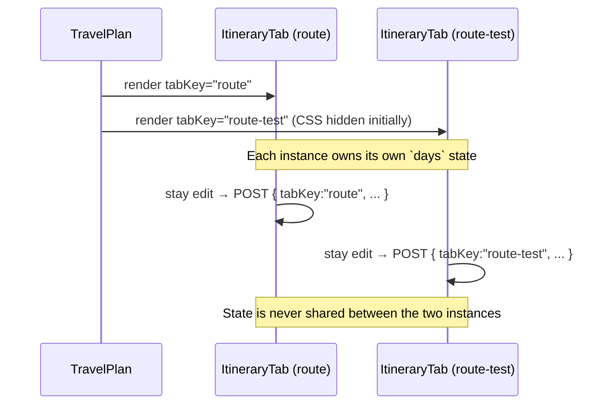

# Frontend Low-Level Design — Editable Itinerary Stays

**Feature:** editable-itinerary-stays  
**Status:** LLD — ready for implementation  
**Date:** 2026-03-19  
**Refs:** [feature-analysis.md](./feature-analysis.md) · [system-design.md](./system-design.md) · [implementation-plan.md](./implementation-plan.md) · [../frontend-lld.md](../frontend-lld.md)

---

## 1. Scope & Non-Goals

### In Scope (FE)
- Extend `TravelPlan` with a second `ItineraryTab` instance carrying `tabKey="route-test"` and label **"Itinerary (Test)"**.
- Add `tabKey` prop to `ItineraryTab`; forward it on every `plan-update` and `stay-update` call.
- New `StayEditControl` component: inline input rendered inside overnight merged cells.
- Optimistic update + snapshot-revert lifecycle for stay edits.
- Client-side pre-flight validation (min 1 night, next stay ≥ 1 night after borrow, last-stay guard).
- Error toast for API failures.
- Keyboard accessibility: Enter to confirm, Escape to cancel.

### Non-Goals (FE)
- Backend persistence, validation, or `stay-update` endpoint implementation.
- Reordering city blocks (drag entire overnight group).
- Adding/removing cities.
- Resetting test-tab data.
- Date/weekday column recomputation after stay edit.

---

## 2. Route Map & Information Architecture

No new routes. Both itinerary tabs live at `/` inside `TravelPlan`.



**Tab ordering (authenticated):**

| Order | Tab ID | Label | Visible to |
|-------|--------|-------|-----------|
| 1 | `itinerary` | Itinerary | Authenticated only |
| 2 | `itinerary-test` | Itinerary (Test) | Authenticated only |
| 3 | `delays` | Train Delays | All |
| 4 | `timetable` | Timetable | All |

---

## 3. Component Breakdown

### 3.1 `TravelPlan` — changes

**Current `Tab` type:** `'itinerary' | 'delays' | 'timetable'`  
**New `Tab` type:** `'itinerary' | 'itinerary-test' | 'delays' | 'timetable'`

Changes:
- Extend `allTabs` array to include `{ id: 'itinerary-test', label: 'Itinerary (Test)' }`.
- Both itinerary entries are hidden from unauthenticated users (same `isLoggedIn` guard).
- Mount a **second** `ItineraryTab` with `tabKey="route-test"`, shown/hidden via `hidden` class (same keep-alive pattern as existing tabs).
- Pass `tabKey` and `label` props into each `ItineraryTab`.
- Default active tab remains `'itinerary'` for authenticated users.



**Props contract (unchanged externally):**

```
TravelPlanProps {
  isLoggedIn?: boolean
  initialRouteData?: RouteDay[]
}
```

**New internal render — itinerary panels:**

```
{isLoggedIn && initialRouteData && (
  <div hidden={tab !== 'itinerary'}>
    <ItineraryTab initialData={initialRouteData} tabKey="route" />
  </div>
)}
{isLoggedIn && initialRouteData && (
  <div hidden={tab !== 'itinerary-test'}>
    <ItineraryTab initialData={initialRouteData} tabKey="route-test" />
  </div>
)}
```

> **Note on `hidden` attribute vs Tailwind class:** The existing tabs use `className={tab === X ? '' : 'hidden'}`. The new panels must use the same pattern for consistency.

---

### 3.2 `ItineraryTab` — changes

**New prop:**

```
interface ItineraryTabProps {
  initialData: RouteDay[]
  tabKey: 'route' | 'route-test'   // NEW — required
}
```

> `tabKey` is a required prop (no default). This is a **breaking change** to the component API, so every direct consumer must supply it explicitly.

**State additions:**

| State variable | Type | Owner | Purpose |
|---|---|---|---|
| `days` | `RouteDay[]` | `ItineraryTab` | Mutable copy of itinerary data; replaces reading `initialData` directly for rendering stays |
| `stayEditingIndex` | `number \| null` | `ItineraryTab` | Which stay (by `stayIndex`) is in edit mode |
| `stayEditSnapshot` | `RouteDay[] \| null` | `ItineraryTab` | Pre-edit snapshot for revert |
| `stayEditError` | `string \| null` | `ItineraryTab` | Global toast message for stay-edit API failure |
| `stayEditSaving` | `boolean` | `ItineraryTab` | Disables confirm button during in-flight request |

**Existing state unchanged:** `planOverrides`, `editingRowId`, `trainSchedules`, `trainJsonModal`, export state, DnD state.

**`plan-update` calls — forward `tabKey`:**

```
body: JSON.stringify({ dayIndex, plan: newPlan, tabKey })
```

This applies to both `handleEditBlur` and `autoSavePlan`.

**Stay computation (derived, not stored):**

`ItineraryTab` derives stays from `days` using a pure helper imported from `app/lib/stayUtils.ts` (BE-owned module, but FE also imports the pure read-only functions):

```
getStays(days: RouteDay[]): Stay[]

interface Stay {
  stayIndex: number        // 0-based index in the stays array
  overnight: string        // city name
  nights: number           // count of consecutive RouteDay rows with this overnight
  firstDayIndex: number    // index of first RouteDay in this stay
  isLast: boolean          // true if no following stay exists
}
```

> **Contract rule for BE:** `getStays` must be a pure, side-effect-free export from `app/lib/stayUtils.ts`. FE imports it for client-side pre-flight validation and optimistic rendering only.

---

### 3.3 `StayEditControl` — new component

A self-contained inline edit widget rendered **inside the overnight merged cell** (`<td rowSpan=...>`).

**Props:**

```
interface StayEditControlProps {
  currentNights: number           // current stay length shown as initial value
  maxAdditionalNights: number     // next stay's current nights - 1 (max we can increase by)
  isLast: boolean                 // if true, renders nothing (null)
  stayIndex: number               // passed to onConfirm for upstream dispatch
  onConfirm: (stayIndex: number, newNights: number) => void
  onCancel: () => void
  isSaving: boolean               // disables confirm while API in flight
}
```

**Rendering rules:**

- `isLast === true` → render `null` (no edit affordance on last stay).
- `isLast === false` → render city name + a pencil icon button.
- When pencil clicked (or `isEditing` state active): render the edit form inline below the city name.

**Internal state:**

| State | Type | Purpose |
|---|---|---|
| `isEditing` | `boolean` | Toggle between read and edit mode |
| `inputValue` | `string` | Controlled numeric input value |
| `validationError` | `string \| null` | Inline field error message |

**Layout (non-editing):**

```
<td rowSpan={n} ...>
  <div class="flex flex-col items-center gap-1">
    <span>{city name}</span>
    <button aria-label="Edit stay duration" ...><Pencil size={14} /></button>
  </div>
</td>
```

**Layout (editing):**

```
<td rowSpan={n} ...>
  <div class="flex flex-col items-center gap-2">
    <span>{city name}</span>
    <div role="group" aria-label="Edit nights for {city}">
      <input
        type="number"
        min="1"
        max={currentNights + maxAdditionalNights}
        value={inputValue}
        aria-label="Nights"
        aria-describedby="stay-edit-error-{stayIndex}"
      />
      {validationError && (
        <span id="stay-edit-error-{stayIndex}" role="alert">{validationError}</span>
      )}
      <div class="flex gap-1">
        <button aria-label="Confirm" disabled={isSaving} ...>✓</button>
        <button aria-label="Cancel" ...>✕</button>
      </div>
    </div>
  </div>
</td>
```

---

## 4. Data Flow

### 4.1 State Ownership

```mermaid
graph TD
    Server["RSC: page.tsx\ninitialRouteData (seed)"]
    IT["ItineraryTab\ndays: RouteDay[] (mutable copy)\nstayEditSnapshot: RouteDay[] | null"]
    SEC["StayEditControl\nisEditing, inputValue, validationError"]
    API["/api/stay-update"]
    Store["Redis / JSON (BE)"]

    Server -->|prop: initialData| IT
    IT -->|derived via getStays()| SEC
    SEC -->|onConfirm(stayIndex, newNights)| IT
    IT -->|optimistic update to days| IT
    IT -->|POST| API
    API --> Store
    Store -->|updatedDays: RouteDay[]| API
    API -->|response| IT
    IT -->|replace days with updatedDays| IT
```

**Key design decision:** `ItineraryTab` owns a `days` state (initialized from `initialData`) so stay edits can be reflected immediately without re-fetching. The server's `updatedDays` response is the authoritative replacement.

### 4.2 `days` State Initialization

`days` is initialized from `initialData` prop on mount:

```
const [days, setDays] = useState<RouteDay[]>(() => initialData)
```

`processedData` (existing) is recomputed from `days` (not `initialData`) so overnight cells reflect post-edit state:

```
const processedData = useMemo(() => processItinerary(days), [days])
```

> **Impact on existing `planOverrides`:** `planOverrides` indexes into `initialData` by `dayIndex`. Since stay edits do not change the total number of days (invariant), `dayIndex` values remain stable and `planOverrides` is unaffected.

### 4.3 Stay Edit — Optimistic Update Flow

```mermaid
sequenceDiagram
    actor U as User
    participant SEC as StayEditControl
    participant IT as ItineraryTab
    participant API as /api/stay-update

    U->>SEC: Clicks pencil, enters newNights, clicks ✓
    SEC->>SEC: Pre-flight validation (client-side)
    alt Validation fails
        SEC->>U: Show inline validationError; no further action
    else Validation passes
        SEC->>IT: onConfirm(stayIndex, newNights)
        IT->>IT: stayEditSnapshot = [...days]
        IT->>IT: Optimistic: days = applyStayEditOptimistic(days, stayIndex, newNights)
        IT->>IT: stayEditSaving = true; stayEditingIndex = null
        IT->>API: POST { tabKey, stayIndex, newNights }
        alt 200 OK
            API-->>IT: { updatedDays: RouteDay[] }
            IT->>IT: days = updatedDays; stayEditSnapshot = null; stayEditSaving = false
        else Error (4xx / 5xx / network)
            API-->>IT: error
            IT->>IT: days = stayEditSnapshot; stayEditSnapshot = null; stayEditSaving = false
            IT->>U: Error toast (stayEditError)
        end
    end
```

### 4.4 Client-Side Pre-flight Validation

Executed inside `StayEditControl` before calling `onConfirm`:

| Check | Condition | Message |
|-------|-----------|---------|
| Min nights | `newNights < 1` | "A stay must be at least 1 night." |
| Next stay not exhausted | `newNights > currentNights + maxAdditionalNights` | "The next stay has no nights left to borrow." |
| No change | `newNights === currentNights` | Silent — no API call; close edit mode |

These mirror the server-side error model defined in `system-design.md §6`. BE is authoritative; FE validation is UX-only.

### 4.5 Optimistic Local Mutation (`applyStayEditOptimistic`)

A pure helper used FE-side for the immediate preview. Mirrors BE `applyStayEdit` semantics:

```
function applyStayEditOptimistic(
  days: RouteDay[],
  stayIndex: number,
  newNights: number
): RouteDay[]
```

- Derives stays from `days` using `getStays`.
- Computes `delta = newNights - stays[stayIndex].nights`.
- Re-assigns `overnight` values across the `delta` boundary days between stay A and stay B.
- Returns a **new** `RouteDay[]` (no mutation).

> This function lives in `app/lib/stayUtils.ts` (shared), exported for FE use. FE must NOT mutate `days` directly.

---

## 5. UX States

### 5.1 `ItineraryTab` State Matrix

| State | `days` | `stayEditingIndex` | `stayEditSaving` | `stayEditError` | Rendered |
|-------|--------|-------------------|-----------------|----------------|---------|
| Idle | server data | `null` | `false` | `null` | Normal table; overnight cells show pencil button |
| Editing | server data | `n` | `false` | `null` | `StayEditControl` for stay `n` shows input form |
| Saving | optimistic | `null` | `true` | `null` | Pencil buttons disabled; overnight cells show optimistic values |
| Save failed | reverted | `null` | `false` | `string` | Toast visible; reverted cell values |
| Save succeeded | `updatedDays` | `null` | `false` | `null` | Cells reflect server response |

### 5.2 `StayEditControl` State Matrix

| State | Trigger | Visual |
|-------|---------|--------|
| Hidden (last stay) | `isLast === true` | Overnight cell: city name only, no pencil |
| Read | default | City name + pencil icon button |
| Editing | Pencil clicked | City name + number input + ✓/✕ buttons |
| Validating | Input change | Inline error below input |
| Saving | `isSaving === true` | ✓ button disabled; input disabled |

### 5.3 Error Toast

- Rendered via the same `ExportSuccessToast` component pattern (but for error). An error `Toast` component must accept a `message` string and auto-dismiss after 5 s.
- Implementation note: use an existing or new small `ErrorToast` component. Reuse `ExportSuccessToast` style with a red/amber color variant, or create `StayEditErrorToast`.
- `stayEditError` drives it; cleared on dismiss or on next successful save.

### 5.4 Empty / Loading

Stay edit has no loading skeleton (edit UI only appears on user interaction). The existing timetable-loading state is unaffected.

---

## 6. Interaction Design & Keyboard Accessibility

### 6.1 Activation

| Method | Result |
|--------|--------|
| Click pencil icon | Opens edit form in `StayEditControl` |
| No double-click on cell | Double-click is reserved for `plan` row editing; do not reuse for stay edit |

### 6.2 Keyboard Flow Inside `StayEditControl`

| Key | Context | Action |
|-----|---------|--------|
| `Tab` | Pencil button focused | Moves to next interactive element (normal tab order) |
| `Enter` | Number input focused | Triggers confirm (same as clicking ✓) |
| `Escape` | Anywhere in edit form | Cancels edit; calls `onCancel`; pencil button regains focus |
| `Tab` | Inside edit group | Cycles: input → ✓ → ✕ → pencil (trap-free; Escape exits) |

### 6.3 Focus Management

- On edit open: `autoFocus` on the number input.
- On edit close (cancel or save): focus returns to the pencil button for that cell. Use a `ref` on the pencil button and call `.focus()` after state update.
- On save failure toast: focus remains on the table; toast is announced via `role="alert"`.

### 6.4 ARIA

| Element | ARIA |
|---------|------|
| Pencil button | `aria-label="Edit stay duration for {city}"` |
| Edit group | `role="group"` with `aria-label="Edit nights for {city}"` |
| Number input | `aria-label="Nights"`, `aria-describedby="stay-edit-error-{stayIndex}"` (when error present) |
| Inline error | `id="stay-edit-error-{stayIndex}"`, `role="alert"` |
| Confirm button | `aria-label="Confirm"`, `disabled` when saving |
| Cancel button | `aria-label="Cancel"` |
| Error toast | `role="alert"` |
| Overnight cell (last stay) | No edit affordance; no special ARIA needed |

---

## 7. Component Interfaces (Contracts)

### 7.1 `TravelPlan` — updated tab definition

```
type Tab = 'itinerary' | 'itinerary-test' | 'delays' | 'timetable'

// allTabs order:
[
  { id: 'itinerary',      label: 'Itinerary' },
  { id: 'itinerary-test', label: 'Itinerary (Test)' },
  { id: 'delays',         label: 'Train Delays' },
  { id: 'timetable',      label: 'Timetable' },
]
```

### 7.2 `ItineraryTab` — updated props

```
interface ItineraryTabProps {
  initialData: RouteDay[]
  tabKey: 'route' | 'route-test'   // required; forwarded to API calls
}
```

Automation hooks should stay stable enough for browser validation, but specific selector names are implementation details and should be maintained with the component code rather than this design doc.

### 7.3 `StayEditControl` — full interface

```
interface StayEditControlProps {
  stayIndex: number
  city: string                     // for aria-labels
  currentNights: number
  maxAdditionalNights: number      // nextStay.nights - 1
  isLast: boolean
  isSaving: boolean
  onConfirm: (stayIndex: number, newNights: number) => void
  onCancel: () => void
}
```

### 7.4 Shared pure functions (from `app/lib/stayUtils.ts`)

FE imports these read-only functions; BE owns the file:

```
getStays(days: RouteDay[]): Stay[]
applyStayEditOptimistic(days: RouteDay[], stayIndex: number, newNights: number): RouteDay[]

interface Stay {
  stayIndex: number
  overnight: string
  nights: number
  firstDayIndex: number
  isLast: boolean
}
```

> **Contract rule for BE/FE:** `getStays` and `applyStayEditOptimistic` must be pure (no I/O, no side effects). The FE LLD depends on these being importable by client components without server-only imports.

### 7.5 `/api/stay-update` — FE call shape

```
POST /api/stay-update
Content-Type: application/json

{ tabKey: 'route' | 'route-test', stayIndex: number, newNights: number }

200 → { updatedDays: RouteDay[] }
4xx → { error: string }
5xx → { error: string }
```

### 7.6 `/api/plan-update` — updated FE call shape

```
POST /api/plan-update
Content-Type: application/json

{ dayIndex: number, plan: PlanSections, tabKey: 'route' | 'route-test' }
```

> Existing calls that omit `tabKey` would default to `"route"` on the server (backward compat). After this feature, all FE calls must include `tabKey` explicitly.

---

## 8. Tab Isolation — FE Responsibilities



**FE isolation guarantees:**
1. Each `ItineraryTab` instance initializes `days` independently from `initialData` (same seed, separate `useState`).
2. `stayEditSnapshot`, `planOverrides`, and all edit state are per-instance.
3. `tabKey` is always included in API request bodies — never inferred from context.
4. No shared global store or context between the two instances.

---

## 9. Validation Strategy

### Tier 0 — Lint & Types

- `next lint` and `tsc --noEmit` run on every PR.
- `ItineraryTabProps.tabKey` remains required so missing consumers fail at compile time.
- `StayEditControlProps` stays fully typed; no `any`.

### Tier 1 — Component behavior

- Validate dual-tab visibility rules for authenticated vs unauthenticated sessions.
- Validate `StayEditControl` read, edit, validation, saving, and error-announcement states.
- Validate `ItineraryTab` forwards `tabKey`, preserves isolation between the two itinerary instances, and keeps stay editing aligned with optimistic UX.

### Tier 2 — Integration flows

- Validate shrink and extend flows against contract-shaped responses.
- Validate revert-on-error behavior for both server and network failures.
- Validate plan-update and stay-update requests always include the correct `tabKey`.
- Validate concurrent-edit prevention while a stay save is in flight.

### Tier 3 — Browser journeys

- Validate the primary authenticated journey across both itinerary tabs.
- Validate keyboard editing, cancel, confirm, and error recovery in the browser.
- Validate selectors and semantics remain stable enough for QA automation without coupling this doc to concrete implementation names.

---

## 10. Accessibility Gaps & Mitigations

The existing FE LLD notes these known gaps:

| Gap | Mitigation for this feature |
|-----|-----------------------------|
| Tab bar lacks `role="tab"` / `role="tabpanel"` | Out of scope for this slice; existing gap unchanged |
| Focus not managed on inline edit exit | `StayEditControl` **must** return focus to pencil button on close (new requirement; not inherited gap) |
| Autocomplete no listbox semantics | Unrelated; unchanged |

`StayEditControl` must not add new focus-management regressions.

---

## 11. Component File Map

```
components/
  TravelPlan.tsx            ← add itinerary-test tab; mount second ItineraryTab
  ItineraryTab.tsx          ← add tabKey prop, days state, stay edit wiring
  StayEditControl.tsx       ← NEW — overnight cell edit widget

app/lib/
  stayUtils.ts              ← NEW (BE-authored) — getStays, applyStayEditOptimistic
```

---

## 12. Decisions Requiring Backend/QA Agreement

| # | Decision | Owner | Status |
|---|----------|-------|--------|
| D-1 | `getStays` and `applyStayEditOptimistic` in `app/lib/stayUtils.ts` must be pure and free of server-only imports so FE can import them in client components | BE must confirm no `server-only` guard on this file | Open |
| D-2 | `POST /api/stay-update` returns full `updatedDays: RouteDay[]` in success body (not just delta). FE replaces entire `days` state atomically | Confirmed in HLD §5.1 | Confirmed |
| D-3 | `POST /api/plan-update` accepts `tabKey` in request body; defaults to `"route"` if absent | Confirmed in HLD §5.2 | Confirmed |
| D-4 | E2E tests use per-run Redis keys (e.g., `route:e2e`, `route-test:e2e`) to prevent cross-tab pollution | QA + BE must configure env | Open (see risk R-D in plan) |
| D-5 | `initialData` prop is the same seed for both `ItineraryTab` instances; test-tab persists independently on server side | Confirmed — FE never merges/shares state | Confirmed |
| D-6 | Error codes `next_stay_exhausted` and `invalid_new_nights` map to specific FE messages (§6.3 of system-design). FE only needs to show a generic toast for any API error; specific messages are client-side pre-flight only | BE must not rely on FE to relay specific error codes to user | Confirmed |

---

## 13. Risks & Tradeoffs

| # | Risk | Tradeoff / Mitigation |
|---|------|-----------------------|
| R-1 | Two `ItineraryTab` instances each run their own `useEffect` for timetable schedule fetching on mount, doubling requests at page load | Both panels are mounted simultaneously (keep-alive pattern). Mitigation: fetch is deduplicated by key; second instance fetches same trains. Long-term: lift schedule fetching to parent. **Accepted for MVP.** |
| R-2 | `days` state initialized from `initialData` prop diverges if `initialData` prop changes (e.g., hot reload). | `useState(() => initialData)` is only initialized once. This is consistent with existing `planOverrides` pattern. Accepted. |
| R-3 | `tabKey` is a new required prop on `ItineraryTab`; all direct consumers must be updated | Tier 0 (TypeScript) will catch missing usage at compile time. |
| R-4 | Making `applyStayEditOptimistic` available to FE requires BE `stayUtils.ts` to avoid server-only imports | Must be confirmed with BE before S3 starts. If blocked, FE re-implements the pure function locally in `components/stayUtils.client.ts`. |
| R-5 | Edit form inside `<td rowSpan>` may overflow cell height in narrow viewports | `StayEditControl` input group uses `flex-col`; cell does not constrain height. Verify in mobile viewport. |

---

## 14. Update to Global Frontend LLD

`docs/frontend-lld.md` requires the following minor updates after this feature ships:

1. **Key UI States table:** Add `ItineraryTab` states: `stay edit mode`, `stay saving`, `stay edit error toast`.
2. **Feature-Specific LLD Addenda table:** Add row for `editable-itinerary-stays → docs/editable-itinerary-stays/frontend-design.md`.
3. **State Ownership section:** Note that `ItineraryTab` now owns a `days` mutable overlay in addition to `planOverrides`.
4. **`TravelPlan` section:** Document four-tab layout and `itinerary-test` tab ID.
