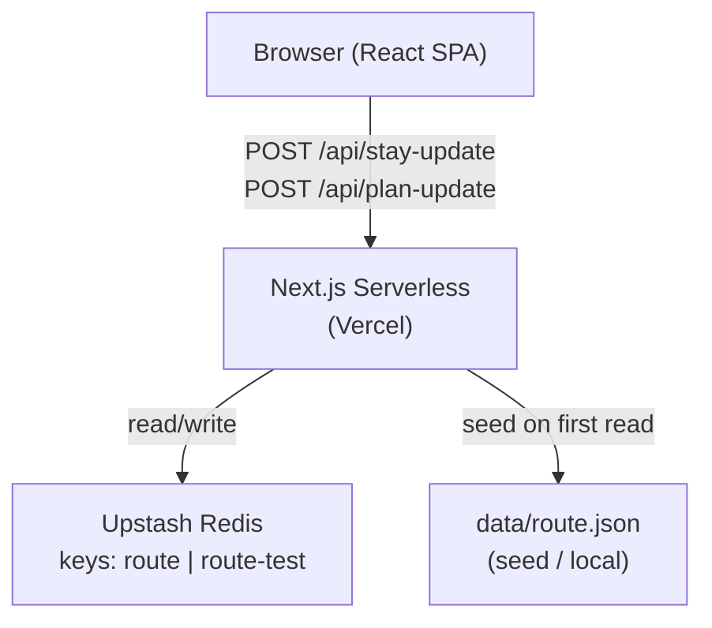
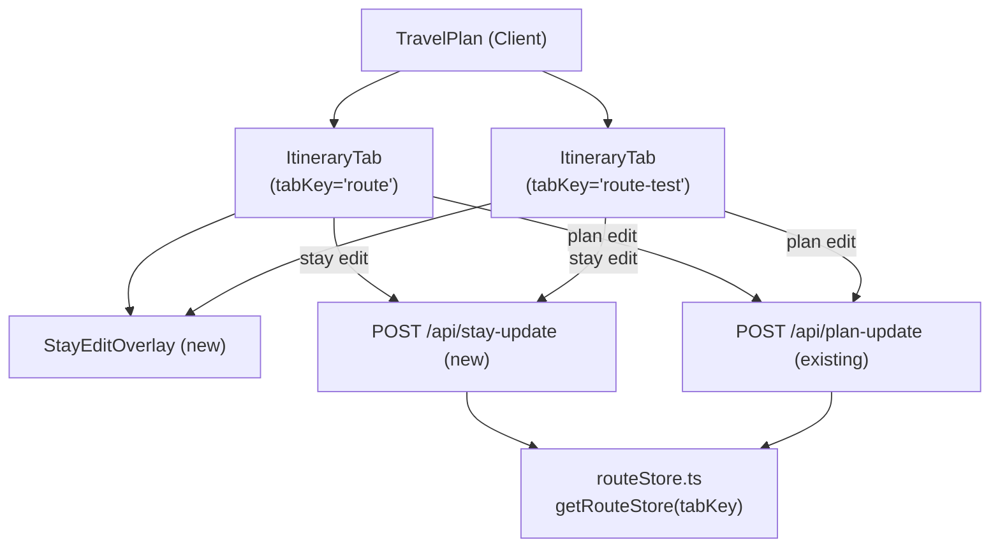
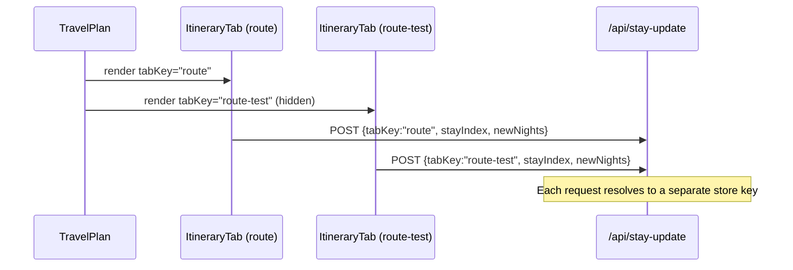
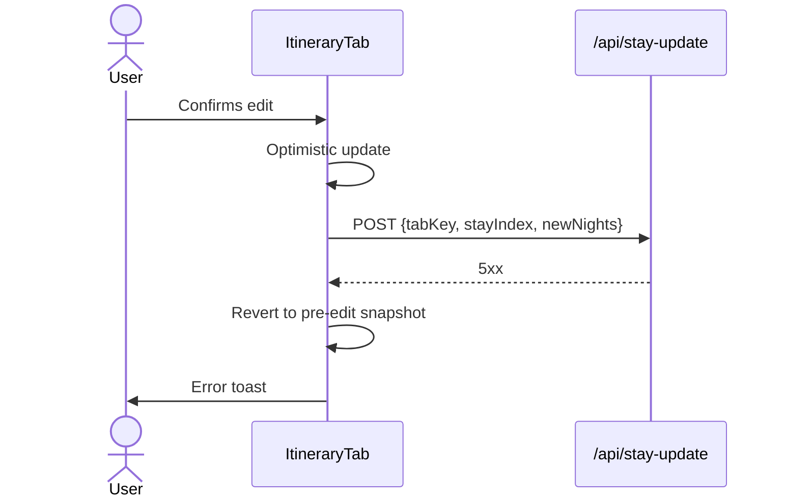

# System Design — Editable Itinerary Stays

**Feature ID:** editable-itinerary-stays  
**Status:** HLD — ready for FE/BE LLD  
**Date:** 2026-03-19  
**Refs:** [feature-analysis.md](./feature-analysis.md) · [system-architecture.md](../high-level-design.md)

---

## 1. Context

The existing Itinerary tab displays `overnight` values as merged, read-only rowspan cells.  
This feature adds:

1. **Itinerary (Test) tab** — identical UI backed by an independent persistence key (`route-test`).
2. **Stay-boundary editing** — user can reassign nights between adjacent city blocks; day-conservation invariant is enforced on the server.

No new microservices, databases, or infrastructure are needed. All changes are within the existing Next.js monolith.

---

## 2. System Context



---

## 3. Component Diagram



**Key decisions:**

- `ItineraryTab` is reused; it receives a new `tabKey: 'route' | 'route-test'` prop — the only differentiator.
- `StayEditOverlay` is a new presentational component (inline or popover; deferred to FE LLD).
- A new API route `/api/stay-update` handles stay-boundary mutations to keep `plan-update` unchanged.

---

## 4. Persistence Model

### 4.1 Dual-Key Strategy

| Context | Key | Seed file | Env var (override) |
|---------|-----|-----------|-------------------|
| Itinerary tab (prod) | `route` | `data/route.json` | `ROUTE_REDIS_KEY` |
| Itinerary (Test) tab (prod) | `route-test` | `data/route.json` | `ROUTE_TEST_REDIS_KEY` |
| Itinerary tab (local) | `data/route.json` | — | `ROUTE_DATA_PATH` |
| Itinerary (Test) tab (local) | `data/route-test.json` | (copy of route.json on seed) | `ROUTE_TEST_DATA_PATH` |

**Local test file:** `FileRouteStore` for the test tab reads/writes `data/route-test.json`. If absent, it seeds by copying `data/route.json` on first read.

**Decision Q1 (from brief):** Redis key for test tab is `route-test` (confirmed).  
**Decision Q2:** Auto-seed from `route.json` on first empty read; no manual reset in MVP.

### 4.2 `RouteStore` Extension

`getRouteStore(tabKey: 'route' | 'route-test')` — new overloaded signature.  
Both backends (`FileRouteStore`, `UpstashRouteStore`) are constructed with an explicit key/path instead of reading env vars inside the constructor. No new class needed; existing classes gain an optional constructor parameter.

### 4.3 Data Shape (unchanged)

`RouteDay[]` — no schema change. Stay duration is derived at read time by counting consecutive `overnight` values. No explicit `nights` field is stored.

```
Stay boundary = transition point where day[i].overnight !== day[i-1].overnight
Stay nights   = count of consecutive RouteDay rows sharing the same overnight value
```

---

## 5. API Contract

### 5.1 New Endpoint — `POST /api/stay-update`

**Auth:** Session required (401 if unauthenticated).

**Request:**
```json
{
  "tabKey":        "route" | "route-test",
  "stayIndex":     2,
  "newNights":     3
}
```

| Field | Type | Validation |
|-------|------|-----------|
| `tabKey` | `"route" \| "route-test"` | Must be one of these two values |
| `stayIndex` | `integer ≥ 0` | Must not be the last stay index |
| `newNights` | `integer ≥ 1` | Must not reduce next stay below 1 night |

**Success response `200`:**
```json
{
  "updatedDays": RouteDay[]
}
```
Returns the full updated array so the client can replace its local state atomically.

**Error responses:**

| Status | `error` field | Condition |
|--------|--------------|-----------|
| 400 | `"invalid_tab_key"` | `tabKey` not in allowed set |
| 400 | `"invalid_stay_index"` | index out of range or last stay |
| 400 | `"invalid_new_nights"` | `newNights < 1` |
| 400 | `"next_stay_exhausted"` | next stay would fall below 1 night |
| 400 | `"day_conservation_violated"` | post-mutation sum ≠ pre-mutation sum (defence-in-depth check) |
| 401 | `"Unauthorized"` | no session |
| 500 | `"internal_error"` | store failure |

### 5.2 Extended Endpoint — `POST /api/plan-update`

Add `tabKey: "route" | "route-test"` to request body (optional; defaults to `"route"` for backward compatibility).

**Updated request body:**
```json
{
  "tabKey":   "route",
  "dayIndex": 0,
  "plan":     { "morning": "...", "afternoon": "...", "evening": "..." }
}
```

> **Contract-first rule:** Update `plan-update` handler only after this shape is agreed. Existing callers omitting `tabKey` continue to work (default `"route"`).

---

## 6. Validation & Error Model

### 6.1 Stay Mutation Invariant

```
oldNights(A) + oldNights(B) === newNights(A) + newNights(B)
where B = stay immediately following A
```

Both FE (pre-flight) and BE (on write) enforce this. BE is authoritative; FE validation is UX-only.

### 6.2 Constraint Table

| Constraint | FE | BE |
|-----------|----|----|
| `newNights ≥ 1` | ✓ | ✓ |
| next stay nights after borrowing `≥ 1` | ✓ | ✓ |
| `stayIndex` is not last stay | ✓ (hide control) | ✓ |
| day-conservation sum check | — | ✓ (defence-in-depth) |
| `tabKey` in allowed set | ✓ | ✓ |

### 6.3 Error Display

| Trigger | User-visible message |
|---------|---------------------|
| `newNights < 1` | "A stay must be at least 1 night." |
| `next_stay_exhausted` | "The next stay has no nights left to borrow." |
| API failure (any 4xx/5xx) | Toast: "Could not save changes. Your edit has been reverted." |

---

## 7. Core Flows

### 7.1 Tab Isolation



### 7.2 Stay Edit — Happy Path

```mermaid
sequenceDiagram
    actor U as User
    participant FE as ItineraryTab
    participant API as /api/stay-update
    participant Store as RouteStore(tabKey)

    U->>FE: Activates stay edit (stayIndex=1, current=4)
    U->>FE: Enters newNights=2, confirms
    FE->>FE: Optimistic update (A=2, B=nextOld+2)
    FE->>API: POST {tabKey, stayIndex:1, newNights:2}
    API->>API: Validate; compute delta; mutate RouteDay[]
    API->>Store: write full array
    Store-->>API: ok
    API-->>FE: {updatedDays: RouteDay[]}
    FE->>FE: Replace state with server response
```

### 7.3 Stay Edit — API Failure



---

## 8. Security & Auth

- Both `/api/stay-update` and `/api/plan-update` (extended) call `auth()` server-side; 401 on no session.
- `tabKey` is validated against the allowlist `['route', 'route-test']` before any store access.
- No cross-tab data leakage: each write resolves to its own Redis key / file path.

---

## 9. Non-Functional Requirements

| NFR | Target | How |
|-----|--------|-----|
| Stay edit p95 latency | ≤ 1 s | Same Upstash pattern as plan-update |
| Day conservation violations | 0 | Server-side invariant check before write |
| Test tab isolation | 0 incidents | Separate key resolved from `tabKey` param |
| Accessibility | Keyboard edit (Enter/Escape) | FE LLD responsibility |
| Backward compat | Existing `plan-update` callers unaffected | `tabKey` defaults to `"route"` |

---

## 10. Impact on Global Architecture

`docs/high-level-design.md` requires two updates (minor):

1. **Component list:** Add `ItineraryTab (Test)` and `StayEditOverlay` to the component diagram.
2. **API Contract table:** Add `POST /api/stay-update` row; annotate `plan-update` with optional `tabKey`.
3. **Data Storage:** Note dual Redis keys `route` / `route-test`.
4. **Known Risks:** Close R-05 partial — test tab adds a second key; original key reset is still out of scope.

No stack, deployment, or auth model changes.
