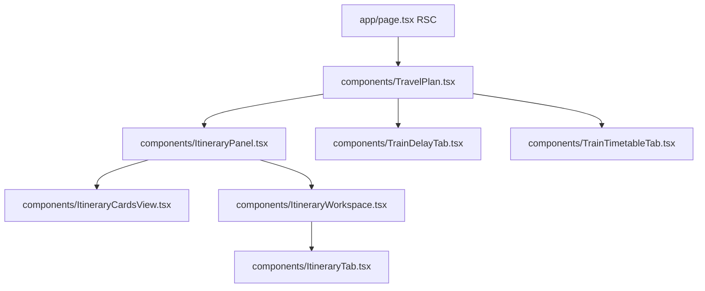

# Frontend Architecture - travel-plan-web-next

**Status:** active baseline
**Date:** 2026-03-25 (updated)
**Refs:** [system-architecture.md](./system-architecture.md) · [frontend-lld.md](./frontend-lld.md) · [`packages/contracts/openapi.yaml`](../packages/contracts/openapi.yaml)

## Scope

- Next.js App Router stays the single frontend surface.
- `app/page.tsx` is the server entry; it bootstraps itinerary workspace/summaries server-side and passes serializable props into client components.
- Client state stays local to feature boundaries; there is no global client store.
- Feature-level frontend LLDs live beside each feature and extend this baseline.

## Route and component map

The Itinerary tab renders `ItineraryPanel`, which switches between `ItineraryCardsView` (no selection) and `ItineraryWorkspace` (itinerary selected). `ItineraryWorkspace` owns workspace-level state (stays, loading, sheet) and mounts `ItineraryTab` for day-level editing.

## State boundaries

| Boundary | Owner | Notes |
|---|---|---|
| Server-loaded auth and itinerary bootstrap | `app/page.tsx` | Itinerary workspace/summaries/error fetched server-side for the URL's `itineraryId` |
| Tab selection and itinerary selection | `components/TravelPlan.tsx` | Panels stay mounted and toggle visibility with `hidden`; `selectedItineraryId` synced with `?itineraryId=` URL param |
| Cards vs detail routing + back guard | `components/ItineraryPanel.tsx` | Shows discard dialog when unsaved edits exist on back navigation |
| Workspace state (stays, loading, sheet) | `components/ItineraryWorkspace.tsx` | Fetches workspace on selection change; owns stay add/edit/reorder mutations |
| Day-level editing | `components/ItineraryTab.tsx` | `days` state + `trainOverrides`/`noteOverrides` write overlays; delegates to `useTrainEditor`, `useNoteEditor`, `useStayEdit`, `useExport`, `useTrainSchedules` hooks |
| Query-driven data widgets | `TrainDelayTab`, `TrainTimetableTab` | Delay and timetable tabs fetch independently on user input |

## Frontend rules

- Preserve the current Next.js + Tailwind component model; prefer local hooks and small presentational components over a new global store.
- Keep itinerary editing contract-first against `packages/contracts/openapi.yaml`.
- Treat server data as authoritative after every write; optimistic UI is allowed only when the rollback path is explicit.
- Keep `ItineraryTab` focused on day-level editing. Workspace-level create/select/edit flows belong in `ItineraryWorkspace` or `ItineraryPanel`.

## UX baseline

- Tabs, dialogs, and drawers must render explicit loading, empty, error, and success states.
- Mobile behavior should prefer stacked headers, full-width primary actions, and bottom-sheet presentation for dense forms.
- Accessibility baseline: semantic buttons/forms, visible focus, dialog focus return, keyboard escape/submit behavior, and error text connected with `aria-describedby`.

## Test baseline

- Tier 0: `npm run lint` and type checks.
- Tier 1: Jest + RTL for component, hook, and pure helper behavior.
- Tier 2: integration coverage for contract-shaped request/response flows with mocked network boundaries.
- Tier 3: Playwright for the highest-risk authenticated journeys.

## Feature addenda

- [`docs/editable-itinerary-stays/frontend-design.md`](./editable-itinerary-stays/frontend-design.md)
- [`docs/itinerary-train-schedule-editor/frontend-design.md`](./itinerary-train-schedule-editor/frontend-design.md)
- [`docs/itinerary-creation-and-stay-planning/frontend-design.md`](./itinerary-creation-and-stay-planning/frontend-design.md)
- [`docs/itinerary-export/LLD.md`](./itinerary-export/LLD.md)
