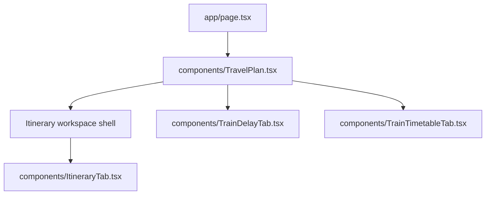

# Frontend Architecture - travel-plan-web-next

**Status:** active baseline  
**Date:** 2026-03-21  
**Refs:** [system-architecture.md](./system-architecture.md) · [frontend-lld.md](./frontend-lld.md) · [`packages/contracts/openapi.yaml`](../packages/contracts/openapi.yaml)

## Scope

- Next.js App Router stays the single frontend surface.
- `app/page.tsx` is the server entry for the authenticated workspace and passes serializable props into client components.
- Client state stays local to feature boundaries; there is no global client store.
- Feature-level frontend LLDs live beside each feature and extend this baseline.

## Route and component map

## State boundaries

| Boundary | Owner | Notes |
|---|---|---|
| Server-loaded route and auth state | `app/page.tsx` | Initial props for the current request |
| Tab selection and workspace chrome | `components/TravelPlan.tsx` | Panels stay mounted and toggle visibility with `hidden` |
| Itinerary editor state | `components/ItineraryTab.tsx` | Owns day overrides, inline editing, drag/drop, train editor, export UI |
| Query-driven data widgets | leaf tabs/components | Delay and timetable tabs fetch independently |

## Frontend rules

- Preserve the current Next.js + Tailwind component model; prefer local hooks and small presentational components over a new global store.
- Keep itinerary editing contract-first against `packages/contracts/openapi.yaml`.
- Treat server data as authoritative after every write; optimistic UI is allowed only when the rollback path is explicit.
- Keep `ItineraryTab` focused on day-level editing. Workspace-level create/select/edit flows should wrap it instead of expanding its responsibility.

## UX baseline

- Tabs, dialogs, and drawers must render explicit loading, empty, error, and success states.
- Mobile behavior should prefer stacked headers, full-width primary actions, and bottom-sheet presentation for dense forms.
- Accessibility baseline: semantic buttons/forms, visible focus, dialog focus return, keyboard escape/submit behavior, and error text connected with `aria-describedby`.

## Test baseline

- Tier 0: `npm run lint` and type checks.
- Tier 1: Jest + RTL for component, hook, and pure helper behavior.
- Tier 2: integration coverage for contract-shaped request/response flows with mocked network boundaries.
- Tier 3: Playwright for the highest-risk authenticated journeys.

## Feature addenda

- [`docs/editable-itinerary-stays/frontend-design.md`](./editable-itinerary-stays/frontend-design.md)
- [`docs/itinerary-train-schedule-editor/frontend-design.md`](./itinerary-train-schedule-editor/frontend-design.md)
- [`docs/itinerary-creation-and-stay-planning/frontend-design.md`](./itinerary-creation-and-stay-planning/frontend-design.md)
