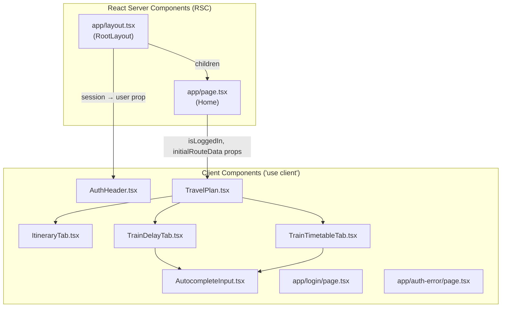
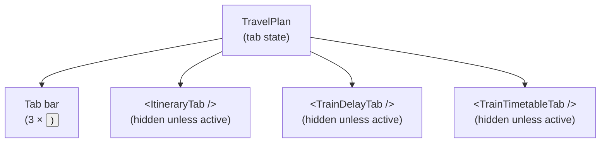
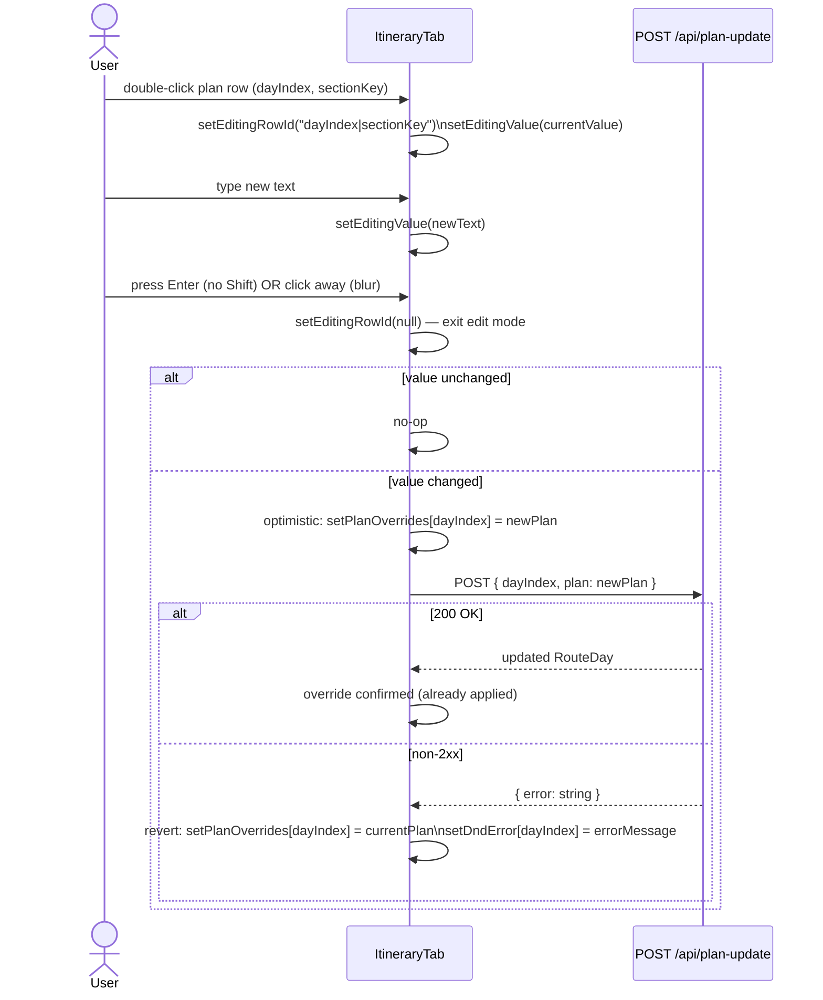
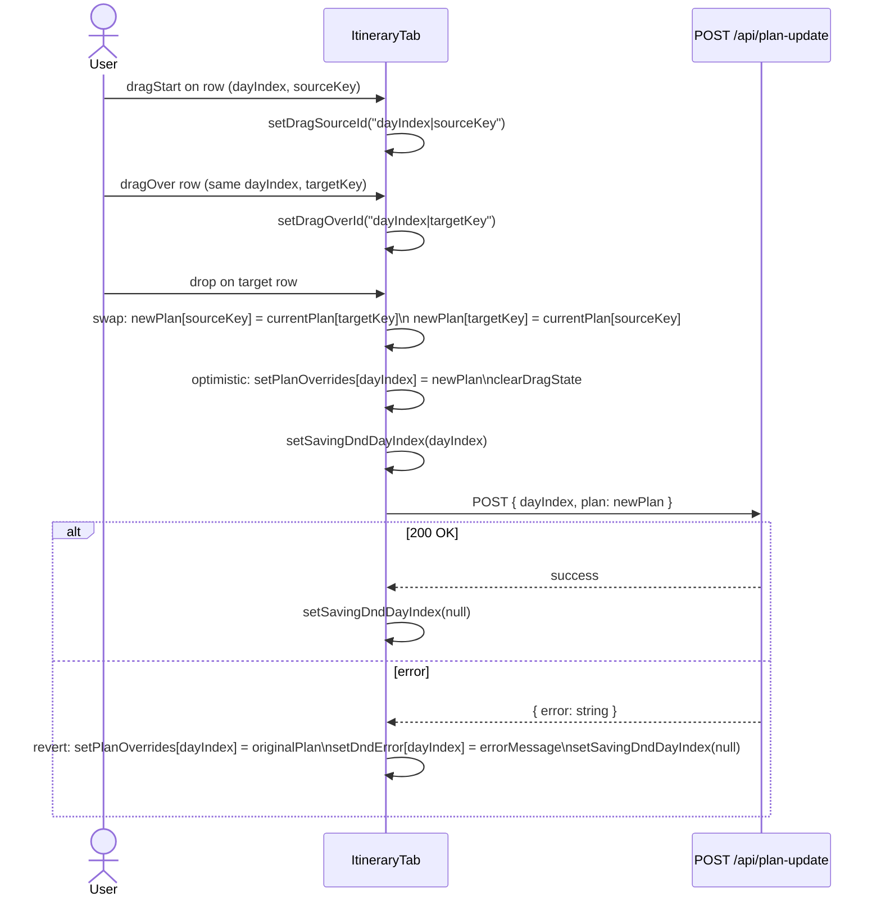
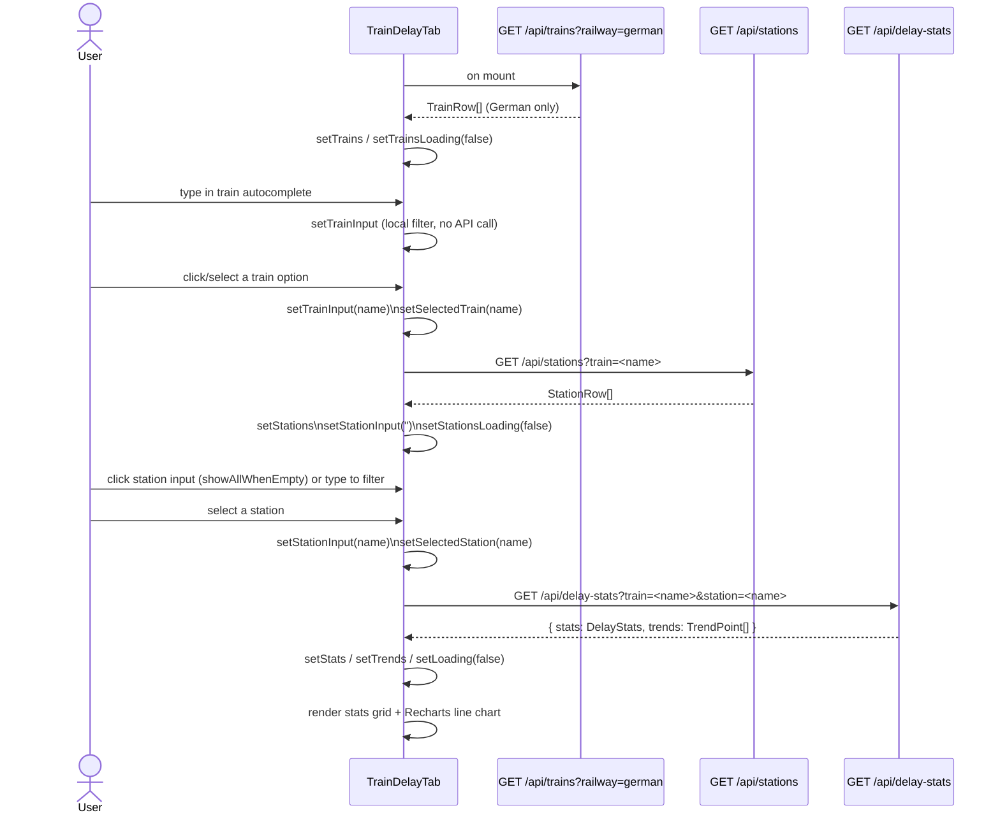
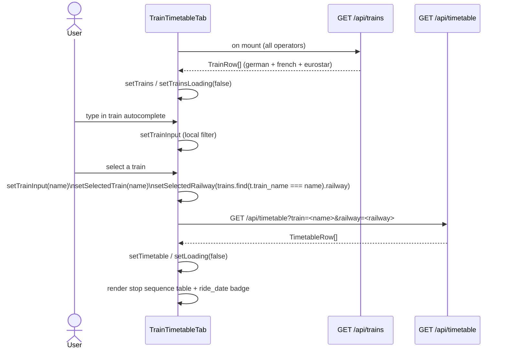
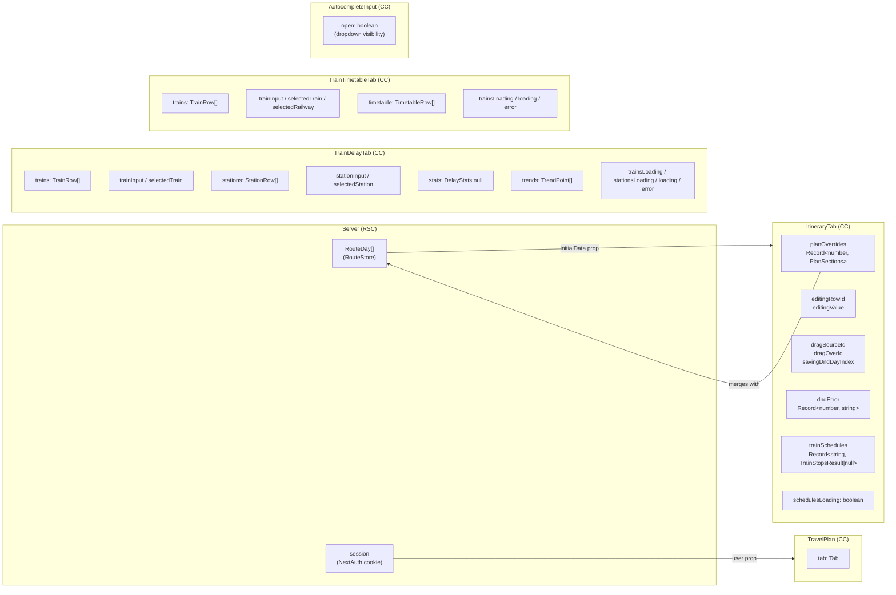

# Frontend Low-Level Design — Travel Plan Web (Next.js)

**Version:** 1.0  
**Date:** 2026-03-13  
**Status:** Baseline (existing system)  
**Author:** Frontend Tech Lead  
**Source:** Derived from `README.md`, `docs/high-level-design.md`, and source-code reading of all components, pages, and lib modules.

---

## Table of Contents

1. [Scope & Non-Goals](#1-scope--non-goals)
2. [Route Map & Information Architecture](#2-route-map--information-architecture)
3. [Client vs Server Component Boundary](#3-client-vs-server-component-boundary)
4. [Component Inventory](#4-component-inventory)
   - 4.1 [RootLayout](#41-rootlayout)
   - 4.2 [AuthHeader](#42-authheader)
   - 4.3 [Home (page.tsx)](#43-home-pagetsx)
   - 4.4 [TravelPlan](#44-travelplan)
   - 4.5 [ItineraryTab](#45-itinerarytab)
   - 4.6 [TrainDelayTab](#46-traindelaytab)
   - 4.7 [TrainTimetableTab](#47-traintimetabletab)
   - 4.8 [AutocompleteInput](#48-autocompleteinput)
   - 4.9 [LoginPage](#49-loginpage)
   - 4.10 [AuthErrorPage](#410-autherrorpage)
5. [Shared Library Modules](#5-shared-library-modules)
6. [Data Flows](#6-data-flows)
   - 6.1 [Page Load](#61-page-load)
   - 6.2 [Itinerary Inline Edit](#62-itinerary-inline-edit)
   - 6.3 [Itinerary Drag-and-Drop Reorder](#63-itinerary-drag-and-drop-reorder)
   - 6.4 [Train Delay Search](#64-train-delay-search)
   - 6.5 [Train Timetable Search](#65-train-timetable-search)
7. [UI States Per Component](#7-ui-states-per-component)
8. [Key Interactions](#8-key-interactions)
   - 8.1 [Tab Switching](#81-tab-switching)
   - 8.2 [Inline Edit](#82-inline-edit)
   - 8.3 [Drag-and-Drop Reorder](#83-drag-and-drop-reorder)
   - 8.4 [Autocomplete](#84-autocomplete)
   - 8.5 [Markdown Rendering in Plan Cells](#85-markdown-rendering-in-plan-cells)
9. [State Ownership Map](#9-state-ownership-map)
10. [Accessibility Notes](#10-accessibility-notes)
11. [Frontend Test Strategy](#11-frontend-test-strategy)
12. [Design Tradeoffs, Risks & Assumptions](#12-design-tradeoffs-risks--assumptions)

---

## 1. Scope & Non-Goals

### Scope

This document describes the **existing** frontend architecture of the Travel Plan Web application as it stands on 2026-03-13. It covers:

- All React components (pages, layouts, tab panels, reusable inputs)
- Server vs client component boundaries (Next.js 15 App Router)
- Data-fetching strategy for each component
- UI state machine per component (loading / empty / error / success)
- All key user interactions (tab switching, inline edit, drag-and-drop, autocomplete)
- Accessibility decisions baked into the existing implementation
- The complete frontend test suite structure

### Non-Goals

- Backend API implementation details (covered by `docs/high-level-design.md`)
- Deployment and infrastructure (covered by HLD §10)
- New feature design — this is a documentation pass, not a change proposal

### Assumptions

- The app is single-tenant: one authenticated Google user can edit the itinerary; all other visitors get a read-only view of train data.
- All state management is local React `useState` — there is no global state library (no Redux, Zustand, etc.).
- Server-side data fetching occurs only in RSC pages/layouts; client components fetch via the browser `fetch()` API against Next.js API routes.

---

## 2. Route Map & Information Architecture

```
/                   → Home page (RSC): renders TravelPlan with itinerary data if authenticated
/login              → Sign-in page (Client): Google OAuth button
/auth-error         → Access denied page (Client): countdown redirect to /
/api/...            → Next.js API routes (server-only, not navigated to by UI)
```

### Tab-level Navigation (within `/`)

The single-page application uses an in-memory tab system rather than separate routes. All three tabs are mounted simultaneously; only visibility is toggled:

| Tab ID | Label | Visibility Condition |
|---|---|---|
| `itinerary` | Itinerary | `isLoggedIn === true` AND `initialRouteData` present |
| `delays` | Train Delays | Always |
| `timetable` | Timetable | Always |

Default active tab: `itinerary` when logged in; `delays` when not logged in.

---

## 3. Client vs Server Component Boundary



**Rules:**
- RSC components (`layout.tsx`, `page.tsx`) call `auth()` server-side; they never import `next-auth/react`.
- Client components call `signIn`/`signOut` from `next-auth/react`; they never call `auth()`.
- The RSC→Client boundary is at `TravelPlan` and `AuthHeader`. Props crossing this boundary must be serialisable (primitives, plain objects/arrays — satisfied by `RouteDay[]` and `boolean`).

---

## 4. Component Inventory

### 4.1 RootLayout

**File:** `app/layout.tsx`  
**Type:** React Server Component (async)

| Concern | Detail |
|---|---|
| **Responsibility** | HTML shell (`<html lang="zh">`, `<body>`), `globals.css` import, top-right `AuthHeader` injection |
| **Server action** | Calls `auth()` to read the NextAuth session cookie server-side |
| **Props (incoming)** | `children: React.ReactNode` |
| **Props (to children)** | Passes `session?.user` to `AuthHeader`; renders `children` in `<body>` |
| **State** | None (stateless RSC) |
| **Side-effects** | Session read on every request |

---

### 4.2 AuthHeader

**File:** `components/AuthHeader.tsx`  
**Type:** Client Component (`'use client'`)

#### Props

```typescript
interface AuthHeaderProps {
  user?: { name?: string | null; email?: string | null; image?: string | null } | null
}
```

| Prop | Type | Required | Description |
|---|---|---|---|
| `user` | `SessionUser \| null \| undefined` | No | Passed down from `RootLayout`. `null`/`undefined` → unauthenticated state |

#### State

None — stateless presentational component.

#### Behaviour

| Condition | Render |
|---|---|
| `user` is falsy | Anchor `<a href="/login">` with `LogIn` icon and "Login" text |
| `user` is truthy | User display name/email with `User` icon + "Logout" `<button>` |

**Interactions:**
- "Logout" button calls `signOut({ callbackUrl: '/' })` from `next-auth/react` — clears session cookie and redirects to `/`.

---

### 4.3 Home (page.tsx)

**File:** `app/page.tsx`  
**Type:** React Server Component (async)

#### Responsibilities

1. Calls `auth()` → derives `isLoggedIn` boolean.
2. If authenticated: calls `getRouteStore().getAll()` → `RouteDay[]`.
3. Renders `<TravelPlan isLoggedIn={...} initialRouteData={...} />` inside a `<main>` with `max-w-6xl` constraints.

#### Props passed to TravelPlan

| Prop | Source | When present |
|---|---|---|
| `isLoggedIn` | `!!session?.user` | Always |
| `initialRouteData` | `getRouteStore().getAll()` | Only when authenticated |

---

### 4.4 TravelPlan

**File:** `components/TravelPlan.tsx`  
**Type:** Client Component (`'use client'`)

#### Props

```typescript
interface TravelPlanProps {
  isLoggedIn?: boolean       // default: false
  initialRouteData?: RouteDay[]
}
```

#### State

```typescript
const [tab, setTab] = useState<Tab>(defaultTab)
// Tab = 'itinerary' | 'delays' | 'timetable'
// defaultTab = isLoggedIn ? 'itinerary' : 'delays'
```

#### Behaviour

- **Tab list**: when `isLoggedIn` is `true`, all three tabs are shown; when `false`, the `itinerary` tab is filtered out.
- **Visibility**: all three tab panels are always mounted in the DOM. Tailwind's `hidden` class toggles which panel is visible. This **preserves component state** (loaded data, selections) across tab switches.
- `ItineraryTab` is only rendered when `isLoggedIn && initialRouteData` are both truthy.

#### Component Composition Diagram



---

### 4.5 ItineraryTab

**File:** `components/ItineraryTab.tsx`  
**Type:** Client Component (`'use client'`)

#### Props

```typescript
interface ItineraryTabProps {
  initialData: RouteDay[]
}
```

#### State

| State var | Type | Purpose |
|---|---|---|
| `trainSchedules` | `Record<string, TrainStopsResult \| null>` | Cache of fetched timetable results, keyed by `"trainId\|start\|end"` |
| `schedulesLoading` | `boolean` | True while the initial batch of timetable fetches is in flight |
| `planOverrides` | `Record<number, PlanSections>` | Client-side overlay for plan edits, keyed by `dayIndex`; merges with `initialData` on render |
| `editingRowId` | `string \| null` | Identifies the row currently in edit mode as `"dayIndex\|sectionKey"` |
| `editingValue` | `string` | Live-controlled value of the active `<textarea>` |
| `dragSourceId` | `string \| null` | Identifies the row being dragged as `"dayIndex\|sectionKey"` |
| `dragOverId` | `string \| null` | Identifies the row currently hovered during drag as `"dayIndex\|sectionKey"` |
| `savingDndDayIndex` | `number \| null` | Day index whose DnD save is in-flight; disables dragging on that day |
| `dndError` | `Record<number, string>` | Per-day inline error message (shown above plan rows) |

#### Derived state

```typescript
const processedData = useMemo(() => processItinerary(initialData), [initialData])
// processItinerary: computes overnightRowSpan for each day
```

#### Initial data fetch (useEffect on mount)

On mount, `ItineraryTab` loops through `initialData` and, for each `TrainRoute` that has both `start` and `end` fields (indicating a DB-queryable train), fetches `GET /api/timetable?train=<normalizedId>`. Results are stored in `trainSchedules`. Station matching uses `findMatchingStation()` from `app/lib/itinerary.ts`.

Non-DB trains (no `start`/`end`) are displayed as the raw `train_id` string without any API call.

#### Plan resolution (effective plan per day)

```
effectivePlan[dayIndex] = planOverrides[dayIndex] ?? initialData[dayIndex].plan
```

The `planOverrides` map is the client-side write layer; it starts empty and accumulates changes from both inline edits and drag-and-drop reorders.

---

### 4.6 TrainDelayTab

**File:** `components/TrainDelayTab.tsx`  
**Type:** Client Component (`'use client'`)

#### Props

None — fully self-contained.

#### State

| State var | Type | Purpose |
|---|---|---|
| `trains` | `TrainRow[]` | German train list from `/api/trains?railway=german` |
| `trainInput` | `string` | Controlled value of the train autocomplete input |
| `selectedTrain` | `string` | Committed train name (set on selection; cleared on text change) |
| `stations` | `StationRow[]` | Stations for the selected train from `/api/stations` |
| `stationInput` | `string` | Controlled value of the station autocomplete input |
| `selectedStation` | `string` | Committed station name |
| `stats` | `DelayStats \| null` | Delay statistics from `/api/delay-stats` |
| `trends` | `TrendPoint[]` | Daily trend series from `/api/delay-stats` |
| `trainsLoading` | `boolean` | True while train list is being fetched on mount |
| `stationsLoading` | `boolean` | True while station list is being fetched after train selection |
| `loading` | `boolean` | True while delay stats are being fetched |
| `error` | `string \| null` | Single error message (last error wins) |

#### Three `useEffect` hooks

1. **Mount** — `[]` dependency: fetches `/api/trains?railway=german`.
2. **Train selection** — `[selectedTrain]` dependency: fetches `/api/stations?train=<name>`; clears station state when `selectedTrain` is empty.
3. **Train + station selection** — `[selectedTrain, selectedStation]` dependency: fetches `/api/delay-stats?train=<name>&station=<name>`; clears stats when either is empty.

---

### 4.7 TrainTimetableTab

**File:** `components/TrainTimetableTab.tsx`  
**Type:** Client Component (`'use client'`)

#### Props

None — fully self-contained.

#### State

| State var | Type | Purpose |
|---|---|---|
| `trains` | `TrainRow[]` | All operators' train list from `/api/trains` (no `railway` filter) |
| `trainInput` | `string` | Controlled value of the train autocomplete input |
| `selectedTrain` | `string` | Committed train name |
| `selectedRailway` | `string` | Railway operator auto-detected from `TrainRow.railway` on selection |
| `timetable` | `TimetableRow[]` | Stop sequence from `/api/timetable` |
| `trainsLoading` | `boolean` | True while the combined train list is loading |
| `loading` | `boolean` | True while timetable is loading |
| `error` | `string \| null` | Error message |

#### Two `useEffect` hooks

1. **Mount** — `[]` dependency: fetches `/api/trains` (all operators).
2. **Train selection** — `[selectedTrain, selectedRailway]` dependency: fetches `/api/timetable?train=<name>&railway=<railway>`.

**Railway auto-detection:** When the user selects a train from the autocomplete, `handleTrainSelect` looks up the matching `TrainRow.railway` value and stores it in `selectedRailway`. This eliminates any manual "select operator" UI — the correct backend data source is inferred automatically.

---

### 4.8 AutocompleteInput

**File:** `components/AutocompleteInput.tsx`  
**Type:** Client Component (`'use client'`)

#### Props

```typescript
interface AutocompleteInputProps {
  id: string                        // for <label htmlFor="…"> association
  value: string                     // controlled value (parent owns)
  onChange: (text: string) => void  // called on every keystroke
  onSelect: (opt: string) => void   // called when an option is chosen
  options: string[]                 // full unfiltered option list
  placeholder?: string
  disabled?: boolean
  showAllWhenEmpty?: boolean        // show full list when value === '' (station input)
}
```

#### State

```typescript
const [open, setOpen] = useState(false)
const containerRef = useRef<HTMLDivElement>(null)
```

#### Filtering logic

```
filtered =
  value !== ''
    ? options.filter(opt => opt.toLowerCase().includes(value.toLowerCase())).slice(0, 50)
    : showAllWhenEmpty
      ? options.slice(0, 50)
      : []
```

- Maximum 50 options rendered to avoid DOM bloat.
- Case-insensitive substring match.

#### Dropdown lifecycle

| Event | Action |
|---|---|
| `onFocus` of input | `setOpen(true)` |
| `onChange` of input | `setOpen(true)` + calls `onChange` |
| `onMouseDown` on list item | `handleSelect(opt)` → `setOpen(false)` |
| `mousedown` outside container | `setOpen(false)` via `document.addEventListener` cleanup |

> **Critical design note:** List items use `onMouseDown` (not `onClick`) so the event fires *before* the input's `onBlur`. This prevents the dropdown from closing before the selection is registered.

---

### 4.9 LoginPage

**File:** `app/login/page.tsx`  
**Type:** Client Component (`'use client'`)

Stateless single-screen: centred card with "Sign in with Google" button. Calls `signIn('google', { callbackUrl: '/' })` on click. No error handling at this level — auth errors are redirected to `/auth-error` by NextAuth.

---

### 4.10 AuthErrorPage

**File:** `app/auth-error/page.tsx`  
**Type:** Client Component (`'use client'`)

#### State

```typescript
const [countdown, setCountdown] = useState(5)
```

Uses `useEffect` with `countdown` as dependency to decrement a 1-second timer. When `countdown <= 0`, calls `router.push('/')`. Renders the remaining seconds in the copy. Cleanup: `clearTimeout` on every re-render to prevent memory leaks.

---

## 5. Shared Library Modules

These are **pure TypeScript modules** (no React) imported by both server and client code. They contain types and utility functions only — no side effects.

### `app/lib/itinerary.ts`

| Export | Kind | Description |
|---|---|---|
| `RouteDay` | Interface | Raw day shape from `route.json` / Redis |
| `ProcessedDay` | Interface | `RouteDay` + `overnightRowSpan: number` |
| `PlanSections` | Interface | `{ morning, afternoon, evening: string }` |
| `TrainRoute` | Interface | `{ train_id, start?, end? }` |
| `getOvernightColor(location)` | Function | Deterministic HSL pastel from string hash |
| `processItinerary(data)` | Function | Computes rowspan values for overnight location cells |
| `normalizeTrainId(trainId)` | Function | `"ICE123"` → `"ICE 123"` (adds space between prefix and number) |
| `findMatchingStation(stations, cityName, side)` | Function | Alias-map lookup; returns first match for `'from'`, last for `'to'` |
| `CITY_ALIASES` | Constant | Map of English city names to station name variants (e.g. `cologne → ['köln', 'koeln', 'cologne']`) |

### `app/lib/trainDelay.ts`

| Export | Kind | Description |
|---|---|---|
| `DelayStats` | Interface | Seven numeric fields: `total_stops`, `avg_delay`, `p50`, `p75`, `p90`, `p95`, `max_delay` |
| `TrendPoint` | Interface | `{ day: string, avg_delay: number, stops: number }` |
| `TrainRow` | Interface | `{ train_name, train_type, railway: 'german' \| 'french' \| 'eurostar' }` |
| `StationRow` | Interface | `{ station_name, station_num }` |
| `StatItem` | Interface | `{ label, value, unit }` — display shape for stats grid |
| `formatDay(day)` | Function | `"2025-01-10T00:00:00"` → `"1/10"` (M/D) for chart X-axis ticks |
| `buildStatItems(stats)` | Function | Maps `DelayStats` → `StatItem[]` for the stats grid |

### `app/lib/trainTimetable.ts`

| Export | Kind | Description |
|---|---|---|
| `TimetableRow` | Interface | `{ station_name, station_num, arrival_planned_time, departure_planned_time, ride_date }` |
| `formatTime(ts)` | Function | Normalises `"HH:MM:SS"` or `"YYYY-MM-DD HH:MM:SS"` → `"HH:MM"`; returns `"—"` for `null` |

### `app/lib/markdown.ts`

| Export | Kind | Description |
|---|---|---|
| `renderMarkdown(value)` | Function | Converts a plain-text plan value with inline markdown (bold, italic, code, strikethrough, newlines) to a React node tree |

---

## 6. Data Flows

### 6.1 Page Load

```mermaid
sequenceDiagram
  actor User
  participant Browser
  participant Layout as layout.tsx (RSC)
  participant Page as page.tsx (RSC)
  participant Auth as auth()
  participant Store as RouteStore
  participant TravelPlan as TravelPlan (CC)

  User->>Browser: GET /
  Browser->>Layout: HTTP request
  Layout->>Auth: auth() — read session
  Auth-->>Layout: session
  Layout->>Page: render children
  Page->>Auth: auth() — read session (independent call)
  Auth-->>Page: session
  alt Authenticated
    Page->>Store: getRouteStore().getAll()
    Store-->>Page: RouteDay[]
    Page-->>Browser: SSR HTML with itinerary data + TravelPlan(isLoggedIn=true)
  else Not authenticated
    Page-->>Browser: SSR HTML with TravelPlan(isLoggedIn=false)
  end
  Browser->>TravelPlan: Hydrate; React takes over
```

> **Note:** `auth()` is called twice — once in `layout.tsx` for `AuthHeader` and once in `page.tsx` for route data gating. NextAuth v5 caches the session within a request, so this is two reads but only one cookie parse.

---

### 6.2 Itinerary Inline Edit



---

### 6.3 Itinerary Drag-and-Drop Reorder



Cross-day drops are silently rejected (`sourceDayIndex !== targetDayIndex` → early return).

---

### 6.4 Train Delay Search



---

### 6.5 Train Timetable Search



---

## 7. UI States Per Component

### TravelPlan

| State | Render |
|---|---|
| `isLoggedIn=false` | Two tabs visible: "Train Delays", "Timetable". Default tab: "Train Delays" |
| `isLoggedIn=true` | Three tabs visible; default: "Itinerary" |

### ItineraryTab

| State | Trigger | Render |
|---|---|---|
| **Loading (schedules)** | `schedulesLoading=true` AND train has `start`+`end` | Inline spinner (`role="status"`) in Train Schedule cell for each pending entry |
| **Success (schedule)** | `trainSchedules[key]` is populated | `"TrainId: FromStation HH:MM → ToStation HH:MM"` |
| **Empty (schedule)** | `trainSchedules[key] === null` | Raw `train_id` string only (no times) |
| **No train** | `day.train.length === 0` | `"—"` italic placeholder |
| **Editing row** | `editingRowId === rowId` | `<textarea autoFocus>` replacing display div |
| **Saving DnD** | `savingDndDayIndex === dayIndex` | Row `cursor-wait`, `draggable=false` |
| **Error (edit/DnD)** | `dndError[dayIndex]` set | Red text above plan rows for that day |

### TrainDelayTab

| State | Trigger | Render |
|---|---|---|
| **Loading (trains)** | `trainsLoading=true` | Full-row spinner with "Loading trains…" |
| **Loading (stations)** | `stationsLoading=true` | Inline spinner next to Station label |
| **Loading (stats)** | `loading=true` | Full-row spinner with "Loading stats…" |
| **Error** | `error` string set | Red `<p>` error message |
| **Station disabled** | `!selectedTrain \|\| stations.length === 0` | Station `AutocompleteInput` is `disabled` |
| **Empty (no data)** | `!loading && !stats && selectedTrain && selectedStation` | `"No data found for this train/station combination in the last 3 months."` |
| **Success** | `!loading && stats` | Stats grid (7 cards) + Recharts line chart |

### TrainTimetableTab

| State | Trigger | Render |
|---|---|---|
| **Loading (trains)** | `trainsLoading=true` | Full-row spinner with "Loading trains…" |
| **Loading (timetable)** | `loading=true` | Full-row spinner with "Loading timetable…" |
| **Error** | `error` string set | Red `<p>` error message |
| **Empty (no timetable)** | `!loading && timetable.length === 0 && selectedTrain` | `"No timetable found for this train."` |
| **Success** | `!loading && timetable.length > 0` | Table with stop sequence + optional `ride_date` badge |

### AutocompleteInput

| State | Trigger | Render |
|---|---|---|
| **Closed (no value)** | `value === '' && !showAllWhenEmpty` | Input only, no dropdown |
| **Open (filtering)** | `value !== ''` OR (`showAllWhenEmpty` AND focused) | Dropdown `<ul>` with up to 50 filtered options |
| **Disabled** | `disabled=true` | Input grayed out; dropdown never opens |
| **Closed (outside click)** | `mousedown` outside container | Dropdown dismissed |

### LoginPage

Single state: form card with "Sign in with Google" button. No loading state (redirect is immediate).

### AuthErrorPage

| State | Render |
|---|---|
| `countdown > 0` | "Redirecting to home in N second(s)…" countdown |
| `countdown === 0` | `router.push('/')` triggered |

---

## 8. Key Interactions

### 8.1 Tab Switching

- **Mechanism:** `onClick` on `<button>` in tab bar → `setTab(id)`.
- **Persistence:** All three tab panels remain mounted (no unmount/remount). Visibility is toggled via `hidden` Tailwind class. This means:
  - `TrainDelayTab` and `TrainTimetableTab` retain their `trains`, `selectedTrain`, `stations`, `selectedStation`, `stats`, `timetable` state across switches.
  - `ItineraryTab` retains `planOverrides` and `trainSchedules` across switches.
- **Auth gating:** The `Itinerary` tab button is only rendered when `isLoggedIn` is true. The panel itself is conditionally rendered (`isLoggedIn && initialRouteData`).

---

### 8.2 Inline Edit

**Trigger:** `onDoubleClick` on a plan row `<div>` (`data-testid="plan-row-{dayIndex}-{sectionKey}"`).

**State machine:**

```
DISPLAY  ──dblClick──→  EDITING  ──blur / Enter──→  SAVING  ──200──→  DISPLAY(confirmed)
                                                             └─non-2xx──→  DISPLAY(reverted) + ERROR
```

**Implementation details:**

| Aspect | Detail |
|---|---|
| Edit element | `<textarea rows={2}>` (supports multi-line input) |
| Commit on Enter | `onKeyDown`: if `key === 'Enter' && !shiftKey` → `e.currentTarget.blur()` |
| Commit on blur | `handleEditBlur` compares `editingValue` against current plan; no-ops if unchanged |
| Single-row constraint | `editingRowId` is a single string; setting it for a new row automatically exits the previous row |
| Optimistic update | `planOverrides[dayIndex]` is set with new value immediately on blur (before API response) |
| Revert | On API error, `planOverrides[dayIndex]` is reset to `currentPlan`; `dndError[dayIndex]` is set with error message |
| Drag handle | Hidden while row is in edit mode (`editingRowId === rowId` → the display div is not rendered) |

---

### 8.3 Drag-and-Drop Reorder

**Mechanism:** Native HTML5 drag-and-drop API (`draggable`, `onDragStart`, `onDragOver`, `onDrop`, `onDragEnd`).

**Constraints:**
- Drag is only allowed within the same day (`sourceDayIndex === targetDayIndex`).
- The time-of-day icon (`Sunrise`, `Sun`, `Moon`) has `data-no-drag="true"` and the drag start handler checks for it (`if (e.target as HTMLElement).dataset.noDrag → e.preventDefault()`), making icons non-initiating.
- `draggable` attribute is `false` while a save is in-flight for that day (`savingDndDayIndex === dayIndex`).

**Visual feedback:**
- Source row: `opacity-40` class added via `dragSourceId === rowId`.
- Target row (same day only): `ring-2 ring-blue-400 bg-blue-50` class added via `dragOverId === rowId`.
- `dragEnd` (aborted drag): both `dragSourceId` and `dragOverId` cleared.

**Swap logic:**

```typescript
newPlan = {
  ...currentPlan,
  [sourceKey]: currentPlan[targetKey],
  [targetKey]: currentPlan[sourceKey],
}
```

Applied optimistically; reverting swaps back to `originalPlan` on API failure.

---

### 8.4 Autocomplete

**Two usage patterns:**

| Pattern | Component | `showAllWhenEmpty` | `disabled` logic |
|---|---|---|---|
| Train search (delay tab) | `TrainDelayTab` | No | Never disabled |
| Station search (delay tab) | `TrainDelayTab` | Yes | Disabled until `selectedTrain` is set AND `stations.length > 0` |
| Train search (timetable tab) | `TrainTimetableTab` | No | Never disabled |

**Input/select split pattern:**

Both delay and timetable tabs maintain separate `input` (text buffer) and `selected` (committed value) state variables per autocomplete:

```
trainInput  ← controlled by AutocompleteInput.value
selectedTrain ← set only on option selection (onSelect); cleared when trainInput changes away from selectedTrain
```

This prevents spurious API calls: API fetches are triggered only when `selectedTrain` (not `trainInput`) is set.

---

### 8.5 Markdown Rendering in Plan Cells

Plan cell content is rendered through `renderMarkdown(value)` from `app/lib/markdown.ts`. Supported syntax in display mode:

| Syntax | Output |
|---|---|
| `**text**` | `<strong>text</strong>` |
| `*text*` | `<em>text</em>` |
| `` `text` `` | `<code>text</code>` |
| `~~text~~` | `<del>text</del>` |
| Newline `\n` | `<br />` |

Raw text is rendered as-is for all other characters. The `<textarea>` in edit mode stores and displays raw markdown — rendering only applies in display mode.

---

## 9. State Ownership Map



**State locality principles observed in the codebase:**
- No global state store — all state is local to its owning component.
- `planOverrides` is the only mutable client-side overlay; server data (`initialData`) is never mutated.
- `AutocompleteInput` owns only the `open` flag; all value state lives in the parent.

---

## 10. Accessibility Notes

The following accessibility decisions are observed in the existing codebase:

| Component | Feature | Implementation |
|---|---|---|
| `AuthHeader` | Login/logout landmark | `aria-label="Login"` on anchor; `aria-label="Logout"` on button |
| `TrainDelayTab` | Spinner identity | All spinners use `role="status"` and `aria-label="Loading"` |
| `TrainTimetableTab` | Spinner identity | Same spinner pattern as above |
| `ItineraryTab` | Spinner identity | `role="status"` + `aria-label="Loading"` on per-train spinner |
| `ItineraryTab` | Drag handle label | `aria-label="Drag to reorder"` on grip icon span |
| `ItineraryTab` | Plan row icons | `title="Morning"` / `title="Afternoon"` / `title="Evening"` on icon spans |
| `TrainDelayTab` | Form labels | `<label htmlFor="train-input">` and `<label htmlFor="station-input">` |
| `TrainTimetableTab` | Form labels | `<label htmlFor="timetable-train-input">` |
| `AutocompleteInput` | Input association | Accepts `id` prop for external `<label htmlFor>` wiring |
| `AutocompleteInput` | `autocomplete` | `autoComplete="off"` to prevent browser suggestions competing with dropdown |
| `RootLayout` | Language | `<html lang="zh">` (trip content is in Chinese) |

**Known gaps (not blocking current functionality):**
- The `AutocompleteInput` dropdown `<ul>` does not have `role="listbox"` / `role="option"` ARIA roles for full combobox semantics. Keyboard navigation within the dropdown (arrow keys) is not implemented — users must use mouse or Tab to navigate.
- The tab bar buttons are plain `<button>` elements without `role="tab"` / `role="tabpanel"` ARIA markup.
- `ItineraryTab`'s `<textarea>` in edit mode receives `autoFocus` but focus management on exit (returning focus to the plan row) is not explicitly handled.

---

## 11. Frontend Test Strategy

### Test Tiers

| Tier | Tool | What is tested | Location |
|---|---|---|---|
| **Tier 0** | `next lint` + TypeScript | Lint, imports, type safety | CI / `npm run lint` |
| **Tier 1 — Unit** | Jest 30 + RTL | Pure function utilities; component render & interaction | `__tests__/unit/`, `__tests__/components/` |
| **Tier 2 — Integration** | Jest 30 | API route handlers with mocked DB/auth | `__tests__/integration/` |
| **Tier 3 — E2E** | Playwright | Full browser flows against running Next.js server | `__tests__/e2e/` |

---

### Component Test Files (`__tests__/components/`)

#### `TravelPlan.test.tsx`

| Test group | Cases covered |
|---|---|
| Render | Page heading present |
| Tab visibility (logged in) | Itinerary default-active; Delays hidden; Timetable hidden |
| Tab switching | → Delays, → Timetable, back → Itinerary |
| Auth gating | No Itinerary tab button when not logged in |
| Auth gating | ItineraryTab not mounted when not logged in |
| Default tab (not logged in) | Delays tab active |

**Testing pattern:** Heavy child components (`ItineraryTab`, `TrainDelayTab`, `TrainTimetableTab`) are replaced with lightweight stubs (`jest.mock`) to keep these tests fast and focused on tab-switching logic only.

---

#### `ItineraryTab.test.tsx`

| Test group | Cases covered |
|---|---|
| Render | Table headers; row count; date + plan sections; separators; empty train dash |
| Train schedules | Loading spinner during fetch; list rendered after fetch; non-DB trains shown as-is |
| Overnight cells | Location cells rendered for all unique overnight values |
| Inline edit | No edit button; dblclick opens textarea; single row editable; typing; blur exits; blur calls POST; saved value shown; revert + error on failure; Enter commits; Shift+Enter does not commit; textarea element type |
| Multi-line | `<br>` rendered in display mode after newline input |
| Sequential edits | Edit row A, then row B works correctly |
| Markdown | `**bold**` → `<strong>`; `*italic*` → `<em>`; backtick code → `<code>`; `~~strike~~` → `<del>`; `\n` → `<br>` |
| Drag-and-drop | 3 handles per row; no handle on editing row; `draggable` attribute; `opacity-40` on source; `ring-2` on target (same day); no ring on cross-day dragOver; swap + POST called; same-slot drop no-ops; revert + error on API failure; dragEnd clears visual state |

**Testing approach:** `global.fetch` is replaced with a `jest.fn()` that routes by URL path to canned responses. `@testing-library/user-event` is used for `dblClick`, typing, and `userEvent.setup()` for event batching. Native drag events are fired with `fireEvent.dragStart/dragOver/drop/dragEnd`.

---

#### `TrainDelayTab.test.tsx`

| Test group | Cases covered |
|---|---|
| Loading states | Trains loading spinner; stations loading spinner; stats loading spinner |
| Labels/hints | Train + Station labels; format hint co-located with Train label |
| Train autocomplete | Fetch on mount; filter by typing; error on fetch failure |
| Station autocomplete | Disabled before train selected; enabled + loaded after selection; `showAllWhenEmpty` on focus |
| Full flow | Stats grid + chart heading after train + station selection |
| Empty state | No-data message when stats is null |
| Station reset | Disabled again when train input cleared |

**Mock pattern:** `recharts`' `ResponsiveContainer` is mocked to use a fixed-size `<div>` (jsdom has no layout engine). `global.fetch` stubbed to route by URL path/query.

---

#### `AutocompleteInput.test.tsx`

| Cases covered |
|---|
| Placeholder rendering |
| `onChange` called on type |
| Dropdown closed when value is empty (default) |
| Filtering (value-based, case-insensitive) |
| `onSelect` called + dropdown closed on `mouseDown` |
| Disabled: no dropdown, input disabled |
| Outside click closes dropdown |
| `showAllWhenEmpty`: all options shown on focus with empty value |
| `showAllWhenEmpty` + value: still filters |
| `showAllWhenEmpty` + outside click: closes |

---

#### `AuthHeader.test.tsx`

Tests: Login link shown when no user; username displayed when user present; Logout button visible; `signOut` called on click.

#### `LoginPage.test.tsx`

Tests: "Sign in with Google" button renders; `signIn('google', ...)` called on click.

#### `AuthErrorPage.test.tsx`

Tests: "Access Denied" heading; countdown text; `router.push('/')` called after 5 seconds.

#### `TrainTimetableTab.test.tsx`

Tests: Trains fetched on mount; timetable fetched on train selection; stop sequence table rendered; loading/error states; empty state message; `ride_date` badge shown when present.

---

### Integration Test Files (`__tests__/integration/`)

These tests import Next.js API route handlers directly and call them with mocked `Request` objects. They verify HTTP contract compliance without a running server.

| File | API route tested |
|---|---|
| `api-trains.test.ts` | `GET /api/trains` — all operators + `railway` filter + partial failure handling |
| `api-stations.test.ts` | `GET /api/stations` — param validation + DB query result |
| `api-delay-stats.test.ts` | `GET /api/delay-stats` — param validation + stats + trends response shape |
| `api-timetable.test.ts` | `GET /api/timetable` — all three railways + unknown railway 400 |
| `api-train-stops.test.ts` | `GET /api/train-stops` — city alias lookup + null when not found |
| `api-plan-update.test.ts` | `POST /api/plan-update` — 401 unauthenticated; 400 validation; 200 success |
| `api-auth-plan-update.test.ts` | Auth-specific `POST /api/plan-update` — session scenarios |

---

### Test Execution Commands

```bash
npm test                    # All Jest tests (silent mode, dots + failures only)
npm run test:watch          # Watch mode
npm run test:verbose        # Full output with test names
npm run test:coverage       # Coverage report

npm run test:e2e:local      # Playwright — local parquets + Docker PostgreSQL
npm run test:e2e            # Playwright — MotherDuck + Neon
npm run test:e2e:ui         # Interactive Playwright UI
```

---

## 12. Design Tradeoffs, Risks & Assumptions

### Tradeoffs

| Decision | Benefit | Cost |
|---|---|---|
| **All tabs always mounted** (visibility via `hidden`) | Tab switches are instant; no state loss | All three tabs hydrate and start their `useEffect` fetches on page load, even if user never visits them |
| **Local `planOverrides` overlay** | Immediate optimistic feedback; no re-fetch needed | If the page is refreshed, uncommitted overlay is lost (no `localStorage` persistence) |
| **`onMouseDown` for dropdown selection** | Prevents blur race condition reliably | Less conventional than `onClick`; requires understanding of event order |
| **`auth()` called twice** (layout + page) | Each RSC independently gets session without prop drilling | Two cookie reads per request (mitigated by NextAuth v5 request-scoped cache) |
| **No global state library** | Simpler dependency tree; easier testing | State must be lifted or re-fetched when shared across distant components (e.g., train list is fetched separately by `TrainDelayTab` and `TrainTimetableTab`) |
| **fetch-on-mount in client components** | Simple pattern; no SSR complexity for interactive data | Initial page load of tab panels triggers fetch waterfalls; no prefetching or SWR cache |

### Risks

| Risk | Impact | Mitigation |
|---|---|---|
| **Duplicate train list fetch** | `TrainDelayTab` and `TrainTimetableTab` both fetch `/api/trains` on mount; when both panels mount simultaneously, two parallel requests are made | Low impact (lightweight query). Could be lifted to `TravelPlan` or handled by a shared React context in a future iteration. |
| **`planOverrides` divergence** | If another session edits the itinerary, local overrides silently win on the current user's client until refresh | Accepted — single-tenant app; only one editor at a time. |
| **No keyboard nav in autocomplete** | Users relying solely on keyboard cannot navigate the dropdown | Known gap; mouse interaction is assumed as primary input for this use case. |
| **Recharts in jsdom** | `ResponsiveContainer` requires a layout engine; mocked in tests | Risk of chart regressions not caught by Jest tests; Playwright E2E tests cover full chart rendering. |
| **Timetable fetch for every DB train on mount** | `ItineraryTab` fires one `GET /api/timetable` fetch per DB train (up to 16 days × up to 3 trains = potentially many requests) | Sequential loop (not parallel) limits concurrency; API route is fast (indexed parquet). Accepted. |

### Assumptions

- The `lang="zh"` on `<html>` is correct for the Chinese plan content; English UI labels coexist without issue.
- `initialData` passed to `ItineraryTab` is the complete `RouteDay[]` for all 16 days; it does not paginate.
- The `data-testid="plan-row-{dayIndex}-{sectionKey}"` attributes on plan row divs are considered part of the component API for testing purposes and must be maintained when refactoring.
- Station autocomplete uses `showAllWhenEmpty=true` so that users can browse all stations by clicking the field without typing — this is intentional UX to support the workflow of selecting from a known short list.

---

*This document describes the frontend architecture as of 2026-03-13. Update it when component APIs, state shapes, routing, or test strategy change materially.*
