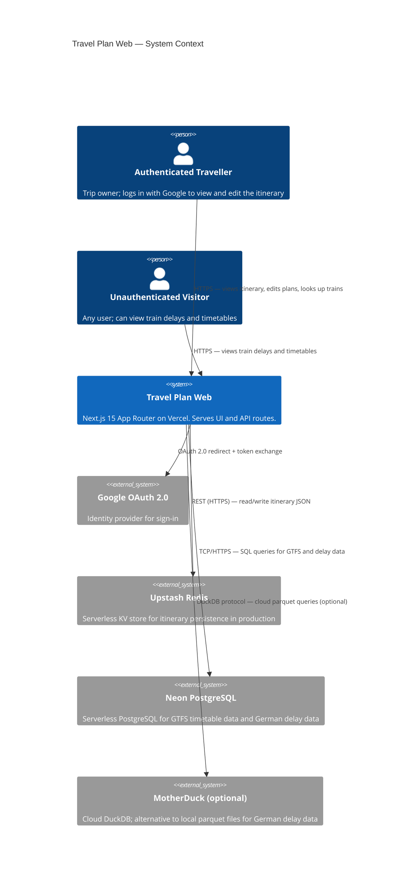
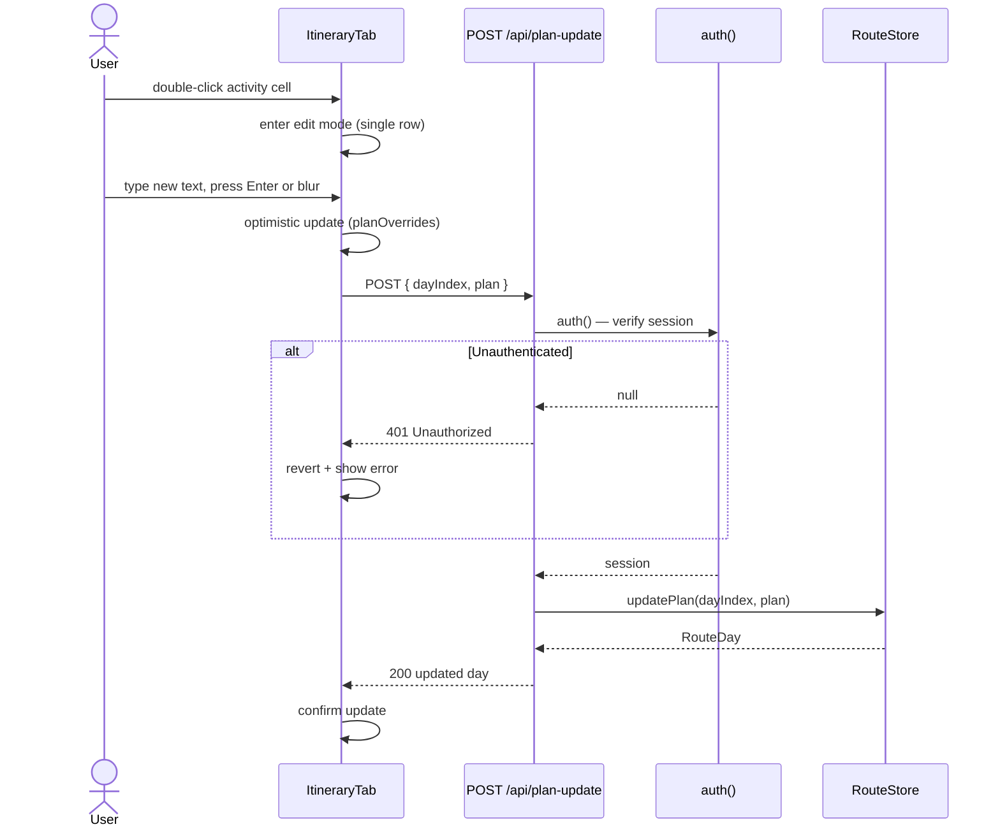
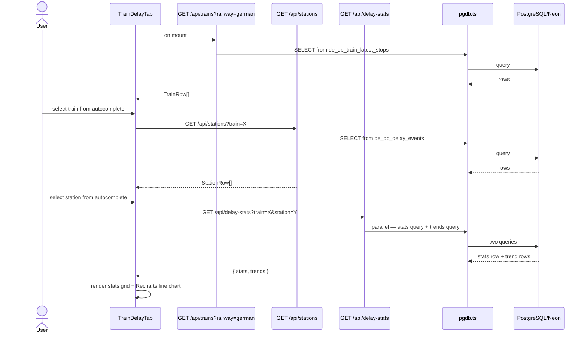
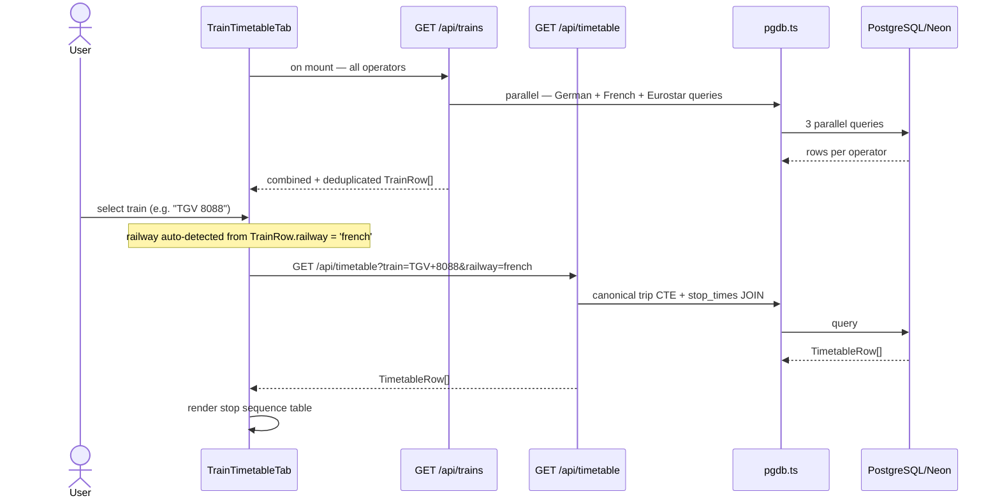
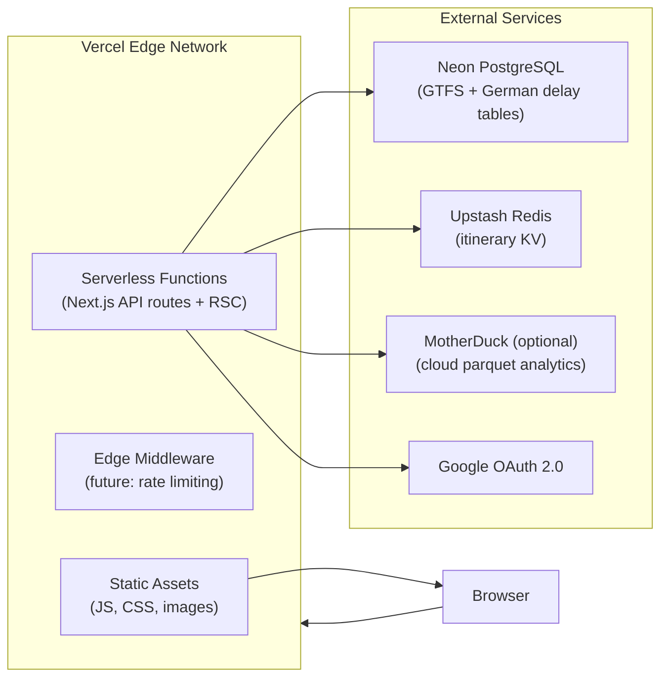
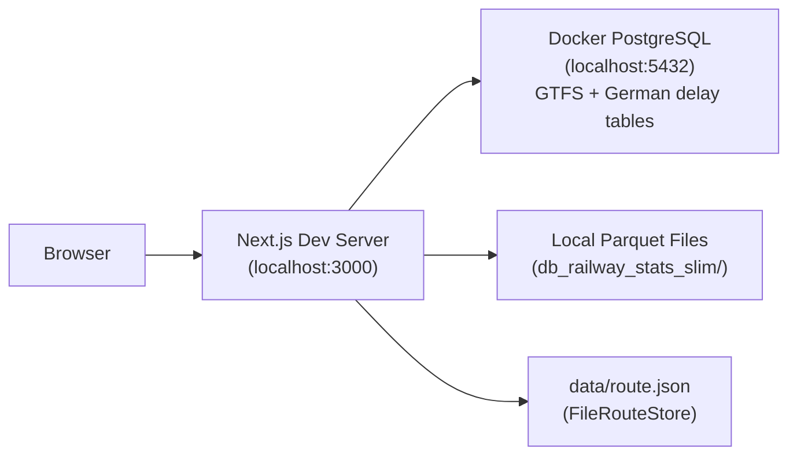
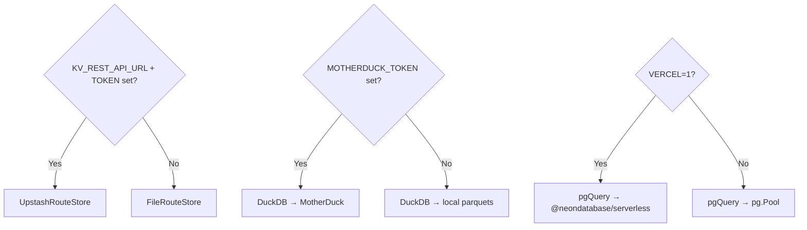

# High-Level Design — Travel Plan Web (Next.js)

**Version:** 1.0  
**Date:** 2026-03-13  
**Status:** Baseline (existing system)  
**Author:** Chief Tech Lead

---

## Table of Contents

1. [System Overview](#1-system-overview)
2. [Context Diagram](#2-context-diagram)
3. [Component Architecture](#3-component-architecture)
4. [Technology Stack](#4-technology-stack)
5. [Data Model](#5-data-model)
6. [Core Data Flows](#6-core-data-flows)
7. [API Contract Summary](#7-api-contract-summary)
8. [Error Model](#8-error-model)
9. [Authentication & Authorization](#9-authentication--authorization)
10. [Deployment Topology](#10-deployment-topology)
11. [Observability](#11-observability)
12. [Test Strategy](#12-test-strategy)
13. [Configuration & Environment Model](#13-configuration--environment-model)
14. [Non-Functional Properties](#14-non-functional-properties)
15. [Known Risks & Open Questions](#15-known-risks--open-questions)

---

## 1. System Overview

Travel Plan Web is a personal, single-tenant web application for planning and reviewing a multi-day European train journey. It is deployed as a Next.js 15 App Router application on Vercel with no separate backend process — all API logic runs as serverless functions co-located with the UI.

### Core Capabilities

| Capability | Summary |
|---|---|
| **Itinerary management** | View, inline-edit, and drag-and-drop reorder a 16-day trip schedule. Persisted in Upstash Redis (production) or a local JSON file (development). |
| **Train timetable lookup** | Autocomplete search across German (DB), French (SNCF), and Eurostar trains; returns planned stop sequences from PostgreSQL/Neon GTFS data. |
| **Train delay analytics** | Search a German long-distance train + station pair; returns delay percentiles and a 90-day daily trend chart from PostgreSQL/Neon parquet-derived tables. |
| **Authentication** | Google OAuth via NextAuth.js v5; optional `ALLOWED_EMAIL` allow-list restricts access to a single account. The Itinerary tab is gated behind authentication. |

### Single-Codebase, Serverless Architecture

The application follows a **unified Next.js monolith** pattern: React Server Components (RSC) handle server-side rendering and initial data fetching; Client Components own interactive UI state; Next.js API routes provide all backend logic. There is no separate API server or background worker.

---

## 2. Context Diagram



---

## 3. Component Architecture

### 3.1 High-Level Component Diagram

```mermaid
graph TD
  subgraph Browser["Browser (React 19)"]
    Layout["RootLayout<br/>(RSC — session, AuthHeader)"]
    Page["page.tsx<br/>(RSC — session + initial route data)"]
    TravelPlan["TravelPlan<br/>(Client — tab switcher)"]
    ItineraryTab["ItineraryTab<br/>(Client — inline edit, DnD)"]
    TrainDelayTab["TrainDelayTab<br/>(Client — delay search + chart)"]
    TrainTimetableTab["TrainTimetableTab<br/>(Client — timetable search)"]
    AuthHeader["AuthHeader<br/>(Client — session display, sign-out)"]
    AutocompleteInput["AutocompleteInput<br/>(Client — reusable typeahead)"]
  end

  subgraph API["Next.js API Routes (Serverless Functions)"]
    AuthRoute["/api/auth/[...nextauth]<br/>GET|POST — OAuth handler"]
    TrainsRoute["/api/trains<br/>GET — combined train list"]
    TimetableRoute["/api/timetable<br/>GET — stop sequence"]
    StationsRoute["/api/stations<br/>GET — stations for a train"]
    DelayStatsRoute["/api/delay-stats<br/>GET — delay stats + trend"]
    TrainStopsRoute["/api/train-stops<br/>GET — dep/arr between stops"]
    PlanUpdateRoute["/api/plan-update<br/>POST — persist plan (auth)"]
    WarmupRoute["/api/warmup<br/>GET — DB readiness probe"]
  end

  subgraph Lib["app/lib (Shared Server Logic)"]
    DB["db.ts<br/>DuckDB singleton (local parquets)"]
    PGDB["pgdb.ts<br/>pgQuery — pg.Pool or Neon serverless"]
    RouteStore["routeStore.ts<br/>FileRouteStore | UpstashRouteStore"]
    Itinerary["itinerary.ts<br/>Types, processItinerary, city aliases"]
    TrainDelay["trainDelay.ts<br/>Types, formatDay, buildStatItems"]
    TrainTimetable["trainTimetable.ts<br/>Types, formatTime"]
    Logger["logger.ts<br/>pino (structured JSON logs)"]
    Auth["auth.ts<br/>NextAuth.js v5 config"]
  end

  subgraph Data["Data Layer"]
    RouteJSON["data/route.json<br/>(seed / local fallback)"]
    ParquetFiles["db_railway_stats_slim/\n*.parquet (local)"]
    PG["PostgreSQL / Neon\ngtfs_trips, gtfs_stops, gtfs_stop_times\ngtfs_calendar_dates\nde_db_delay_events\nde_db_train_latest_stops"]
    Redis["Upstash Redis\nroute key (JSON array)"]
    MotherDuck["MotherDuck (cloud)\ndelay_events_slim\ntrain_latest_stops"]
  end

  Page --> TravelPlan
  TravelPlan --> ItineraryTab
  TravelPlan --> TrainDelayTab
  TravelPlan --> TrainTimetableTab
  TrainDelayTab --> AutocompleteInput
  TrainTimetableTab --> AutocompleteInput
  Layout --> AuthHeader

  ItineraryTab -- "POST /api/plan-update" --> PlanUpdateRoute
  TrainDelayTab -- "GET /api/trains?railway=german" --> TrainsRoute
  TrainDelayTab -- "GET /api/stations" --> StationsRoute
  TrainDelayTab -- "GET /api/delay-stats" --> DelayStatsRoute
  TrainTimetableTab -- "GET /api/trains" --> TrainsRoute
  TrainTimetableTab -- "GET /api/timetable" --> TimetableRoute
  ItineraryTab -- "GET /api/train-stops" --> TrainStopsRoute

  PlanUpdateRoute --> Auth
  PlanUpdateRoute --> RouteStore
  TrainsRoute --> PGDB
  TimetableRoute --> PGDB
  StationsRoute --> PGDB
  DelayStatsRoute --> PGDB
  TrainStopsRoute --> PGDB
  WarmupRoute --> PGDB

  RouteStore --> RouteJSON
  RouteStore --> Redis
  PGDB --> PG
  DB --> ParquetFiles
  DB --> MotherDuck
```



### 3.2 Frontend Component Responsibilities

| Component | Type | Responsibility |
|---|---|---|
| `RootLayout` | RSC | HTML shell, session read, `AuthHeader` injection |
| `page.tsx` | RSC | Session check; if authenticated, fetches route data from `RouteStore` and passes it to `TravelPlan` |
| `TravelPlan` | Client | Tab state management; mounts all three tab panels, toggling visibility with Tailwind `hidden` to preserve state across switches |
| `ItineraryTab` | Client | Renders trip table; manages `planOverrides` overlay for client-side edits; handles inline edit (double-click → input → blur/Enter → POST) and drag-and-drop (optimistic swap → POST → revert on failure) |
| `TrainDelayTab` | Client | Two-step autocomplete (train → station); fetches and renders delay stats grid and Recharts line chart |
| `TrainTimetableTab` | Client | Single-step autocomplete; fetches and renders planned stop sequence table; auto-detects railway from selected train |
| `AuthHeader` | Client | Displays user name/avatar when logged in; "Sign in" link when not; calls `signOut` on logout |
| `AutocompleteInput` | Client | Controlled typeahead input; filters options list locally; uses `onMouseDown` to register selection before `onBlur` closes the dropdown |

### 3.3 Backend Module Responsibilities

| Module | Responsibility |
|---|---|
| `auth.ts` | NextAuth.js v5 configuration — Google provider, `ALLOWED_EMAIL` check in `signIn` callback, custom error page |
| `db.ts` | DuckDB singleton; falls back automatically between local parquets and MotherDuck based on `MOTHERDUCK_TOKEN`; `convertBigInt` serialisation helper |
| `pgdb.ts` | `pgQuery` abstraction — uses `pg.Pool` locally, `@neondatabase/serverless` on Vercel (detected via `VERCEL=1`) |
| `routeStore.ts` | `RouteStore` interface + `FileRouteStore` (local JSON) + `UpstashRouteStore` (Redis); factory `getRouteStore()` selects impl based on env vars |
| `itinerary.ts` | `RouteDay` / `ProcessedDay` types; `processItinerary` (rowspan calculation); `getOvernightColor` (deterministic HSL); `findMatchingStation` (city alias map) |
| `trainDelay.ts` | Domain types (`DelayStats`, `TrendPoint`, `TrainRow`, `StationRow`); `buildStatItems`, `formatDay` |
| `trainTimetable.ts` | `TimetableRow` type; `formatTime` (normalises `HH:MM:SS` and `YYYY-MM-DD HH:MM:SS` to `HH:MM`) |
| `logger.ts` | Pino logger; JSON in production, `pino-pretty` in development; level controlled by `LOG_LEVEL` env |

---

## 4. Technology Stack

| Layer | Choice | Rationale |
|---|---|---|
| **Framework** | Next.js 15 (App Router) | Unified FE+BE in one deployment; RSC for SSR; API routes for serverless backend |
| **Language** | TypeScript 5 | Full-stack type safety; shared types between client and server |
| **UI** | React 19 + Tailwind CSS v3 + lucide-react | Utility-first styling; no component library dependency |
| **Charts** | Recharts 3 | Declarative charting for React; sufficient for the delay trend use case |
| **Auth** | NextAuth.js v5 (Auth.js) | Google OAuth; session management; CSRF protection |
| **ORM / Query** | Raw SQL via `pg` / `@neondatabase/serverless` | Simple parameterised queries; no ORM overhead |
| **Analytics DB (German)** | DuckDB (local parquet) / MotherDuck (cloud) | In-process columnar analytics; zero-server-cost for local dev |
| **Relational DB** | PostgreSQL (Docker locally) / Neon (production) | GTFS timetable data and German delay events from parquet-loaded tables |
| **KV Store** | FileRouteStore (local) / Upstash Redis (production) | Serverless-friendly KV; avoids cold-start issues of a relational DB for simple JSON storage |
| **Logging** | Pino | Structured JSON logs; low overhead; pretty-print in dev |
| **Testing** | Jest 30 + React Testing Library + Playwright | Unit/integration/component (Jest); E2E browser (Playwright) |
| **Deployment** | Vercel (serverless) | Zero-config Next.js deployment; automatic preview deployments |

---

## 5. Data Model

### 5.1 Itinerary Data (`data/route.json` / Upstash Redis `route` key)

```
RouteDay[]
  ├── date: string            "2026/9/25"
  ├── weekDay: string         "星期五"
  ├── dayNum: number          1
  ├── overnight: string       "巴黎"
  ├── plan
  │   ├── morning: string
  │   ├── afternoon: string
  │   └── evening: string
  └── train: TrainRoute[]
        ├── train_id: string  "ICE 123"
        ├── start?: string    "paris"
        └── end?: string      "cologne"
```

**Storage:** Single Redis key `route` stores the full `RouteDay[]` JSON array. On first read, if the key is absent, `UpstashRouteStore` seeds it from `data/route.json`.

### 5.2 GTFS Tables (PostgreSQL / Neon)

| Table | Purpose | Key Columns |
|---|---|---|
| `gtfs_trips` | Trip definitions for all operators | `trip_id` (prefixed: `fr:`, `eu:`, `de:`), `trip_headsign` (branded train name), `service_id`, `train_brand` |
| `gtfs_stops` | Stop/station master | `stop_id`, `stop_name`, `stop_lat`, `stop_lon` |
| `gtfs_stop_times` | Planned arrival/departure per stop per trip | `trip_id`, `stop_id`, `stop_sequence`, `arrival_time`, `departure_time` |
| `gtfs_calendar_dates` | Service calendar exceptions (active dates) | `service_id`, `date`, `exception_type` |
| `gtfs_routes` | Route metadata | `route_id`, `route_short_name`, `agency_id` |
| `gtfs_agency` | Operator info | `agency_id`, `agency_name` |

**Indexes:** `idx_trips_prefix` on `split_part(trip_id, ':', 1)` and `idx_trips_headsign` on `trip_headsign` for fast train name lookups.

### 5.3 German Railway Tables (PostgreSQL / Neon)

| Table | Purpose | Key Columns |
|---|---|---|
| `de_db_delay_events` | Historical delay events (long-distance trains only) | `train_name`, `station_name`, `event_time`, `delay_in_min`, `is_canceled`, `train_line_station_num` |
| `de_db_train_latest_stops` | Latest observed stop sequence per train | `train_name`, `station_num`, `station_name`, `arrival_planned_time`, `departure_planned_time`, `ride_date` |
| `de_db_load_state` | Incremental load tracking | `file_name`, `loaded_at`, `rows_loaded` |

**Constraints:** Both `de_db_*` tables enforce a `CHECK` constraint allowing only long-distance train prefixes: `ICE`, `IC`, `EC`, `EN`, `RJX`, `RJ`, `NJ`, `ECE`.

**Primary keys:** `de_db_train_latest_stops(train_name, station_num)`.

### 5.4 Local Parquet Files (DuckDB mode)

| File | Table equivalent | Contents |
|---|---|---|
| `db_railway_stats_slim/delay_events_slim.parquet` | `de_db_delay_events` | Slim subset of delay events |
| `db_railway_stats_slim/train_latest_stops.parquet` | `de_db_train_latest_stops` | Latest stop sequence per train |

> **Note:** In production the application currently uses the PostgreSQL path for all queries (German data loaded via `scripts/load-german-railway.sh`). The DuckDB / MotherDuck path is available as a local-development and optional cloud-analytics alternative.

---

## 6. Core Data Flows

### 6.1 Page Load — Authenticated User

```mermaid
sequenceDiagram
  actor User
  participant Browser
  participant NextRSC as Next.js RSC (page.tsx)
  participant Auth as auth.ts (NextAuth)
  participant Store as RouteStore
  participant Redis as Upstash Redis

  User->>Browser: GET /
  Browser->>NextRSC: HTTP request
  NextRSC->>Auth: auth() — read session cookie
  Auth-->>NextRSC: session { user }
  NextRSC->>Store: getRouteStore().getAll()
  Store->>Redis: GET route
  Redis-->>Store: RouteDay[] JSON
  Store-->>NextRSC: RouteDay[]
  NextRSC-->>Browser: HTML with SSR itinerary data
  Browser->>Browser: Hydrate React; render TravelPlan(isLoggedIn=true)
```

### 6.2 Itinerary Inline Edit



### 6.3 Train Delay Statistics Flow



### 6.4 Train Timetable Flow



---

## 7. API Contract Summary

All API routes return `application/json`. Error responses always include a top-level `"error"` string field. Successful responses are described below.

### 7.1 `GET /api/trains`

| Param | Type | Required | Description |
|---|---|---|---|
| `railway` | `german \| french \| eurostar` | No | Filter to a single operator. Omit for all. |

**Success response** `200`:
```json
[
  { "train_name": "ICE 905",  "train_type": "ICE",      "railway": "german" },
  { "train_name": "TGV 8088", "train_type": "SNCF",     "railway": "french" },
  { "train_name": "EST 9002", "train_type": "Eurostar",  "railway": "eurostar" }
]
```
Partial failures (one operator down) are logged but do not fail the request — the other operators' data is still returned.

---

### 7.2 `GET /api/timetable`

| Param | Type | Required | Description |
|---|---|---|---|
| `train` | `string` | **Yes** | Train name (e.g. `ICE 905`) |
| `railway` | `german \| french \| eurostar` | No | Defaults to `german` |

**Success response** `200`:
```json
[
  {
    "station_num": 1,
    "station_name": "Berlin Hbf",
    "arrival_planned_time": null,
    "departure_planned_time": "09:00:00",
    "ride_date": "2026-03-10"
  }
]
```
Times are `"HH:MM:SS"` for GTFS sources, `"YYYY-MM-DD HH:MM:SS"` for German parquet; both rendered as `HH:MM` in the UI via `formatTime`.

---

### 7.3 `GET /api/stations`

| Param | Type | Required | Description |
|---|---|---|---|
| `train` | `string` | **Yes** | German train name |

**Success response** `200`:
```json
[
  { "station_name": "Berlin Hbf", "station_num": 1 }
]
```

---

### 7.4 `GET /api/delay-stats`

| Param | Type | Required | Description |
|---|---|---|---|
| `train` | `string` | **Yes** | German train name |
| `station` | `string` | **Yes** | Station name |

**Success response** `200`:
```json
{
  "stats": {
    "total_stops": 120,
    "avg_delay": 3.4,
    "p50": 2.0, "p75": 5.0, "p90": 9.0, "p95": 12.0,
    "max_delay": 47
  },
  "trends": [
    { "day": "2025-01-01T00:00:00", "avg_delay": 1.5, "stops": 3 }
  ]
}
```
Window: last 3 months relative to the most recent `event_time` in the table. Cancelled stops (`is_canceled = true`) are excluded.

---

### 7.5 `GET /api/train-stops`

| Param | Type | Required | Description |
|---|---|---|---|
| `train` | `string` | **Yes** | German train name |
| `from` | `string` | **Yes** | Departure city name |
| `to` | `string` | **Yes** | Arrival city name |

**Success response** `200`:
```json
{
  "fromStation": "Berlin Hbf",
  "depTime": "09:15",
  "toStation": "Köln Hbf",
  "arrTime": "14:30"
}
```
Returns `null` if no station match is found (city alias resolution via `CITY_ALIASES` map in `itinerary.ts`).

---

### 7.6 `POST /api/plan-update`

**Auth:** Session cookie required. Returns `401` if absent.

**Request body:**
```json
{ "dayIndex": 0, "plan": { "morning": "...", "afternoon": "...", "evening": "..." } }
```

**Success response** `200`: The updated `RouteDay` object.

---

### 7.7 `GET|POST /api/auth/[...nextauth]`

Handled by NextAuth.js v5. Manages OAuth callback (`/api/auth/callback/google`), CSRF token (`/api/auth/csrf`), sign-in (`/api/auth/signin`), sign-out (`/api/auth/signout`), and session (`/api/auth/session`) endpoints automatically.

---

### 7.8 `GET /api/warmup`

No params. Runs two lightweight `SELECT … LIMIT 1` queries against `de_db_train_latest_stops` and `de_db_delay_events` to ensure the DB connection is ready. Used by Playwright's `webServer.url` to absorb the MotherDuck cold-start delay.

**Success response** `200`: `{ "ok": true }`

---

## 8. Error Model

All API routes follow a consistent error response shape:

```json
{ "error": "<human-readable message>" }
```

### HTTP Status Codes

| Status | When Used |
|---|---|
| `200 OK` | Request succeeded; body contains result |
| `400 Bad Request` | Missing required query params; invalid JSON body; `dayIndex` out of range; unknown `railway` value |
| `401 Unauthorized` | `POST /api/plan-update` called without a valid session |
| `500 Internal Server Error` | Unhandled database error or unexpected exception in an API route |

### Error Handling Conventions

- **Validation errors** are returned synchronously before any DB call.
- **Database errors** are caught in a `try/catch` and logged via `pino` before returning `500`.
- **Partial failures** in `GET /api/trains` (one operator's query fails): the failed operator is logged at `error` level but the remaining operators' data is still returned with `200`. No `"error"` field is present in the response — the partial result is treated as a degraded-success.
- **RouteStore read failure** on `GET /` (SSR): surfaces as a Next.js server error page; no explicit handling at the route level.
- **Client-side API failures**: `ItineraryTab` reverts optimistic updates and shows an inline error string. `TrainDelayTab` and `TrainTimetableTab` surface error messages in the UI.

### Auth-Error Page

`/auth-error` — rendered when NextAuth rejects sign-in (e.g. email not in allow-list). Auto-redirects to `/login` after 5 seconds.

---

## 9. Authentication & Authorization

### Flow

```mermaid
sequenceDiagram
  actor User
  participant Browser
  participant App as Next.js App
  participant Google as Google OAuth 2.0
  participant NextAuth as NextAuth.js (auth.ts)

  User->>Browser: click "Sign in with Google"
  Browser->>App: GET /api/auth/signin/google
  App->>Google: redirect to Google consent screen
  Google->>App: callback /api/auth/callback/google?code=...
  App->>NextAuth: signIn callback — check ALLOWED_EMAIL
  alt Email not in allow-list
    NextAuth-->>App: return false
    App-->>Browser: redirect to /auth-error
  end
  NextAuth-->>App: return true — create session
  App-->>Browser: Set-Cookie: session JWT; redirect to /
```

### Trust Boundary

- **Server-side session check** via `auth()` is performed in `page.tsx` (RSC) for data-access gating and in `POST /api/plan-update` for write-operation authorization.
- **Client-side session** is exposed to `TravelPlan` via the `isLoggedIn` prop; the Itinerary tab is conditionally rendered only when `isLoggedIn = true`. This is a UI-only gate — the actual write protection is server-side in the API route.
- **`ALLOWED_EMAIL`**: optional single-email allow-list. If unset, any authenticated Google account is granted access.
- **CSRF protection**: handled transparently by NextAuth.js v5 on all mutation endpoints.

---

## 10. Deployment Topology

### Production (Vercel)



**Key topology properties:**
- Each API request triggers a fresh serverless function invocation; there is no persistent in-process state.
- PostgreSQL connections use `@neondatabase/serverless` (HTTP-based) on Vercel to avoid TCP connection limits.
- Upstash Redis is accessed via REST API — no persistent TCP connection.
- `serverExternalPackages: ['pg', 'pino', 'pino-pretty']` ensures these Node.js-native packages are not bundled by webpack.

### Local Development



Two local modes:
- **`dev:local`**: local parquets + Docker PostgreSQL (overrides `MOTHERDUCK_TOKEN=` and `DATABASE_URL=postgresql://...localhost...`)
- **`dev:cloud`**: MotherDuck + Neon (uses `.env.local` credentials)

### Data Loading Scripts

| Script | Purpose |
|---|---|
| `scripts/init-db.sql` | Creates GTFS tables in PostgreSQL |
| `scripts/load-data.sh` | Loads GTFS CSV files into PostgreSQL |
| `scripts/init-db-german-railway.sql` | Creates `de_db_*` tables in PostgreSQL |
| `scripts/load-german-railway.sh` | Loads German long-distance parquet data into PostgreSQL |
| `scripts/build-german-slim-parquets.sh` | Builds slim parquet files from full German parquet set |
| `scripts/merge_gtfs.py` | Merges per-operator GTFS folders into a unified dataset |

---

## 11. Observability

### Structured Logging

All API routes use `pino` for structured JSON logging. Each log entry includes:
- Route path and key parameters (`train`, `station`, `railway`)
- Response time in milliseconds (`ms`)
- Row counts
- User email (for `plan-update` actions)
- Backend selection at startup (`RouteStore` and `pgdb` backends)

**Log levels:**
- `info` — normal request/response, backend selection
- `warn` — degraded state (incomplete KV env, unauthenticated write attempt)
- `error` — database errors, failed operator queries in `/api/trains`

**Development:** `pino-pretty` with colorised output.  
**Production:** plain JSON — consumable by Vercel log drain.

### Metrics & Tracing

No dedicated metrics or distributed tracing are currently implemented. Response time (`ms`) is logged per-request and available in Vercel's log view.

---

## 12. Test Strategy

### Test Tiers

| Tier | Tool | Scope | Location |
|---|---|---|---|
| **Tier 0** | `next lint` + TypeScript | Lint, format, type checking | CI on every push |
| **Tier 1 — Unit** | Jest 30 + RTL | Pure functions (`itinerary.ts`, `trainDelay.ts`, `db.ts`), `RouteStore` impls, `pgdb.ts` paths, middleware | `__tests__/unit/`, `__tests__/middleware/`, `__tests__/components/` |
| **Tier 2 — Integration** | Jest 30 | API route handlers with mocked dependencies (DB, auth, store) | `__tests__/integration/` |
| **Tier 3 — E2E** | Playwright | Full browser flows against a running Next.js server (local or cloud data) | `__tests__/e2e/` |

### Current Coverage

- **211 Jest tests** across 21 suites covering unit logic, all API routes, component behaviour, and auth middleware.
- **45 Playwright E2E tests** covering navigation, itinerary editing and reordering, timetable search, delay stats, and Google OAuth (session injection for authenticated flows).

### Test Execution

```bash
npm test                    # Tier 0 + Tier 1 + Tier 2 (Jest, silent mode)
npm run test:coverage       # same + coverage report
npm run test:e2e:local      # Tier 3 — local parquets + Docker PostgreSQL
npm run test:e2e            # Tier 3 — MotherDuck + Neon
```

### Environment Strategy

| Mode | Config files loaded | DB | Route storage |
|---|---|---|---|
| `npm test` (Jest) | `.env.test` | Mocked | Mocked |
| `npm run test:e2e:local` | `.env.test` + `.env.local` (overridden) | Docker PostgreSQL | FileRouteStore |
| `npm run test:e2e` | `.env.test` + `.env.local` | Neon | MotherDuck or local |

### Playwright E2E Strategy

- Playwright builds a production bundle (`npm run build && npm start`) when MotherDuck is configured, to avoid per-route JIT overhead on cold starts.
- A `/api/warmup` endpoint blocks until the DB connection is confirmed ready, absorbing the ~80s MotherDuck cold-start before the test suite begins.
- MotherDuck mode runs tests serially (`workers: 1`) to prevent concurrent DuckDB connection contention.
- Screenshots are captured on failure; traces on first retry.

### Test Gates (Enforced)

- **Before any PR merge:** Tier 0 and Tier 1 must pass.
- **Before declaring a feature integrated:** Tier 2 must pass.
- **Before a production release:** Tier 3 critical paths must pass.

---

## 13. Configuration & Environment Model

### Environment Variables

| Variable | Required | Used by | Description |
|---|---|---|---|
| `GOOGLE_CLIENT_ID` | Production | `auth.ts` | Google OAuth client ID |
| `GOOGLE_CLIENT_SECRET` | Production | `auth.ts` | Google OAuth client secret |
| `AUTH_SECRET` | Production | `auth.ts` | NextAuth session signing secret (≥32 chars) |
| `ALLOWED_EMAIL` | Optional | `auth.ts` | Restrict sign-in to one Google account |
| `DATABASE_URL` | Production | `pgdb.ts` | PostgreSQL connection string |
| `KV_REST_API_URL` | Production | `routeStore.ts` | Upstash Redis REST URL |
| `KV_REST_API_TOKEN` | Production | `routeStore.ts` | Upstash Redis REST token |
| `MOTHERDUCK_TOKEN` | Optional | `db.ts` | MotherDuck auth token (omit for local parquets) |
| `MOTHERDUCK_DB` | Optional | `db.ts` | MotherDuck database name |
| `MOTHERDUCK_DELAY_TABLE` | Optional | `db.ts` | Override for delay table name (default: `delay_events_slim`) |
| `MOTHERDUCK_STOPS_TABLE` | Optional | `db.ts` | Override for stops table name (default: `train_latest_stops`) |
| `VERCEL` | Auto-set | `pgdb.ts` | Switches `pg.Pool` → `@neondatabase/serverless` |
| `ROUTE_DATA_PATH` | Optional | `routeStore.ts` | Override path for `route.json` (default: `data/route.json`) |
| `LOG_LEVEL` | Optional | `logger.ts` | Pino log level (default: `info`) |
| `NODE_ENV` | Auto-set | `logger.ts`, Next.js | `development` / `production` / `test` |

### Backend Selection Logic



---

## 14. Non-Functional Properties

| Category | Property | Current State |
|---|---|---|
| **Performance** | Train list autocomplete filters locally (no per-keystroke API call) | ✅ |
| **Performance** | Delay stats and timetable responses target < 3 s p95 | Accepted; logged per-request |
| **Reliability** | Failed plan-update always reverts the UI (no silent loss) | ✅ optimistic + revert pattern |
| **Reliability** | `/api/trains` partial failure (one operator down) degrades gracefully | ✅ `Promise.allSettled` |
| **Security** | All write operations gated behind server-side session check | ✅ `auth()` in API route |
| **Security** | Credentials never committed; all via env vars | ✅ `.gitignore` enforced |
| **Accessibility** | Autocomplete inputs have `<label>` and `role="status"` spinners | ✅ |
| **Deployability** | Zero extra server processes; all logic in Vercel serverless | ✅ |
| **Compatibility** | Runs on Node.js 18+ | ✅ |
| **Maintainability** | TDD enforced — tests written before implementation | ✅ per `CLAUDE.md` |

---

## 15. Known Risks & Open Questions

| # | Type | Description | Severity | Status |
|---|---|---|---|---|
| R-01 | Data freshness | Delay parquet data is a static snapshot; not live. Users see historical patterns only. | Medium | Accepted by design |
| R-02 | GTFS staleness | French/Eurostar timetable data becomes stale when carrier schedules change. Requires manual `merge_gtfs.py` re-run. | Medium | Manual process; no automation |
| R-03 | MotherDuck cold-start | MotherDuck connections take ~80s on cold start. E2E tests absorb this via `/api/warmup`. Production users may see slow first-request on cloud mode. | Medium | Mitigated in tests; production risk accepted |
| R-04 | Serverless connection limits | `pg.Pool` is not safe for Vercel (no persistent process). Mitigated by using `@neondatabase/serverless` on Vercel. | High | ✅ Mitigated |
| R-05 | Single-tenant design | `ALLOWED_EMAIL` allows only one account. Multi-user is explicitly out of scope. | Low | Accepted |
| R-06 | Itinerary seed update | No mechanism exists to reset the Redis itinerary to a new `route.json` without directly editing the Redis key. | Low | Open |
| Q-01 | Delay data for French/Eurostar | Should delay analytics expand to French and Eurostar trains? | — | Open |
| Q-02 | Rate limiting | Login endpoint has a middleware rate-limit test but no deployed Edge middleware rate limiter. | Medium | Open |

---

*This document describes the architecture as of 2026-03-13. Update it when the global architecture is materially changed.*
