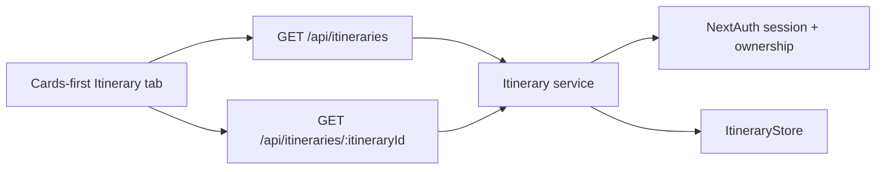
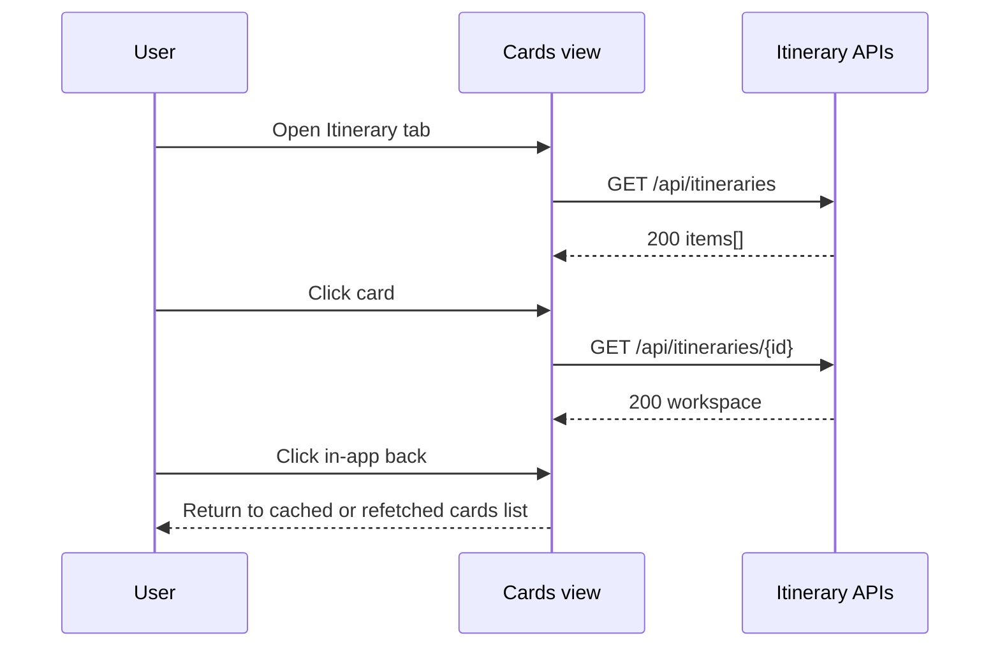

# Backend Low-Level Design - Itinerary Cards Navigation

**Feature ID:** itinerary-cards-navigation  
**Status:** LLD - ready for implementation  
**Date:** 2026-03-22  
**Refs:** [feature-analysis.md](./feature-analysis.md) · [../backend-architecture.md](../backend-architecture.md) · [../system-architecture.md](../system-architecture.md) · [../itinerary-creation-and-stay-planning/backend-design.md](../itinerary-creation-and-stay-planning/backend-design.md) · [`../../packages/contracts/openapi.yaml`](../../packages/contracts/openapi.yaml)

## Scope

- Support the desktop cards-first `Itinerary` tab with the smallest backend change set.
- Cover how the UI gets the current user's itinerary card list and how it loads a selected itinerary workspace.
- Keep existing create, stay-edit, and day-plan APIs unchanged.

## Non-goals

- No persistence-schema changes, editor workflow changes, or mobile-specific backend work.
- No search, filter, archive, delete, sharing, or cross-user list behavior.
- No new write path for the in-app back action; returning to cards is frontend-only state.

## Minimal Backend Decision

- Reuse existing `ItineraryStore.listByOwner(ownerEmail)` for cards data; the store already supports owner-scoped summaries through full records.
- Keep `GET /api/itineraries/{itineraryId}` as the detail-loader for the existing editor workspace.
- Add one read-only list contract surface: `GET /api/itineraries` returns the signed-in user's itinerary summaries ordered by `updatedAt desc`.
- Do not change `RouteDay[]`, stay derivation, or itinerary record shape.

This keeps the feature additive: one list read path plus the existing detail read path.

## Runtime Fit

## API Behavior

### `GET /api/itineraries`

- Requires authenticated session.
- Returns only itineraries owned by `session.user.email`.
- Response shape is summary-only to keep payload light for cards view.
- Order is `updatedAt desc` so the most recently touched itinerary appears first.
- Empty state returns `200` with `items: []`; do not treat no itineraries as an error.
- No query params, filtering, or pagination in this slice.

Suggested contract shape:

- `200 { items: ItinerarySummary[] }`
- `401 { error: "UNAUTHORIZED" }`
- `500 { error: "INTERNAL_ERROR" }`

### `GET /api/itineraries/{itineraryId}`

- No behavior change.
- Remains the only backend call needed when a user clicks a card to enter the existing workspace.
- `404 ITINERARY_NOT_FOUND` and `403 ITINERARY_FORBIDDEN` remain the recovery signals for the cards view error state.

## Service And Module Changes

- `app/lib/itinerary-store/store.ts`: no interface change required; `listByOwner` already exists.
- `app/lib/itinerary-store/service.ts`: add a read-only `listItineraries(ownerEmail)` mapper that converts `ItineraryRecord[]` to `ItinerarySummary[]`.
- `app/api/itineraries/route.ts`: support `GET` alongside existing `POST`; share auth/error handling conventions with current itinerary handlers.
- No changes to stay or day-plan routes.

## Data And Authorization Rules

- Cards view uses only `ItinerarySummary` fields already present in the contract and store.
- Ownership boundary stays server-side; clients never pass `ownerEmail`.
- No new indexes, migrations, or record backfills are needed because owner ordering is already maintained by the itinerary index.

## Page-Load / Navigation Notes

- Back navigation does not require a backend mutation.
- FE may reuse the already loaded list on back-navigation; a refetch is optional and not required for correctness in this slice.
- Deep links with `?itineraryId=<id>` remain valid by continuing to use the existing detail endpoint.

## Contract Updates

- Update `packages/contracts/openapi.yaml` to add `GET /api/itineraries`.
- Reuse `ItinerarySummary`.
- Add one lightweight response schema, for example `ItineraryListResponse { items: ItinerarySummary[] }`.
- No changes to existing itinerary detail or mutation schemas.

## Test Strategy

### Tier 1

- Service test for `listItineraries(ownerEmail)` returning owner-scoped summaries in `updatedAt desc` order.
- Store coverage can stay as-is if existing `listByOwner` tests already prove ordering and owner isolation.

### Tier 2

- `GET /api/itineraries` returns `200` with summary items for an authenticated owner.
- `GET /api/itineraries` returns `200` with empty `items` when the owner has none.
- `GET /api/itineraries` returns `401` without a session.
- Existing `GET /api/itineraries/{itineraryId}` tests remain the coverage for card click-through detail loading.

## Tradeoffs, Risks, Assumptions

- Adding `GET /api/itineraries` is slightly broader than a page-only server fetch, but it keeps cards retry/loading behavior simple and reuses the existing store boundary cleanly.
- Returning summaries instead of full workspaces avoids loading `days` blobs for every card and keeps scope small.
- Assumes current owner index ordering is reliable enough for desktop card presentation without pagination.
- If FE chooses pure server-rendered list hydration instead of a new route, the same service and response shape should still be treated as the canonical backend contract for future refresh flows.
