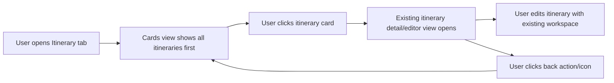

# Feature Analysis - Itinerary Cards Navigation

**Feature ID:** itinerary-cards-navigation  
**Status:** Ready for FE/BE design handoff  
**Date:** 2026-03-22  
**Project:** travel-plan-web-next

## User Problem

Authenticated users can now create multiple itineraries, but the `Itinerary` tab does not expose a recoverable list of prior itineraries. Once a user leaves an itinerary workspace, there is no clear in-app way to browse older itineraries and reopen one from the UI.

## Desired Outcome

- Make the `Itinerary` tab start from an itinerary cards view.
- Let users reopen any saved itinerary by clicking its card.
- Keep the existing itinerary detail/editor experience as the second step, not a redesigned workspace.
- Provide clear in-app actions to return from the detail/editor view back to the cards view.

## Target UX Flow

## Product Rationale

- Solves the current retrieval gap without changing the existing editor mental model.
- Preserves the current MVP investment: creation flow and itinerary workspace remain the core editing surface.
- Gives users a lightweight library entry point that matches the new multi-itinerary capability.
- Minimizes scope by treating this as navigation and discoverability work, not a planner redesign.

## Scope

### In Scope

- In the authenticated `Itinerary` tab, show all available itineraries as the default first view.
- Each card provides enough identifying information to help users choose the right itinerary at a glance.
- Clicking a card opens that itinerary in the existing detail/editor workspace.
- The detail/editor view includes clear, persistent in-app actions or icons to return to the cards view.
- Cards view and detail view states stay within the `Itinerary` tab experience.
- Desktop-first behavior only for this feature.

### Out of Scope

- Redesigning the itinerary detail/editor layout or editing rules.
- New itinerary data model changes beyond what is needed to list and open existing itineraries.
- Mobile-specific layouts, gestures, or responsive optimization.
- Cross-tab navigation changes outside the `Itinerary` tab.
- Advanced library features such as search, filters, sort controls, pinning, archive, delete, or sharing.

## Desktop-Only Assumptions

- The feature is designed for desktop and laptop usage only.
- Card density, spacing, and back-navigation affordances may assume desktop pointer and keyboard input.
- No acceptance criteria require mobile optimization, compact breakpoints, or touch-first behavior.

## Key States

### 1. Cards View - Populated

- User sees all available itineraries before entering any specific itinerary.
- Each itinerary appears as a clickable card.
- A `New itinerary` action remains visible from this top-level view.

### 2. Cards View - Empty

- If the user has no itineraries yet, the cards view shows a clear empty state.
- The empty state directs the user to create their first itinerary.

### 3. Detail/Editor View

- After card selection, the app opens the existing itinerary workspace for the selected itinerary.
- The selected itinerary context is visually clear.
- A back action/icon returns the user to cards view without forcing them to change browser history manually.

### 4. Load / Error States

- While itinerary cards are loading, the UI shows a clear loading state in the cards area.
- If the list cannot be loaded, the UI shows an actionable error state.
- If a selected itinerary is unavailable, the user can recover back to cards view from the error state.

## Functional Requirements

- The default authenticated entry point for the `Itinerary` tab is the itinerary cards view.
- The cards view includes every itinerary the current user can reopen from this app.
- Selecting a card opens the existing itinerary detail/editor view for that itinerary.
- The detail/editor view exposes at least one prominent in-app back affordance that returns to cards view.
- Returning to cards view must not require a browser refresh or leaving the `Itinerary` tab.
- The feature must stay aligned with the current create flow and existing itinerary workspace behavior.

## Non-Functional Requirements

- Desktop UX should make card scanning and re-entry obvious within a few seconds.
- Navigation between cards view and detail/editor view should feel immediate and predictable.
- Labels and icons for back-navigation must be understandable without relying on browser controls.
- Empty, loading, and error states must be explicit and usable.

## Acceptance Criteria

### AC-1: Cards View Is the Default Itinerary Tab State

Given an authenticated user opens the `Itinerary` tab  
When the tab loads successfully  
Then the first visible state is a cards view showing the user's itineraries  
And the app does not immediately drop the user into one itinerary detail view by default

### AC-2: Every Available Itinerary Is Recoverable from Cards View

Given the user has multiple saved itineraries  
When the cards view is shown  
Then each saved itinerary is represented by a clickable card  
And the user can choose which itinerary to reopen from the UI

### AC-3: Card Selection Opens Existing Detail/Editor View

Given the user is on the cards view  
When they click an itinerary card  
Then that itinerary opens in the existing itinerary detail/editor workspace  
And the current editing experience remains consistent with today's itinerary workspace behavior

### AC-4: In-App Back Navigation Returns to Cards View

Given the user is viewing an itinerary detail/editor workspace  
When they activate the provided back action or icon  
Then the app returns them to the itinerary cards view  
And they can immediately select a different itinerary

### AC-5: Empty State Supports First-Time Use

Given the user has no itineraries  
When they open the `Itinerary` tab  
Then they see an empty cards-view state with a clear `New itinerary` action  
And no broken or blank detail/editor workspace is shown

### AC-6: Loading and Error States Are Recoverable

Given itinerary cards fail to load or a selected itinerary cannot be opened  
When the failure occurs  
Then the UI shows a clear error state  
And the user has an in-app way to return to the cards view or retry

### AC-7: Desktop-Only Delivery Is Acceptable

Given this feature is delivered for the current MVP  
When it is reviewed for release  
Then desktop usability is required  
And mobile-specific optimization is not required for acceptance

## Recommended Prioritization

- **P0:** add cards view as the default `Itinerary` tab state, with click-to-open behavior for all itineraries
- **P0:** add clear in-app back navigation from itinerary detail/editor view to cards view
- **P1:** add robust empty, loading, and error states for both cards and detail entry
- **P2:** improve card metadata density or visual polish if needed after core navigation works
- **Not recommended for this slice:** search, filtering, delete/archive actions, or mobile optimization

## Risks and Assumptions

- Assumption: the current backend can already identify the set of itineraries a user owns or can reopen.
- Assumption: the existing itinerary workspace should remain the single detailed editing surface.
- Risk: if the app currently auto-selects a latest itinerary through routing/server defaults, tech design will need to clarify how cards view becomes the primary entry without breaking deep links.
- Risk: unsaved inline edits in the detail view may require explicit guard behavior before returning to cards view; this should follow current dirty-state protection patterns rather than inventing a new rule.

## Handoff

Project coordinator should ask FE and BE leads to design the smallest list-and-open flow that reuses the current itinerary workspace, preserves current create behavior, and adds explicit back-navigation within the `Itinerary` tab.
