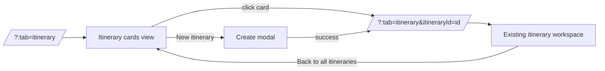
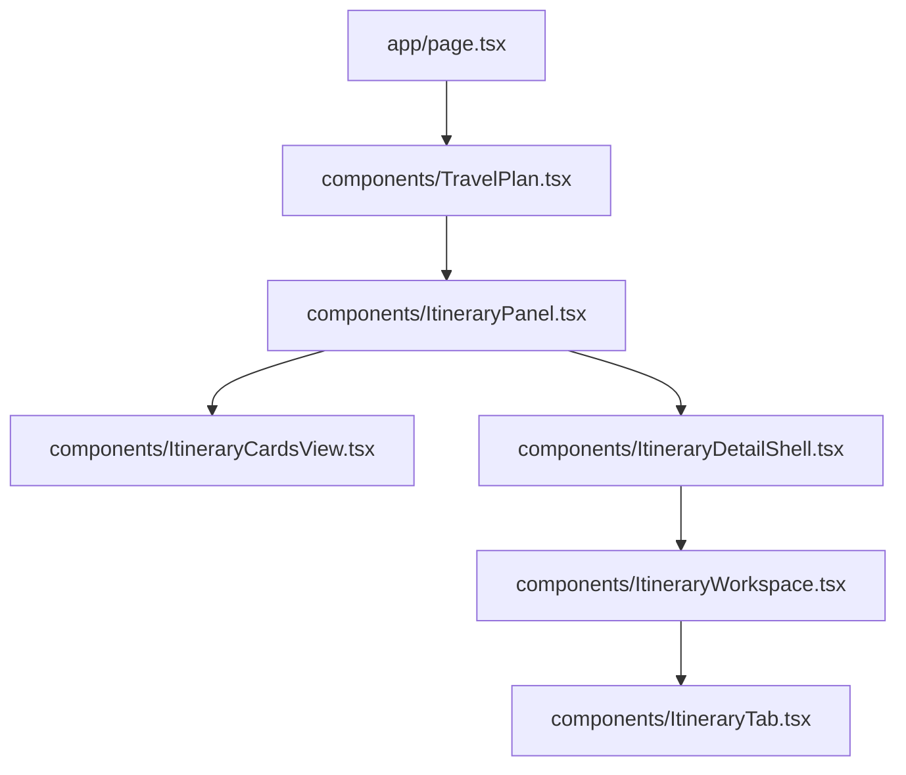
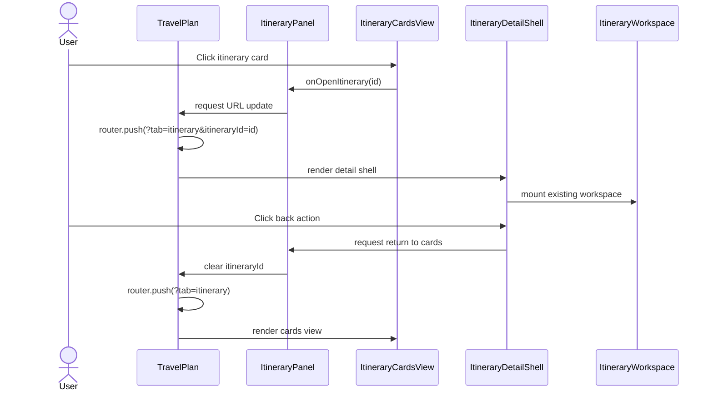

# Frontend Low-Level Design - Itinerary Cards Navigation

**Feature:** itinerary-cards-navigation  
**Status:** LLD - ready for implementation  
**Date:** 2026-03-22  
**Refs:** [feature-analysis.md](./feature-analysis.md) · [../frontend-architecture.md](../frontend-architecture.md) · [../system-architecture.md](../system-architecture.md) · [`../../packages/contracts/openapi.yaml`](../../packages/contracts/openapi.yaml)

## 1. Scope

### In scope
- Make authenticated `Itinerary` tab default to a desktop cards view when `itineraryId` is absent.
- Open the existing detail/editor workspace when a card is selected.
- Add an explicit in-app back action from detail/editor to cards view.
- Define recoverable loading, empty, and error states for cards and detail entry.
- Guard cards/detail navigation when the existing workspace reports unsaved inline edits.

### Out of scope
- Redesign of `ItineraryTab` table, train editor, export flows, or stay editing rules.
- Mobile-first layouts, touch gestures, or compact breakpoint optimization.
- Search, sort, filters, archive, delete, duplicate, or sharing actions in cards view.
- A new global client store or route tree.

## 2. Route and navigation model

- Keep `/` as the only route.
- `?tab=itinerary` with no `itineraryId` means cards view.
- `?tab=itinerary&itineraryId=<id>` means detail/editor view for that itinerary.
- Deep links with `itineraryId` remain valid and bypass cards view.
- Explicit back action removes `itineraryId` and returns to cards view inside the tab.
- `New itinerary` from cards view creates the shell, then navigates into detail/editor for the new itinerary.

## 3. Information architecture

### Boundary changes

### `app/page.tsx`
- Stop auto-resolving latest itinerary when `tab=itinerary` and `itineraryId` is absent.
- Server-load the cards payload for authenticated users entering cards view.
- Server-load the selected workspace only when `itineraryId` is present.
- Pass both `initialItinerarySummaries` and optional `initialItineraryWorkspace` into `TravelPlan`.

### `components/TravelPlan.tsx`
- Keep ownership of top-level tab state and search-param sync.
- Replace direct `ItineraryWorkspace` mount with a new itinerary-only panel wrapper.
- Keep `New itinerary` trigger in itinerary-level chrome, but render it in a way that also makes sense on cards view.
- Continue to own cross-tab dirty-state blocking.

### `components/ItineraryPanel.tsx` (new)
- Own itinerary subview selection derived from `selectedItineraryId`.
- Render either cards view or detail shell.
- Own itinerary-list refresh after create and after returning from detail if metadata changed.
- Centralize detail-entry recovery when a selected itinerary is missing or forbidden.

### `components/ItineraryCardsView.tsx` (new)
- Presentational grid/list for desktop cards.
- Receives summaries, loading/error state, selected/open callbacks, and `New itinerary` trigger.
- Shows populated, empty, loading, and error states without mounting the editor workspace.

### `components/ItineraryDetailShell.tsx` (new)
- Thin wrapper around existing `ItineraryWorkspace`.
- Adds persistent desktop header with `Back to all itineraries`, itinerary title, start date, and existing top-level actions.
- Owns navigation-intent handling for back and card-to-card switching; detail editing stays in `ItineraryWorkspace` and `ItineraryTab`.

### `components/ItineraryWorkspace.tsx`
- Stay the detail/editor container for one selected itinerary.
- Preserve empty-workspace vs table branching, stay sheet flows, and error mapping.
- Surface dirty-state and recoverable load errors upward; do not take on cards-list concerns.

## 4. Data and state flow

| State | Owner | Type | Notes |
|---|---|---|---|
| `tab` + `itineraryId` | `TravelPlan` | route state | URL remains the source of truth |
| Itinerary summaries list | `app/page.tsx` -> `ItineraryPanel` | server state mirrored locally | Requires contract-backed list payload |
| Selected itinerary workspace | `app/page.tsx` / `ItineraryWorkspace` | server state mirrored locally | Existing behavior retained for detail view |
| Cards/detail subview | `ItineraryPanel` | derived UI state | `selectedItineraryId ? detail : cards` |
| Dirty detail flag | `ItineraryTab` -> `ItineraryWorkspace` -> `ItineraryPanel` -> `TravelPlan` | derived UI state | Used for back, card switch, create, and tab switch guards |
| Create modal open/pending | `TravelPlan` | local UI state | Existing behavior retained |

## 5. Contract usage and required spec change

- Current contract covers create, read-one workspace, stay append/edit, and day-plan patch.
- Cards view needs a contract-backed itinerary list endpoint before implementation.
- Recommended addendum: `GET /api/itineraries` returning an ordered array of `ItinerarySummary` for the signed-in user.
- Cards UI should use summary data only: `id`, `name`, `startDate`, `status`, `updatedAt`, and optionally a small derived count if the contract later adds it.
- Do not infer cards from repeated detail fetches on the client; that creates unnecessary latency and weakens the contract-first boundary.

## 6. Desktop UX states

### Cards view - populated
- Default authenticated itinerary entry state.
- Show a multi-column desktop grid of clickable cards with strong title/date hierarchy and updated-at support text.
- Entire card is clickable; keyboard activation uses the card button/link surface.
- `New itinerary` stays visible in the cards header.

### Cards view - empty
- Show one centered empty-state panel instead of an empty grid.
- Primary CTA: `New itinerary`.
- Supporting copy explains that saved itineraries will appear here after creation.

### Cards view - loading
- Use card skeletons or fixed-height placeholders in the grid area.
- Keep header and `New itinerary` visible so the page does not feel blocked.

### Cards view - error
- Show a recoverable panel with retry action.
- Keep `New itinerary` available if creation is independent from the failed list fetch.

### Detail/editor view
- Preserve the existing `ItineraryWorkspace` and `ItineraryTab` layout as the main editor surface.
- Add a persistent desktop back action above the workspace, left-aligned and visible without scrolling into the table.
- Back label should be explicit, for example `Back to all itineraries`, not a lone chevron.

### Detail load or selection error
- If direct entry fails with `ITINERARY_NOT_FOUND` or `ITINERARY_FORBIDDEN`, show a detail-scoped error panel with `Back to all itineraries`.
- Do not silently fall back to another itinerary.

## 7. Back-navigation and dirty-state rules

- Navigation intents covered by the same guard: back to cards, selecting another card, switching tabs, and opening `New itinerary` from detail.
- Reuse current dirty signal from `ItineraryTab` for inline plan edit and quick stay edit sessions.
- Add detail-shell awareness for any open modal/sheet that would lose unsaved form input before route change.
- When not dirty, navigation proceeds immediately.
- When dirty, show a desktop confirmation dialog with:
  - primary: `Leave without saving`
  - secondary: `Keep editing`
  - body copy explaining that unsaved inline edits will be discarded
- Choosing leave clears `itineraryId` or applies the requested target navigation; choosing stay keeps the current detail view unchanged.
- Browser-history behavior should remain additive for user-initiated card open and back actions via `router.push`, so browser Back/Forward still maps to cards/detail transitions.
- No `beforeunload` requirement for this slice; scope is in-app navigation only.

## 8. Accessibility and desktop interaction

- Cards grid uses semantic interactive elements with visible focus states and clear selected hover/focus affordances.
- Back action is a labeled button in normal tab order before workspace controls.
- Confirmation dialog uses `role="dialog"`, initial focus on the least destructive action, and focus return to the triggering control on cancel.
- Cards loading and error regions should be announced with polite/live semantics only when content changes after first render.
- Desktop-only delivery is acceptable, but layouts should fail safely on narrower widths instead of overlapping critical controls.

## 9. FE test strategy

### Tier 0
- Lint and typecheck for the new panel, list payload types, and route-state updates.

### Tier 1
- `TravelPlan`: `?tab=itinerary` with no `itineraryId` renders cards-first and keeps top-level tab sync correct.
- `ItineraryPanel`: cards/detail branching, list refresh after create, and detail error recovery to cards.
- `ItineraryCardsView`: populated, empty, loading, and error states; keyboard-open behavior; `New itinerary` wiring.
- `ItineraryDetailShell`: persistent back action, guard dialog display, and confirmed/cancelled navigation handling.
- `ItineraryWorkspace` integration point: dirty-state propagation still works when wrapped by the new shell.

### Tier 2
- Cards-first entry loads summaries, opens a selected itinerary, then returns to cards with the explicit back action.
- Deep link with `itineraryId` opens detail directly and back returns to cards instead of auto-opening latest.
- Dirty detail state blocks card switch and back until the user confirms discard.
- Selected-itinerary fetch failure renders recoverable error and returns to cards without leaving the tab.
- Create-from-cards success navigates into the new detail workspace and refreshes the cards list on return.

### Tier 3
- Authenticated user lands on itinerary cards, opens one itinerary, edits inline, cancels back, then confirms back and reopens another itinerary.
- Authenticated user with no itineraries lands on empty cards view, creates a new itinerary, enters detail, then returns to cards and sees the new card.

## 10. Risks, assumptions, and tradeoffs

- Assumption: backend/store already supports owner-scoped listing; FE still needs a contract-visible endpoint for it.
- Assumption: preserving `itineraryId` as the only detail selector is simpler than adding a second `view` query param.
- Tradeoff: using `router.push` for cards/detail transitions improves browser-history parity but creates more history entries than `replace`; this is preferable for a navigation-focused slice.
- Risk: current dirty signal only covers inline edit sessions inside `ItineraryTab`; implementation must extend the same guard to any new unsaved detail-shell form state.
- Risk: if `app/page.tsx` continues auto-loading latest when `itineraryId` is absent, cards-first behavior will be inconsistent and should be treated as a blocking dependency.
