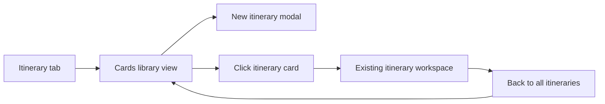
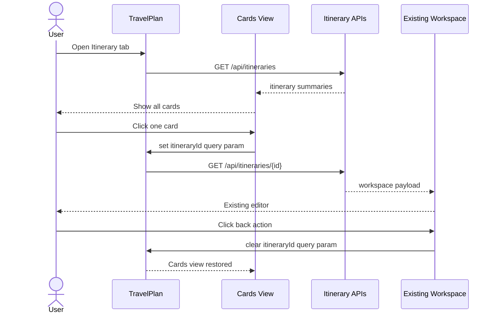

# System Design - Itinerary Cards Navigation

**Feature ID:** itinerary-cards-navigation  
**Status:** HLD - desktop scope locked  
**Date:** 2026-03-22  
**Refs:** [feature-analysis.md](./feature-analysis.md) · [../system-architecture.md](../system-architecture.md) · [`packages/contracts/openapi.yaml`](../../packages/contracts/openapi.yaml) · [../api/error-model.md](../api/error-model.md)

## Scope

- Make the authenticated `Itinerary` tab land on a desktop cards view instead of auto-opening the latest itinerary.
- Reuse the current itinerary detail/editor workspace after card selection.
- Add a clear in-app back action from detail/editor back to cards.
- Keep creation, stay editing, day editing, and storage model unchanged except where needed to support cards listing.

## Desktop Information Architecture

- `Cards library view`: primary entry state, shows all reopenable itineraries plus `New itinerary`.
- `Detail workspace`: secondary state, keeps the current `ItineraryWorkspace` and `ItineraryTab` behavior.
- `Back action`: persistent control near the workspace header; removes selection without leaving the tab.

## Route And Query State

- Keep the current route at `/`; do not add a new page segment.
- `?tab=itinerary` means cards view.
- `?tab=itinerary&itineraryId=<id>` means detail/editor for that itinerary.
- Back navigation deletes `itineraryId` and preserves `tab=itinerary`.
- Deep links with `itineraryId` remain valid and continue to open the detail/editor directly.
- `New itinerary` keeps its current behavior: after create success, navigate to `?tab=itinerary&itineraryId=<newId>`.

## Primary User Flows

## Subsystem Boundaries

- `app/page.tsx`: stop resolving latest itinerary by default for the authenticated `Itinerary` tab; only hydrate a detail workspace when `itineraryId` is present.
- `components/TravelPlan.tsx`: remains the tab shell and URL-state owner; switches between cards view and existing workspace using `itineraryId` presence.
- `new ItineraryCardsView component`: fetches or hydrates itinerary summaries, renders populated/empty/error/loading states, and emits `onOpenItinerary(id)`.
- `components/ItineraryWorkspace.tsx`: stays the detail workspace boundary; add a top-level back affordance and keep existing editor/stay flows unchanged.
- `app/api/itineraries/route.ts`: add `GET` for the current user's card summaries; keep `POST` unchanged.
- `app/lib/itinerary-store/*`: reuse `listByOwner`; no storage schema change.

## API And Storage Implications

- Add `GET /api/itineraries` returning ordered card summaries for the signed-in user.
- Summary payload is minimal: existing itinerary metadata plus derived `dayCount` and `stayCount` for card display.
- Keep `GET /api/itineraries/{itineraryId}` as the detail entry contract.
- No new write endpoints.
- No persistence-model change: current per-user index plus itinerary records already support list-and-open.
- Sort cards by `updatedAt desc` so the most recently touched itinerary appears first.

## Error Model

- Reuse shared `{ error: "CODE" }` responses from `docs/api/error-model.md`.
- Cards list load: `401 UNAUTHORIZED`, `500 INTERNAL_ERROR`; UI shows inline cards-area recovery with retry.
- Detail open: keep `403 ITINERARY_FORBIDDEN` and `404 ITINERARY_NOT_FOUND`; UI shows a recoverable error with `Back to all itineraries`.
- Dirty-state behavior follows current workspace rules; this feature must not invent a new unsaved-changes policy.

## Compatibility Decisions

- Preserve current detail/editor layout, client state, and save endpoints.
- Preserve deep-link compatibility for existing `itineraryId` URLs.
- Avoid introducing a new router subtree, nested layout, or dedicated detail page.
- Keep desktop-only acceptance: no mobile-specific states or route variants.

## FE/BE Execution Slices

| Slice | Outcome | FE | BE |
|---|---|---|---|
| S0 | Contract and route-state agreement | define cards/detail state in shell | add list contract + response shape |
| S1 | Cards view as default tab state | render cards/empty/loading/error states | implement `GET /api/itineraries` |
| S2 | Open selected itinerary in existing workspace | card click -> query sync -> workspace handoff | reuse existing detail read path |
| S3 | In-app back from detail to cards | add persistent back control + recovery path | no new BE work |
| S4 | Hardening and regression coverage | component + E2E flows for cards/open/back | auth + list ordering + contract tests |

## Risks And Follow-ups

- Existing server logic currently resolves latest itinerary when `itineraryId` is absent; FE and BE must remove that default together to avoid cards/detail mismatch.
- If card metadata needs richer preview later, extend only the list response; keep workspace payload unchanged.
- Unsaved inline edits may already block tab switches; back-to-cards should reuse that guard instead of bypassing it.
