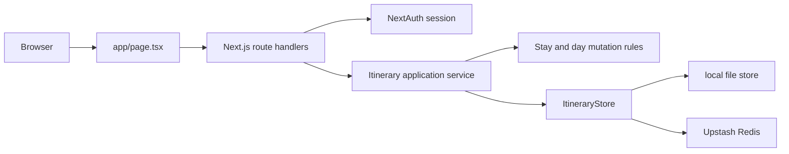
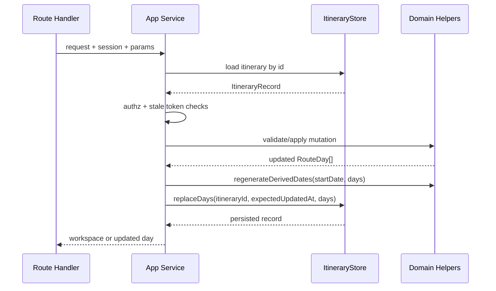

# Backend Low-Level Design - Itinerary Creation and Stay Planning

**Feature ID:** itinerary-creation-and-stay-planning  
**Status:** LLD - MVP ready for implementation  
**Date:** 2026-03-21  
**Refs:** [feature-analysis.md](./feature-analysis.md) · [system-design.md](./system-design.md) · [implementation-plan.md](./implementation-plan.md) · [../system-architecture.md](../system-architecture.md) · [../backend-lld.md](../backend-lld.md) · [`../../packages/contracts/openapi.yaml`](../../packages/contracts/openapi.yaml) · [../api/error-model.md](../api/error-model.md)

## Scope

- Deliver MVP backend support for per-user itineraries inside the existing Next.js route-handler monolith.
- Cover itinerary store abstraction, create/read itinerary APIs, append stay API, patch stay API, itinerary-scoped day-plan updates, ownership checks, persistence, and test gates.
- Keep the editor-facing payload as `RouteDay[]`; stays remain derived, not normalized into a separate table.

## Non-goals

- Duplicate itinerary flow, middle stay insertion, stay deletion, train-edit API redesign, or cross-user collaboration.
- Strong multi-writer concurrency control beyond last-write-wins plus reserved `WORKSPACE_STALE` handling.
- Separate backend service, ORM adoption, or browser/API boundary changes outside current same-origin Next.js handlers.

## Runtime Fit

- New handlers live under `app/api/itineraries/**/route.ts`; auth continues through `auth()` in route handlers.
- New backend modules live under `app/lib/itinerary-store/` and pure itinerary domain helpers under `app/lib/itinerary-editor/`.
- `app/page.tsx` keeps server-side data loading; it resolves the selected or latest owned itinerary and passes the returned `RouteDay[]` workspace payload into the existing `TravelPlan`/`ItineraryTab` flow.

## Module Boundaries

### `ItineraryStore`

Backend-facing abstraction; no React types or route-handler concerns.

- `createShell(input)` -> persists metadata + empty `days`.
- `getById(itineraryId)` -> returns full itinerary record.
- `listByOwner(ownerEmail)` -> returns owner summaries ordered by `updatedAt desc`.
- `getLatestByOwner(ownerEmail)` -> convenience for `app/page.tsx` fallback.
- `replaceDays(itineraryId, expectedUpdatedAt, days)` -> atomic itinerary-day replacement with metadata bump.
- `updateMetadata(itineraryId, expectedUpdatedAt, patch)` -> for shell naming only if needed later; not required by MVP handlers.

### Application Service

Single orchestration layer used by handlers.

- Owns authz, not-found mapping, date regeneration, stay derivation, stale-write checks, and workspace shaping.
- Returns `ItineraryWorkspace` responses matching `packages/contracts/openapi.yaml`.

### Pure domain helpers

- `deriveStays(days)` groups contiguous `RouteDay.overnight` blocks.
- `buildBlankDays(startDate, startDayNum, city, nights)` creates blank appended days.
- `regenerateDerivedDates(startDate, days)` rewrites `date`, `weekDay`, and `dayNum` for the full array.
- `applyAppendStay(days, city, nights)` and `applyPatchStay(days, stayIndex, patch)` enforce stay rules without I/O.
- `canRemoveTrailingDays(daysToRemove)` returns false when any removed day has non-empty authored `plan` or non-empty `train`.

## Data Model

### Canonical record

`ItineraryRecord` is the persistence unit.

- `id`
- `ownerEmail`
- `name`
- `startDate`
- `status` = `draft`
- `createdAt`
- `updatedAt`
- `days: RouteDay[]`

### Derived view

- `stays` is computed on read from contiguous `overnight` values.
- Empty itinerary is valid: `days = []`, `stays = []`.
- `RouteDay.plan` remains `{ morning, afternoon, evening }` and `RouteDay.train` remains the current array shape so `ItineraryTab` does not need a backend-only transform.

## Persistence Design

- **Prod / Upstash:** store one JSON document per itinerary key: `itinerary:<id>`.
- **Prod / Upstash index:** maintain `user-itineraries:<ownerEmail>` as ordered itinerary id list for latest lookup and future switcher support.
- **Local file:** store `data/itineraries/<id>.json` plus `data/itineraries/index/<owner-hash>.json`.
- Persist the whole itinerary document on every write to keep metadata and `days` in one atomic unit per itinerary.
- `updatedAt` acts as the optimistic concurrency token; stale writes return `409 WORKSPACE_STALE` if the stored value changed since the client snapshot.
- Existing `routeStore` remains a legacy seed source only; new itinerary APIs do not write to `route` or `route-test`.

## API Behavior

The contract source remains `packages/contracts/openapi.yaml`. Rules below define server behavior that is not obvious from schema alone.

### `POST /api/itineraries`

- Requires authenticated session.
- Validates `startDate` as a calendar date and `name` as optional trimmed string up to contract length.
- Creates a record with `days = []`, `status = draft`, and `name = trimmed input or auto-generated fallback`.
- Adds the new `id` to the owner's index and returns `201` with summary plus workspace URL.
- No partial record is written if validation fails.

### `GET /api/itineraries/{itineraryId}`

- Requires authenticated session and ownership of the itinerary.
- Returns metadata, derived stays, and raw `days`.
- Empty itinerary returns `200` with empty arrays, not `404`.

### `POST /api/itineraries/{itineraryId}/stays`

- Requires authenticated session and ownership.
- Validates trimmed `city` and integer `nights >= 1`.
- Appends a new stay to the end only.
- Generates blank `RouteDay` rows with that `city`, empty `plan`, empty `train`, then regenerates all derived date fields from `startDate`.
- Returns the full updated workspace payload.

### `PATCH /api/itineraries/{itineraryId}/stays/{stayIndex}`

- Requires authenticated session and ownership.
- `stayIndex` addresses the derived stay list from the current stored snapshot.
- Accepts `city`, `nights`, or both; at least one field must be present.
- Returns full updated workspace payload so the client can replace local itinerary state atomically.

#### City rules

- Trimmed city is required when `city` is present.
- Renames only the targeted contiguous stay block.
- Adjacent stays with the same final city are merged server-side into one contiguous block before response shaping.

#### Nights rules

- Nights must be an integer `>= 1`.
- **Non-last stay:** change target stay length by borrowing from or donating to the next stay only; total day count is unchanged.
- **Last stay expand:** append blank days for the delta, then regenerate dates.
- **Last stay shrink:** remove trailing days only when all removed days have empty `plan` sections and empty `train`; otherwise return `409 STAY_TRAILING_DAYS_LOCKED`.
- **City + nights:** apply the nights mutation first against the current stay block, then rewrite the final targeted block city.

### `PATCH /api/itineraries/{itineraryId}/days/{dayIndex}/plan`

- Requires authenticated session and ownership.
- Validates `dayIndex` bounds against the stored itinerary and requires all three plan fields to be strings.
- Updates exactly one day's `plan`; `overnight`, `date`, `weekDay`, `dayNum`, and `train` are preserved.
- Returns the updated `RouteDay` only, matching the current editor contract.

## Auth And Ownership

- Every itinerary route calls `auth()` and returns `401 UNAUTHORIZED` with no session.
- Authorization is record ownership by `ownerEmail === session.user.email`.
- Existing same-origin cookie/session model remains unchanged; no new CORS or CSRF design is needed for MVP.
- Ownership failures return `403 ITINERARY_FORBIDDEN`; missing ids return `404 ITINERARY_NOT_FOUND`.

## Mutation Sequencing

## Validation And Error Mapping

- `400 INVALID_START_DATE` - invalid or missing shell start date.
- `400 INVALID_ITINERARY_NAME` - invalid optional name.
- `400 STAY_CITY_REQUIRED` - blank city after trim.
- `400 STAY_NIGHTS_MIN` - nights below `1` or non-integer.
- `404 STAY_INDEX_INVALID` - derived stay does not exist for the stored snapshot.
- `409 STAY_TRAILING_DAYS_LOCKED` - last-stay shrink would drop authored trailing content.
- `409 WORKSPACE_STALE` - client writes against an outdated `updatedAt` snapshot.
- `500 INTERNAL_ERROR` - unexpected store or server failure.

## Logging And Ops

- Log `route`, `itineraryId`, `userEmail`, `errorCode`, and latency bucket on every write path.
- Do not log full `days`, `plan`, or `train` payloads.
- Metrics to watch: itinerary create success rate, stay append/patch error rate, `409` rate, and p95 handler latency.

## Tiered Test Strategy

### Tier 0

- Lint and typecheck for store interfaces, route params, and contract-generated types.

### Tier 1

- Pure domain tests for stay derivation, append generation, city rename, non-last borrow/donate, last-stay expand, last-stay shrink guard, merge-on-same-city, and date regeneration.
- Store tests for file and Upstash implementations, owner index ordering, `createShell`, `getLatestByOwner`, and optimistic concurrency token handling.

### Tier 2

- Route-handler tests with mocked auth + real store implementation against temp file fixtures.
- Cover `401`, `403`, `404`, `409`, validation `400`s, happy-path create/read/append/patch/day-plan flows, and persistence of the current `RouteDay[]` shape.
- Include one end-to-end write chain: create itinerary -> append stay -> patch stay city+nights -> patch day plan -> reload workspace.

## Risks And Assumptions

- `stayIndex` is snapshot-relative; stale editors must send the last seen `updatedAt` or they can mutate the wrong block.
- Merging adjacent same-city stays is simpler for `RouteDay[]` integrity, but FE must accept that a patched stay can change the returned stay count.
- Whole-document writes match current store patterns and keep implementation simple, but they do not solve true concurrent editing.
- Assumes `startDate` is mandatory for MVP and date regeneration is the backend source of truth after every stay mutation.
