# Feature Analysis - Itinerary Creation and Stay Planning

**Feature ID:** itinerary-creation-and-stay-planning  
**Status:** Ready for tech/design handoff  
**Date:** 2026-03-21  
**Project:** travel-plan-web-next

## User Problem

Authenticated travellers can edit an existing seeded itinerary, but they cannot start a brand-new trip and then build it up city by city. The current product shape is strong at inline editing inside `ItineraryTab`, but weak at first-time setup and progressive trip construction.

## Recommendation

### Primary Flow: Guided Create -> Land in Itinerary -> Add Stays Progressively

Recommend a lightweight creation flow that collects only the minimum trip shell up front, then moves the user into the existing itinerary workspace for step-by-step stay building.

Why this should be primary:

- Fits the current product: the app already centers the itinerary table as the main editing surface.
- Avoids a large new planning surface or architecture reset.
- Reduces first-run friction versus a long wizard.
- Preserves the app's strength: incremental editing after the itinerary exists.

### Secondary Flow: Quick Duplicate / Start from Existing Itinerary

Recommend a secondary entry point that lets a user create a new itinerary from the current seeded itinerary or a prior itinerary, then edit stays progressively.

Why this should be secondary:

- Useful for repeat trip planning and "same route, adjusted nights" behavior.
- Lower effort than manual re-entry for similar trips.
- Should not replace the primary empty-start flow because it assumes reusable prior content.

## Primary UX Flow

```mermaid
flowchart LR
    A[Authenticated user on itinerary area] --> B[Click New itinerary]
    B --> C[Create itinerary sheet or modal]
    C --> D[Enter trip name optional, start date optional, first city required]
    D --> E[Create blank itinerary shell]
    E --> F[Open itinerary workspace]
    F --> G[Empty-state guidance in itinerary]
    G --> H[Add first stay]
    H --> I[Add next stay]
    I --> J[Edit plans and train details later]
```

## Key Screens and Steps

### 1. Entry Point

- Add a clear `New itinerary` action in the authenticated itinerary area.
- If the user already has an itinerary open, the action should still be available as a secondary top-level action, not hidden in settings.

### 2. Create Itinerary Sheet / Modal

Collect only setup fields needed to create an editable shell:

- itinerary name: optional but recommended
- start date: optional if the current data model cannot yet support dates cleanly during MVP
- first stay city: required

Do not ask for the full route, all cities, or all day-by-day plans here.

### 3. New Itinerary Workspace

After create, open the familiar itinerary surface with an explicit empty/progressive state:

- first stay card/row visible
- CTA to `Add next stay`
- CTA to `Add day details later`
- clear note that plans and train schedule can be filled in incrementally

### 4. Add Stay Progressively

Recommend a simple repeated stay-building interaction:

- choose city
- choose number of nights
- insert at end by default
- return to itinerary immediately

This should feel like extending the existing stay model, not launching a separate complex planner.

### 5. Edit Existing Stays

Once stays exist, support these lightweight actions:

- edit city name for a stay block
- edit number of nights for a stay block
- add a new stay after any existing stay
- delete a stay if it has not accumulated required downstream details, or with clear confirmation if supported later

## Secondary UX Flow

### Duplicate Existing Itinerary

1. User selects `Duplicate itinerary` from an existing itinerary.
2. User confirms name and optional start-date adjustment.
3. App opens the duplicated itinerary as a separate editable copy.
4. User adjusts stay lengths, inserts new stays, or deletes unnecessary stays.

This is better than a template gallery for now because the current product appears to manage a narrow set of itinerary data rather than a broad template ecosystem.

## Rationale vs Alternatives

- Prefer **lightweight create + progressive editing** over a full-screen multi-step wizard because the app already has a capable itinerary editor and does not need a second primary planning paradigm.
- Prefer **stay-first construction** over day-by-day construction because the current itinerary model already groups days around overnight stays.
- Prefer **duplicate existing itinerary** over a new template marketplace because it matches the current single-user, personal-trip shape.
- Avoid a map-first or drag-canvas planner for MVP; it would be a larger UX and technical shift with weak reuse of the current table-based editor.

## In Scope

- Create a brand-new itinerary from an authenticated itinerary area.
- Let the user create an itinerary with minimal setup.
- Let the user add and edit stays progressively after creation.
- Make the primary post-create surface the existing itinerary workspace pattern, with empty-state guidance.
- Provide a secondary duplicate flow for faster iteration from existing data.

## Out of Scope

- Collaborative itinerary creation.
- Large trip-template systems.
- Map-based route authoring.
- Automatic booking, pricing, or ticketing.
- Full architectural redesign of itinerary storage.
- Advanced optimization such as auto-balancing stays across the whole trip.

## Edge Cases

- User starts creation and cancels: no partial itinerary should appear in the main list/workspace.
- User creates an itinerary with only one stay: allowed; they can add more later.
- User creates an itinerary and leaves plans blank: allowed; itinerary remains valid but clearly incomplete.
- User tries to add a stay without a city: blocked with inline validation.
- User tries to set nights below 1: blocked with inline validation.
- User has an existing itinerary and starts a new one accidentally: warn before abandoning unsaved edits.
- If date handling is not yet robust in the current model, MVP may allow creation without requiring dates rather than forcing brittle date logic.

## Functional Requirements

- Authenticated users can start a new itinerary from the main itinerary experience.
- The initial create step requires less effort than filling the whole trip at once.
- After creation, the user can add stays one at a time without leaving the itinerary workspace.
- The user can edit stay city and stay duration after creation.
- The user can duplicate an existing itinerary into a separately editable itinerary.
- The flow should preserve compatibility with the current itinerary-centric editing experience.

## Non-Functional Requirements

- The creation flow should feel lightweight and complete in under a minute for a basic itinerary shell.
- Empty and incomplete states must be explicit and understandable on mobile and desktop.
- The new flow should not require a separate complex planning UI for MVP.
- Validation and error handling should match the clarity level of current inline editing patterns.

## Acceptance Criteria

### AC-1: Start a New Itinerary

Given an authenticated user is in the itinerary area  
When they choose `New itinerary` and complete the required setup fields  
Then a new itinerary is created  
And the user lands in an editable itinerary workspace for that itinerary

### AC-2: Minimal Setup Only

Given the user is creating a new itinerary  
When they open the create flow  
Then they are not required to define the full route, every stay, or all day plans before creation

### AC-3: Progressive Stay Building

Given a newly created itinerary exists  
When the user adds a stay with a city and nights value  
Then the stay appears in the itinerary immediately  
And the user can continue adding another stay without restarting the itinerary

### AC-4: Edit a Stay After Creation

Given an itinerary already has one or more stays  
When the user edits a stay's city or nights  
Then the itinerary updates to reflect the new stay values

### AC-5: Incomplete Itinerary Is Allowed

Given a user has created an itinerary shell  
When some plans or later stays are still blank  
Then the itinerary remains accessible and editable  
And the UI clearly indicates the next recommended action

### AC-6: Duplicate Existing Itinerary

Given the user has an existing itinerary  
When they choose `Duplicate itinerary`  
Then a separate editable copy is created  
And changes to the copy do not alter the original itinerary

### AC-7: Validation for Stay Creation

Given the user is adding or editing a stay  
When required fields are missing or nights is less than 1  
Then the save action is blocked  
And the UI shows a clear validation message

### AC-8: Safe Cancelation

Given the user has opened the create flow but has not confirmed creation  
When they cancel  
Then no new itinerary is added

## Success Metrics

- More authenticated users can create a usable itinerary without leaving the app.
- Time to first itinerary creation stays low versus a full wizard approach.
- Users can reach first stay creation in one short flow.
- Users can continue trip planning incrementally instead of abandoning setup due to high upfront effort.

## Assumptions, Risks, and Unknowns

- Assumption: the current app can support more than one itinerary conceptually, even if MVP initially represents this as a new editable record rather than a broad library UI.
- Assumption: progressive stay creation can reuse much of the current itinerary table/stay-edit mental model.
- Risk: if the current storage model is tightly coupled to one seeded itinerary only, tech design may need a minimal persistence expansion.
- Risk: if dates are deeply coupled to all rows up front, requiring dates during creation could add disproportionate complexity.
- Unknown: whether MVP should support deleting stays immediately or defer deletion until after create/edit stability is proven.
- Unknown: whether users need a visible itinerary switcher/list in MVP, or if the first release can focus on creating and opening the newest itinerary.

## Priority Decision

- **P1:** lightweight create flow that lands in the existing itinerary workspace
- **P2:** progressive add/edit stay actions inside that workspace
- **P3:** duplicate existing itinerary for faster repeat planning
- **Not recommended for MVP:** full-route wizard, map planner, or template gallery

## Handoff

Project coordinator should plan the next phase around the primary flow above and ask tech/design leads to confirm the smallest storage and navigation changes needed to support a new itinerary shell without disrupting the current itinerary editor.
