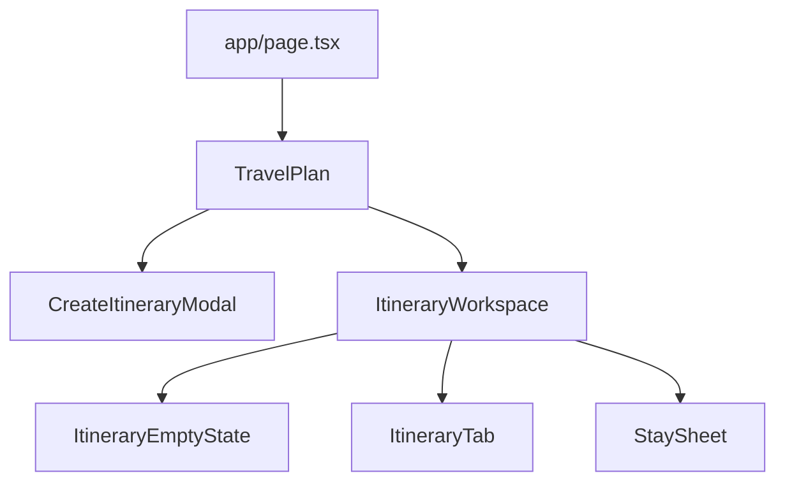
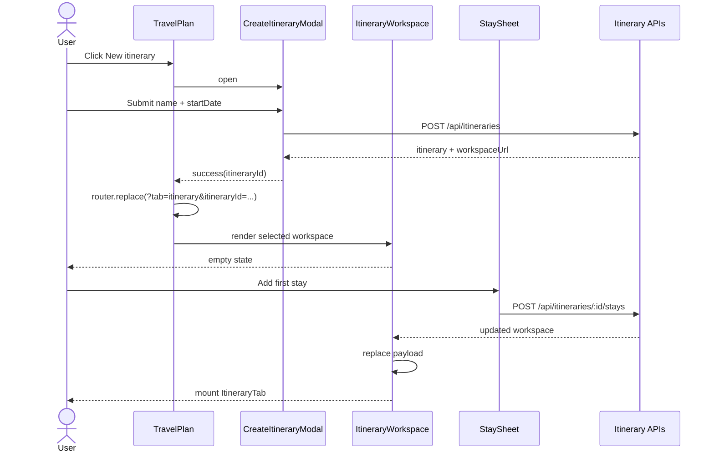

# Frontend Low-Level Design - Itinerary Creation and Stay Planning

**Feature:** itinerary-creation-and-stay-planning  
**Status:** LLD - MVP ready for implementation  
**Date:** 2026-03-21  
**Refs:** [feature-analysis.md](./feature-analysis.md) · [system-design.md](./system-design.md) · [implementation-plan.md](./implementation-plan.md) · [../frontend-architecture.md](../frontend-architecture.md) · [`packages/contracts/openapi.yaml`](../../packages/contracts/openapi.yaml) · [../api/error-model.md](../api/error-model.md)

## 1. Scope

### In scope
- New itinerary shell modal from the authenticated itinerary area.
- Query-param itinerary selection with `?tab=itinerary&itineraryId=<id>`.
- Empty itinerary workspace state when the selected itinerary has zero `days`.
- One reusable stay sheet for `Add first stay`, `Add next stay`, and full `Edit stay`.
- Integration with the existing `ItineraryTab` for day-plan editing after a workspace has at least one stay.
- Keep quick inline nights edit in `ItineraryTab` as a separate fast path from the full stay sheet.

### Out of scope
- Duplicate itinerary, template/gallery, map planning, stay deletion, middle insertion.
- Redesign of day-plan, train, export, or drag/drop interactions already owned by `ItineraryTab`.
- New frontend state libraries or a new route tree.

## 2. Route and information architecture

- Keep `/` as the only workspace route for MVP.
- `tab` continues to select the visible panel; `itineraryId` selects the itinerary workspace within the itinerary tab.
- Server picks the latest itinerary when `itineraryId` is absent; client keeps the URL canonical after create/select.
- If the selected itinerary has no days, render workspace guidance instead of the itinerary table.

## 3. Component boundaries

### `app/page.tsx`
- Read `searchParams.tab` and `searchParams.itineraryId`.
- When authenticated, load the selected itinerary workspace payload on the server.
- Pass the initial workspace payload and selected ids into `TravelPlan`.
- Do not push stay/create form state into the server component.

### `components/TravelPlan.tsx`
- Remains the client shell for top-level tabs.
- Owns URL sync for active tab and selected `itineraryId` via `useRouter`, `usePathname`, and `useSearchParams`.
- Adds the `New itinerary` trigger near the itinerary tab header, not inside `ItineraryTab`.
- Blocks switching/new-create when child workspace reports unsaved inline day edits.
- Mounts a new `ItineraryWorkspace` wrapper instead of rendering `ItineraryTab` directly.

### `components/ItineraryWorkspace.tsx` (new)
- Container for itinerary-only workspace behavior.
- Props: initial workspace payload, selected `itineraryId`, selection callbacks, and unsaved-change reporting.
- Chooses between empty-state rendering and `ItineraryTab` rendering.
- Owns create-stay/edit-stay network mutations and authoritative workspace refresh.
- Owns the full stay sheet open state and selected stay context.

### `components/CreateItineraryModal.tsx` (new)
- Lightweight modal for `name` and required `startDate`.
- Handles inline field validation and submit-pending state.
- On success, returns the created itinerary summary/workspace URL to `TravelPlan`; it does not own navigation.

### `components/ItineraryEmptyState.tsx` (new)
- Dedicated zero-days workspace state.
- Shows itinerary metadata, a short explanation, and the primary CTA `Add first stay`.
- Must not mount `ItineraryTab`; this avoids table-specific assumptions on empty data.

### `components/StaySheet.tsx` (new)
- Reusable add/edit sheet rendered as modal on desktop and bottom sheet on mobile.
- Modes: `add-first`, `add-next`, `edit`.
- Fields: `city`, `nights`; edit mode may prefill both and allow city correction.
- Submits through callbacks from `ItineraryWorkspace`; no direct fetches inside the presentational form.

### `components/ItineraryTab.tsx`
- Keeps ownership of day-level editing, quick inline nights edit, train editor, export, and local per-day overrides.
- Receives `itineraryId` in addition to itinerary data so all day-level writes target itinerary-scoped APIs.
- Emits workspace-level intents upward for `Add next stay`, `Edit stay`, and unsaved-inline-edit status.
- Does not absorb full stay-edit form state.

### `components/StayEditControl.tsx`
- Stays the fast inline numeric affordance for nights-only changes.
- Remains available where the current table layout supports it.
- Never edits city and never becomes the shared add/edit form.

## 4. State and data flow

| State | Owner | Type | Notes |
|---|---|---|---|
| Active tab + selected `itineraryId` | `TravelPlan` | route state | Source of truth mirrors URL search params |
| Loaded workspace payload | `ItineraryWorkspace` | server state mirrored locally | Replace atomically after create/add/edit responses |
| Shell modal open/pending/errors | `TravelPlan` + `CreateItineraryModal` | local UI state | Reset on close/success |
| Stay sheet open/mode/form errors | `ItineraryWorkspace` + `StaySheet` | local UI state | Reused across add/edit flows |
| Inline day edit and quick nights edit state | `ItineraryTab` | local UI state | Existing model remains local to the table |
| Unsaved inline edits flag | `ItineraryTab` -> `ItineraryWorkspace` -> `TravelPlan` | derived UI state | Used to guard navigation/create |

## 5. Query-param selection and refresh rules

- URL shape for MVP: `/?tab=itinerary&itineraryId=<id>`.
- `TravelPlan` owns search-param writes; use `router.replace` for auto-selection after create and `router.push` only for user-initiated switching if history is desirable.
- Preserve unrelated search params.
- If `tab !== itinerary`, keep `itineraryId` in the URL so returning to the tab restores the same workspace.
- If the selected itinerary fails with `ITINERARY_NOT_FOUND` or `ITINERARY_FORBIDDEN`, show a recoverable workspace state with CTA to return to the default/latest itinerary.

## 6. UX states

### Create shell modal
- Required: `startDate`; optional: `name`.
- Disable submit while pending.
- Inline validation maps to `INVALID_START_DATE` and `INVALID_ITINERARY_NAME`.
- Request-level failure shows compact form-level error and keeps entered values.

### Empty workspace
- Header shows itinerary name and formatted start date.
- Primary CTA: `Add first stay`.
- Secondary supporting copy explains that plans and train details are added after the first stay exists.
- No empty table shell; use a card-like workspace state to reduce confusion.

### Stay sheet
- `add-first`: title `Add first stay`, primary action `Create stay`.
- `add-next`: title `Add next stay`, optionally show current last city as context.
- `edit`: title `Edit stay`, primary action `Save stay`; allow city and nights edits.
- Inline validation maps to `STAY_CITY_REQUIRED` and `STAY_NIGHTS_MIN`.
- `STAY_TRAILING_DAYS_LOCKED` and `WORKSPACE_STALE` render as form-level errors with retry guidance.

### Itinerary table integration
- Once `days.length > 0`, render existing `ItineraryTab`.
- Add clear workspace-level actions above the table: `Add next stay` and context `Edit stay` actions per stay block.
- Quick inline nights edit remains visible for rapid numeric changes and should keep current optimistic/revert behavior.
- Full `Edit stay` entry point should be discoverable from the overnight block header/overflow, not by overloading the inline nights pencil.

## 7. `ItineraryTab` integration contract

| Concern | Owner | MVP rule |
|---|---|---|
| Day plan editing | `ItineraryTab` | Keep current interaction model; repoint writes to itinerary-scoped endpoint |
| Quick nights edit | `StayEditControl` inside `ItineraryTab` | Nights-only, optimistic, fast path |
| Full stay edit | `ItineraryWorkspace` + `StaySheet` | City + nights, non-inline, authoritative workspace refresh |
| Add first/next stay | `ItineraryWorkspace` + `StaySheet` | Append-only |
| Empty workspace | `ItineraryWorkspace` | Do not mount table until first stay exists |

Recommended `ItineraryTab` additions:
- `itineraryId: string`
- `onRequestAddStay(): void`
- `onRequestEditStay(stayIndex: number): void`
- `onDirtyStateChange(isDirty: boolean): void`

Assumption: `ItineraryTab` can derive stay metadata from `days` as it does today; the new full-edit trigger uses the same derived `stayIndex` addressing as the contract.

## 8. Accessibility and mobile

- Shell modal and stay sheet use `role="dialog"`, `aria-modal="true"`, labelled title, descriptive help text, and focus return to their trigger.
- Initial focus: first invalid field on failed submit, otherwise first input.
- `Escape` closes only when not submitting.
- Form errors use `role="alert"`; field errors connect through `aria-describedby`.
- On mobile, stay editing should use a bottom sheet with safe-area padding and sticky primary/secondary actions.
- Workspace actions above the table should wrap cleanly on narrow screens; avoid placing the only add/edit affordance inside horizontally clipped table content.
- Keep icon-only stay actions labelled with city context, for example `Edit stay for Paris`.

## 9. FE test strategy

### Tier 0
- Lint, typecheck, and route-level compile safety for new props and search-param parsing.

### Tier 1
- `CreateItineraryModal`: required date validation, submit-pending state, request error rendering, success callback.
- `ItineraryEmptyState`: correct CTA wiring and metadata display.
- `StaySheet`: mode-specific titles, prefills, validation, locked-last-stay error rendering, mobile action layout.
- `TravelPlan` / `ItineraryWorkspace`: query-param sync, empty-vs-table branching, unsaved-change guard behavior.
- `ItineraryTab`: add/edit callbacks exposed without regressing quick inline nights edit behavior.

### Tier 2
- Create flow: successful shell create updates URL to the new `itineraryId` and renders empty workspace.
- Add-first/add-next flow: contract-shaped stay payload updates workspace and mounts/refreshes `ItineraryTab`.
- Full stay edit flow: city+nights patch refreshes workspace; 409 stale/locked errors remain recoverable.
- Day-plan save flow includes `itineraryId` targeting and stays isolated per selected itinerary.

### Tier 3
- Authenticated user creates a new shell, lands on the empty workspace, adds first stay, then sees the itinerary table.
- User adds a next stay, uses inline quick nights edit, then opens full stay edit and changes city without regressing inline flow.
- User reloads with `?tab=itinerary&itineraryId=<id>` and returns to the same workspace.

## 10. Risks, assumptions, and open points

- Assumption: server returns a workspace payload shaped like `ItineraryWorkspace` after stay mutations so FE can replace local workspace state atomically.
- Assumption: selected itinerary resolution happens server-side in `app/page.tsx`; FE does not need a second fetch on first load.
- Risk: current `ItineraryTab` owns substantial local editing state, so the new dirty-state guard must be added carefully to avoid false positives while users type.
- Risk: if the table remains the only place for stay-level actions, mobile discoverability will be poor; workspace-level controls are required.
- Open point for FE/BE handshake: whether plan-save responses should continue returning just `RouteDay` or a richer payload when stale-workspace detection is added later. MVP can keep the current narrow response.
