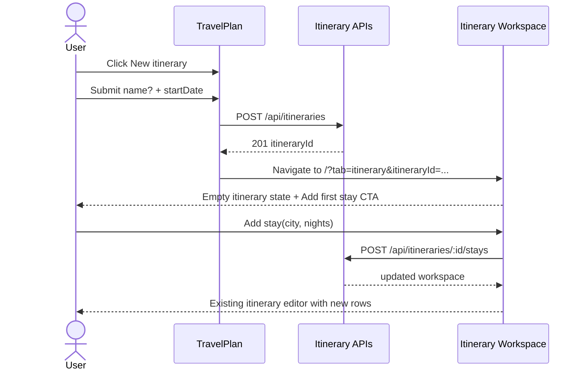

# System Design - Itinerary Creation and Stay Planning

**Feature ID:** itinerary-creation-and-stay-planning  
**Status:** HLD - MVP scope locked  
**Date:** 2026-03-21  
**Refs:** [feature-analysis.md](./feature-analysis.md) · [../system-architecture.md](../system-architecture.md) · [`packages/contracts/openapi.yaml`](../../packages/contracts/openapi.yaml) · [../api/error-model.md](../api/error-model.md)

## MVP Scope

- Authenticated user creates a new itinerary shell with `name` optional and `startDate` required.
- App lands the user in the existing itinerary workspace for that new itinerary.
- User adds stays progressively from the workspace, append-only for MVP.
- User edits stay city and stay nights from the workspace.
- Existing day plan editing stays in `ItineraryTab`.
- Exclude duplicate-itinerary, template flows, map flows, middle insertion, and stay deletion.

## Why This Is The Smallest Useful Slice

- Reuses the current day-table editor instead of introducing a second planner surface.
- Avoids full-route upfront setup; only `startDate` is required so day rows can be generated deterministically.
- Keeps stays derived from `RouteDay[]`, which matches the current renderer and save model.

## User Flow

## Subsystem Boundaries

- `app/page.tsx`: resolves authenticated session, selected `itineraryId`, and initial workspace payload.
- `components/TravelPlan.tsx`: keeps tab shell; adds `New itinerary` trigger and itinerary workspace selection state.
- `components/ItineraryTab.tsx`: remains the day-level editor for plans, train details, and quick nights adjustment.
- `Stay create/edit sheet`: new workspace-level UI for add stay and edit city/nights without overloading the inline nights control.
- `ItineraryStore`: new abstraction for per-user itinerary metadata + `RouteDay[]` payloads.

## Navigation And Workspace Implications

- Keep the current `/` route and tab layout.
- Use `itineraryId` search params instead of a new page tree for MVP.
- If the selected itinerary has zero days, render an empty workspace state instead of mounting the full table.
- Unsaved inline plan edits must block `New itinerary` and itinerary switching until saved or discarded.

## Storage Implications

- Replace the single-record assumption with per-itinerary records keyed by `itineraryId`.
- Persist `startDate` in itinerary metadata; recompute `date`, `weekDay`, and `dayNum` server-side after every stay mutation.
- Keep day-level `plan` and `train` payloads on each `RouteDay` so the current editor stays compatible.
- Stay boundaries remain derived from contiguous `overnight` values; no normalized stay table in MVP.

## Stay Mutation Rules

- `Add stay`: append `nights` new blank days to the end of the itinerary with the submitted city.
- `Edit city`: rewrite `overnight` for the targeted stay block only.
- `Edit nights` for non-last stay: retain current borrow-from-next behavior.
- `Edit nights` for last stay: allow expand by appending blank days; allow shrink only when removed trailing days have no user-authored `plan` or `train` data.

## Contract Summary

- `POST /api/itineraries`: create itinerary shell.
- `GET /api/itineraries/{itineraryId}`: read workspace metadata, derived stays, and `RouteDay[]`.
- `POST /api/itineraries/{itineraryId}/stays`: append a stay from the workspace.
- `PATCH /api/itineraries/{itineraryId}/stays/{stayIndex}`: edit stay city and/or nights.
- `PATCH /api/itineraries/{itineraryId}/days/{dayIndex}/plan`: day-level plan save for the current editor.

The authored boundary lives in `packages/contracts/openapi.yaml`.

## City Editing Recommendation

- City editing belongs in MVP because append-only stay creation without city correction leaves users stuck on basic mistakes.
- Do not add city editing into the existing inline nights widget; that control should stay a fast numeric affordance.
- Add a separate `Edit stay` sheet/drawer opened from the overnight block header or overflow action.
- Use the same sheet for `Add first stay`, `Add next stay`, and `Edit stay`; fields are `city` and `nights`.

## Error Model

- Use the shared `{ error: "CODE" }` envelope from `docs/api/error-model.md`.
- Field validation stays inline for shell/stay forms.
- Request failures revert optimistic UI and show a compact toast.
- Ownership and not-found failures transition to a recoverable workspace state instead of a blank crash.

## FE/BE Execution Slices

| Slice | Outcome | FE | BE |
|---|---|---|---|
| S0 | Contract + itinerary store boundary agreed | review contract | define store + API shape |
| S1 | Shell creation + navigation to empty workspace | create modal + empty state | create/read endpoints + persistence |
| S2 | Append-first-stay and append-next-stay flow | stay sheet + workspace refresh | append-stay endpoint + date regeneration |
| S3 | Edit city and nights in workspace | sheet wiring + quick nights affordance | stay patch rules, last-stay logic |
| S4 | Existing plan editor writes against itinerary-scoped route | update `ItineraryTab` requests | plan patch endpoint + auth/ownership |
| S5 | Integration and E2E hardening | critical path tests | storage/auth/invariant tests |

## Risks And Follow-ups

- `stayIndex` addressing is simple but stale clients can target the wrong block; keep `WORKSPACE_STALE` reserved if multi-tab conflicts surface.
- Append-only stay creation is intentional MVP scope; middle insertion is the first post-MVP extension.
- Duplicate-itinerary should reuse `POST /api/itineraries` + a copy strategy later, not change the MVP contracts now.
