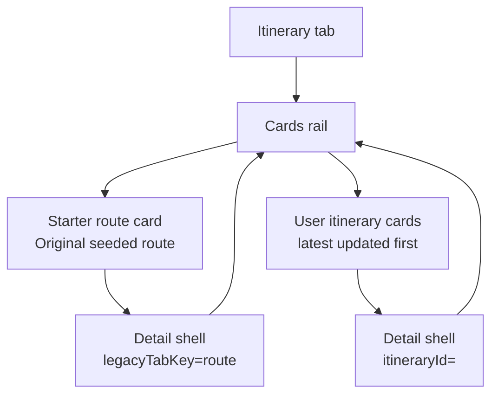
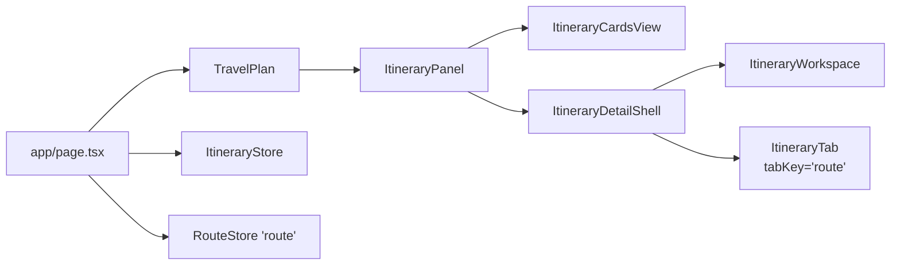

# System Design - Itinerary Desktop Adjustments

**Feature ID:** itinerary-desktop-adjustments  
**Status:** HLD - ready for FE/BE handoff  
**Date:** 2026-03-22  
**Refs:** [../system-architecture.md](../system-architecture.md) · [../itinerary-cards-navigation/system-design.md](../itinerary-cards-navigation/system-design.md) · [../itinerary-detail-ux-cleanup/feature-analysis.md](../itinerary-detail-ux-cleanup/feature-analysis.md) · [`../../packages/contracts/openapi.yaml`](../../packages/contracts/openapi.yaml) · [../api/error-model.md](../api/error-model.md)

## Scope

- Make desktop itinerary cards larger and left-aligned for faster scanning.
- Make the itinerary detail workspace use the same visual content width as `Itinerary (Test)`.
- Surface the original seeded `route` as its own card in the main `Itinerary` cards view.
- Keep user-created itinerary storage, ownership rules, and write APIs unchanged.

## Decision Summary

- Treat this as a desktop presentation plus navigation-target adjustment inside the existing Next.js monolith.
- Keep persisted user itineraries and the seeded `route` as two separate sources; do not migrate or clone the seeded route into each user's itinerary index.
- Add a second detail target inside the `Itinerary` tab: `legacyTabKey=route` for the seeded route card.
- Keep existing itinerary detail reads and writes on `/api/itineraries/:id/*`; keep seeded-route editing on existing legacy `route` store behavior.
- Do not add a new page route, DB table, or auth model.

## Desktop UX Shape

- Cards view uses a single left-aligned desktop rail, not a centered two-column grid.
- Each card grows in width and padding so title, start date, and status metadata scan in one glance.
- The seeded route appears as a distinct starter card, visually separated from user-owned itineraries.
- Detail mode keeps one back action and one workspace rail aligned to the same width as `Itinerary (Test)`.

## Query-State Contract

- `?tab=itinerary` => cards view.
- `?tab=itinerary&itineraryId=<id>` => persisted user itinerary detail.
- `?tab=itinerary&legacyTabKey=route` => seeded route detail.
- FE must never emit both `itineraryId` and `legacyTabKey` together.
- If both are present on load, prefer `itineraryId` and normalize on the next client-side URL write to preserve old deep-link behavior.

## Component Boundaries

- `app/page.tsx`: compose one desktop cards payload from two sources: user itinerary summaries plus seeded-route card metadata.
- `TravelPlan`: replace single `selectedItineraryId` mental model with a small union target: none, itinerary id, or `legacyTabKey=route`.
- `ItineraryCardsView`: render `Starter route` first, then `Your itineraries`; both use the same larger card component.
- `ItineraryDetailShell`: render either `ItineraryWorkspace` or `ItineraryTab tabKey='route'` under the same back/header rail.
- `ItineraryWorkspace`: no contract or persistence change; only width/alignment must match the legacy test-tab presentation.

## Seeded Route Handling

### Why this approach

- It avoids copying the shared seeded route into every user account.
- It preserves all existing user itinerary ids, ownership checks, and ordering rules.
- It reuses code paths that already know how to read and edit the primary legacy `route` store.

### Behavior

- The seeded card is a synthetic view-model entry generated at page-load time from `getRouteStore('route').getAll()`.
- The card is not persisted in `ItineraryStore` and is not included in the user's itinerary index.
- Opening the seeded card routes to `legacyTabKey=route`, then renders the legacy `ItineraryTab` detail surface inside the normal detail shell.
- Opening a saved itinerary still routes to `itineraryId=<id>` and uses `ItineraryWorkspace` plus `/api/itineraries/:id/*`.
- `New itinerary` behavior stays unchanged; created itineraries continue to land in the user-owned list only.

### View-model fields

- Seeded card label: `Original seeded route`.
- Seeded card source badge: `Starter route`.
- Seeded card metadata derives from the `route` payload already available on the server: start date from day 1, day count from `RouteDay[]`, stay count from derived stays.
- Saved itinerary cards keep current metadata and ordering (`updatedAt desc`).

## FE Implications

- Replace centered cards grid with a single-column, left-aligned desktop stack.
- Introduce a shared desktop width token/utility for both `ItineraryDetailShell` and `ItineraryWorkspace` so the header rail and table rail match `Itinerary (Test)` width.
- Keep all edit affordances, discard dialog rules, and back-to-cards behavior unchanged.
- Add a small target-aware detail switch: `itineraryId` => `ItineraryWorkspace`; `legacyTabKey=route` => `ItineraryTab`.

## BE / Server Implications

- No new API endpoint.
- No `ItineraryStore` schema change.
- No ownership change for user itineraries.
- Server-render layer must assemble seeded-card metadata alongside stored itinerary summaries.
- If the app later uses `GET /api/itineraries` for client refresh, that route must mirror the same merged cards payload; this slice does not require a public contract change first.

## Contracts And Errors

- `packages/contracts/openapi.yaml`: no path or schema expansion for this slice; `/api/itineraries` remains the persisted-itinerary contract.
- `docs/api/error-model.md`: no new error codes.
- Seeded-route load failures reuse existing legacy route-store failure handling and surface as a recoverable inline error in the detail shell.
- Persisted itinerary errors (`401/403/404/409/500`) remain unchanged.

## Test Gates

- Tier 0: lint, typecheck, formatting.
- Tier 1 FE: cards sections render, seeded card routes correctly, detail width token applied consistently, mixed target URL state normalizes correctly.
- Tier 1 BE/server: seeded card metadata derivation from `route`, persisted itinerary ordering unaffected.
- Tier 2: authenticated page load with seeded card + user cards; open seeded route; back to cards; open saved itinerary.
- Tier 3: desktop E2E covering starter card, saved card, and unchanged create flow.

## Risks And Guardrails

- Do not store the seeded card in `ItineraryStore`; mixing it into the user index would blur ownership and ordering semantics.
- Do not route seeded-card edits through `/api/itineraries/:id/*`; keep the existing legacy `route` behavior until a deliberate migration slice exists.
- Keep section labels explicit so users do not confuse the starter route with their own saved itineraries.
