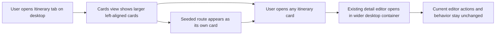

# Feature Analysis - Itinerary Desktop Surface Adjustments

**Feature ID:** itinerary-desktop-surface-adjustments  
**Status:** Ready for FE/BE design handoff  
**Date:** 2026-03-22  
**Project:** travel-plan-web-next

## User Problem

The current desktop cards-first itinerary experience is directionally correct, but three gaps remain: the cards view feels too small and visually centered, the selected-itinerary detail page feels narrower than the current `Itinerary (Test)` workspace, and the original seeded route is no longer recoverable as its own card from the cards view.

## Desired Outcome

- Make the desktop cards view feel like a clear browsing surface with larger, left-aligned itinerary cards.
- Let the selected-itinerary detail page use a wider desktop content width consistent with the current `Itinerary (Test)` tab.
- Show the original seeded route as its own separate itinerary card in the cards view.
- Preserve current cards-first navigation and current detail editor behavior.

## Target UX

## Product Rationale

- Larger left-aligned cards improve scanability and make the cards-first entry feel intentional on desktop.
- A wider detail surface better matches the editing density already proven in the current `Itinerary (Test)` workspace.
- Restoring the seeded route as a separate card keeps the baseline itinerary discoverable without breaking the cards-first model.
- The request is a targeted desktop refinement, not a new navigation or editor redesign.

## Scope

### In Scope

- Desktop cards-view presentation for itinerary cards in the authenticated `Itinerary` tab.
- Desktop selected-itinerary detail-page width after opening a card from cards view.
- Inclusion of the original seeded route as a distinct recoverable card in the cards view.
- Clarifying expected UX behavior for these three adjustments only.

### Out of Scope

- Mobile or tablet layout changes.
- Changes to cards-first navigation flow, back-navigation rules, or deep-link behavior.
- Changes to detail editor controls, editing rules, validation, or persistence behavior.
- Search, sorting, filtering, grouping, pinning, archive, delete, duplicate, or sharing behavior in cards view.
- Any redesign of the `Itinerary (Test)` tab itself.

## Functional Requirements

- On desktop, itinerary cards in the main `Itinerary` tab must render as a left-aligned card collection rather than a centered cluster.
- On desktop, itinerary cards must use a larger visual footprint than a compact tile treatment so users can scan and click them comfortably.
- The original seeded route must appear as its own card in the same cards view users use to open itineraries.
- Selecting the seeded-route card must open the same seeded itinerary content users expect from the original baseline route.
- On desktop, the selected-itinerary detail page in the main `Itinerary` tab must use a wider content width aligned with the current `Itinerary (Test)` tab's workspace width.
- All existing detail-editor interactions and cards-first navigation behavior must remain unchanged.

## Desktop UX Guidance

- **Cards alignment:** when the cards row is not full, cards start at the left edge of the cards content area; the layout should not visually center a small number of cards.
- **Cards size:** favor fewer, larger cards per row over smaller dense tiles; card size should support easy scanning of itinerary identity and key summary metadata on desktop.
- **Detail width:** use the current `Itinerary (Test)` desktop workspace as the visual benchmark for acceptable width in the main `Itinerary` detail page.
- **Seeded route card:** present it as a peer card in the cards view, not as an auto-open default and not merged into another itinerary card.

## Acceptance Criteria

### AC-1: Desktop Cards Are Left-Aligned

Given an authenticated user opens the `Itinerary` tab on desktop  
When the cards view renders with one or more itinerary cards  
Then the card collection begins at the left edge of the cards content area  
And the layout does not center the visible card group within the available row

### AC-2: Desktop Cards Use a Larger Browsing Treatment

Given an authenticated user is viewing itinerary cards on desktop  
When the cards view is rendered  
Then the UI presents a browsing layout with fewer, larger cards per row rather than compact centered tiles  
And each card remains a clear primary click target for opening that itinerary

### AC-3: Seeded Route Appears as a Separate Card

Given an authenticated user opens the `Itinerary` cards view on desktop  
When itinerary cards are listed  
Then the original seeded route appears as its own distinct itinerary card  
And it is not hidden, auto-opened, or folded into another itinerary entry

### AC-4: Seeded Route Card Is Recoverable Like Other Cards

Given the original seeded route card is visible in the cards view  
When the user selects that card  
Then the app opens the original seeded route in the existing itinerary detail/editor experience  
And the cards-first navigation model remains unchanged

### AC-5: Main Itinerary Detail Uses Wider Desktop Width

Given a user opens any itinerary card from the main `Itinerary` cards view on desktop  
When the detail page is shown  
Then the main detail workspace uses a wider desktop content width  
And that width is visually aligned with the current `Itinerary (Test)` tab workspace rather than the narrower current main-itinerary detail layout

### AC-6: Existing Editor Behavior Is Preserved

Given a user is viewing an itinerary detail page after these adjustments  
When they use the existing editor actions  
Then the current detail editor behavior, controls, and editing rules remain unchanged  
And these desktop adjustments do not introduce new editor steps or remove current ones

## Risks and Assumptions

- Assumption: the original seeded route is still a valid product artifact that should remain user-accessible from the main `Itinerary` cards view.
- Assumption: `Itinerary (Test)` provides the intended desktop width benchmark only; its sandbox behavior is not being copied into the main itinerary flow.
- Risk: if the seeded route is sourced differently from user-owned itineraries today, FE/BE design must clarify how it appears as a peer card without changing the cards-first UX.
- Risk: widening the detail surface must not reintroduce duplicate header/actions already cleaned up in `itinerary-detail-ux-cleanup`.

## Success Signals

- Desktop users can scan the cards view more quickly because cards feel larger and start from a predictable left edge.
- The main itinerary detail page no longer feels visually cramped relative to `Itinerary (Test)`.
- Users can explicitly reopen the original seeded route from cards view without losing the current cards-first model.

## Handoff

Project coordinator should route this to FE and BE leads as a small desktop-only refinement slice covering cards sizing/alignment, main-detail width parity with `Itinerary (Test)`, and seeded-route card recoverability, while preserving the current cards-first navigation and detail editor behavior.
