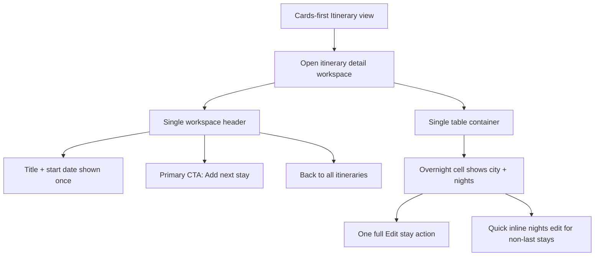

# Feature Analysis - Itinerary Detail UX Cleanup

**Feature ID:** itinerary-detail-ux-cleanup  
**Status:** Ready for FE implementation handoff  
**Date:** 2026-03-22  
**Project:** travel-plan-web-next

## User Problem

The new desktop itinerary detail view repeats core information and exposes too many overlapping controls before the table. Users see the itinerary title/date twice, `Add next stay` twice, multiple `Edit stay` entry points for the same stay, and several stacked containers before they reach the actual planning grid. This makes the workspace feel noisier and harder to scan than needed.

## Goal

Simplify the desktop itinerary detail workspace so users can understand itinerary context quickly, reach the table sooner, and keep all current editing capabilities without losing the cards-first navigation model.

## Product Recommendation

### Recommended Desktop Layout

- Keep one compact workspace header above the table with: `Back to all itineraries`, itinerary title, start date, and one primary `Add next stay` CTA.
- Keep the planning table as the main content immediately under that header.
- In each stay block, show stay metadata once and keep editing actions attached to that stay cell instead of duplicating them in a separate workspace-level actions row.
- Preserve quick inline nights editing for non-last stays and preserve full `Edit stay` access for stays that support full editing today.

### Controls to Keep vs Remove

| Area | Keep | Remove |
|---|---|---|
| Workspace header | `Back to all itineraries`, itinerary title, start date, one `Add next stay` | Any duplicate title/date display; any second `Add next stay` |
| Workspace-level actions | No separate per-stay action strip | Row/list of `Edit stay for X` buttons above the table |
| Stay cell | One full `Edit stay` trigger in the stay cell | Duplicate full-edit triggers in the same stay cell |
| Stay duration editing | Existing quick inline nights edit for non-last stays | Treating the inline nights pencil as a second full-edit entry point |
| Layout chrome | One header container + one table container | Extra stacked containers that do not add new information or actions |

## Rationale

- Reduces visual noise by making each key action appear in one predictable place.
- Preserves current user capability: users can still add the next stay, fully edit a stay, and quickly adjust nights.
- Keeps the stay editing mental model aligned with the table, where the stay data already lives.
- Supports the existing cards-first navigation decision instead of redesigning the workspace flow again.
- Lowers FE ambiguity by clearly mapping each action to one surviving location.

## In Scope

- Desktop detail itinerary workspace only after a user opens an itinerary from cards view.
- Simplifying layout hierarchy and reducing duplicate labels, metadata, and action placement.
- Defining the single recommended placement for `Add next stay` and `Edit stay` controls.
- Preserving current editing capabilities and current cards-first/back-navigation behavior.

## Out of Scope

- Mobile or tablet optimization.
- Any change to itinerary data model, backend APIs, or persistence behavior.
- New editing capabilities, validation rules, or permission changes.
- Redesign of cards view, create flow, or stay edit sheet behavior.
- Removing the quick inline nights edit itself.

## Functional Requirements

- The desktop detail workspace shows itinerary title and start date exactly once in the visible detail layout.
- The desktop detail workspace exposes `Add next stay` exactly once.
- The workspace does not show a separate above-table list of `Edit stay for X` actions.
- Each stay block has at most one full `Edit stay` entry point in the table UI.
- Quick inline nights editing remains available for eligible non-last stays.
- The current cards-first entry and `Back to all itineraries` return path remain intact.

## Acceptance Criteria

### AC-1: Header Metadata Is Not Duplicated

Given an authenticated user opens an itinerary detail workspace on desktop  
When the workspace is fully loaded  
Then the itinerary title is shown once  
And the itinerary start date is shown once

### AC-2: Add Next Stay Appears Once

Given the user is viewing a populated itinerary detail workspace on desktop  
When the workspace actions are visible  
Then exactly one `Add next stay` action is shown  
And activating it opens the same add-stay flow used today

### AC-3: Per-Stay Editing Is Not Duplicated

Given the user is viewing a stay block in the itinerary table on desktop  
When that stay supports full editing  
Then the UI shows one full `Edit stay` trigger for that stay within the table area  
And the workspace does not also show a separate `Edit stay for {city}` action list above the table

### AC-4: Quick Nights Edit Is Preserved Without Extra Full-Edit Duplication

Given the user is viewing a non-last stay that currently supports quick nights editing  
When the stay cell is rendered  
Then the quick inline nights edit remains available  
And it is visually distinct from the single full `Edit stay` trigger  
And the stay cell does not include another duplicate full-edit control

### AC-5: Last-Stay Rules Remain Unchanged

Given the user is viewing the last stay in the itinerary  
When the stay cell is rendered  
Then the current last-stay editing rules remain unchanged  
And the cleanup does not add any new duration-edit capability that does not exist today

### AC-6: Layout Prioritizes the Table

Given the user opens a populated itinerary detail workspace on desktop  
When the page first renders  
Then the user sees a compact header followed directly by the itinerary table container  
And the workspace does not insert extra stacked containers that repeat context or actions before the table

### AC-7: Cards-First Navigation Is Preserved

Given the user reached the detail workspace from the itinerary cards view  
When they use the provided back action  
Then they return to the cards view  
And the cleanup does not change the cards-first navigation model

## Risks and Assumptions

- Assumption: the existing full stay edit flow and quick inline nights edit are both worth preserving; this feature only removes duplication around them.
- Assumption: showing one full-edit trigger per stay in the table is sufficient discoverability on desktop.
- Risk: FE should ensure the surviving quick-edit control is clearly labeled so users do not confuse duration edit with full stay edit.

## Success Signals

- A first-time reviewer can identify itinerary context and the primary next action within a few seconds.
- The table becomes the clear focal point of the detail workspace.
- No current desktop stay-editing capability is lost during simplification.

## Handoff

Project coordinator should route this to FE for a small desktop-only UX cleanup that keeps current behavior, removes duplicate controls, and consolidates actions into a single header + single table-centric editing surface.
