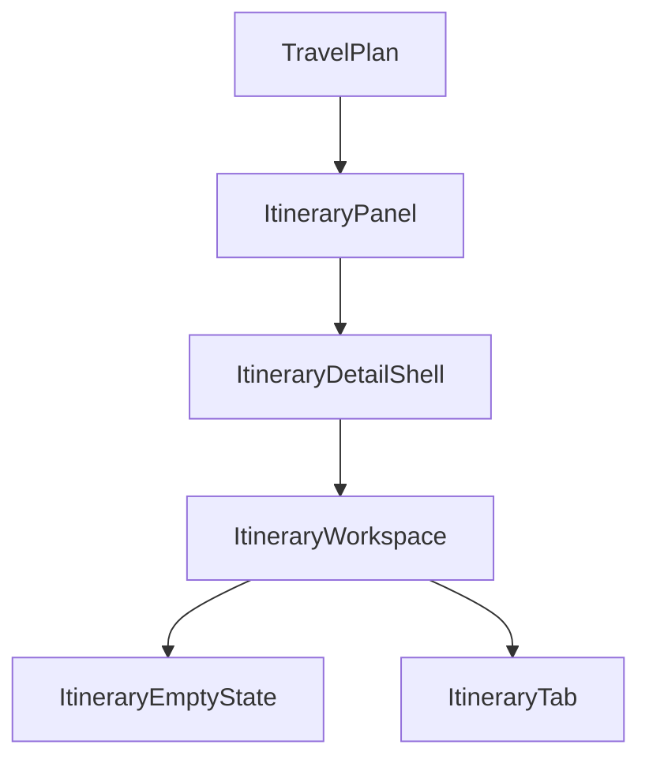
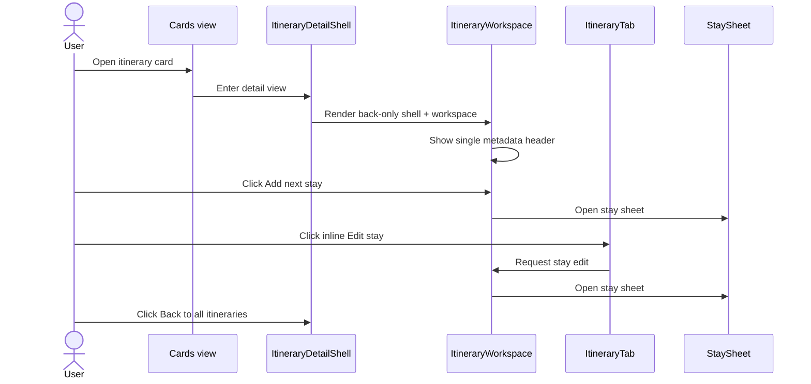

# Frontend Low-Level Design - Itinerary Detail UX Cleanup

**Feature:** itinerary-detail-ux-cleanup  
**Status:** LLD - ready for implementation  
**Date:** 2026-03-22  
**Refs:** [../frontend-architecture.md](../frontend-architecture.md) · [../system-architecture.md](../system-architecture.md) · [../itinerary-cards-navigation/frontend-design.md](../itinerary-cards-navigation/frontend-design.md) · [`../../packages/contracts/openapi.yaml`](../../packages/contracts/openapi.yaml)

## 1. Scope

### In scope
- Simplify the desktop itinerary detail view after card selection.
- Remove redundant title/date headers and duplicate stay-management actions.
- Preserve cards-first entry, existing route state, and current edit capabilities.
- Reuse `ItineraryDetailShell`, `ItineraryWorkspace`, `ItineraryTab`, and `ItineraryEmptyState` with minimal structural churn.

### Out of scope
- API or contract changes.
- Mobile layout redesign.
- Changes to plan editing, train editing, export flows, or stay-sheet form behavior.
- New create, delete, archive, sort, or share actions.

## 2. Problem statement

- The selected-itinerary desktop path currently stacks multiple chrome layers.
- `ItineraryDetailShell` shows itinerary metadata, then `ItineraryWorkspace` repeats itinerary metadata.
- `ItineraryWorkspace` and `ItineraryTab` both expose `Add next stay`.
- `ItineraryWorkspace` header-level `Edit stay for {city}` buttons duplicate the stay edit entry points already rendered inside the table.
- The result is a noisy detail view even though the underlying editor behavior is correct.

## 3. Target desktop structure

- Keep the cards-to-detail navigation model unchanged.
- Reduce `ItineraryDetailShell` to navigation chrome only: one desktop back action.
- Make `ItineraryWorkspace` the only owner of detail-page metadata and workspace-level stay CTA.
- Keep row-level stay edit affordances in `ItineraryTab` as the canonical edit entry points for populated itineraries.
- Keep `ItineraryEmptyState` as the canonical zero-days entry point with `Add first stay`.

## 4. Component ownership

### `components/TravelPlan.tsx`
- Keep current tab state, URL sync, dirty-state blocking, and create modal behavior unchanged.
- Keep `New itinerary` behavior unchanged for this slice to avoid cross-flow churn.

### `components/ItineraryPanel.tsx`
- Keep cards/detail branching and discard-confirmation flow unchanged.
- No new layout ownership beyond passing the existing callbacks through.

### `components/ItineraryDetailShell.tsx`
- Keep only the persistent `Back to all itineraries` control.
- Remove the right-aligned itinerary name and start-date summary.
- Keep error-state back handling delegated to `ItineraryWorkspace`.

### `components/ItineraryWorkspace.tsx`
- Become the single owner of populated-workspace header content.
- For non-empty workspaces, render one header with:
  - itinerary name
  - start date
  - one primary `Add next stay` action
- Remove the header-level row of `Edit stay for {city}` buttons.
- Keep stay sheet orchestration, workspace fetch/error handling, and empty-state branching.

### `components/ItineraryTab.tsx`
- Keep table editing, inline stay editing, train editor, and export behavior unchanged.
- Remove the table-top `Add next stay` strip when rendered for itinerary-scoped editing.
- Keep inline overnight-cell `Edit stay` controls as the populated-workspace edit surface.

### `components/ItineraryEmptyState.tsx`
- No structural change.
- Continue to show itinerary name, start date, and `Add first stay` for zero-day itineraries.

## 5. Control consolidation

| Area | Current state | Planned desktop state |
|---|---|---|
| Detail shell header | Back button + duplicated title/date | Back button only |
| Workspace header metadata | Title/date repeated after shell | Keep as the single metadata header |
| Add stay CTA | Shown in workspace header and again above table | Keep only workspace-header CTA |
| Edit stay actions | Header button list plus inline table controls | Keep inline table controls only |
| Empty itinerary action | `Add first stay` in empty state | Keep unchanged |

## 6. Interaction flow

- `Add next stay` remains available without scrolling into the table chrome.
- `Edit stay` remains available at the relevant overnight block, close to the affected data.
- Empty itineraries still start from `ItineraryEmptyState`, not from a populated-workspace header.
- Detail error states still provide an in-context back action to cards.

## 7. Data and state impact

- No route-state changes: `?tab=itinerary&itineraryId=<id>` remains the selected detail URL.
- No contract changes: continue using the existing itinerary list, workspace read, stay create/update, and day-plan patch endpoints from `packages/contracts/openapi.yaml`.
- No new shared client store.
- Dirty-state propagation stays unchanged: `ItineraryTab` -> `ItineraryWorkspace` -> `ItineraryPanel` -> `TravelPlan`.

## 8. Desktop UX states

### Populated workspace
- Show one compact header above the table.
- Left side: itinerary name and start date.
- Right side: one primary `Add next stay` button.
- No second metadata block and no stay-button chip row.

### Empty workspace
- Show `ItineraryEmptyState` only.
- Do not add a second header above it.

### Detail loading
- Keep the existing workspace loading panel.
- Shell still shows the back action so the page keeps a clear escape hatch.

### Detail error
- Keep the existing recoverable error panel with `Back to all itineraries`.
- Do not add another metadata header around the error panel.

## 9. FE test strategy

### Tier 0
- `npm run lint`
- project typecheck command

### Tier 1
- `ItineraryDetailShell`: renders only the back action; no duplicated itinerary title/date in shell chrome.
- `ItineraryWorkspace`: populated state renders exactly one metadata header and one `Add next stay` CTA.
- `ItineraryWorkspace`: populated state no longer renders header-level `Edit stay for {city}` buttons.
- `ItineraryTab`: itinerary-scoped render no longer shows the top utility-strip `Add next stay` button.
- `ItineraryEmptyState` path still exposes `Add first stay` and does not gain an extra wrapper header.

### Tier 2
- Cards -> detail flow renders simplified desktop detail layout while preserving inline plan edit and stay-sheet entry.
- Populated itinerary can still add a stay from the workspace header and edit a stay from an overnight cell.
- Empty itinerary still opens `Add first stay` flow correctly.
- Dirty back-navigation guard still blocks return to cards until discard is confirmed.

## 10. Risks, assumptions, tradeoffs

- Assumption: the user feedback is limited to desktop selected-itinerary layout; cards view and create-modal chrome stay as-is.
- Tradeoff: keeping `New itinerary` behavior unchanged avoids broader navigation churn, even if the top tab bar remains visually busy.
- Tradeoff: inline table stay actions remain the canonical edit entry, which is lower in the page than a header action list but closer to the edited content.
- Risk: existing tests may currently assert duplicated controls and will need updating alongside the layout cleanup.
