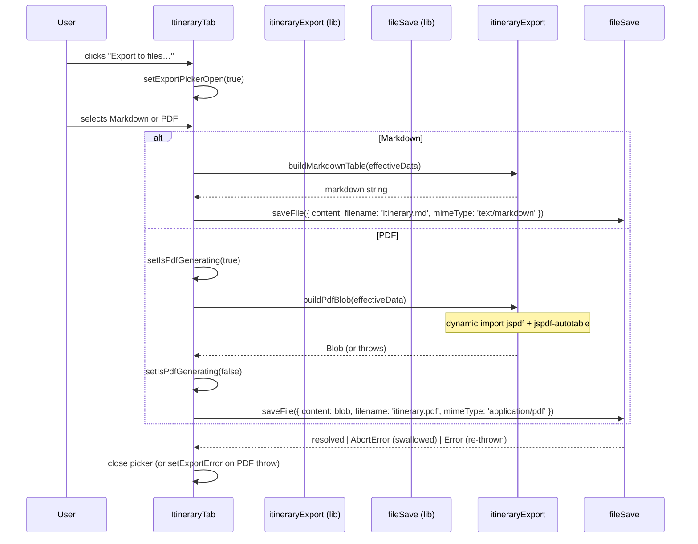

# Frontend LLD — Itinerary Export (`itinerary-export`)

**Status:** Draft | **Date:** 2026-03-19 | **Author:** Frontend Tech Lead  
**Inputs:** `docs/itinerary-export/PRODUCT_BRIEF.md`, `docs/frontend-lld.md`, `docs/itinerary-export/CONTRACTS.md`

---

## 1. Overview

Client-side-only "Export to files…" feature added to `ItineraryTab`. Users can download the displayed itinerary as Markdown (`.md`) or PDF (`.pdf`). No backend changes; no new routes.

**Non-goals:** server-side PDF, custom filenames, other tabs, extra formats (CSV/iCal), live timetable times.

**Key assumptions:**
- Effective data = `initialData` merged with `planOverrides` + `trainOverrides` at call time — no extra fetches.
- Markdown export preserves raw Markdown syntax; PDF export strips it (`stripMarkdown()`).
- Auth guard lives in `TravelPlan.tsx`; export button inherits that protection.

**Open questions (blocking):**
- **OQ-1:** CJK characters in PDF — embed CJK font, transliterate, or accept `?` placeholder for v1?
- **OQ-2:** Bundle size budget — is ~58 KB gzip for `jspdf` + `jspdf-autotable` acceptable?

---

## 2. Architecture Overview

No new pages or routes. All additions are within `ItineraryTab` and two new utility modules.

```
TravelPlan                          (unchanged)
└── ItineraryTab                    (MODIFIED — state + handlers + toolbar)
    ├── ExportToolbar               (NEW — trigger button)
    │   └── ExportFormatPicker      (NEW — inline format popover)
    └── <table> …                   (unchanged)
```

### Component responsibilities

| Component | New/Modified | Role |
|---|---|---|
| `ItineraryTab` | Modified | Owns `exportPickerOpen`, `exportError`, `isPdfGenerating` state; merges effective data; wires handlers |
| `ExportToolbar` | New | Presentational — renders Export button; disabled when `hasData=false` |
| `ExportFormatPicker` | New | Presentational — format choice popover; keyboard dismiss; inline PDF error/spinner |

`ExportToolbar` and `ExportFormatPicker` are stateless; all logic is in `ItineraryTab` + utility functions.

### New files

| Path | Purpose |
|---|---|
| `app/lib/itineraryExport.ts` | Pure functions: `buildPlanCell`, `buildTrainCell`, `stripMarkdown`, `toExportRows`, `buildMarkdownTable`, `buildPdfBlob` |
| `app/lib/fileSave.ts` | `saveFile()` — File System Access API with anchor fallback |
| `components/ExportToolbar.tsx` | Export button component |
| `components/ExportFormatPicker.tsx` | Format picker popover |

**Modified:** `components/ItineraryTab.tsx`, `package.json` (add `jspdf`, `jspdf-autotable`).

---

## 3. Core Data Flow



**Effective data merge** (inside `ItineraryTab` at export time):
```ts
const effectiveData = initialData.map((day, i) => ({
  ...day,
  plan: planOverrides[i] ?? day.plan,
  train: trainOverrides[i] ?? day.train,
}))
```

**`saveFile` strategy:** File System Access API (`showSaveFilePicker`) first; anchor-download fallback for Safari/Firefox. `AbortError` (user cancels dialog) is silently swallowed at both levels.

**`buildPdfBlob` import pattern:** `await import('jspdf')` + `await import('jspdf-autotable')` (side-effect registration on jsPDF prototype). Dynamic import keeps ~58 KB off the initial bundle.

---

## 4. Column Transformations

Output columns: **Date · Day · Overnight · Plan · Train Schedule** (Weekday omitted per FR-07).

| Column | Source | Rule |
|---|---|---|
| Date | `RouteDay.date` | Verbatim (e.g. `2026/9/25`) |
| Day | `RouteDay.dayNum` | `String(dayNum)` |
| Overnight | `RouteDay.overnight` | Verbatim |
| Plan | `RouteDay.plan` (merged) | `buildPlanCell()` — non-empty sections as `"Label: value"` joined by `\n`; all-empty → `"—"` |
| Train Schedule | `RouteDay.train` (merged) | `buildTrainCell()` — `normalizeTrainId()` per entry, joined by `\n`; empty → `"—"` |

For **PDF**, plan cells are additionally wrapped with `stripMarkdown()` (strips `**`, `*`, `` ` ``, `~~`, `- `, `1. ` tokens — same set as `markdown.tsx`).

PDF table: landscape A4, Helvetica, via `jspdf-autotable`. See OQ-1 for CJK limitation.

---

## 5. UI States

| State | Export Button | Picker |
|---|---|---|
| No itinerary data | Disabled + `title` tooltip | Cannot open |
| Idle | Enabled | Closed |
| Picker open | `aria-expanded=true` | Open |
| PDF generating | Enabled | Open; PDF button shows spinner (`role="status"`) |
| PDF error | Enabled | Open; `role="alert"` error banner below buttons |
| Success / cancel | Enabled | Closes; error cleared |

**State slices** (all `useState` in `ItineraryTab`):

| State | Type | Cleared when |
|---|---|---|
| `exportPickerOpen` | `boolean` | Picker closes |
| `exportError` | `string \| null` | Picker opens or closes |
| `isPdfGenerating` | `boolean` | PDF resolves or throws |

---

## 6. Key APIs & Utilities

See `docs/itinerary-export/CONTRACTS.md` for full typed signatures. Summary:

| Symbol | Module | Notes |
|---|---|---|
| `buildMarkdownTable(data)` | `itineraryExport.ts` | Returns GFM pipe-table string |
| `buildPdfBlob(data)` | `itineraryExport.ts` | Async; dynamic jsPDF import; returns `Blob` |
| `buildPlanCell(plan)` | `itineraryExport.ts` | Pure; no Markdown stripping |
| `buildTrainCell(trains)` | `itineraryExport.ts` | Uses `normalizeTrainId` from `itinerary.ts` |
| `stripMarkdown(text)` | `itineraryExport.ts` | PDF-only preprocessing |
| `saveFile(opts)` | `fileSave.ts` | FSAA + anchor fallback; swallows `AbortError` |

---

## 7. Accessibility

- `ExportToolbar` `<button>`: `aria-haspopup="true"`, `aria-expanded={exportPickerOpen}`, `title` on disabled.
- `ExportFormatPicker`: Escape closes + returns focus to Export button via `buttonRef`; Tab cycles within picker; `role="alert"` on error; `role="status" aria-label="Generating PDF…"` on spinner.

---

## 8. Validation Strategy

Project mandates TDD — **tests before implementation** (see `CLAUDE.md`).

- **Tier 0:** lint and type safety for the new export state, utility signatures, and client-only integration points.
- **Tier 1:** unit and component validation for data transformation, picker behavior, success/error states, and accessibility semantics.
- **Tier 2:** browser-level validation for the authenticated export journey, save/cancel behavior, fallback handling, and no-regression checks on adjacent itinerary interactions.
- **Critical journeys:** authenticated export to Markdown, authenticated export to PDF, graceful PDF failure recovery, graceful save-dialog cancellation, and client-side operation without export-triggered API calls.
