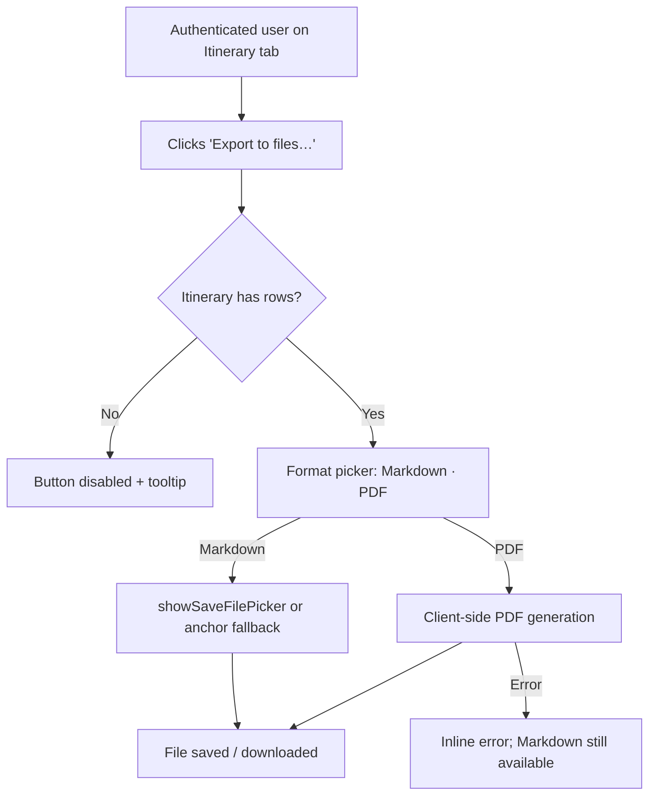

# Product Brief — Itinerary Export to Files

**Feature slug:** `itinerary-export` | **Status:** Proposed | **Date:** 2026-03-19

---

## Problem Statement

Authenticated travellers have no way to take their itinerary offline or share it outside the app. This feature lets them download the plan as a portable file — no server round-trip, no privacy concern.

---

## Target Users

Authenticated travellers only. Unauthenticated visitors cannot reach the Itinerary tab and therefore cannot export.

---

## Scope

**In scope**
- "Export to files…" button in the Itinerary tab (authenticated users only).
- Format picker with two options: **Markdown (`.md`)** and **PDF (`.pdf`)**.
- File-save via File System Access API (`showSaveFilePicker`); silent anchor-download fallback where unsupported.
- Exported columns: **Date, Day #, Overnight, Plan, Train Schedule**.
  - **Weekday column omitted.**
  - **Plan cell**: `Morning: …` / `Afternoon: …` / `Evening: …` newline-separated; empty sections omitted.
  - **Train Schedule cell**: normalised train number(s) only (e.g. `ICE 123`); no station names or times. Empty → `—`.
- Button disabled with tooltip when itinerary has zero rows.
- PDF failure: inline error; Markdown option remains usable.
- All logic is purely client-side — zero API calls.

**Out of scope**
- Server-side PDF rendering or email delivery.
- Export of Train Delays or Train Timetable tabs.
- Custom filename editing, Excel/CSV/iCal formats, print-dialog integration.
- Departure/arrival times in the export.
- Any backend API changes.

---

## User Flow

---

## Acceptance Criteria

| ID | Given / When / Then |
|----|---------------------|
| AC-01 | **Auth gate** — Given authenticated user on Itinerary tab → "Export to files…" button is visible. |
| AC-02 | **Unauth gate** — Given unauthenticated user → no export button is rendered. |
| AC-03 | **Picker opens** — Given ≥1 row, when button clicked → picker shows exactly "Markdown (.md)" and "PDF (.pdf)". |
| AC-04 | **Picker dismisses** — Given picker open, when Escape / click-outside / Cancel → picker closes, no file written. |
| AC-05 | **Columns** — Markdown export contains headers Date, Day, Overnight, Plan, Train Schedule; no Weekday column. |
| AC-06 | **Plan cell** — Empty time-of-day sections are omitted; non-empty sections formatted as `<Period>: <text>`. |
| AC-07 | **Train cell (with trains)** — Contains normalised train number(s) only; no station names or times. |
| AC-08 | **Train cell (no trains)** — Contains `—`. |
| AC-09 | **PDF validity** — Saved PDF is readable by standard viewers and carries the same logical content as Markdown. |
| AC-10 | **PDF failure** — Inline error shown; Markdown export still succeeds. |
| AC-11 | **Empty itinerary** — Button is disabled; tooltip explains nothing to export. |
| AC-12 | **API fallback** — `showSaveFilePicker` absent → silent anchor download, no error shown. |
| AC-13 | **Dialog cancel** — User cancels native save dialog → no file written, no error shown. |
| AC-14 | **Client-side only** — With network blocked, export still completes successfully. |
| AC-15 | **No regression** — Inline edit, drag-and-drop, and train JSON modal continue to work. |

---

## Non-Functional Requirements

- **Performance:** Markdown < 100 ms; PDF < 3 s (loading indicator if > 500 ms) for a 16-day itinerary.
- **Bundle:** PDF library dynamically imported; bundle increase < 50 KB gzipped.
- **Accessibility:** Button meets WCAG 2.1 AA contrast; format picker fully keyboard-operable.
- **Privacy:** No itinerary data leaves the browser (no XHR/fetch to external services).
- **Browser support:** Latest Chrome, Firefox, Safari; File System Access API is progressive enhancement.

---

## Success Metrics

| Metric | Target |
|--------|--------|
| Export activation rate | ≥ 1 export per authenticated session in week 1 post-launch |
| PDF error rate | < 2% of PDF export attempts |
| Markdown generation (p99) | < 100 ms |
| PDF generation (p95) | < 3 s |
| Export formatting validation pass rate | 100% for core Markdown and PDF output checks |

---

## Open Questions

1. **PDF library choice** — `jsPDF`, `pdfmake`, or CSS-print shim? Delegated to Chief Tech Lead / Frontend Tech Lead.
2. **Markdown syntax in PDF** — Strip Markdown to plain text in PDF export? Current assumption: yes.
3. **Default filename** — Static `itinerary.md` / `itinerary.pdf` assumed acceptable; user cannot customise.

---

## Execution Notes

| Role | Responsibility |
|------|---------------|
| Chief Tech Lead | PDF library choice, dynamic-import strategy, File System Access API wrapper contract |
| Frontend Tech Lead | Component placement, format picker spec, export utility interface, validation approach |
| Frontend Developer | Implementation per LLD; feature validation for export formatting, fallback behaviour, and regression safety |
| QA | Cross-browser validation for export flows, fallback behaviour, and PDF integrity |

*Handoff: Ready for Chief Tech Lead and Frontend Tech Lead to begin HLD/LLD planning.*
