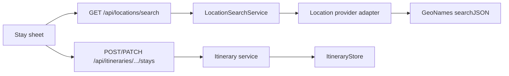
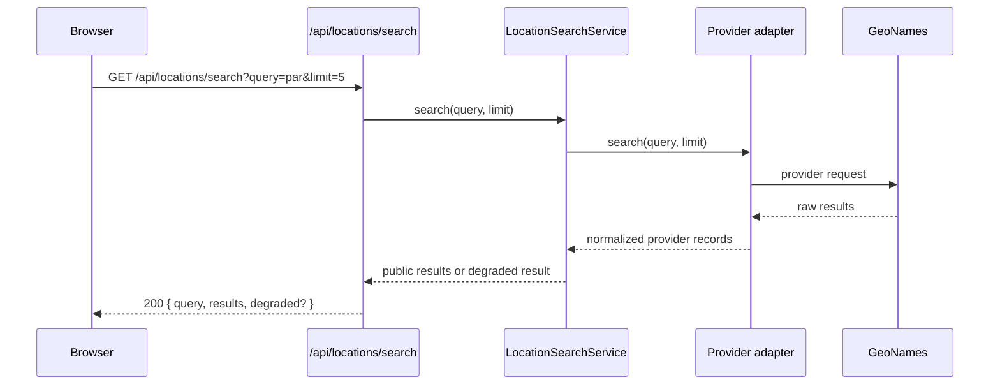

# Backend Low-Level Design - Itinerary Location Autocomplete

**Feature ID:** itinerary-location-autocomplete  
**Status:** LLD - ready for implementation  
**Date:** 2026-03-23  
**Refs:** [feature-analysis.md](./feature-analysis.md) · [system-design.md](./system-design.md) · [../backend-architecture.md](../backend-architecture.md) · [../system-architecture.md](../system-architecture.md) · [../api/error-model.md](../api/error-model.md) · [`../../packages/contracts/openapi.yaml`](../../packages/contracts/openapi.yaml)

## Scope

- Add a backend-owned location-search API for itinerary stay entry and editing.
- Normalize third-party place results into a provider-agnostic contract so the frontend never depends on GeoNames fields or URLs.
- Extend itinerary stay create/read/update contracts so selected place metadata persists and legacy text-only stays remain valid.
- Keep the existing Next.js monolith, auth boundary, `RouteDay[]` storage model, and stay mutation rules.

## Non-goals

- No frontend component design, dropdown behavior internals, or keyboard interaction design.
- No new normalized place table, background enrichment job, or backfill of old itineraries.
- No reverse geocoding, map tiles, routing, weather, or timezone enrichment.
- No commitment to GeoNames as a permanent public contract dependency.

## Decision Summary

- Replace the earlier browser-direct lookup assumption with a same-origin backend search endpoint: `GET /api/locations/search`.
- Public API stays provider-neutral and returns normalized `resolved` location candidates only; the client still adds its own custom raw-text option.
- Stay create/update payloads accept a structured `location` object; legacy callers may continue sending `city` only and are normalized to `kind=custom`.
- Read payloads always return a normalized `location` object on `stays[]` and `days[]`, even when stored data is legacy text-only.
- Internal provider details stay behind an adapter boundary; GeoNames-specific ids and request parameters are not exposed in the public contract.

## Runtime Fit



## Module Boundaries

### API layer

- `app/api/locations/search/route.ts`
  - Authenticates the caller.
  - Validates `query` and optional `limit`.
  - Maps service result to the OpenAPI response envelope.
- `app/api/itineraries/[itineraryId]/stays/route.ts`
- `app/api/itineraries/[itineraryId]/stays/[stayIndex]/route.ts`
  - Extend existing stay create/update validation to accept structured `location` input.

### Application/domain layer

- `app/lib/location-search/service.ts`
  - Orchestrates provider calls, timeout handling, normalization, and degraded-success responses.
- `app/lib/location-search/types.ts`
  - Defines internal provider result types and public DTO mappers.
- `app/lib/location-search/providers/provider.ts`
  - Provider interface: `search(query, limit): Promise<LocationProviderResult[]>`.
- `app/lib/location-search/providers/geonames.ts`
  - GeoNames-only adapter hidden behind the provider interface.
- `app/lib/location-search/config.ts`
  - Reads server-only env vars and exposes validated config.
- `app/lib/itinerary-store/service.ts`
  - Normalizes incoming stay location payloads.
  - Hydrates legacy stored days into public `custom` locations on read.
  - Clears stale resolved metadata when an edited stay is saved as custom.
- `app/lib/itinerary-store/domain.ts`
  - Preserves per-stay invariant: every day in one contiguous stay block carries the same normalized `location` object.

### Persistence layer

- `app/lib/itinerary-store/store.ts`
  - No interface change required.
  - Whole-record read/write continues; the `days[].location` shape changes additively.

## Public Contract Decisions

### `GET /api/locations/search`

- Purpose: return up to 5 normalized resolved-place candidates for itinerary stay entry.
- Auth: same session model as other itinerary APIs; unauthenticated requests return `401 UNAUTHORIZED`.
- Query params:
  - `query` - required trimmed string, 2-80 chars after trim.
  - `limit` - optional integer, default `5`, max `5`.
- Success `200`:
  - `query`: trimmed query echoed back.
  - `results`: ordered list of normalized resolved candidates.
  - `degraded`: optional object present when provider lookup could not run or returned a non-fatal provider failure.
- No custom option is returned by the backend; the frontend always composes it locally from the current input.

### Candidate schema

Public candidates use a provider-neutral shape:

```ts
type ResolvedStayLocation = {
  kind: 'resolved'
  label: string
  queryText: string
  coordinates: { lat: number; lng: number }
  place: {
    placeId: string
    name: string
    locality?: string
    region?: string
    country?: string
    countryCode?: string
    featureType?: 'locality' | 'region' | 'country' | 'other'
  }
}
```

- `placeId` is opaque to the client. For GeoNames-backed records the backend may derive it from provider data, but the client must treat it as an opaque identifier.
- `label` is the server-composed display string for stable rendering across search, save, and reload.
- `queryText` echoes the search text used to obtain the candidate so edit flows can preserve committed text semantics.

## Stay mutation contract updates

### Create / update requests

- Canonical input becomes `location` plus `nights`.
- Backward-compatibility path: if `location` is omitted and `city` is present, the backend creates `location = { kind: 'custom', label: trimmed city, queryText: trimmed city }`.
- If both `city` and `location` are present during the transition window, `city` must equal `location.label` after trim or the request fails with `400 STAY_LOCATION_LABEL_MISMATCH`.
- `PATCH` semantics remain partial:
  - `nights` only -> preserve existing stored `location`.
  - `location` only -> update label and metadata, keep nights unchanged.
  - `location + nights` -> existing stay mutation rules still apply, then the final target block receives the normalized `location`.

### Read responses

- `StaySummary.location` becomes required in the contract.
- `RouteDay.location` becomes required in the contract.
- Legacy persisted days missing `location` are normalized on read to:

```ts
{ kind: 'custom', label: overnight, queryText: overnight }
```

- The public read model never exposes provider-specific fields.

## Persistence Model

### Public API shape

```ts
type StayLocation =
  | {
      kind: 'custom'
      label: string
      queryText: string
    }
  | ResolvedStayLocation
```

### Stored itinerary days

- `RouteDay.overnight` remains the renderer-safe visible label and stays required.
- `RouteDay.location` is stored on every day in the contiguous stay block.
- Stay create/update writes must copy the same normalized `location` object onto each day in the mutated stay block.
- When adjacent stays merge because the final labels match, the merged block keeps the post-mutation normalized `location` selected for that final label.

### Internal provider reference

- The backend may persist internal provider provenance for future re-fetch/debugging, but it must not leak through the public API.
- If implementation stores provider provenance, keep it nested in an internal-only shape handled by service-level DTO mapping rather than returning raw store documents directly.

## Search Flow



## Provider Adapter Rules

- `LocationProvider` is the only layer allowed to know remote request params, throttling semantics, or response field names.
- GeoNames adapter responsibilities:
  - Build outbound request using server-side config only.
  - Enforce `maxRows <= 5`.
  - Map GeoNames `name/admin/country/fcl/fcode/lat/lng` into the internal neutral provider result.
  - Drop malformed rows missing parseable coordinates or a stable source id.
- `LocationSearchService` responsibilities:
  - Compose stable display labels.
  - De-duplicate near-identical candidates by `(placeId, label)`.
  - Cap results to requested limit after normalization.
  - Convert provider failures into degraded success responses when the failure is recoverable.

## Validation Rules

### Search endpoint

- Blank or <2-char trimmed `query` -> `400 LOCATION_QUERY_TOO_SHORT`.
- Query >80 chars -> `400 LOCATION_QUERY_TOO_LONG`.
- Invalid `limit` -> `400 LOCATION_LIMIT_INVALID`.
- Server enforces `limit <= 5` even if a client sends a larger value.

### Stay mutations

- `location.kind=custom`
  - `label` required after trim, max `80`.
  - `queryText` required after trim, max `80`.
  - No coordinates or place object allowed.
- `location.kind=resolved`
  - `label` and `queryText` required after trim.
  - `coordinates.lat/lng` must be finite numbers.
  - `place.placeId` and `place.name` required.
  - Optional `countryCode` must be uppercase ISO-like 2-char string when present.
- Existing nights validation, stay index validation, and trailing-day lock rules remain unchanged.

## Error Handling

### Search endpoint

- `400 LOCATION_QUERY_TOO_SHORT`
- `400 LOCATION_QUERY_TOO_LONG`
- `400 LOCATION_LIMIT_INVALID`
- `401 UNAUTHORIZED`
- `500 INTERNAL_ERROR` only for unexpected application failures before a degraded response can be formed.

Recoverable provider failures do not return `5xx`.

Instead the endpoint returns:

```json
{
  "query": "par",
  "results": [],
  "degraded": { "code": "LOOKUP_UNAVAILABLE" }
}
```

Supported degraded codes:

- `LOOKUP_CONFIG_MISSING` - provider credentials/config absent.
- `LOOKUP_UNAVAILABLE` - timeout, network failure, provider 5xx, or parseable provider error.
- `LOOKUP_RATE_LIMITED` - upstream quota/rate limit response.

### Stay APIs

- Preserve all existing itinerary/stay error codes.
- Add `400 STAY_LOCATION_INVALID` for malformed structured location payloads.
- Add `400 STAY_LOCATION_LABEL_MISMATCH` when both legacy `city` and canonical `location.label` are supplied but differ.

## Auth, Security, And Ops

- Search endpoint requires the same authenticated session as itinerary editing; no public anonymous search route is added.
- GeoNames credentials move server-side; do not use `NEXT_PUBLIC_*` config for the new lookup path.
- Recommended env vars:
  - `LOCATION_SEARCH_PROVIDER=geonames`
  - `GEONAMES_USERNAME`
  - `GEONAMES_BASE_URL` default `https://api.geonames.org`
  - `LOCATION_SEARCH_TIMEOUT_MS` default `1200`
- Log `route`, `userEmail`, `queryLength`, `resultCount`, `degradedCode`, and latency bucket.
- Do not log full query strings if product policy treats raw location input as sensitive user content; if logging is needed, prefer query length plus a hash.

## Contract-First OpenAPI Changes

Update `packages/contracts/openapi.yaml` to:

- Add `GET /api/locations/search`.
- Add `LocationSearchResponse`, `ResolvedStayLocation`, `StayLocation`, `CustomStayLocation`, `ResolvedPlace`, and `LocationSearchDegradedState` schemas.
- Extend `CreateStayRequest` and `UpdateStayRequest` with canonical `location` support and transitional legacy `city` support.
- Extend `StaySummary` and `RouteDay` with required `location` in read responses.
- Extend the shared error model with `LOCATION_QUERY_TOO_SHORT`, `LOCATION_QUERY_TOO_LONG`, `LOCATION_LIMIT_INVALID`, `STAY_LOCATION_INVALID`, and `STAY_LOCATION_LABEL_MISMATCH`.

Generated contract artifacts under `packages/contracts/generated/` should be regenerated during implementation after the spec change lands.

## Tiered Test Strategy

### Tier 0

- OpenAPI validation and generated-type regeneration.
- Typecheck for the new `location-search` and itinerary DTO mappings.

### Tier 1

- Provider adapter tests for GeoNames raw-result normalization, malformed-row dropping, and field mapping.
- Service tests for label composition, dedupe, result limiting, degraded mapping, and config-missing handling.
- Itinerary-domain/service tests for:
  - legacy `city` -> `custom` normalization
  - resolved location persistence across add/edit
  - clearing stale resolved metadata when edited text saves as custom
  - merged-stay final location selection

### Tier 2

- Route-handler tests for `GET /api/locations/search` covering `200`, degraded `200`, `400`, `401`, and unexpected `500`.
- Stay API integration tests covering:
  - create stay with `custom` location
  - create stay with `resolved` location
  - patch stay preserving location when only nights change
  - patch geocoded stay to custom and verify resolved metadata is removed
  - workspace read normalizing legacy records without stored `location`

## Tradeoffs, Risks, Assumptions

- Backend proxying adds one same-origin hop, but it removes provider coupling from the frontend and lets config stay server-side.
- Whole-record itinerary writes remain acceptable because location metadata is small and already repeated per day.
- GeoNames ranking quality still affects candidate usefulness; the custom save path remains the completion-safe fallback.
- The transitional `city` + `location` contract increases short-term validation complexity but avoids breaking older clients while the new frontend rolls out.
- Assumes only one provider is active at a time in MVP; the adapter interface keeps future provider swaps additive.
