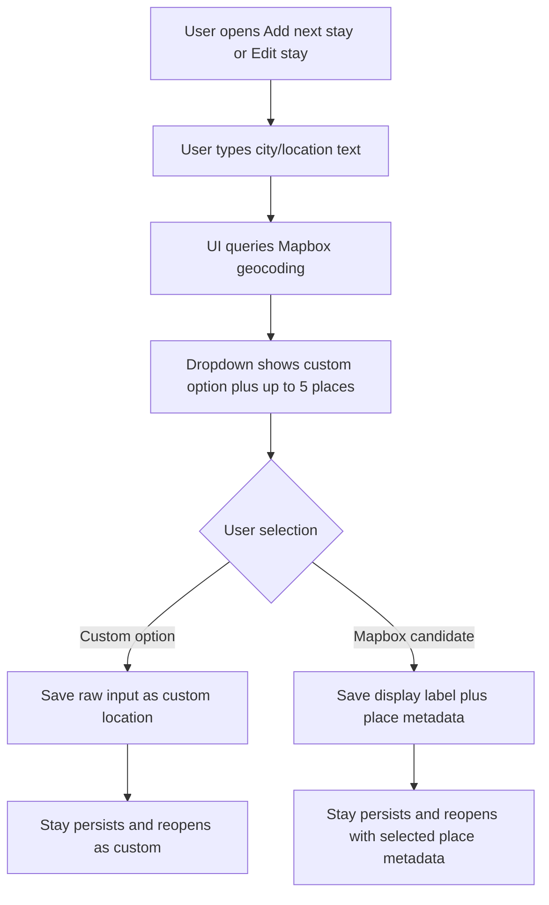

# Feature Analysis - Itinerary Location Autocomplete

**Feature ID:** itinerary-location-autocomplete  
**Status:** Ready for design and implementation handoff  
**Date:** 2026-03-23  
**Project:** travel-plan-web-next

## User Problem

The current stay sheet accepts a free-text city only. Users have no help finding the intended place, cannot distinguish between similarly named cities, and the app does not retain structured place metadata that later map, routing, or lookup features can reuse.

## Desired Outcome

- Stay add/edit feels faster and safer because users can pick a real place from autocomplete results.
- Users can still save any typed value as a custom location when the desired place is missing or intentionally non-standard.
- Selected place metadata persists with the stay so later frontend features can use it after reloads and future edits.
- Existing saved stays keep working without migration friction by defaulting to custom locations.

## Scope

### In Scope

- Itinerary-scoped stay sheet city input used by `Add next stay` and `Edit stay`.
- Query Mapbox geocoding as the user types a location.
- Show up to 5 candidate places in a dropdown.
- Always offer a custom-location option that saves the raw typed value.
- Persist enough selected-place metadata for later frontend use, including coordinates when a Mapbox place is chosen.
- Treat existing stored city-only stays as custom locations when loaded or edited.
- Preserve current stay save rules for nights, validation, and itinerary ownership.

### Out of Scope

- Backend, native, or shared contract redesign.
- Any map rendering, reverse geocoding, route optimization, or weather/timezone features.
- Reworking itinerary shell creation or non-itinerary location inputs.
- Automatic conversion of existing city strings into geocoded places.
- Device-location permission flows.

## Resolved Defaults

- Autocomplete applies only after the user enters at least 2 non-space characters.
- Lookup should feel live but not per-keystroke noisy; default expectation is a short debounce before querying.
- The custom option is always available and uses the current raw input exactly as typed after existing trim validation.
- The custom option remains the safe default until the user explicitly selects a Mapbox candidate.
- If a user edits a previously geocoded stay and changes the text without selecting a new candidate, the stay saves as a custom location so stale place metadata is not retained.
- Existing stored stay cities with no place metadata load as custom locations.

## Primary User Flows

### Flow 1: Add Next Stay With Geocoded Place

1. User opens `Add next stay`.
2. User types a city or place name.
3. UI shows a dropdown with one custom option and up to 5 Mapbox candidates.
4. User explicitly selects a Mapbox candidate.
5. User saves the stay.
6. The itinerary shows the chosen place label and persists associated place metadata for later frontend use.

### Flow 2: Add Next Stay As Custom Location

1. User opens `Add next stay`.
2. User types a city, district, hotel area, or other free-text value.
3. User either chooses the custom option or leaves the raw-input default in place.
4. User saves the stay.
5. The itinerary stores the typed label as a custom location with no geocoded coordinates requirement.

### Flow 3: Edit Existing Stay

1. User opens `Edit stay` for a current stay.
2. If the stay already has place metadata, the current label is shown and remains associated until the user changes it.
3. If the stay is legacy city-only data, the stay is treated as a custom location.
4. If the user changes the text, new autocomplete suggestions appear.
5. Saving after selecting a candidate stores that candidate's metadata; saving without a candidate stores the text as custom.

## Functional Requirements

- The stay sheet city field must support typeahead suggestions from Mapbox geocoding.
- The dropdown must show at most 5 Mapbox candidates per query.
- The dropdown must always include a custom-location option based on the current typed input when the input passes basic city validation.
- The user must be able to save a stay without selecting a Mapbox result.
- The user must be able to explicitly choose a Mapbox candidate before saving.
- Saving a Mapbox candidate must persist both the visible label and its place metadata for later frontend use.
- Saving a custom location must persist that the stay is custom and must not retain stale coordinates from any prior geocoded selection.
- Reopening the stay sheet after reload must preserve the prior selection state: geocoded stays remain geocoded, legacy/plain stays remain custom.
- Existing nights validation and stay-edit business rules remain unchanged.

## Edge Cases

- Fewer than 5 Mapbox matches: show only available matches plus the custom option.
- No matches returned: show the custom option only.
- Mapbox request fails, times out, or is rate-limited: do not block typing or saving; allow the custom option and show a lightweight error state.
- User types quickly and results arrive out of order: only the latest query's results should be shown.
- User edits text after selecting a Mapbox result: prior geocoded selection is cleared until a new candidate is selected.
- Existing stay has only a city string: prefill that label and treat it as custom.
- Duplicate or near-duplicate candidate labels: show enough secondary place context for the user to distinguish them.
- Keyboard-only user: can open suggestions, move through options, select one, and save without pointer input.

## Acceptance Criteria

### AC-1: Suggestions Appear During Add Next Stay

Given an authenticated user opens `Add next stay`  
When they enter at least 2 non-space characters in the city field  
Then the UI requests location suggestions from Mapbox  
And the dropdown shows at most 5 Mapbox candidates

### AC-2: Custom Option Is Always Available

Given the user has entered a valid non-empty location string  
When the autocomplete dropdown is shown  
Then the dropdown includes an option to use the raw input as a custom location  
And the user can save without choosing a Mapbox candidate

### AC-3: Select Mapbox Candidate During Add Next Stay

Given the user is adding a stay and Mapbox suggestions are visible  
When they choose one candidate and save  
Then the stay is created with that candidate's display label  
And the selected place metadata is persisted with the stay  
And the metadata remains available after page reload

### AC-4: Save Custom Location During Add Next Stay

Given the user is adding a stay and has typed a valid location string  
When they keep or choose the custom option and save  
Then the stay is created using the typed label  
And the stay is persisted as a custom location  
And no geocoded coordinates are required

### AC-5: Edit Existing Geocoded Stay

Given a stay was previously saved from a Mapbox candidate  
When the user opens `Edit stay`  
Then the current location label is prefilled  
And saving without changing the location preserves the existing place metadata

### AC-6: Edit Existing Stay And Replace With New Candidate

Given a stay already exists  
When the user changes the location text, selects a different Mapbox candidate, and saves  
Then the stay label updates  
And the old place metadata is replaced with the newly selected place metadata

### AC-7: Edit Existing Stay And Save As Custom

Given a stay already exists  
When the user changes the location text and saves without selecting a Mapbox candidate  
Then the stay is persisted as a custom location using the typed label  
And any previously selected geocoded metadata is cleared

### AC-8: Legacy City Values Default To Custom

Given a stay was saved before this feature and only contains a city string  
When the user loads the itinerary or opens `Edit stay`  
Then that stay is treated as a custom location  
And the current city label remains editable and saveable without migration work

### AC-9: Autocomplete Failure Does Not Block Stay Save

Given the user is entering a location and Mapbox suggestions cannot be retrieved  
When the request fails or returns no results  
Then the user can still save the stay using the custom option  
And the UI does not block the stay flow on the failed lookup

### AC-10: Candidate Labels Are Distinguishable

Given Mapbox returns multiple places with similar primary names  
When the dropdown is rendered  
Then each candidate shows enough additional place context for the user to distinguish which one to choose

## Success Metrics

- Higher share of newly added or edited stays saved with structured place metadata.
- Reduced manual correction rate for ambiguous city names in itinerary stays.
- Low autocomplete failure abandonment: users still complete stay save via custom fallback when lookup fails.
- Technical target: location suggestions feel responsive enough for normal typing and do not noticeably delay stay entry.

## Risks And Follow-Ups

- Mapbox result quality may vary by language or local naming; the custom fallback is required to protect completion.
- Persisted place metadata must remain frontend-readable on later reload/edit flows even though this brief does not prescribe storage shape.
- Later features may need additional place fields beyond coordinates; implementation should avoid a persistence shape that only stores the label.

## Handoff

Project coordinator should route this to frontend design/implementation for the stay sheet UX and to the relevant technical lead for the smallest persistence change that keeps existing contracts stable while preserving selected place metadata.
