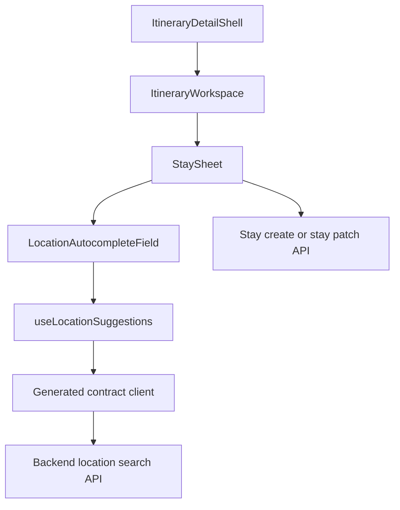
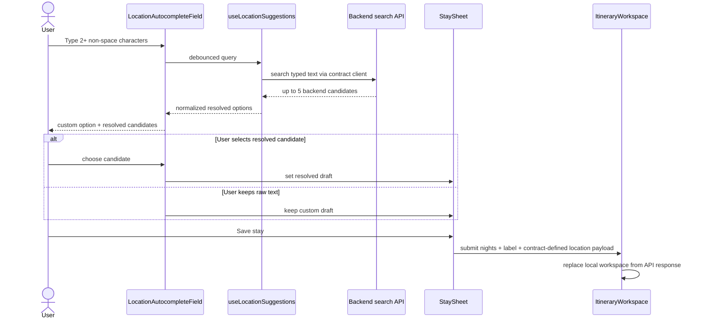

# Frontend Low-Level Design - Itinerary Location Autocomplete

**Feature:** itinerary-location-autocomplete  
**Status:** LLD - ready for implementation after contract lock  
**Date:** 2026-03-23  
**Refs:** [feature-analysis.md](./feature-analysis.md) · [../frontend-architecture.md](../frontend-architecture.md) · [../itinerary-creation-and-stay-planning/frontend-design.md](../itinerary-creation-and-stay-planning/frontend-design.md) · [`../../packages/contracts/openapi.yaml`](../../packages/contracts/openapi.yaml)

## 1. Scope

### In scope
- Extend the itinerary `StaySheet` location input used by `Add next stay` and `Edit stay`.
- Consume a backend location-search API defined in `packages/contracts/openapi.yaml`; the browser must not call GeoNames or any other provider directly.
- Show one custom raw-text option plus up to 5 backend-provided location candidates.
- Persist selected place metadata only through the stay create/edit API contract.
- Preserve current nights validation, submit behavior, and itinerary ownership rules.
- Treat legacy city-only stays as custom locations on load and edit.

### Out of scope
- Provider-specific request building, provider credentials, or frontend knowledge of GeoNames internals.
- New UX beyond the agreed autocomplete behavior.
- Map rendering, reverse geocoding, automatic migration of legacy city strings, or non-itinerary location inputs.

## 2. Contract-first boundary

- Frontend reads the search operation and stay-location schemas from `packages/contracts/openapi.yaml` and generated contract artifacts.
- Frontend code only depends on backend-exposed fields needed for UX: candidate key, display text, optional secondary context, and the contract-defined persisted location payload.
- Frontend must not branch on provider names, provider feature classes, provider ids, or raw provider JSON.
- If the exact search endpoint or persisted stay-location schema is not yet present in `packages/contracts/openapi.yaml`, spec update is the blocking prerequisite before implementation starts.

Minimum contract support required for the FE slice:

| Need | Why FE needs it |
|---|---|
| Search input text parameter | trigger suggestions from typed text |
| Result cap support or backend-enforced max 5 | keep dropdown bounded |
| Stable candidate key | list rendering and keyboard selection |
| Primary display label | visible option text and saved stay label |
| Optional secondary display context | disambiguate similar names |
| Persistable resolved-location payload | save selected metadata without FE reconstructing provider fields |
| Returned stay location on read/edit | reopen edit sheet without losing prior selection |

## 3. UI boundaries



| Boundary | Owner | Responsibility |
|---|---|---|
| `components/ItineraryWorkspace.tsx` | workspace container | opens add/edit sheet, submits authoritative stay writes, replaces workspace payload after success |
| `components/StaySheet.tsx` | form shell | owns `nights`, submit pending state, validation, and final stay payload assembly |
| `components/LocationAutocompleteField.tsx` | location input subcomponent | owns query text, popup visibility, active option, and selected draft state |
| `app/lib/locations/useLocationSuggestions.ts` | query layer | debounce, latest-request wins, backend error normalization, result-to-option mapping |
| generated contract client | API boundary | executes backend search request and stay mutations only through the shared contract |

## 4. FE-owned view models

The FE keeps a small UI model around the contract types instead of exposing raw API responses to the form.

```ts
type LocationSelectionDraft =
  | {
      kind: 'custom'
      label: string
      queryText: string
    }
  | {
      kind: 'resolved'
      label: string
      queryText: string
      persistedLocation: ContractStayLocation
    }

type LocationOption =
  | {
      kind: 'custom'
      key: 'custom'
      primaryLabel: string
      secondaryLabel?: string
      draft: LocationSelectionDraft
    }
  | {
      kind: 'resolved'
      key: string
      primaryLabel: string
      secondaryLabel?: string
      draft: LocationSelectionDraft
    }
```

- `ContractStayLocation` means the contract-defined structured location schema returned by the backend and accepted by stay save APIs.
- The FE stores the resolved candidate payload opaquely inside `persistedLocation`; it does not reinterpret provider-specific internals.
- The visible compatibility label used by the existing stay UI remains `draft.label`.

## 5. Data flow



Flow rules:
- Start remote lookup only when the trimmed query has at least 2 non-space characters.
- Use a short debounce in the hook layer.
- Latest request wins; stale responses must not replace newer suggestions.
- Backend candidates are mapped once into `LocationOption`; `StaySheet` consumes only normalized options/drafts.
- Save payload uses the current draft:
  - `custom`: send typed label and the contract-defined custom-location representation.
  - `resolved`: send typed/saved label and the exact contract-defined resolved-location payload from the selected candidate.

## 6. Custom option and backend candidates

- Show the custom option whenever the trimmed input is non-empty and passes existing validation.
- Keep the custom option first in the list so the user can always save the raw text without remote success.
- Show at most 5 backend candidates under the custom option.
- The custom option remains the effective default until the user explicitly selects a backend candidate.
- If the user edits text after selecting a backend candidate, clear the resolved draft immediately and revert to custom semantics until a new candidate is selected.
- Pressing `Enter` with no active resolved option keeps the current text as custom.
- Similar candidate names rely on backend-supplied secondary context; FE should render it as-is and not synthesize provider-derived context.

## 7. Loading, error, empty, and edit states

| State | Field behavior | Save behavior |
|---|---|---|
| Empty or short query | plain input, no remote lookup, no popup | unchanged current validation |
| Loading suggestions | input stays editable; popup shows custom option plus loading row | save remains enabled for valid custom input |
| Results available | popup shows custom option first plus up to 5 resolved candidates | save uses current draft |
| No results | popup shows custom option plus supportive empty copy | save remains enabled |
| Search request failed | popup falls back to custom-only mode with compact non-blocking hint | save remains enabled |
| Edit existing resolved stay, text unchanged | field starts with saved label and resolved draft still selected | save preserves existing metadata |
| Edit existing resolved stay, text changed | resolved draft clears on first text divergence | save falls back to custom unless user reselects |
| Edit legacy city-only stay | field preloads text as custom | save remains custom unless user explicitly selects a candidate |

Recommended copy:
- loading: `Searching for places...`
- empty: `No matching places found. You can still save this as a custom location.`
- error: `Place suggestions are unavailable right now. You can still save this location.`

Accessibility requirements:
- Use combobox semantics on the text input with `aria-expanded`, `aria-controls`, and `aria-activedescendant`.
- Render the popup as `role="listbox"` and each row as `role="option"`.
- Keyboard flow: `ArrowDown` opens and moves through options, `ArrowUp` moves upward, `Enter` selects, `Escape` closes, `Tab` continues normal form navigation.
- Use a polite live region for loading, result count, and error text.
- Use `onMouseDown` for option selection so blur does not swallow the click.

## 8. Local persistence handling

- The FE does not persist autocomplete results locally and does not cache provider-specific search rows.
- Authoritative persistence stays in the existing stay create/edit APIs.
- After a successful add/edit mutation, `ItineraryWorkspace` replaces its local workspace snapshot with the server response.
- On read/edit hydration:
  - if a stay includes the contract-defined structured location payload, hydrate a `resolved` draft;
  - if a stay has only legacy text fields, hydrate a `custom` draft.
- Saving changed text without reselecting a resolved candidate must send the contract-defined custom-location shape and omit stale resolved metadata.
- Saving an unchanged resolved stay should round-trip the same structured payload back to the backend.
- Derived itinerary views continue to render the visible stay label; later features may read structured metadata from the server-authored stay payload when present.

## 9. Main implementation slices

1. Contract lock and generated client wiring
   - Confirm the backend search operation and stay-location schemas in `packages/contracts/openapi.yaml`.
   - Regenerate or consume typed client artifacts before FE coding.

2. Search hook and option normalization
   - Add `useLocationSuggestions` around the generated client.
   - Centralize debounce, latest-request-wins handling, and mapping into `LocationOption`.

3. `LocationAutocompleteField`
   - Extract the location input into a dedicated controlled autocomplete component.
   - Support custom-first rendering, keyboard interaction, loading/error rows, and candidate selection.

4. `StaySheet` and workspace integration
   - Upgrade form state from text-only city handling to `LocationSelectionDraft`.
   - Preserve unchanged resolved edits, custom fallback on text changes, and existing nights validation.

5. Workspace read/write normalization
   - Hydrate legacy stays as custom.
   - Pass contract-defined location payloads through save and reload flows without FE-side provider remapping.

## 10. FE test strategy

### Tier 0
- `npm run lint`
- project typecheck command
- generated client compile safety against the new location-search contract

### Tier 1
- `useLocationSuggestions`: threshold gating, debounce timing, latest-request-wins behavior, max-5 enforcement, empty response mapping, and error normalization.
- `LocationAutocompleteField`: custom option priority, keyboard navigation, `Enter` default-to-custom, blur handling, and accessible combobox attributes.
- `StaySheet`: add/edit prefill for custom vs resolved stays, unchanged resolved save, changed-text custom fallback, and non-blocking search failure state.
- workspace normalization helpers: legacy city-only data maps to custom and stale resolved metadata is not retained on custom resave.

### Tier 2
- Add-next flow with contract-shaped mocked search results saves a resolved candidate and preserves metadata after workspace refresh.
- Add-next flow with search failure or empty results still saves as custom.
- Edit flow preserves metadata when text is unchanged, replaces metadata after a new candidate selection, and clears metadata when changed text is saved as custom.
- Legacy workspace payload without structured location metadata opens and resaves as custom without regression.

## 11. Tradeoffs, risks, assumptions

- Assumption: the backend contract will expose both search results and the persisted stay-location shape needed for add/edit round-trips.
- Tradeoff: the FE stores resolved metadata opaquely instead of reshaping provider fields; this keeps provider swaps invisible to the UI but makes the FE dependent on clear backend display fields.
- Risk: if the backend response omits secondary display context, similarly named places may remain hard to distinguish.
- Risk: if stay read/write responses do not include the resolved location payload, edit flows cannot preserve unchanged selections; that must be solved in the shared contract, not with FE reconstruction.
