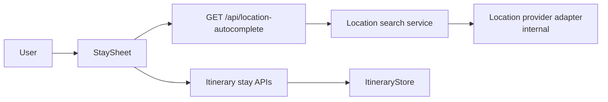
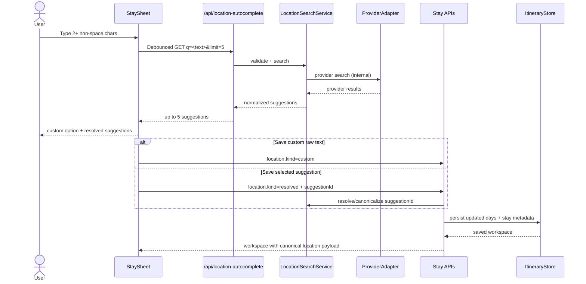

# System Design - Itinerary Location Autocomplete

**Feature ID:** itinerary-location-autocomplete  
**Status:** HLD - updated for FE->BE contract handoff  
**Date:** 2026-03-23  
**Refs:** [feature-analysis.md](./feature-analysis.md) · [../system-architecture.md](../system-architecture.md) · [`../../packages/contracts/openapi.yaml`](../../packages/contracts/openapi.yaml) · [../api/error-model.md](../api/error-model.md)

## Scope

- Add backend-owned location autocomplete for the stay-sheet field used by `Add first stay`, `Add next stay`, and `Edit stay`.
- Keep user-visible behavior unchanged: show up to 5 resolved candidates plus one custom raw-text option.
- Persist selected place metadata through itinerary stay APIs so reload/edit flows retain the selected place.
- Keep legacy city-only entries backward-compatible by treating them as `custom` locations.

## Scope Delta From Prior Design

- Remove direct browser->GeoNames calls.
- Add a same-origin backend lookup API and make provider integration backend-internal.
- Move provider normalization, rate-limit handling, and provider credentials to the backend.
- Keep the frontend-visible contract provider-agnostic and additive to existing itinerary stay payloads.

## System Context



## Boundary Decisions

- Frontend owns query text, debounce, keyboard UX, loading state, custom-option rendering, and stale-selection clearing.
- Backend owns provider credentials, outbound provider calls, result normalization, provider fallback policy, and request logging.
- Frontend consumes only normalized suggestions and opaque suggestion identifiers; it must not depend on GeoNames field names or provider ids.
- Itinerary stay create/update APIs remain the persistence boundary; selected resolved locations are saved there as additive `location` metadata.
- `overnight` and stay `city` remain the backward-compatible display label; `location` is additive and canonical for new place metadata.

## Core Flow



## Frontend-Visible API Contract

The authored source of truth is `packages/contracts/openapi.yaml`.

### Lookup API

- `GET /api/location-autocomplete?q=<query>&limit=5`
- Authenticated, same-origin, no provider-specific params.
- Returns resolved suggestions only; the custom raw-text option stays frontend-local.

```ts
type LocationAutocompleteResponse = {
  query: string
  suggestions: Array<{
    suggestionId: string
    label: string
    secondaryLabel?: string
    location: {
      kind: 'resolved'
      label: string
      queryText: string
      coordinates: { lng: number; lat: number }
      place: {
        id: string
        name: string
        locality?: string
        region?: string
        country?: string
        countryCode?: string
      }
    }
  }>
}
```

- `suggestionId` is opaque to the frontend and may encode provider lookup state or a backend-issued token.
- `place.id` is a stable opaque identifier in the FE contract; backend may map it to provider ids internally.

### Stay Mutation Contract

Additive change to the existing itinerary stay APIs:

```ts
type StayLocationInput =
  | {
      kind: 'custom'
      label: string
      queryText: string
    }
  | {
      kind: 'resolved'
      suggestionId: string
      label: string
      queryText: string
    }

type StayLocation =
  | {
      kind: 'custom'
      label: string
      queryText: string
    }
  | {
      kind: 'resolved'
      label: string
      queryText: string
      coordinates: { lng: number; lat: number }
      place: {
        id: string
        name: string
        locality?: string
        region?: string
        country?: string
        countryCode?: string
      }
    }
```

- `POST /api/itineraries/{itineraryId}/stays` accepts `{ location, nights }`.
- `PATCH /api/itineraries/{itineraryId}/stays/{stayIndex}` accepts `{ location?, nights? }`.
- Workspace/stay/day responses return canonical `location?: StayLocation`.
- The backend derives `city` / `overnight` from `location.label` for backward-compatible rendering.

## Internal Backend Contract

- Provider choice, request params, username, retries, and throttling policy stay internal to the backend.
- Backend may use GeoNames now, but that is an implementation detail behind `LocationSearchService` and `ProviderAdapter`.
- Backend stores any provider-specific ids or raw payload fragments only in backend-private fields if needed; they are not part of the FE contract.
- Provider-specific failures are collapsed into shared API behavior and structured logs, not exposed as provider-shaped UI contracts.

## Persistence Boundary

- `RouteDay.overnight` remains the visible label used by the current renderer.
- New `RouteDay.location?: StayLocation` is additive and repeated across each day in the contiguous stay block.
- Derived `StaySummary` also exposes `location?: StayLocation` so edit flows can reopen with the saved selection state.
- Legacy records without `location` are treated as `custom` on read and edit.
- If a user edits text without selecting a new suggestion, save `kind='custom'` and clear stale resolved metadata.

## Error Model

- Validation remains unchanged for blank location text and invalid nights.
- `GET /api/location-autocomplete` returns `400 LOCATION_QUERY_INVALID` for invalid requests and `503 LOCATION_LOOKUP_UNAVAILABLE` when lookup cannot be served.
- Frontend degrades any lookup failure to custom-only mode; save must remain available.
- Provider timeout, rate limiting, and missing provider config stay backend-internal and map to the same user-safe failure behavior.
- Out-of-order responses remain a frontend concern; only the latest request updates the dropdown.

## Security And Ops

- Provider credentials are server-only config; do not expose them via `NEXT_PUBLIC_*` vars.
- The new route stays same-origin and authenticated with the existing session cookie model.
- Log lookup requests with query length, result count, latency, outcome, and provider status without logging full user-entered raw text beyond existing safe-log policy.
- Metrics baseline: lookup request count, p95 latency, zero-result rate, unavailable rate, resolved-save share, custom-save share.

## Test And Release Gates

| Tier | Focus |
|---|---|
| Tier 0 | contract validation, typecheck, route registration, generated type consistency |
| Tier 1 | FE suggestion state + custom fallback; BE query validation, provider normalization, token resolution |
| Tier 2 | lookup route with mocked provider; stay create/update round-trip with `custom` vs `resolved` location payloads |
| Tier 3 | add-first-stay, add-next-stay, and edit-stay flows with reload persistence and lookup degradation |

## Execution Slices

| Slice | Outcome | FE | BE |
|---|---|---|---|
| S0 | Contract lock | adopt new lookup + stay payload shapes | update OpenAPI and error mappings |
| S1 | Lookup endpoint | wire client fetcher to same-origin API | add route, service, provider adapter, generic error mapping |
| S2 | Save resolved/custom locations | submit `location` payloads from add/edit sheet | persist additive `location` metadata and return canonical workspace |
| S3 | Legacy/edit safety | clear stale selection on text change | normalize legacy city-only stays as `custom` on read |
| S4 | Verification | component + E2E coverage | route/service/integration coverage |

## Risks And Follow-Ups

- Opaque `suggestionId` must be durable long enough for the user to save after selection; choose a signed token or deterministic backend re-resolution strategy.
- Repeating `location` per day slightly increases payload size, but avoids a normalized stay table change in this slice.
- Provider relevance and coverage may change over time; the provider-agnostic FE contract protects future swaps.
