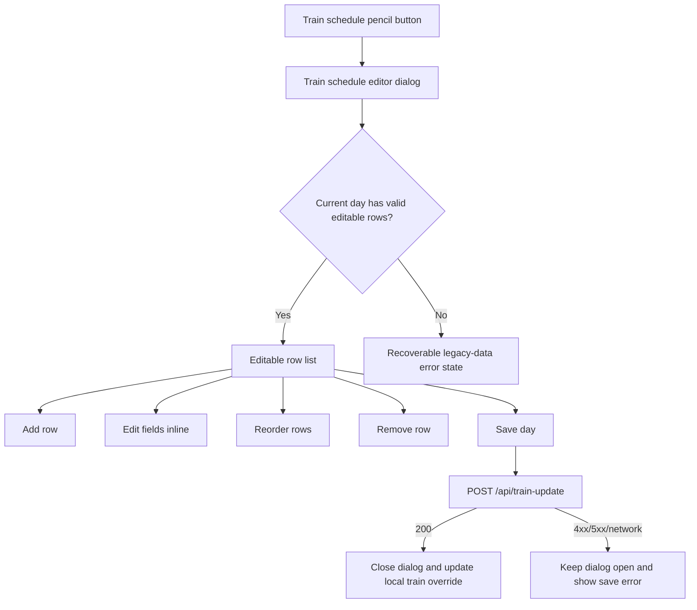
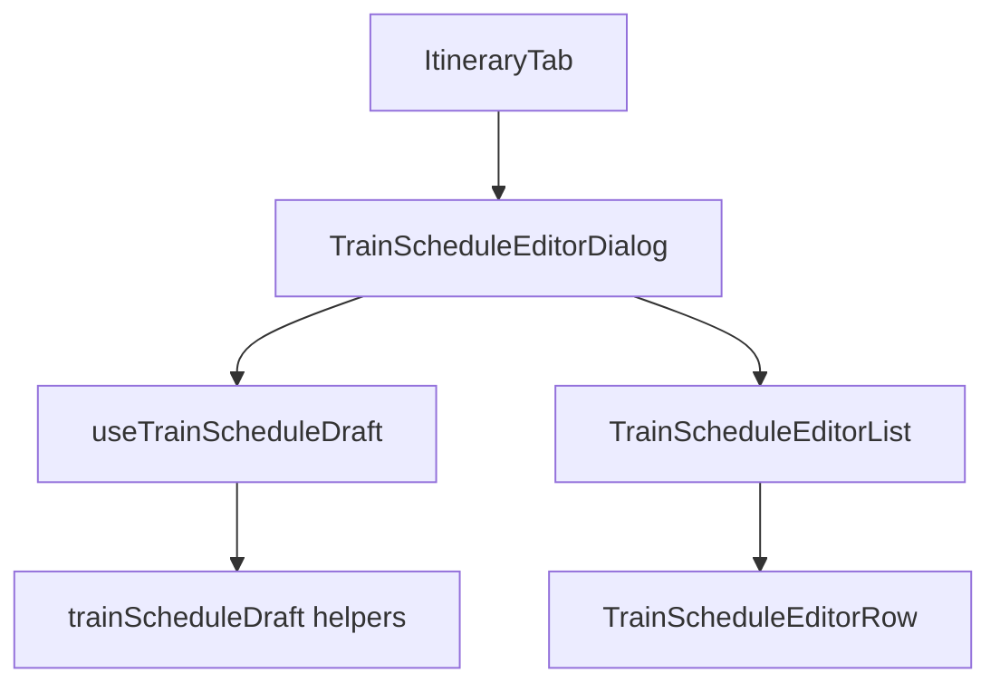
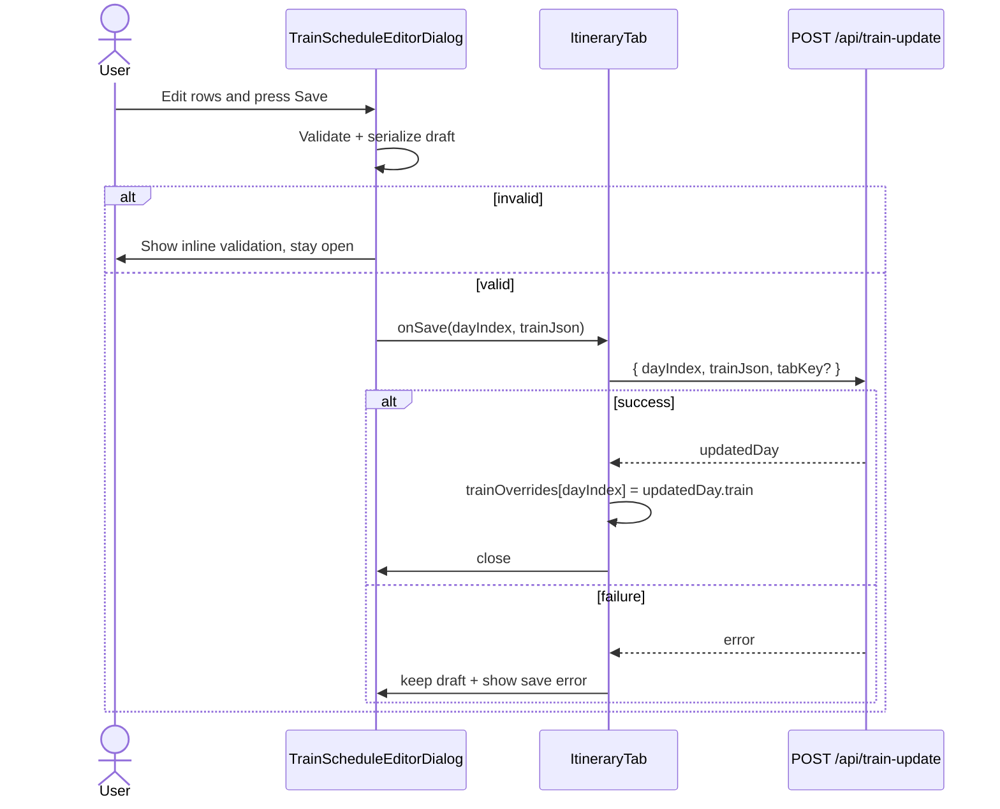

# Frontend Low-Level Design - Itinerary Train Schedule Editor

**Feature:** itinerary-train-schedule-editor  
**Status:** LLD - ready for implementation  
**Date:** 2026-03-19  
**Refs:** [feature-analysis.md](./feature-analysis.md) · [../frontend-lld.md](../frontend-lld.md) · [../high-level-design.md](../high-level-design.md)

## 1. Scope

### In scope
- Replace the train JSON textarea flow in `components/ItineraryTab.tsx` with a structured day-level editor inside the existing Itinerary tab.
- Support `TrainRoute[]` rows with editable `train_id` and optional `start` + `end`.
- Support add, remove, reorder, save, cancel, and save-empty-array.
- Preserve current persistence path `POST /api/train-update` and current stored `RouteDay['train']` shape.
- Keep current post-save behavior: editor closes, train cell refreshes from saved data, timetable-derived display remains best-effort.

### Out of scope
- New routes, new tabs, or non-train itinerary editing.
- Autocomplete, timetable search, or station lookup redesign.
- Any stored schema expansion beyond the current common train entry shape.
- Backend redesign; only a tiny backward-compatible request addendum is acceptable if needed.

## 2. UX Model

The existing pencil affordance remains in the Train Schedule column. Activating it opens a structured dialog for one day.



### Dialog behavior
- Title: `Edit train schedule` plus read-only day/date context.
- Body: list of train rows; each row is a small card/grid with `train_id`, `start`, and `end` fields.
- Primary action: `Save` for the whole day.
- Secondary action: `Cancel` closes without mutating saved data.
- Empty state: explanatory copy plus a primary `Add train` action.

### Row interaction rules
- `train_id` is required.
- `start` and `end` are optional as a pair; both blank is valid, only one filled is invalid.
- Reordering changes persisted array order via drag-and-drop using the existing plan-column DnD interaction style.
- Removing a row updates local draft immediately and never calls the API until day-level save.

## 3. Component and State Boundaries



### `ItineraryTab`
- Keeps ownership of persisted day data, `trainOverrides`, and the save side effect.
- Replaces `trainJsonModal`, `trainJsonEditValue`, `trainJsonSaving`, and `trainJsonError` with structured-editor state:
  - `trainEditorDayIndex: number | null`
  - `trainEditorSaving: boolean`
  - `trainEditorSaveError: string | null`
- Opens the dialog with the current day's effective train array (`trainOverrides[index] ?? day.train`).
- On successful save, writes `updatedDay.train` into `trainOverrides[dayIndex]` exactly as today.

### `TrainScheduleEditorDialog`
- Container/presentation boundary for one day.
- Receives initial train data, day label, open state, save state, and callbacks.
- Owns no server effects; delegates parsing, validation, and serialization to the draft hook/helpers.

### `useTrainScheduleDraft` or equivalent local reducer
- Owns draft rows, row ids, field-level errors, dirty state, and legacy-data parse status.
- Normalizes incoming saved data into UI rows without changing payload semantics.
- Produces `serialize(): string` that returns the exact JSON string expected by `POST /api/train-update`.

### `TrainScheduleEditorRow`
- Controlled row renderer.
- Emits field changes, remove action, and reorder intents.
- Shows row-level validation messages inline.

## 4. Draft Data Model

Use a UI-only row model so reorder and validation do not depend on array index identity.

```text
TrainScheduleDraftRow {
  id: string
  trainId: string
  start: string
  end: string
}
```

Serialization target remains:

```text
Array<{ train_id: string; start?: string; end?: string }>
```

Serialization rules:
- Trim all fields before validation and save.
- Persist `train_id` always.
- Persist `start` and `end` only when both are non-empty.
- If both are empty, omit both keys to stay compatible with current data shape.

## 5. Validation and Legacy Data Handling

### Client validation

| Rule | Scope | Save behavior |
|---|---|---|
| `train_id.trim().length > 0` | row | block save; show inline error |
| `start` and `end` both empty or both filled | row | block save; show inline error |
| `start`/`end`, if present, must be strings after trim | row | block save |

Validation runs on:
- field blur for touched rows
- save attempt for all rows
- after add/remove/reorder to refresh row numbering only; reorder itself never creates errors

### Legacy malformed saved data

If incoming `day.train` contains entries outside the supported editable shape, the dialog opens in a recoverable blocking state instead of silently dropping fields.

Blocking conditions:
- non-array payload in client state
- non-object row
- missing/non-string `train_id`
- `start` or `end` present but not string/nullish
- unsupported extra keys on any row

Recoverable state UX:
- prominent error message that this day contains legacy train data unsupported by the structured editor
- no save allowed from that state
- `Close` action only
- optional diagnostic summary listing offending row numbers/keys for developer support

This preserves data and avoids accidental destructive normalization.

## 6. Save Flow and API Boundary



### API usage
- Keep request body compatible with current endpoint by continuing to send `trainJson` as a JSON string.
- Keep success handling compatible with current response shape by consuming returned `updatedDay.train`.

### Minimal contract clarification recommended
- Add optional `tabKey: 'route' | 'route-test'` to `POST /api/train-update`, defaulting to `'route'` when omitted.
- Keep `trainJson` as the request field and keep response shape unchanged.

Reason:
- `ItineraryTab` is already shared across `route` and `route-test`.
- Without `tabKey`, the structured editor remains coupled to the primary route store even when used from the test tab.
- This is a backward-compatible routing clarification, not a data-model change.

## 7. Loading, Error, and Empty States

### Loading / pending
- `Save` shows pending text and spinner-equivalent affordance, disables all dialog actions except close via explicit cancel is also disabled while request is inflight.
- Existing timetable loading in the table remains unchanged.

### Empty
- If the day has zero trains, show empty illustration/copy and a single `Add train` button.
- First added row should autofocus `train_id`.

### Save errors
- API/network failure appears at dialog level above the footer.
- Message should be actionable: `Could not save train schedule. Your edits are still open.`
- User can retry without losing draft state.

### Validation errors
- Inline at row level under the offending field or row.
- Save button remains enabled; errors block submit and focus moves to the first invalid field on submit.

## 8. Accessibility Expectations

- Dialog uses `role="dialog"`, `aria-modal="true"`, labelled title, and descriptive day context.
- Focus moves to the first editable field on open and returns to the trigger button on close.
- Keyboard support:
  - `Escape` closes only when not saving.
  - `Enter` inside a field does not submit implicitly unless focus is on the Save button.
- Every row action has an accessible name including row position where useful.
- Validation errors are linked with `aria-describedby`; dialog-level save error uses `role="alert"`.
- Row list order changes should be announced through an `aria-live="polite"` region when reordering via buttons.

## 9. Test Strategy

### Tier 0
- Lint, typecheck, and existing CI checks.

### Tier 1 - unit / component
- Draft parser accepts supported saved rows and rejects malformed/unsupported legacy rows.
- Serializer preserves array order and emits the current contract shape.
- Validation covers blank `train_id`, half-filled station pair, trim behavior, remove-all, and add-default-row behavior.
- `TrainScheduleEditorDialog` renders empty, populated, invalid, saving, and save-error states.
- `ItineraryTab` opens the structured dialog from the existing affordance and posts serialized `trainJson` only after valid save.

### Tier 2 - integration
- `POST /api/train-update` request body matches contract-shaped payload for add, remove, reorder, and save-empty-array flows.
- Successful response updates only the targeted day override and closes the dialog.
- API 400/500 and network failure keep the dialog open with draft state preserved.
- If the optional `tabKey` addendum ships, integration coverage must prove `route` vs `route-test` routing stays isolated.

### Tier 3 - E2E
- Authenticated user edits an existing day: change fields, reorder rows, save, and see updated train display after close.
- Authenticated user opens an empty day, adds one row, saves, and sees it rendered.
- User attempts invalid save and is guided to the first invalid row.
- Failed save keeps dialog open and preserves typed values.

## 10. Recommended Implementation Slices

1. Add draft parsing/serialization/validation helpers with unit tests first.
2. Build isolated structured editor dialog and row components with component tests for empty/populated/invalid/pending/error states.
3. Wire `ItineraryTab` from raw JSON modal state to structured dialog state while preserving current success/error semantics.
4. Add optional `tabKey` request addendum to `train-update` only if test-tab parity is required in this slice; otherwise document current limitation explicitly.
5. Finish with browser coverage for primary happy path, invalid save, and failed save recovery.

## 11. Risks and Assumptions

- Assumption: the supported editable train shape is exactly `train_id` plus optional `start` and `end`; unsupported extra keys must block structured editing rather than be silently dropped.
- Risk: `POST /api/train-update` currently lacks `tabKey`, so reuse inside `route-test` is ambiguous until the optional addendum is adopted.
- Risk: replacing drag-based reorder inside a dialog can hurt accessibility; explicit move up/down controls are the safer baseline.
- Assumption: unresolved timetable data after save is non-blocking and continues to render as today.
