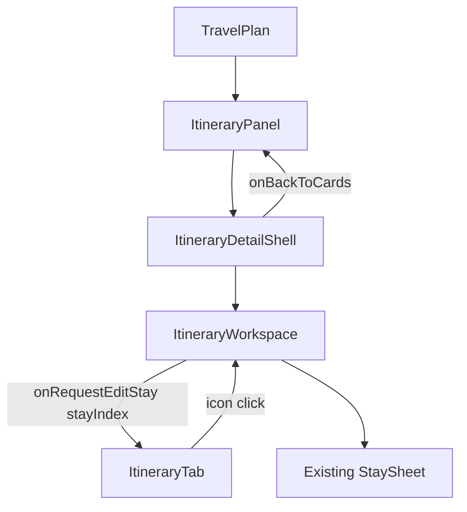
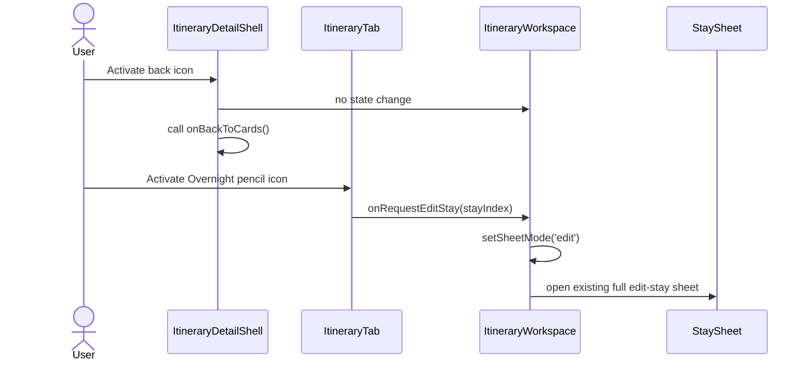

# Frontend Low-Level Design - Itinerary UI Adjustments

**Feature:** itinerary-ui-adjustments  
**Status:** LLD - ready for implementation  
**Date:** 2026-03-23  
**Refs:** [feature-analysis.md](./feature-analysis.md) · [system-design.md](./system-design.md) · [../frontend-architecture.md](../frontend-architecture.md) · [../itinerary-cards-navigation/frontend-design.md](../itinerary-cards-navigation/frontend-design.md) · [../itinerary-detail-ux-cleanup/frontend-design.md](../itinerary-detail-ux-cleanup/frontend-design.md) · [`../../packages/contracts/openapi.yaml`](../../packages/contracts/openapi.yaml)

## 1. Scope

### In scope
- Refine the desktop itinerary detail/table controls for itinerary-scoped editing (`?tab=itinerary&itineraryId=<id>`).
- Replace the current labeled back button in `ItineraryDetailShell` with a lightweight icon action that keeps the same `onBackToCards` behavior.
- Remove the separate Overnight-cell `Edit stay` button in itinerary-scoped mode.
- Make the Overnight pencil icon the only visible trigger for the existing full stay edit sheet.

### Out of scope
- API, route, contract, persistence, or auth changes.
- Changes to `StaySheet` fields, validation, submit flow, or server error mapping.
- Mobile redesign or broader table layout cleanup.
- Changes to legacy seeded-route mode or other non-itinerary-scoped stay-edit paths unless needed to preserve current behavior.

## 2. Route and ownership impact

- Route state stays unchanged: cards view is `?tab=itinerary`; detail view is `?tab=itinerary&itineraryId=<id>`.
- `TravelPlan` and `ItineraryPanel` keep ownership of URL sync and dirty-navigation guarding.
- `ItineraryDetailShell` keeps ownership of the detail-level return affordance only.
- `ItineraryWorkspace` remains the owner of full stay-sheet orchestration through `onRequestEditStay(stayIndex)`.
- `ItineraryTab` changes only the visible Overnight-cell trigger mapping for itinerary-scoped desktop detail mode.

## 3. Impacted components

| Component | Current role | Planned change |
|---|---|---|
| `components/ItineraryDetailShell.tsx` | renders the desktop back button above the workspace | replace the text button treatment with an icon-only action button wired to the same `onBackToCards` callback |
| `components/ItineraryWorkspace.tsx` | maps `onRequestEditStay(stayIndex)` to existing edit-sheet state | no handler changes; remains the only full-stay edit entry target |
| `components/ItineraryTab.tsx` | renders both a full `Edit stay` button and the quick-edit pencil in itinerary-scoped Overnight cells | itinerary-scoped mode renders one pencil icon trigger that calls `onRequestEditStay(stayIndex)`; remove the separate text button and remove quick-inline-pencil behavior from this surface |
| `components/StayEditControl.tsx` | quick inline nights editor for non-last stays | do not mount for itinerary-scoped desktop detail mode; keep existing behavior unchanged anywhere still outside this slice |

## 4. Interaction and handler mapping

### 4.1 Back to cards

| UI element | Owner | Handler | Expected outcome |
|---|---|---|---|
| Header back icon action | `ItineraryDetailShell` | `onBackToCards()` | returns to cards view using the existing query-param transition |
| Workspace error-panel back action | `ItineraryWorkspace` | `onBackToCards?.()` | unchanged fallback path for recoverable detail load errors |

### 4.2 Overnight edit trigger

| Render context | Visible control | Handler | Notes |
|---|---|---|---|
| itinerary-scoped desktop detail, editable stay | one pencil icon | `onRequestEditStay(stay.stayIndex)` | sole full-edit trigger |
| itinerary-scoped desktop detail, non-editable/absent stay | no full-edit control | none | preserve current guard conditions |
| non-itinerary-scoped contexts | existing behavior | unchanged | outside this slice |

## 5. Rendering rules

### `components/ItineraryDetailShell.tsx`
- Keep one visible in-app return affordance in normal detail state.
- Replace the bordered text-button presentation with a compact icon button aligned with the current shell chrome.
- Use an accessible name equivalent to `Back to all itineraries`; visible helper text/tooltip is optional, but the control must not rely on icon shape alone.

### `components/ItineraryTab.tsx`
- In itinerary-scoped mode (`itineraryId && onRequestEditStay`), Overnight cells must render exactly one full-edit affordance.
- That affordance is the pencil icon in the Overnight cell, placed near the city label and styled as a lightweight table action.
- Remove the separate `Edit stay` text button from both non-last and last-stay Overnight render branches.
- Remove the old quick-inline pencil interaction from itinerary-scoped mode so the same icon never maps to two different edit models.
- Keep existing itinerary-scoped PATCH behavior in `ItineraryWorkspace`/`StaySheet`; only trigger presentation changes.

## 6. UX states and accessibility

### Desktop detail states

| State | Back control | Overnight edit control |
|---|---|---|
| Loading workspace | icon action remains visible in shell | not rendered until table data is present |
| Workspace error | existing text back action in error panel remains unchanged | not rendered |
| Populated workspace | icon action visible | one pencil icon per editable stay block |
| Empty workspace | icon action visible | not applicable |

### Accessibility expectations
- Back icon action uses a semantic `button`, visible focus styles, and an explicit accessible name such as `Back to all itineraries`.
- Overnight pencil uses a semantic `button` with an explicit label such as `Edit stay for {city}`.
- Keyboard activation remains `Enter`/`Space`; no hover-only affordance.
- Focus order stays stable: back icon before workspace controls; Overnight edit icon in the normal table tab order.
- Opening the stay sheet preserves existing dialog focus-management and return-focus behavior owned by `StaySheet`/workspace flow.

## 7. Data and contract impact

- No OpenAPI or generated-contract changes.
- No new fetches, mutations, cache keys, or query params.
- Existing itinerary edit endpoint usage remains unchanged because the full edit flow still originates in `ItineraryWorkspace` and `StaySheet`.
- This slice is presentation and intent-mapping only.

## 8. FE test strategy

### Tier 0
- `npm run lint`
- project typecheck command

### Tier 1
- `ItineraryDetailShell`: renders one icon-style back action with accessible name `Back to all itineraries` and no duplicate text-button treatment assertions.
- `ItineraryTab`: itinerary-scoped mode renders exactly one `Edit stay for {city}` trigger per editable Overnight block.
- `ItineraryTab`: itinerary-scoped mode no longer renders visible `Edit stay` text buttons.
- `ItineraryTab`: clicking the Overnight pencil in itinerary-scoped mode calls `onRequestEditStay(stayIndex)`.
- `ItineraryTab`: itinerary-scoped mode no longer mounts or exposes quick-inline nights edit controls for this surface.
- `ItineraryWorkspace`: existing `onRequestEditStay` wiring still opens the full edit sheet and submits through the unchanged PATCH flow.

### Tier 2
- Detail-shell integration preserves cards return behavior when the icon action is used.
- Populated itinerary detail opens the existing stay sheet from the Overnight pencil and still saves successfully.
- Recoverable workspace error state still exposes the current back-to-cards action.

### Tier 3
- Cards -> detail -> back icon returns to cards with the same URL/result as today.
- Cards -> detail -> Overnight pencil opens the existing full edit-stay sheet.
- Saving from that sheet still updates the itinerary and preserves current regression coverage around stay editing.

## 9. Risks, tradeoffs, assumptions

- Assumption: the icon-only back affordance is acceptable if its accessible name remains explicit and its hit area/focus state stay clear.
- Assumption: removing quick inline nights edit is intended only for itinerary-scoped desktop detail mode; other contexts keep current behavior unless separately changed.
- Tradeoff: using one icon trigger reduces visual noise and duplicate actions, but discoverability depends more on icon styling, label, and tooltip semantics.
- Risk: tests currently assert visible `Back to all itineraries` text or quick-inline stay-edit controls and will need targeted updates.
