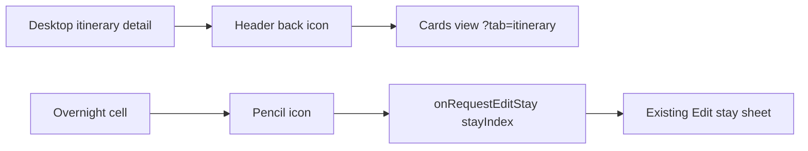

# System Design - Itinerary UI Adjustments

**Feature ID:** itinerary-ui-adjustments  
**Status:** HLD - FE-only refinement locked  
**Date:** 2026-03-23  
**Refs:** [feature-analysis.md](./feature-analysis.md) · [../system-architecture.md](../system-architecture.md) · [../api/error-model.md](../api/error-model.md)

## Scope

- Refine the desktop itinerary detail/table presentation only.
- Replace the current labeled/block back control with a lightweight icon action.
- Make the Overnight-cell pencil the only visible trigger for the existing full `Edit stay` flow.
- Remove the separate `Edit stay` button and any prior pencil-specific behavior from this screen.

## Unchanged Boundaries

- No route, API, storage, auth, or native changes.
- Query-state contract stays the same: detail remains `?tab=itinerary&itineraryId=<id>` and return-to-cards remains `?tab=itinerary`.
- The existing stay-edit sheet, validation, save contract, and error handling remain the source of truth.
- `packages/contracts/openapi.yaml` and the shared error model do not change.

## Impacted Surface Area

| Surface | Current role | Required adjustment |
|---|---|---|
| `components/ItineraryDetailShell.tsx` | renders the desktop return control above the workspace | keep the same callback and destination, but present it as a single icon action |
| `components/ItineraryTab.tsx` | renders Overnight-cell full-edit button plus legacy pencil-specific edit affordance | collapse to one icon entry point that always opens the existing full `Edit stay` flow |
| `components/ItineraryWorkspace.tsx` / stay sheet wiring | owns `onRequestEditStay(stayIndex)` -> existing stay editor flow | no behavior change; must remain the target of the Overnight icon action |
| FE test surface | component + desktop E2E coverage for cards return and stay editing | update assertions to reflect icon-only controls and single-trigger behavior |

## Interaction Contract

- **Back action:** exactly one visible in-app return affordance appears in the detail header; activating it uses the existing `onBackToCards` path and preserves current cards navigation behavior.
- **Stay edit action:** exactly one visible full-edit affordance appears per editable Overnight block; the pencil icon invokes the same `onRequestEditStay(stayIndex)` intent used today by the separate `Edit stay` button.
- **Removed behavior:** no Overnight-cell control on this surface may continue to open the prior pencil-only inline edit path; the icon now represents full stay edit only.
- **Behavior guarantee:** underlying destinations, sheet contents, validation, persistence, and ownership/error handling remain unchanged; only trigger/control presentation and mapping change on desktop.

## Risks And Rollback

- Main UX risk is discoverability regression from text button to icon-only control; mitigate with existing tooltip or accessible label and visible focus/hover states.
- Main implementation risk is leaving two edit entry points wired in parallel; FE should assert there is one full-edit trigger per editable stay block.
- Secondary risk is accidental removal of the cards-return action from error/detail states; reuse the same callback path already used for back-to-cards behavior.
- Rollback is low risk: restore the prior labeled back control and separate `Edit stay` button wiring in the same FE components; no data rollback or contract rollback is required.

## Verification Approach

- Tier 0: `npm run lint` and relevant typecheck path stay clean after icon-only control updates.
- Tier 1: component coverage confirms the detail shell exposes one back icon action, Overnight cells expose one full-edit trigger, and the trigger calls the existing stay-edit intent.
- Tier 1: component coverage confirms the separate `Edit stay` button and prior pencil-only inline behavior are not rendered in itinerary-scoped desktop detail mode.
- Tier 3: desktop E2E covers cards -> detail -> back-to-cards, then detail -> Overnight pencil -> existing `Edit stay` flow opens with unchanged save behavior.

## Delivery Notes

- This change is FE-only and should be executed as a visual/control refinement, not as a workflow redesign.
- Frontend implementation should preserve current responsive boundaries by limiting acceptance and regression expectations to the existing desktop detail/table surface.
