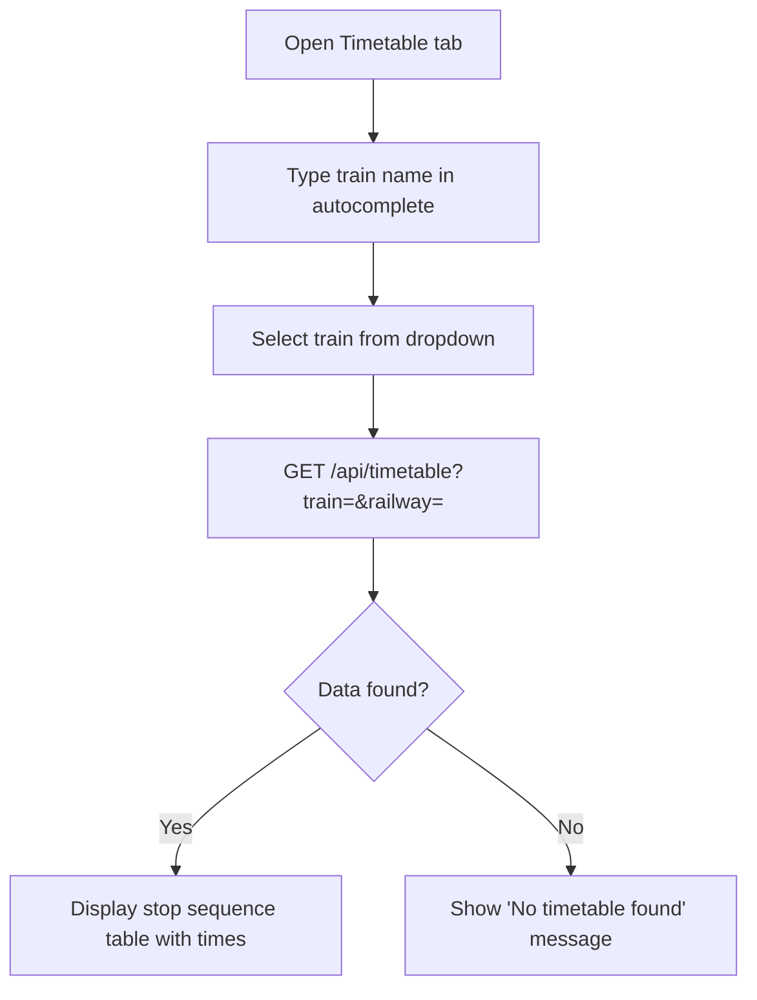
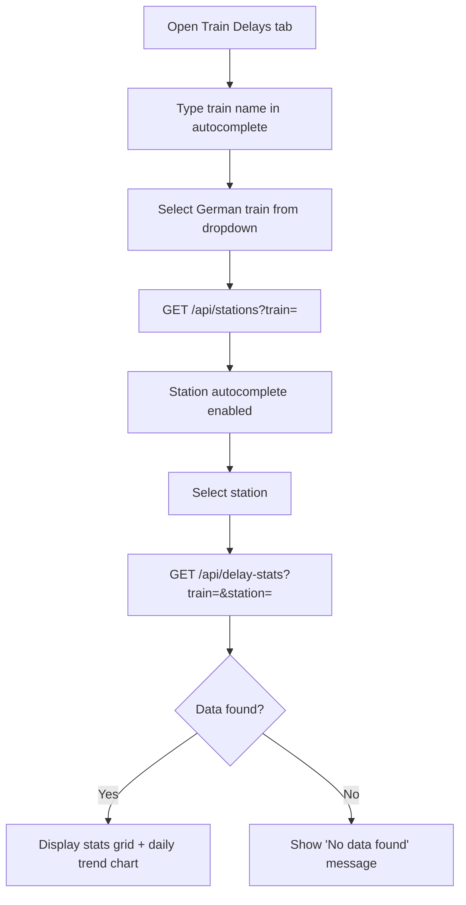

# Product Brief — Travel Plan Web (Next.js)

**Version:** 1.0  
**Date:** 2026-03-13  
**Status:** Baseline (existing product)

---

## 1. Overview

Travel Plan Web is a personal, authenticated web application for planning and reviewing a multi-day European train journey. It combines a live, editable trip itinerary with real-time train timetable lookup and historical delay analytics — all in a single, tab-based interface. The product is self-hosted on Vercel and requires Google authentication to access the full feature set.

---

## 2. Target Users

| User | Description |
|------|-------------|
| **Authenticated traveller** | The trip owner who logs in with Google, views the full itinerary, edits plans, and checks train data. |
| **Unauthenticated visitor** | Anyone who reaches the URL without a session; can access the Train Delays and Timetable tabs but cannot see or edit the itinerary. |

---

## 3. Problem Statement

Planning a long European rail trip involves juggling a day-by-day schedule, understanding which trains to catch, and having realistic expectations about on-time performance. Before this product existed, those three concerns lived in separate places (spreadsheets, carrier websites, and third-party delay trackers). This application consolidates them in one place with live data and an editable schedule.

---

## 4. Goals & Desired Outcomes

1. **Consolidated travel view** — one URL shows the full trip schedule, planned trains, and supporting data.
2. **Live, editable itinerary** — the trip owner can adjust morning/afternoon/evening activities and have those changes persist across sessions and devices.
3. **Real-time timetable lookup** — any train from DB (German), SNCF (French), or Eurostar can be looked up in seconds without navigating to carrier sites.
4. **Delay intelligence** — the traveller can quantify historic delay risk for any German long-distance train at any station before committing to a tight connection.

---

## 5. Feature Set (In-Scope)

### 5.1 Authentication & Access Control

- Google OAuth sign-in via NextAuth.js v5.
- Optional `ALLOWED_EMAIL` allow-list to restrict access to a single account.
- Unauthenticated users see only the Train Delays and Timetable tabs.
- Authenticated users see all three tabs; the Itinerary tab is the default.
- Access denied error page with a 5-second auto-redirect to the login page.
- Sign-out clears the session and redirects to the home page.

### 5.2 Itinerary Tab *(authenticated only)*

- Displays a 16-day trip schedule as a table with columns: Date, Weekday, Day #, Overnight Location, and three activity rows per day (Morning, Afternoon, Evening).
- Overnight location cells are automatically merged (rowspan) for consecutive days in the same city and colour-coded with deterministic pastel backgrounds.
- Each day may list associated trains with departure and arrival stations; departure/arrival times are fetched live from the timetable API and shown inline.
- **Inline editing:** double-click any activity cell to edit it. Commit with Enter or by clicking away. Only one cell is editable at a time. On save, a `POST /api/plan-update` call persists the change; on failure the edit reverts and an error message is shown.
- **Drag-and-drop reorder:** drag the grip handle on any activity row to swap Morning/Afternoon/Evening activities within the same day. An optimistic update is applied immediately; on API failure the swap reverts. Drag handles are hidden while a row is in edit mode.
- Changes persist via `RouteStore` — file-based locally, Upstash Redis in production.
- Activity text supports Markdown rendering.

### 5.3 Train Timetable Tab *(all users)*

- Autocomplete search across all trains from DB (German), SNCF (French), and Eurostar — no railway selector needed; the correct data source is detected automatically from the train name.
- Displays a planned stop sequence table: stop number, station name, arrival time, departure time.
- For German trains, shows the date of the latest observed run.
- Loading spinner shown while fetching; error and empty states handled gracefully.
- Tab state is preserved — switching away and returning does not reset the search.

### 5.4 Train Delays Tab *(all users)*

- Two-step autocomplete: first select a train (German long-distance only), then select a station served by that train.
- Displays a statistics grid: total stops, average delay, median (p50), p75, p90, p95, and maximum delay (all in minutes). Cancelled stops are excluded from calculations.
- Displays a daily average delay line chart for the last 3 months of available data (Recharts).
- Loading spinners for train list and stats; inline error messages on fetch failure.
- Empty-state message when no data is found for the selected train/station combination.
- Tab state is preserved across tab switches.

### 5.5 API Routes (Backend)

| Endpoint | Method | Description |
|----------|--------|-------------|
| `GET /api/trains` | GET | Returns combined train list (German, French, Eurostar) with railway source. |
| `GET /api/timetable?train=&railway=` | GET | Returns planned stop sequence for a train. |
| `GET /api/stations?train=` | GET | Returns stations for a German train ordered by stop sequence. |
| `GET /api/delay-stats?train=&station=` | GET | Returns delay statistics and a 3-month daily trend. |
| `GET /api/train-stops?train=&from=&to=` | GET | Returns dep/arr times between two stations for a train. |
| `POST /api/plan-update` | POST | Persists plan changes for a day (authenticated only, returns 401 otherwise). |
| `GET|POST /api/auth/[...nextauth]` | GET/POST | NextAuth.js OAuth callback, session, and CSRF handling. |

### 5.6 Data Sources

- **German delay data:** DuckDB querying slim parquet files (`delay_events_slim.parquet`, `train_latest_stops.parquet`), optionally via MotherDuck cloud.
- **European timetables (French, Eurostar, German):** GTFS CSV files merged into a unified dataset, queried via PostgreSQL/Neon.
- **Itinerary data:** `data/route.json` (seed / local fallback), persisted in Upstash Redis in production.

---

## 6. Out of Scope / Non-Goals

- Multi-user collaboration or shared trip editing.
- Trip creation from scratch (data is pre-seeded via `route.json`).
- Mobile native app; the product is a web-only responsive interface.
- Real-time live train tracking or live departure boards.
- Delay data for French or Eurostar trains (German long-distance only).
- Booking, ticketing, or payment integrations.
- Offline mode.

---

## 7. User Journeys

### 7.1 Authenticated traveller — view and edit the itinerary

```mermaid
flowchart TD
    A[Visit app URL] --> B{Session valid?}
    B -- No --> C[Redirect to /login]
    C --> D[Click Sign in with Google]
    D --> E[Google OAuth flow]
    E --> F{Email allowed?}
    F -- No --> G[/auth-error page — auto-redirect in 5s]
    F -- Yes --> H[Home page — Itinerary tab active]
    H --> I[View 16-day trip table]
    I --> J[Double-click activity cell]
    J --> K[Edit text inline]
    K --> L{Enter or click away}
    L --> M[POST /api/plan-update]
    M -- Success --> N[Updated cell persisted]
    M -- Failure --> O[Revert to previous value + error message]
    I --> P[Drag grip handle on activity row]
    P --> Q[Drop on another row in same day]
    Q --> R[Optimistic swap applied]
    R --> S[POST /api/plan-update]
    S -- Failure --> T[Revert swap]
```

### 7.2 Any user — look up a train timetable



### 7.3 Any user — check train delay stats



---

## 8. Functional Requirements

| # | Requirement |
|---|-------------|
| FR-01 | The application must require Google authentication to display the Itinerary tab. |
| FR-02 | Unauthenticated users must be able to access the Train Delays and Timetable tabs. |
| FR-03 | The Itinerary tab must display the full trip schedule with merged overnight location cells and pastel colour-coding. |
| FR-04 | Activity cells must be editable inline via double-click and persist changes via the plan-update API. |
| FR-05 | Activity rows within a day must be reorderable via drag-and-drop with optimistic UI updates. |
| FR-06 | Failed save operations (edit or drag-and-drop) must revert the UI and display an error message. |
| FR-07 | The Train Timetable tab must support autocomplete search across German, French, and Eurostar trains without requiring a railway selector. |
| FR-08 | The Train Delays tab must support a two-step autocomplete (train → station) and display statistics and a chart for the last 3 months. |
| FR-09 | Tab state (search inputs, selected train/station, results) must be preserved when switching between tabs. |
| FR-10 | All data-fetching states (loading, error, empty) must be visually communicated to the user. |
| FR-11 | The `POST /api/plan-update` endpoint must return HTTP 401 for unauthenticated requests. |
| FR-12 | The application must support both local (parquet + Docker PostgreSQL) and cloud (MotherDuck + Neon) data source modes. |

---

## 9. Non-Functional Requirements

| Category | Requirement |
|----------|-------------|
| **Performance** | Train list autocomplete must filter locally (no additional API call per keystroke). |
| **Performance** | Delay stats and timetable responses should return within 3 seconds under normal load. |
| **Reliability** | Failed plan-update API calls must always result in a UI revert — no silent data loss. |
| **Accessibility** | Autocomplete inputs must have associated `<label>` elements and ARIA roles (`role="status"` for spinners). |
| **Security** | Session authentication must be enforced server-side for all write operations. |
| **Security** | OAuth credentials, API tokens, and database connection strings must not be committed to source control. |
| **Maintainability** | All production code must have corresponding Jest unit/integration or Playwright E2E test coverage. |
| **Deployability** | The application must deploy to Vercel with zero additional server processes; all API routes run as serverless functions. |
| **Compatibility** | The application must run on Node.js 18+. |

---

## 10. Acceptance Criteria

### AC-01 — Google Sign-In

> **Given** an unauthenticated user visits the app  
> **When** they click "Sign in with Google" on `/login`  
> **Then** they are redirected through the Google OAuth flow and land on the home page with a valid session.

### AC-02 — Email Allow-List Rejection

> **Given** `ALLOWED_EMAIL` is set and a user signs in with a non-matching Google account  
> **When** the OAuth callback completes  
> **Then** the user is redirected to `/auth-error`, sees an "Access Denied" message, and is automatically redirected to `/login` after 5 seconds.

### AC-03 — Itinerary Visibility (Authenticated)

> **Given** a user is authenticated  
> **When** they land on the home page  
> **Then** the Itinerary tab is visible, active by default, and the trip schedule table is rendered with all days.

### AC-04 — Itinerary Hidden (Unauthenticated)

> **Given** a user is not authenticated  
> **When** they visit the home page  
> **Then** only the Train Delays and Timetable tabs are visible; the Itinerary tab is absent.

### AC-05 — Inline Edit — Success

> **Given** an authenticated user views the itinerary  
> **When** they double-click a Morning/Afternoon/Evening cell, change the text, and press Enter  
> **Then** a `POST /api/plan-update` is sent, the cell shows the new value, and the change persists after a page reload.

### AC-06 — Inline Edit — API Failure

> **Given** an authenticated user edits a cell and the `POST /api/plan-update` returns an error  
> **When** the user commits the edit  
> **Then** the cell reverts to its previous value and an error message is displayed.

### AC-07 — Drag-and-Drop Reorder — Success

> **Given** an authenticated user views the itinerary  
> **When** they drag a plan row grip handle and drop it on another row within the same day  
> **Then** the rows swap immediately (optimistic), a `POST /api/plan-update` is sent, and the new order persists after reload.

### AC-08 — Drag-and-Drop Reorder — API Failure

> **Given** the drag-and-drop `POST /api/plan-update` returns an error  
> **When** the drop is completed  
> **Then** the swap reverts to the original order and an error message is shown.

### AC-09 — Train Timetable Search

> **Given** a user is on the Timetable tab  
> **When** they type a train name (e.g. "ICE 905") in the autocomplete and select it  
> **Then** a stop sequence table is displayed showing station names, arrival times, and departure times.

### AC-10 — Train Timetable — Multi-Operator

> **Given** a user searches for a French SNCF train (e.g. "TGV 8088") or Eurostar train (e.g. "EST 9423")  
> **When** they select the train  
> **Then** the correct data source is queried automatically and a timetable is rendered without requiring a railway selector.

### AC-11 — Delay Stats — Success

> **Given** a user is on the Train Delays tab  
> **When** they select a German train and then a station  
> **Then** a stats grid (avg, p50, p75, p90, p95, max delay, total stops) and a daily trend line chart are displayed.

### AC-12 — Delay Stats — Empty State

> **Given** a user selects a train/station combination with no data in the last 3 months  
> **When** the API responds  
> **Then** a message "No data found for this train/station combination in the last 3 months" is shown.

### AC-13 — Tab State Persistence

> **Given** a user has selected a train and station on the Train Delays tab  
> **When** they switch to the Timetable tab and back  
> **Then** their train and station selections and the displayed stats remain unchanged.

### AC-14 — Unauthenticated Plan Update

> **Given** a request is made to `POST /api/plan-update` without a valid session  
> **When** the API receives the request  
> **Then** it returns HTTP 401 Unauthorized.

---

## 11. Success Metrics

### Product Metrics
| Metric | Target |
|--------|--------|
| Itinerary edit completion rate | > 95% of double-click edits result in a saved change (no accidental discards) |
| Timetable search success rate | > 90% of train name searches return a valid timetable |
| Delay tab engagement | Traveller views delay stats for all planned trains at least once before travel |

### Technical Metrics
| Metric | Target |
|--------|--------|
| API response time (p95) | < 3 s for delay-stats and timetable queries |
| Plan-update error rate | < 1% of save requests fail in production |
| Test coverage | ≥ 211 Jest tests passing; ≥ 45 Playwright E2E tests passing |
| Build success rate | 100% — Vercel deployment must never fail due to TypeScript or lint errors |

---

## 12. Constraints

| Constraint | Detail |
|------------|--------|
| **Platform** | Vercel (serverless); no persistent in-process state between requests |
| **Runtime** | Node.js 18+ |
| **Authentication** | Google OAuth only; no email/password or other providers |
| **Data access** | No direct client-side database access; all data goes through Next.js API routes |
| **Storage** | Itinerary edits stored in Upstash Redis (production) or local JSON file (dev); no relational DB for itinerary |
| **GTFS data** | European timetable data is static (pre-loaded); not updated in real time |
| **Delay data** | German long-distance trains only (ICE, IC, EC, EN, RJX, RJ, NJ, ECE); covers last ~3 months of parquet data |

---

## 13. Risks & Open Questions

| # | Risk / Question | Severity | Status |
|---|-----------------|----------|--------|
| R-01 | Parquet data freshness — delay data reflects the loaded parquet snapshot, not live data. | Medium | Accepted; expected by design |
| R-02 | Upstash Redis cold-start could cause first-request latency spikes in production. | Low | Mitigated by `route.json` seed fallback |
| R-03 | GTFS timetable data becomes stale when carrier schedules change. | Medium | Manual re-run of merge script needed |
| R-04 | Google OAuth token renewal could cause silent session expiry during long editing sessions. | Low | NextAuth.js handles token refresh automatically |
| R-05 | MotherDuck cloud dependency — if MotherDuck is unavailable, cloud mode fails. | Medium | Local parquet mode available as fallback |
| Q-01 | Is there a planned mechanism to update `route.json` / the itinerary seed data for a new trip? | — | Open |
| Q-02 | Should delay data eventually cover French and Eurostar trains, or remain German-only? | — | Open |

---

## 14. Execution Notes

This is an existing, deployed product. No new development is required as part of this brief. The relevant roles for future changes are:

| Role | Responsibility |
|------|----------------|
| **Chief Tech Lead** | Architecture decisions, cross-cutting concerns (auth, data layer changes) |
| **Frontend Tech Lead / Developer** | UI component changes, new tab features, accessibility improvements |
| **Backend Tech Lead / Developer** | API route changes, new data sources, GTFS merge script updates |
| **QA** | E2E regression coverage, Playwright test suite maintenance |
