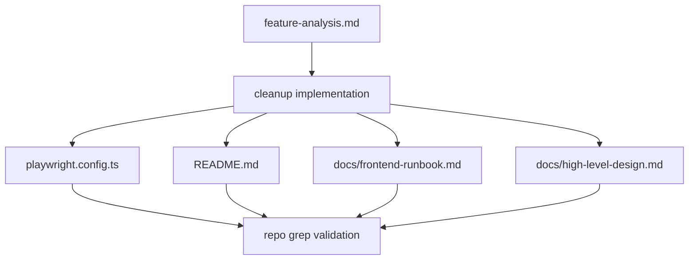
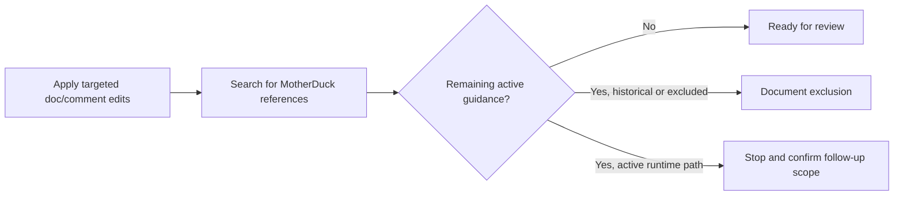

# Frontend Low-Level Design - Remove MotherDuck Content

**Feature:** remove-motherduck-content  
**Status:** LLD - ready for implementation  
**Date:** 2026-03-23  
**Refs:** [feature-analysis.md](./feature-analysis.md) · [../frontend-architecture.md](../frontend-architecture.md) · [../system-architecture.md](../system-architecture.md) · [../high-level-design.md](../high-level-design.md) · [`../../packages/contracts/openapi.yaml`](../../packages/contracts/openapi.yaml)

## 1. Scope

### In scope
- Remove or reword active MotherDuck-specific guidance from current frontend-facing docs.
- Rewrite `playwright.config.ts` comments so they describe only supported test behavior.
- Remove README guidance that tells developers to set `MOTHERDUCK_*` variables for normal workflows.
- Update current runbook and architecture docs so supported local/cloud modes no longer describe MotherDuck as active.

### Out of scope
- Runtime feature work, UI changes, routing changes, or API contract changes.
- Backend/native/shared contract edits.
- Renaming generic commands only because they include `cloud` or `local`.
- Historical QA/design records unless they are still positioned as current setup guidance.

## 2. Frontend impact summary

- No route, component, state, or rendering changes.
- No OpenAPI or generated-contract changes.
- No new test coverage is required for user-facing behavior because this slice is documentation/config-comment cleanup.
- `playwright.config.ts` is the only non-doc file in scope, and its default path is comment cleanup first.

## 3. Impacted files and edit categories

| File | Current issue | Planned edit category | Notes |
|---|---|---|---|
| `README.md` | environment setup, dev/test mode tables, and API descriptions advertise MotherDuck | remove obsolete setup steps; reword mode descriptions; update API wording | keep command names unless a real dead dependency forces a follow-up |
| `playwright.config.ts` | comments justify warmup, timeout, and worker choices in MotherDuck terms | comment rewrite first; remove dead branch only if runtime dependency is confirmed obsolete | do not change Playwright behavior speculatively |
| `docs/frontend-runbook.md` | startup guidance still describes cloud mode as `MotherDuck + Neon` | reword supported data-source guidance | keep runbook aligned with README |
| `docs/high-level-design.md` | stack, deployment, and risk register still list MotherDuck as active | reword architecture narrative; remove MotherDuck-only risk entry | do not broaden into storage redesign |

## 4. File-by-file plan

### 4.1 `README.md`

- Remove the MotherDuck-specific `.env.local` block entries and any prose that presents MotherDuck as optional or supported.
- Keep supported local-parquet guidance explicit so the replacement path is obvious after removal.
- Reword `dev:cloud` and `test:e2e` tables/comments to describe the currently supported provider mix without inventing a new workflow.
- Update API endpoint descriptions at `/api/stations`, `/api/delay-stats`, and `/api/train-stops` so they mention only current supported data access.

### 4.2 `playwright.config.ts`

- Replace comments on env loading, readiness URL, timeout, worker count, and test timeout with neutral supported-language.
- Treat the `hasMotherduck` branch as a review gate, not an automatic deletion.
- If implementation review confirms the branch is dead and not part of a supported path, remove the branch in the same cleanup.
- If that confirmation is not available, keep the branch temporarily, remove MotherDuck wording, and leave a narrow follow-up note outside this feature doc.

### 4.3 `docs/frontend-runbook.md`

- Replace the current cloud-dev label so it no longer names MotherDuck.
- Keep local startup, validation, and build guidance unchanged except where wording currently implies MotherDuck support.
- Ensure runbook terminology matches the README after cleanup.

### 4.4 `docs/high-level-design.md`

- Remove MotherDuck from the active technology stack row.
- Reword local/cloud deployment bullets so only supported providers remain.
- Remove or rewrite the MotherDuck cold-start risk entry if that risk exists only because of deprecated support.

## 5. Safeguards and non-goals

- Preserve runtime behavior unless a real obsolete dependency is verified in the same touched file.
- Do not edit `package.json` scripts as part of this slice unless the Playwright/runtime review proves they are dead support code and the diff stays narrowly scoped.
- Do not touch local-only files such as `.env.local` or historical docs such as prior QA reports.
- Keep command names, provider names, and architecture terms stable unless they directly claim active MotherDuck support.
- If any `MOTHERDUCK_*` usage remains after cleanup, it must be either justified as temporary implementation debt or moved to a follow-up task.

## 6. Validation approach

### Content validation
- Run repo-wide searches for `MotherDuck`, `motherduck`, and `MOTHERDUCK_` after edits.
- Expected remaining matches are limited to this feature folder and intentionally excluded historical/local-only records.
- Compare `README.md`, `docs/frontend-runbook.md`, and `docs/high-level-design.md` wording for consistency on supported data sources.

### Runtime-safety validation
- Review the final `playwright.config.ts` diff to confirm comment cleanup did not silently change test behavior unless the branch removal was explicitly justified.
- If any runtime branch is removed, verify the supported E2E path still maps to existing npm scripts and documented workflows.

### Release gate
- Tier 0: optional sanity check with `npm run lint` only if `playwright.config.ts` logic changes beyond comments.
- No FE Tier 1/Tier 2 additions are required for docs-only updates.

## 7. Risks, tradeoffs, assumptions

- Assumption: MotherDuck is no longer a supported developer workflow for this project.
- Risk: `playwright.config.ts` and `package.json` still contain environment-based branches that may represent old runtime support rather than pure comments.
- Tradeoff: keeping generic `cloud` command names avoids scope creep, but some wording may stay broader than the actual provider list.
- Risk: README API descriptions can drift from implementation if wording is removed too aggressively; keep replacement text factual and minimal.
