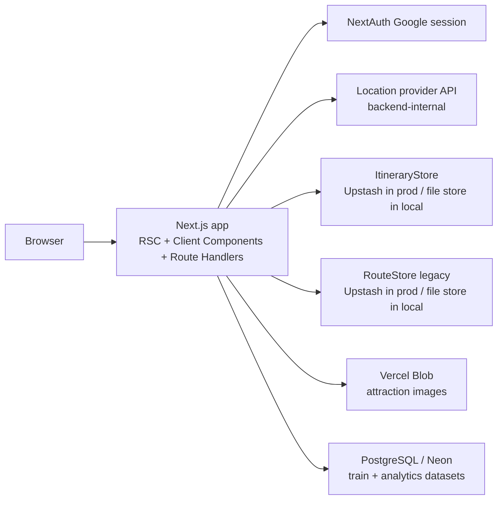
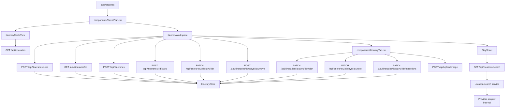

# System Architecture - travel-plan-web-next

## System Shape

Next.js 15 App Router remains the only deployable app. UI, authenticated APIs, location-provider integration, image storage, and data access stay inside the same Vercel-hosted monolith.

## Architecture Decisions

- Keep the existing itinerary editor as the primary workspace; do not add a separate planner app.
- The authenticated `Itinerary` tab is a two-step flow: cards library first, existing editor second.
- Itinerary-scoped persistence lives in `ItineraryStore`; the legacy `route` tab uses the separate `RouteStore`.
- Each itinerary is stored as metadata plus `RouteDay[]` so `ItineraryTab` keeps its current rendering and editing behavior.
- Itinerary-scoped route handlers live under `/api/itineraries*`; legacy flat write routes (`note-update`, `stay-update`, `attraction-update`, `train-update`) remain as compatibility paths for the legacy route tab.
- Location lookup is backend-owned at `/api/locations/search`; the frontend stays provider-agnostic.
- Attraction images are stored in Vercel Blob via a backend-issued client upload token at `/api/upload-image`.
- Keep deployment, auth provider, logging stack, and serverless model unchanged.

## Component Boundaries

## Storage Model

- `itinerary metadata`: `id`, `ownerEmail`, `name`, `startDate`, `status`, `createdAt`, `updatedAt`
- `itinerary days`: full `RouteDay[]` blob (includes `location`, `note`, `attractions` per day) keyed by `itineraryId`
- `user itinerary index`: ordered list of itinerary ids per owner for latest-itinerary lookup
- `stays`: derived from contiguous `RouteDay.overnight` blocks; no separate stay table
- `attraction images`: stored in Vercel Blob; URLs persisted in `DayAttraction.images[]`

## Navigation Model

- `/` stays the main authenticated entry.
- `?tab=itinerary` opens the itinerary cards view for authenticated users.
- `?tab=itinerary&itineraryId=<id>` opens the itinerary workspace for the selected itinerary.
- If `itineraryId` is absent, the app stays in cards view; if no itineraries exist, the empty state offers "New itinerary".
- "New itinerary" opens `CreateItineraryModal` and redirects into the new workspace on success.

## Operational Baseline

- AuthN/AuthZ: NextAuth session; every itinerary API checks ownership by `ownerEmail`.
- Logging: structured `info/warn/error` logs with `itineraryId`, route name, user email, and validation code.
- Third-party lookup: backend-owned location autocomplete at `GET /api/locations/search`; frontend adds debounce, request cancellation, max 5 results, and custom-location fallback on any failure.
- Security: provider credentials and Blob tokens stay server-side; frontend never receives provider-specific keys or credentials.
- Legacy route tab (`RouteStore`) and itinerary-scoped store (`ItineraryStore`) coexist; new feature work targets the itinerary-scoped stack.
